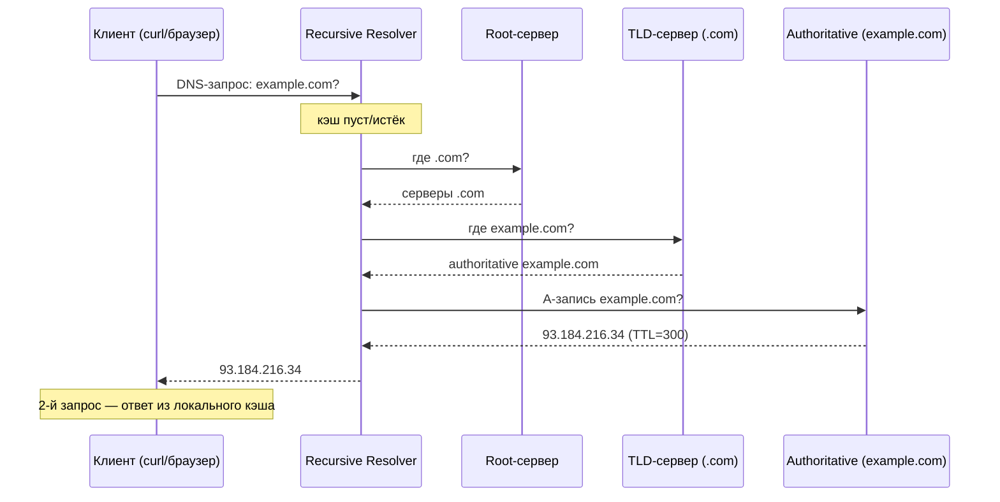
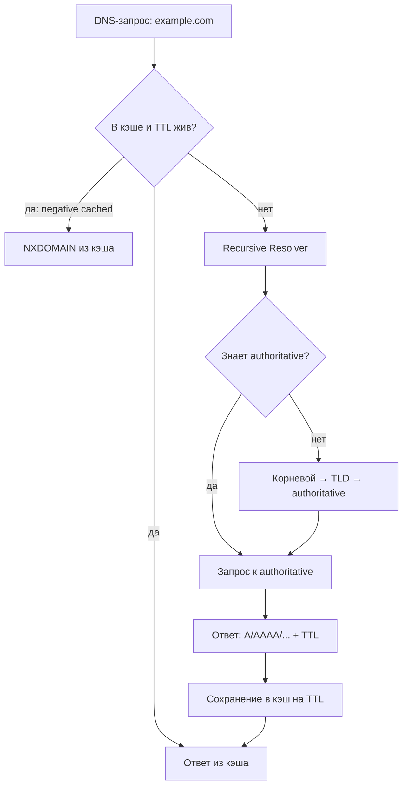

# DNS (Система доменных имён)

## Определение

**DNS (Domain Name System, Система доменных имён)** — распределённая иерархическая база данных, которая переводит человекочитаемые имена (`example.com`) в машинные ресурсы (в первую очередь IP-адреса, а также MX-для почты, TXT-записи и т.д.). Любой запрос к сервису по имени начинается с DNS-резолюции: `curl https://example.com` → «где это?» → получили IP → устанавливаем соединение.

## Зачем нужно

- **Имена вместо IP** — люди запоминают `example.com`, а не `93.184.216.34`; при смене сервера IP меняется, а имя остаётся.
- **Виртуальные хосты и переадресация** — один сервер может обслуживать много доменов (SNI/виртуальные хосты), домен может быть `CNAME`-алиасом (напр. `www` → API CDN).
- **Балансировка и отказоустойчивость** — DNS round robin, geoDNS, health-check через DNS-записи (CDN/anycast).
- **Service Discovery** — в микросервисных и облачных системах имена + `SRV`-записи используются для поиска инстансов сервиса.
- **Почта и безопасность** — `MX`-записи маршрутизируют email; `TXT`/SPF/DKIM/DMARC и `DNSSEC` защищают.



## Как работает

DNS — иерархия доверия и делегирования. Резолюция проходит путь: **кэш → recursive resolver → root → TLD → authoritative**.

- **Root-серверы** — 13 логических корневых серверов; знают, кто отвечает за TLD (`.com`, `.ru`, ...).
- **TLD-серверы** — отвечают за верхний уровень; делегируют владельцам доменов (authoritative).
- **Authoritative (авторитетный) сервер** — хранит сами записи вашего домена и отвечает о них «из первых рук».
- **Recursive Resolver** — выполняет полный путь за клиента (например, сервер ISP, 8.8.8.8); кеширует ответы.



Ключевые понятия:

- **Типы записей**: `A` (IPv4), `AAAA` (IPv6), `CNAME` (алиас), `MX` (почта + приоритет), `NS` (авторитетные серверы), `TXT` (метаданные/SPF), `PTR` (обратная резолюция), `SRV` (сервис + порт + вес/приоритет — для Service Discovery).
- **TTL (time-to-live)** — сколько секунд запись можно держать в кэшах резолверов. Чем меньше TTL — тем быстрее применяются изменения, но тем больше нагрузки на DNS.
- **UDP:53 / TCP:53** — стандартно DNS работает по **UDP** (быстро, короткие ответы); по TCP — большие ответы, «zone transfer», когда UDP-ответ обрезан (TC-флаг).
- **NXDOMAIN vs NODATA vs SERVFAIL** — имя не существует / имя есть, а тип записи нет / резолвер или авторитетный не ответил (сбой). Обрабатывать нужно по-разному.
- **DNSSEC** — цифровая подпись записей; защищает от подмены ответа (спуфинг/кэш-poisoning); DoH/DoT шифруют сам DNS-обмен (см. Security).

## Примеры кода

> Резолюция из приложений: записать IP, проверить MX/SRV/TXT — обычная работа кода с DNS.

### TypeScript (node:dns/promises)

```typescript
import dns from 'node:dns/promises'

async function inspectDomain(name: string) {
  const ips = await dns.resolve4(name).catch(() => dns.lookup(name, { family: 4 }))
  const mx = await dns.resolveMx(name).catch(() => [])
  const txt = await dns.resolveTxt(name).catch(() => [])
  return { ips, mx, txt }
}

// использование
const info = await inspectDomain('example.com')
console.log(info.ips) // ['93.184.216.34']
```

### Go (net)

```go
import "net"

func inspectDomain(ctx context.Context, name string) error {
	ips, err := net.LookupIP(name)
	if err != nil {
		return err
	}
	mx, err := net.LookupMX(name)
	if err == nil {
		// mx[0].Host + mx[0].Pref — приоритет почты
	}
	txt, err := net.LookupTXT(name)
	if err == nil {
		// txt — SPF/DKIM-записи
	}
	return nil
}
```

### Java (java.net + dnsjava)

```java
import java.net.InetAddress;

void inspectDomain(String name) throws Exception {
    // системный резолвер: первый адрес + все
    InetAddress address = InetAddress.getByName(name);
    InetAddress[] all = InetAddress.getAllByName(name);

    // MX/TXT через библиотеку dnsjava (net.lookup)
    Record[] answers = new Lookup(name, Type.MX).run();
    for (Record r : answers) {
        MXRecord mx = (MXRecord) r;
        System.out.println(mx.getTarget() + " pref=" + mx.getPriority());
    }
}
```

## Пример использования: интеграция

> Ключевые интеграции DNS в реальном коде: **кеш резолвера с TTL**, **указание своего DNS-сервера**, **Service Discovery по SRV**.

### Кеш-резолвер с TTL (TypeScript)

```typescript
class DnsCache {
  private cache = new Map<string, { ips: string[]; expires: number }>()

  constructor(private ttlMs = 30_000) {}

  async resolve(name: string) {
    const now = Date.now()
    const hit = this.cache.get(name)
    if (hit && hit.expires > now) return hit.ips

    const ips = await dns.resolve4(name) // сетевой вызов
    this.cache.set(name, { ips, expires: now + this.ttlMs })
    return ips
  }
}
```

### Свой DNS-сервер (8.8.8.8) через net.Resolver (Go)

```go
import "net"

// Даём приложению конкретный резолвер, а не системный (resolv.conf).
func newResolver() *net.Resolver {
	return &net.Resolver{
		PreferGo: true,
		Dial: func(ctx context.Context, network, _ string) (net.Conn, error) {
			d := net.Dialer{}
			return d.DialContext(ctx, network, "8.8.8.8:53")
		},
	}
}

func main() {
	r := newResolver()
	ips, err := r.LookupIP(context.Background(), "ip4", "example.com")
	// err != nil — SERVFAIL/timeout: стоит fallback на второй резолвер (1.1.1.1)
}
```

### Service Discovery по SRV-записям (Java)

```java
import org.xbill.DNS.*;

// В микросервисах SRV-записи вида
// _orders._tcp.example.com → name=orders-01 host=10.0.0.5 port=8080 weight=10
public List<Address> discover(String service, String domain) {
    Record[] answers = new Lookup(
        "_" + service + "._tcp." + domain, Type.SRV
    ).run();
    List<Address> found = new ArrayList<>();
    for (Record r : answers) {
        SRVRecord srv = (SRVRecord) r;
        InetAddress[] ips = InetAddress.getAllByName(srv.getTarget().toString());
        found.add(new Address(ips[0].getHostAddress(), srv.getPort()));
    }
    return found;
}
```

## Паттерны использования

- **Кешировать резолюцию с учётом TTL** — не дергать DNS на каждый запрос; собственный TTL ≤ TTL записи (структура «кеш + рефреш + фолбек»).
- **Множественные резолверы и фолбек** — один DNS-сервер недоступен → переключение; учитывать SERVFAIL как «попробовать другой» (а NXDOMAIN — нет).
- **Fallback по таймауту** — DNS-запрос имеет таймаут (обычно 1–5 с); при необходимости использовать TCP:53/DoH как резерв.
- **Уважать TTL записей, которые вы меняете** — для быстрых ротаций — низкий TTL (30–60 с) на время деплоя, потом поднять.
- **Для service discovery — SRV + вес/приоритет** — клиенты сортируют адреса: приоритет → вес → round robin (как при балансировке).
- **Мониторить время резолюции и кэш** — медленный DNS — частая причина высокого p99 (см. Observability).
- **DNSSEC/DoH/DoT на критичных путях** — защита от подмены ответа.

## Антипаттерны и ловушки

- **Отсутствие кеша** — каждый HTTP-запрос заново резолвит имя: latency и нагрузка на DNS.
- **Слишком большой TTL у меняющихся записей** — после редиректа/миграции пользователи ещё днями ходят на старый IP.
- **Слишком маленький TTL везде** — резолверы не кешируют, нагрузка и задержки растут (компромисс под конкретные записи).
- **Не различать NXDOMAIN от SERVFAIL** — «не существует» не лечится повторами и фолбеком; SERVFAIL — лечится.
- **Резолвер-фолбек с повторами без backoff** — все клиенты одновременно долбят упавший DNS → «бьющее стадо» (см. Exponential Backoff).
- **DNS как точка отказа** — единственный резолвер, единственный `A`-запись без запасного IP/каналов.
- **Игнорировать TCP/TC-флаг** — большой ответ, обрезанный в UDP:53, приводит к ошибке, если не повторить по TCP.

## Когда использовать / когда НЕ использовать

**Использовать:**
- Резолюция имён в интернет/облаке, `curl`, браузер, почта (MX), CDN (CNAME/geo), API-клиенты (имя хоста).
- Service Discovery в микросервисах и Kubernetes (mDNS / SRV / headless-сервисы).
- Знакомство с архитектурой сети: root/TLD/authoritative, TTL, кэширование.

**НЕ использовать (или с осторожностью):**
- «Горячий» критический путь кластера, где важна мс-задержка и динамика инстансов — там таблицы Consul/etcd + gRPC-резолвер надёжнее DNS (DNS кешируется агрессивно).
- Очень частые изменения (Autoscaling по ID инстансов) — DNS не мгновенен из-за TTL.
- Если важна приватность/защита от спуфинга без DNSSEC/DoH — иначе резолюцию можно подменить.
- Передача больших данных — DNS записи ограничены по размеру (обычно ≤ 512 байт UDP, до 4k с расширением).

## Связанные темы

- **TCP vs UDP** — DNS по умолчанию работает по UDP:53 (+ TCP при больших ответах); TCP — рукопашный фолбек.
- **HTTP/2 и HTTP/3** — HTTP/3 (QUIC) работает поверх UDP, как и DNS; знание транспортного уровня важно для диагностики.
- **gRPC** — встроенный DNS-резолвер и использование SRV/headless-сервисов для service discovery.
- **Load Balancing** — round robin по A-записям, geoDNS, health-check и TTL при миграции трафика.
- **Security** — DNSSEC, DNS spoofing/cache poisoning, DNS rebinding; DoH/DoT.
- **Observability** — метрики резолюции (время, ошибки, кэш-hits) — классика «медленного DNS».

## Вопросы

### Q1
**Что делает DNS для запроса `curl https://example.com`?**
- [x] Переводит доменное имя в IP-адрес (и иную метаданную), чтобы установить соединение
- [ ] Открывает TCP-соединение напрямую на 443
- [ ] Передаёт запрос прокси
- [ ] Ничего — браузер сам знает IP

Пояснение: DNS — разрешает имя в IP (A/AAAA) и прочие записи; только после этого клиент подключается.

### Q2
**Каков порядок полной резолюции при пустом кэше?**
- [ ] Authoritative → TLD → Root → ответ
- [x] Кэш → Recursive Resolver → Root → TLD → Authoritative → ответ (и кеширование)
- [ ] Root → Authoritative
- [ ] Сразу к resolver ISP

Пояснение: resolver рекурсивно проходит Root → TLD → authoritative, ответ кеширует (в т.ч. резолвер и клиент).

### Q3
**По какому протоколу/порту DNS-запросы идут по умолчанию?**
- [ ] TCP:80
- [ ] UDP:443
- [x] UDP:53 (TCP:53 — для больших ответов/zone transfer)
- [ ] HTTP:53

Пояснение: стандартный DNS — UDP:53; TCP нужен при обрезке ответа (TC-флаг), больших данных и передаче зон.

### Q4
**Что означает TTL записи DNS?**
- [ ] Время жизни домена
- [x] Сколько секунд резолверы и клиенты могут кешировать ответ, прежде чем спросить снова
- [ ] Порог ошибок
- [ ] Количество IP-адресов

Пояснение: TTL — срок жизни записи в кэше; от него зависит скорость применения изменений и нагрузка на DNS.

### Q5
**Какой тип записи отвечает за почту и за service discovery соответственно?**
- [ ] A и AAAA
- [x] MX (почта), SRV (сервис + порт + вес/приоритет)
- [ ] CNAME и PTR
- [ ] TXT и NS

Пояснение: MX маршрутизирует email; SRV — как найти сервис (host + port + weight/priority).

## Источники

- RFC 1034 — Domain names — concepts and facilities: https://datatracker.ietf.org/doc/html/rfc1034
- RFC 1035 — Domain names — implementation and specification: https://datatracker.ietf.org/doc/html/rfc1035
- RFC 8484 — DNS Queries over HTTPS (DoH): https://datatracker.ietf.org/doc/html/rfc8484
- Cloudflare Learning — How DNS works: https://www.cloudflare.com/learning/dns/
- IANA — Root zone: https://www.iana.org/domains/
- dnsjava (Java DNS lib): https://github.com/dnsjava/dnsjava
