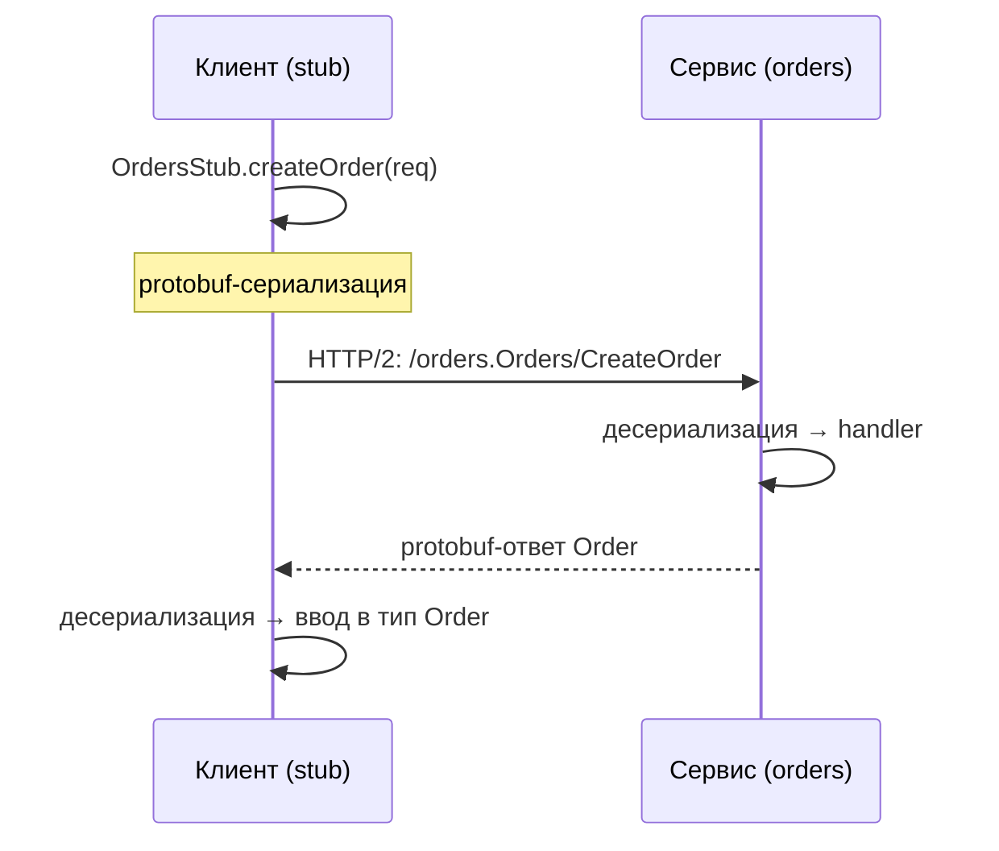
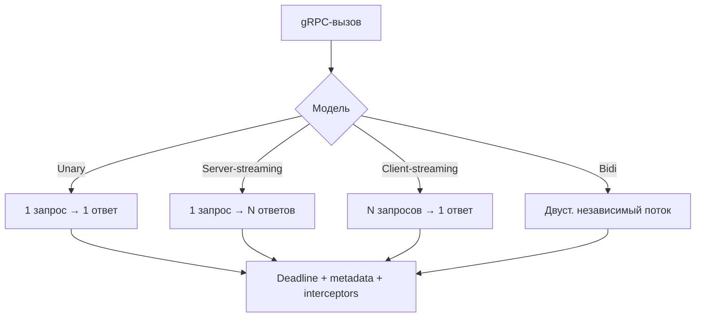

# gRPC (Удалённый вызов процедур от Google)

## Определение

**gRPC** — фреймворк удалённого вызова процедур (**RPC**) от Google: клиент вызывает метод сервиса «как локальную функцию». Контракт задаётся в **Protocol Buffers** (типизированный `.proto`), транспорт — **HTTP/2** (мультиплексирование, бинарный формат, потоковые RPC). Строгая типизация, генерация кода на 10+ языках, четыре модели взаимодействия.

## Зачем нужно

- **Строгий контракт** — `.proto` описывает сервис и типы; кодогенерация даёт типизированные stubs на всех языках — нет «playground» REST-документации.
- **Эффективность** — бинарная сериализация protobuf компактнее и быстрее JSON; HTTP/2 даёт мультиплексирование (один канал на много запросов/потоков).
- **Стриминг** — unary, server-streaming, client-streaming, bidi-streaming из коробки — удобно для чатов, логов, feed, больших данных.
- **Идеален для микросервисов** — Множество языков (Go, Java, TS, ...), deadlines, metadata, интерцепторы, балансировка — готовый «внутренний API».
- **Cross-language** — один `.proto`, генераторы для всех платформ: TS/Go/Java согласуются автоматически.



## Как работает

1. **IDL (`.proto`)** — описание: `service Orders { rpc CreateOrder(CreateOrderRequest) returns (Order); }` + типы сообщений (поля, enum, oneof, map).
2. **Кодогенерация** — `protoc`/buf генерирует: сообщения-классы, stub клиента и каркас сервера. Методы и типы типизированы.
3. **Транспорт HTTP/2** — каждый RPC — `stream` (поток) на HTTP/2-соединении; путь вида `/{package}.{Service}/{Method}`. Мультиплексирование — несколько RPC параллельно на одном канале.
4. **Сериализация protobuf** — компактный бинарный формат (тег-значение), быстрее JSON, требует схемы.
5. **Каналы и deadlines** — `Channel` = соединение со стекингом; каждый вызов — с `deadline` (аналог таймаута, см. Timeouts), `metadata` (header'ы: токен, trace-id), interceptors (аналог middlewares).

**Четыре модели gRPC:**

- **Unary** — запрос → валидация → ответ (класс. request/response).
- **Server-streaming** — клиент шлёт запрос, сервер стримит ответы (лог-фид, прогресс).
- **Client-streaming** — клиент стримит запросы, сервер отвечает одним ответом (агрегация, upload).
- **Bidirectional (bidi)** — оба стримят независимо (чат, живой мониторинг).



## Примеры кода

> `orders.proto` общий; ниже — кодогенерированные stubs из одного контракта на трёх языках.

### orders.proto

```protobuf
syntax = "proto3";
package orders;

service Orders {
  rpc CreateOrder(CreateOrderRequest) returns (Order);
  rpc StreamOrderUpdates(StreamRequest) returns (stream OrderUpdate);
  rpc BatchUpload(stream Order) returns (BatchResult);
  rpc Chat(stream ChatMessage) returns (stream ChatMessage);
}

message CreateOrderRequest { string userId = 1; int64 amount = 2; }
message Order { string id = 1; string status = 2; }
message StreamRequest { string userId = 1; }
message OrderUpdate { string orderId = 1; string status = 2; }
```

### TypeScript (@grpc/grpc-js)

```typescript
import { loadPackageDefinition, credentials } from '@grpc/grpc-js'

// сгенерированный код: OrdersClient и типы из orders.proto
const client = new OrdersClient('orders:443', credentials.createSsl())

async function createOrder(userId: string, amount: number) {
  const call = await new Promise((resolve, reject) => {
    client.createOrder({ userId, amount }, (err, res) =>
      err ? reject(err) : resolve(res),
    )
  })
  return call as Order
}

// server-streaming: подписка на обновления
const stream = client.streamOrderUpdates({ userId })
stream.on('data', (update: OrderUpdate) => console.log(update.status))
```

### Go (google.golang.org/grpc)

```go
import (
	"context"
	"google.golang.org/grpc"
	pb "orders/gen" // сгенерированный из orders.proto
)

// Клиент
conn, _ := grpc.NewClient("orders:443",
	grpc.WithTransportCredentials(insecure.NewCredentials())) // прод: TLS
client := pb.NewOrdersClient(conn)

ctx, cancel := context.WithTimeout(context.Background(), 3*time.Second)
defer cancel()

order, err := client.CreateOrder(ctx, &pb.CreateOrderRequest{UserId: "u1", Amount: 100})
if err != nil {
	// статусы gRPC: codes.DeadlineExceeded, codes.NotFound...
}

// Server-streaming
stream, err := client.StreamOrderUpdates(ctx, &pb.StreamRequest{UserId: "u1"})
for {
	upd, err := stream.Recv()
	if err == io.EOF { break }
	_ = upd
}
```

### Java (grpc-java)

```java
import io.grpc.*;
import orders.OrdersGrpc;
import orders.Orders.*;

ManagedChannel channel = ManagedChannelBuilder.forAddress("orders", 443)
        .useTransportSecurity()
        .build();

OrdersGrpc.OrdersBlockingStub stub = OrdersGrpc.newBlockingStub(channel);

Order order = stub.createOrder(CreateOrderRequest.newBuilder()
        .setUserId("u1").setAmount(100).build());

// server-streaming — Iterable/Iterator по потоку
Iterator<OrderUpdate> updates = stub.streamOrderUpdates(
        StreamRequest.newBuilder().setUserId("u1").build());
```

## Пример использования: интеграция

> В проде gRPC редко «голый»: deadlines, интерцепторы, retry-политики, metadata-токены, DNS-балансировка.

### Deadline + metadata-авторизация (TypeScript)

```typescript
import { credentials, Metadata } from '@grpc/grpc-js'
import { deadline } from './deadline' // утилита из темы Timeouts

const client = new OrdersClient('orders:443', credentials.createSsl())

function withAuthAndDeadline(token: string) {
  const meta = new Metadata()
  meta.set('authorization', `Bearer ${token}`)
  meta.set('x-request-id', crypto.randomUUID()) // трассировка
  return { metadata: meta, deadline: new Date(Date.now() + 3_000) }
}

// вызов с общим дедлайном — клиент не «висит» (см. Timeouts)
const res = await new Promise<Order>((resolve, reject) => {
  client.createOrder({ userId: 'u1', amount: 100 }, withAuthAndDeadline(token),
    (err, o) => err ? reject(err) : resolve(o))
})
```

### Интерцептор логирования и deadline (Go)

```go
func unaryInterceptor(
	ctx context.Context,
	method string,
	req, reply any,
	cc *grpc.ClientConn,
	invoker grpc.UnaryInvoker,
	opts ...grpc.CallOption,
) error {
	start := time.Now()
	err := invoker(ctx, method, req, reply, cc, opts...) // сам вызов
	code := status.Code(err)
	log.Printf("rpc %s -> %s in %v\n", method, code, time.Since(start))
	return err
}

func main() {
	conn, _ := grpc.NewClient("orders:443",
		grpc.WithUnaryInterceptor(unaryInterceptor),
		// retry-политика на стороне клиента (см. Retries):
		grpc.WithDefaultServiceConfig(`{
		  "methodConfig":[{"name":[{"service":"orders.Orders"}],
		  "retryPolicy":{"maxAttempts":3,"initialBackoff":"0.2s",
		  "maxBackoff":"1s","backoffMultiplier":2,"retryableStatusCodes":["UNAVAILABLE"]}}]
		}`),
	)
	_ = conn
}
```

### Каналы, вызовы с дедлайном и переиспользование (Java)

```java
// ClientInterceptor — аналог middleware: ставим дедлайн и токен для всех вызовов.
Channel channel = ClientInterceptors.intercept(
        ManagedChannelBuilder.forAddress("orders", 443).build(),
        new ClientInterceptor() {
            @Override
            public <ReqT, RespT> ClientCall<ReqT, RespT> interceptCall(
                    MethodDescriptor<ReqT, RespT> method,
                    CallOptions opts,
                    Channel next) {
                Deadline d = Deadline.after(3, TimeUnit.SECONDS); // дедлайн
                return next.newCall(method, opts.withDeadline(d));
            }
        });

OrdersGrpc.OrdersBlockingStub stub = OrdersGrpc.newBlockingStub(channel);
// deadline превышен → StatusException DEADLINE_EXCEEDED (не «вечное ожидание»)
Order o = stub.createOrder(...);
```

## Паттерны использования

- **gRPC для внутренних сервисов** — микросервисы, API-слой; быстрый бинарный RPC между бэкендами.
- **Стриминг для длинных операций и feed** — логи, события, чат (bidi), прогресс (server-streaming) вместо опроса REST.
- **Deadline на каждый вызов** — обязаны: без него gRPC-вызов может «висеть» (см. Timeouts).
- **Metadata для авторизации и трассировки** — токены и `x-request-id`, интерцепторы продлевают цепочку.
- **Retry-политики на клиенте** — встроенный retry/backoff для `UNAVAILABLE` (см. Retries, Exponential Backoff) — осторожно с перегрузкой.
- **Один канал на процесс** — переиспользовать; канал мультиплексирует по HTTP/2.
- **DNS/service discovery** — gRPC использует DNS-резолвер и headless-сервисы (см. DNS, Service Discovery).
- **Наблюдаемость** — интерцепторы добавляют метрики и трейсы на каждый RPC (см. Observability).

## Антипаттерны и ловушки

- **gRPC без deadlines** — главная ошибка: клиент ждёт «вечно», поток занял, каскад (см. Timeouts).
- **Опасные retry без budget** — автоматические повторы `UNAVAILABLE` умножают нагрузку — включать разумную политику и следить (см. Retries).
- **Огромные сообщения** — без `maxRecvMessageSize` GET большой протобуф съест память сервера (лимиты сообщений).
- **«Chatty RPC»** — слишком много диалоговых вызовов по 1 полю: деградация из-за сериализации и сети; батчить (см. API design).
- **Блокирующий stub в реактивном стеке** — blocking-вызовы в event-loop быстро убивают параллельность — нужны async/stream stubs.
- **gRPC как «лёгкий REST» для публичных клиентов** — браузеры требуют gRPC-Web/connect; для веба удобнее REST/OpenAPI + SSE.
- **Безнадзорные версии** — изменения `.proto` без майоринга ломают клиентов (см. API versioning).
- **Не логировать код статусов** — теряется диагностика `DEADLINE_EXCEEDED` vs `UNAVAILABLE`.

## Когда использовать / когда НЕ использовать

**Использовать:**
- Внутренние сервисы (микросервисы, backend-to-backend): типизированный контракт, стриминг, скорость.
- Многоязычные команды (один `.proto` → TS/Go/Java стабы).
- Сценарии со стримами: события, чаты, feed, биржевые данные, прогрес-бары, загрузки.
- Мобильные/нативные клиенты (gRPC-клиент хорошо поддерживается) — когда нужен быстрый коннект.

**НЕ использовать (или с осторожностью):**
- Публичные API для браузеров/внешних интеграций — REST/OpenAPI + JSON удобнее, проще дебаг, совместимость кеширования.
- Простые одноразовые скрипты/CURL — gRPC требует protobuf-контракт и кодогенерацию (есть grpcurl).
- Сервисы с человекочитаемым API (для внешних партнёров) — протокол бинарный, сложнее аудит.
- Если нет пользы от стриминга и контрактов — обычный REST быстрее в деплое для маленьких команд.

## Связанные темы

- **HTTP/2 and HTTP/3** — gRPC транспорт: HTTP/2, мультиплексирование, бинарные кадры; QUIC-потенциал обсуждается.
- **API design / Versioning** — `.proto` и эволюция схем (см. Semantic versioning, API versioning).
- **DNS / Service Discovery** — резолверы и headless-сервисы для gRPC-балансировки.
- **Timeouts / Retries / Circuit Breakers** — дедлайны, retry-политики, защита клиента от упавшего сервиса.
- **WebSockets vs длинные соединения** — bidi-streaming gRPC и WebSocket — соседи по «streaming over HTTP».
- **Observability** — интерцепторы, метрики latency/errors, связь со трейсингом (см. Observability).

## Вопросы

### Q1
**Что задаёт «контракт» в gRPC?**
- [x] Protocol Buffers (`.proto`): сервис + типы; генерация кода на всех языках
- [ ] OpenAPI-схема
- [ ] Манифест Docker
- [ ] Соглашение по JSON

Пояснение: `.proto`-файл — источник истины; из него генерируются стабы и серверные каркасы с типизацией.

### Q2
**На каком транспорте работает gRPC?**
- [ ] HTTP/1.1 текстом
- [x] HTTP/2 — бинарные, мультиплексированные потоки (streams)
- [ ] QUIC только
- [ ] WebSockets

Пояснение: gRPC построен на HTTP/2: один канал — мультиплекс потоков; каждый RPC — stream.

### Q3
**Какие модели взаимодействия есть в gRPC?**
- [ ] Только запрос-ответ
- [x] Unary, server-streaming, client-streaming, bidirectional
- [ ] Push, poll, long-poll
- [ ] REST и SOAP

Пояснение: четыре модели: unary (1↔1), server-strem (1→N), client-stream (N→1), bidi (N↔N).

### Q4
**Почему deadline в gRPC-вызове обязателен?**
- [ ] Для сжатия
- [x] Без него вызов может «висеть» бесконечно, занимая поток/соединение (см. Timeouts)
- [ ] Чтобы попасть в лимиты HTTP/2
- [ ] Для авторизации

Пояснение: дедлайн — крайний срок ответа; без него клиент рискует «зависнуть» на недоступном сервисе.

### Q5
**Когда gRPC лучше НЕ выбирать?**
- [ ] Внутренние микросервисные вызовы
- [ ] Когда нужен стриминг feed
- [ ] Многоязычная команда
- [x] Публичный браузерный API для внешних интеграций — удобнее REST/OpenAPI (нужен gRPC-Web/connect, веб-кеширование сложнее)

Пояснение: бинарность и кодогенерация мешают «человеческому» API и веб-клиентам; браузер требует доп-шлюз (gRPC-Web).

## Источники

- gRPC — What is gRPC: https://grpc.io/docs/what-is-grpc/
- gRPC — Core concepts (модели, каналы, дедлайны): https://grpc.io/docs/what-is-grpc/core-concepts/
- Protocol Buffers — язык и генерация: https://protobuf.dev/
- gRPC Go — настроика каналов и retry: https://grpc.io/docs/languages/go/
- gRPC Java — basics tutorial: https://grpc.io/docs/languages/java/basics/
- gRPC-Web / Connect: https://connectrpc.com/
