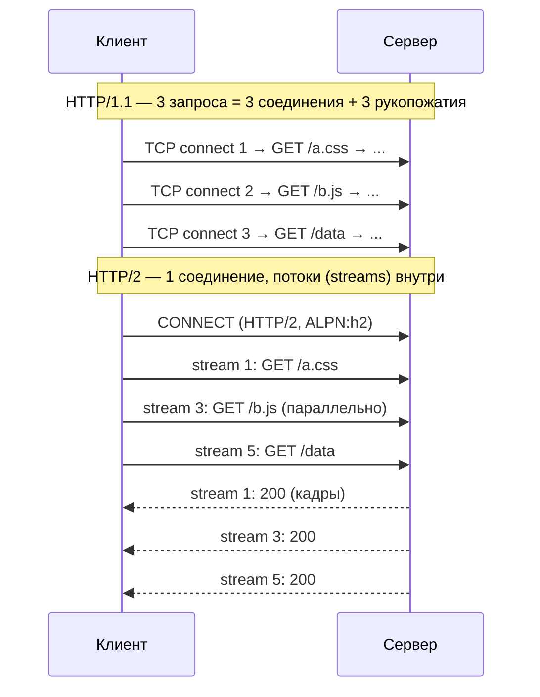
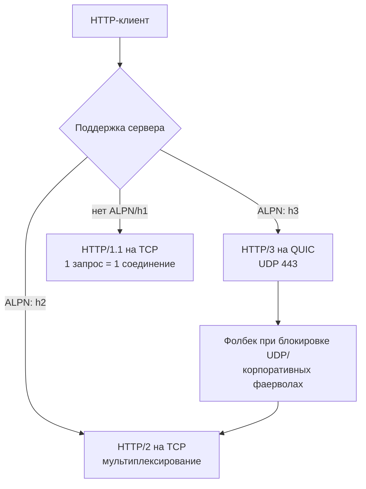

# HTTP/2 и HTTP/3 (Современный HTTP)

## Определение

**HTTP/2** — вторая версия HTTP: сохраняет семантику HTTP/1.1 (методы, статусы, заголовки), но кардинально меняет транспорт — **одно TCP-соединение с мультиплексированием**: несколько запросов/ответов одновременно в бинарных кадрах, сжатие заголовков (HPACK), приоритизация потоков, server push.

**HTTP/3** — следующая версия: та же семантика HTTP, но поверх **QUIC (протокол на базе UDP)** вместо TCP. Убирает главный недостаток HTTP/2 — TCP HOL blocking при потере пакетов. Шифрование по умолчанию (TLS 1.3), быстрее соединение (0-RTT), независимые потоки, смена сети без разрыва соединения.

## Зачем нужно

- **HTTP/1.1 ограничен**: по одному запросу за соединение (head-of-line) → или много TCP-соединений (по 6-8 на страницу), или очередь запросов. Латенсность растёт с числом ресурсов.
- **HTTP/2** — мультиплексирование в одном соединении: десятки запросов параллельно без новых рукопожатий; меньше рукокожатий, сжатее заголовки.
- **HTTP/3** — решает «HOL по TCP»: потеря одного пакета в TCP тормозит весь поток (все потоки HTTP/2 ждут повторную передачу); в QUIC потерянный пакет тормозит только свой поток. + миграция сети (с Wi-Fi на 4G) без обрыва.



## Как работает

**HTTP/2:**
- **Бинарные кадры (frames)** — фреймы с потоком (stream); поверх одного TCP идёт много логических потоков, идентифицируемых `stream_id`.
- **Мультиплексирование** — потоки независимы, запросы не ждут друг друга; интерфейси управляется приоритетами/весами.
- **HPACK** — сжатие заголовков: повторяющиеся заголовки не шлются целиком (динамическая таблица).
- **Flow control на уровне потока** — каждый stream управляет потреблением отдельно.
- **Server Push** — сервер может отправить ассеты до запроса (часто отключено из-за лишнего трафика).
- **ALPN (TLS)** — согласование протокола при рукопожатии (`h2`); без TLS — `h2c` (редко, почти не используется в проде).
- **Потеря пакета в TCP** — HOL: вся очередь приостанавливается, пока потерянный пакет передаётся повторно.

**HTTP/3 (QUIC):**
- **Поверх UDP** — QUIC добавляет надёжность на прикладном уровне: соединение, секвенирование, ACK, контроль перегрузки (как у TCP), но потоки независимы.
- **Только TLS 1.3** — шифрование встроено в QUIC (в HTTP/2 TLS отдельно, шифрово отдельный).
- **0-RTT / 1-RTT** — бывает «нулевой раунд» для повторных соединений (меньше задержка).
- **Connection migration** — соединение привязано к connection id, а не к IP: смена сети сохраняет состояния.
- **Независимые потоки** — потеря пакета не блокирует остальные потоки (нет TCP-HOL).

| | HTTP/1.1 | HTTP/2 | HTTP/3 |
|---|---|---|---|
| Транспорт | TCP (по запросу) | TCP + мультиплексирование | QUIC (UDP) |
| Мультиплексирование | нет | да | да |
| Сжатие заголовков | нет | HPACK | QPACK |
| Шифрование | опционально (TLS) | обычно TLS 1.2/1.3 | только TLS 1.3 |
| HOL blocking | по соединению | по TCP-потоку (потеря пакета тормозит всё) | нет (потоки независимы) |
| 0-RTT | нет | нет | да |
| Смена сети | разрыв соединения | разрыв | нет (migration) |



## Примеры кода

> Приложения обычно просто «поддерживают» HTTP/2/3 — работаем с HTTP-клиентами/серверами, а протокол согласуется автоматически (ALPN).

### TypeScript (node:http2 и fetch)

```typescript
import http2 from 'node:http2'
import { connect } from 'node:http2'

// Клиент HTTP/2: одно соединение, параллельные потоки
const client = http2.connect('https://example.com', {
  settings: { maxConcurrentStreams: 100 },
})

client.on('stream', (stream, headers) => {
  stream.resume()
})
const req = client.request({ ':method': 'GET', ':path': '/api/data' })
req.on('response', (headers) => console.log('status', headers[':status']))
req.end()
```

### Go (net/http — h2 автоматически)

```go
import "net/http"

// Go автоматически включаeт HTTP/2 по TLS (ALPN h2), если
// сервер SetEnableHTTP2, для h1 достаточно простого сервера.
func main() {
	mux := http.NewServeMux()
	mux.HandleFunc("/api", func(w http.ResponseWriter, r *http.Request) {
		w.Header().Set("X-Proto", r.Proto) // "HTTP/2.0"
		w.Write([]byte("ok"))
	})
	// ListenAndServeTLS автоматически выполняет ALPN → h2
	_ = http.ListenAndServeTLS(":443", "cert.pem", "key.pem", mux)
}
```

### Java (HttpClient HTTP/2 — JDK 11+)

```java
import java.net.URI;
import java.net.http.HttpClient;
import java.net.http.HttpRequest;
import java.net.http.HttpResponse;

HttpClient client = HttpClient.newBuilder()
        .version(HttpClient.Version.HTTP_2)   // при недоступности — fallback на HTTP/1.1
        .connectTimeout(Duration.ofSeconds(3))
        .build();

HttpRequest req = HttpRequest.newBuilder(URI.create("https://example.com/api"))
        .timeout(Duration.ofSeconds(5))
        .build();

HttpResponse<String> resp = client.send(req, HttpResponse.BodyHandlers.ofString());
System.out.println("http " + resp.version() + " status " + resp.statusCode());
```

## Пример использования: интеграция

> Тонкие детали проде: **наблюдаемость версии протокола**, **мультиплексирование приоритетов**, **настройка потоков**, фолбек при недоступности QUIC.

### Наблюдение версии протокола (TypeScript)

```typescript
import http2 from 'node:http2'
import http from 'node:http'

function protocolOfURL(url: string): string {
  if (!url.startsWith('https:')) return 'http/1.1 (plain)'
  // ALPN согласовывается при connect; проверяем через effectiveProtocol
  const client = http2.connect(url, { settings: { maxConcurrentStreams: 0 } })
  return client.encrypted ? 'http/2 (http2.connect)' : 'http/1.1'
}
```

### grpc поверх HTTP/2 (Go)

```go
// gRPC использует HTTP/2 как транспорт (см. gRPC).
// Важно: HTTP/2-соединения переиспользуются; вводите разумные лимиты потоков.
import (
	"google.golang.org/grpc"
	"google.golang.org/grpc/credentials"
)

conn, err := grpc.NewClient("orders:443",
	grpc.WithTransportCredentials(credentials.NewTLS(&tls.Config{MinVersion: tls.VersionTLS12})),
)
// conn автоматически иcпользует HTTP/2 (ALPN h2) с мультиплексированием потоков.
```

### Java: проверка и приоритеты потоков (WebClient)

```java
import org.springframework.web.reactive.function.client.WebClient;

// WebClient с Netty умеет h1/h2 и поддерживает приоритеты/борьба за потоки.
WebClient web = WebClient.builder()
        .baseUrl("https://example.com/api")
        .build();

web.get().retrieve().bodyToMono(String.class)
        .retryWhen(Retry.backoff(3, Duration.ofMillis(200))) // см. Retries
        .subscribe(System.out::println);
```

## Паттерны использования

- **HTTP/2 как дефолт для API** — одно соединение + мультиплексирование; gRPC и многие клиенты работают поверх h2.
- **HTTP/3 для латентно- и потере-чувствительных сценариев** — мобильные сети, стриминг, видеозвонки: независимые потоки без TCP-HOL.
- **Полагаться на ALPN и fallback** — клиент сам согласует `h2`/`h3`/`h1.1`; не забывать, что QUIC на UDP могут блокировать фаерволы — фолбек обязателен.
- **Приоритизация потоков** — важные данные (JS/CSS критичный путь) — выше; но не злоупотреблять.
- **Connection reuse через мультиплексирование** — не открывать свой клиент на каждый запрос — переиспользовать (пул соединений).
- **Ограничить concurrency потоков** — на сервере лимит `maxConcurrentStreams`, клиент уважает push-потоки.
- **Сжимать повторные заголовки (HPACK/QPACK)** — браузер и клиенты делают автоматически; следить за большими cookie/заголовками.
- **Наблюдаемость**: следить, что трафик реально идёт по h2/h3 (`req.httpVersion`, заголовок `Alt-Svc`, логи сервера), иначе «мультиплексирование» — иллюзия.

## Антипаттерны и ловушки

- **Рекламировать HTTP/2 как «всё решает»** — под потерей пакетов TCP-HOL остаётся: что-то теряете — остаётся очередь (тогда нужен HTTP/3).
- **Server Push без контроля** — сервер «допихивает» ассеты, которые клиенту не нужны: трафик впустую; многие клиенты это отключают.
- **Игнорировать GOAWAY** — сервер закрывает соединение; клиент, который не обработал GOAWAY, шлёт «в упавшую трубу» до таймаута (см. Timeouts).
- **Делать свои retries без backoff на h2/h3** — при 500 мультиплекс превращается в «бьющее стадо» (см. Retries/Backoff).
- **Наивное «QUIC везде»** — UDP блокируют корпоративные сети, NAT-фолбек; без fallback на h2/h1 пользователь в офисах отваливается.
- **Считать HTTP/3 «быстрее всегда»** — 0-RTT компенсирует только повторный визит; первое соединение — та же задержка + UDP может быть заблокирован.
- **Не настраивать лимиты потоков/буферов** — слишком много особенно больших потоков на сервере повышает потребление памяти.

## Когда использовать / когда НЕ использовать

**Использовать:**
- HTTP/2: практически любой HTTP-трафик (браузеры, API, gRPC); выигрыш от мультиплексирования и сжатия заголовков.
- HTTP/3: мобильные и сети с потерями, стриминг/реалтайм, долгие соединения (WebSocket/SSE не имеют h3-варианта полностью, но fetch-долгие потоки пролетают), приложения, чувствительные к задержке.
- Проверять поддержку клиентов/серверов (ALPN) и настраивать фолбек.

**НЕ использовать (с осторожностью):**
- Внутренние сервисы без явной пользы — HTTP/2 уже стандарт канала gRPC; если всё работает на h1, миграция не даст ничего без мультиплексирования.
- HTTP/3 в средах с блокировкой UDP (corporate) без fallback.
- Свой протокол поверх HTTP/2 без знания ограничений (потоки, push, flow control) — сервер может превратить хаос.

## Связанные темы

- **TCP vs UDP** — HTTP/2 живёт на TCP, HTTP/3 — на QUIC (UDP); понимание транспорта объясняет HOL и фолбеки.
- **gRPC** — структурно построен на HTTP/2 (мультиплексирование stream, бинарные кадры).
- **WebSockets / SSE / Long Polling** — живут поверх HTTP-соединения; HTTP/2 поменял их практики (SSE через h2-потоки).
- **DNS** — доступ в интернет начинается с резолюции; DoH поверх HTTP/2/3 для приватности.
- **Load Balancing** — L7-балансировщики должны понимать h2/h3 (иначе «клейм» разрывает мультиплекс).
- **Security** — TLS 1.3 обязателен в HTTP/3; правильная настройка важно для h2/h3.

## Вопросы

### Q1
**Главное преимущество HTTP/2 перед HTTP/1.1?**
- [x] Мультиплексирование запросов в одном TCP-соединении + сжатие заголовков (HPACK)
- [ ] Шифрование вместо TLS
- [ ] Ударная пропускная способность
- [ ] Работа без DNS

Пояснение: несколько потоков (streams) одновременно на одном соединении + сжатые заголовки — меньше рукопожатий и очередей.

### Q2
**Какая проблема остаётся в HTTP/2 под потерей пакетов?**
- [ ] Нет шифрования
- [x] TCP HOL: потеря одного пакета приостанавливает все потоки соединения
- [ ] Слишком много соединений
- [ ] Нет flow control

Пояснение: TCP мультиплексирует потоки, но при потере — повторная передача тормозит всю очередь; это HTTP/3/QUIC убирает.

### Q3
**На чём построен HTTP/3?**
- [ ] TCP + TLS 1.2
- [x] QUIC на базе UDP + TLS 1.3 (потоки независимы, 0-RTT, connection migration)
- [ ] SCTP
- [ ] HTTP/2 с шифрованием

Пояснение: HTTP/3 = семантика HTTP на QUIC (UDP), сшитая с TLS 1.3.

### Q4
**Как происходит выбор протокола между клиентом и сервером?**
- [ ] Всегда HTTP/2
- [x] ALPN при TLS-рукопожатии: сервер предлагает h2/h3/ h1, клиент выбирает
- [ ] По IP-адресу
- [ ] По HTTP-заголовку

Пояснение: ALPN согласовывает версию протокола в момент handshake (h3/h2/h1.1), с фолбеком.

### Q5
**Почему не «просто взять HTTP/3» везде?**
- [ ] QUIC ущемляет лицензии
- [x] QUIC работает на UDP, который блокируют корпоративные сети/NAT — нужен fallback на h2/h1
- [ ] HTTP/3 не умеет GET
- [ ] HTTP/3 медленнее

Пояснение: UDP может быть заблокирован фаерволом; требуется фолбек: QUIC → HTTP/2 → HTTP/1.1.

## Источники

- RFC 9113 — HTTP/2: https://datatracker.ietf.org/doc/html/rfc9113
- RFC 9114 — HTTP/3 (QUIC): https://datatracker.ietf.org/doc/html/rfc9114
- RFC 8446 — TLS 1.3: https://datatracker.ietf.org/doc/html/rfc8446
- Cloudflare Learning — HTTP/2 and HTTP/3: https://www.cloudflare.com/learning/performance/http-vs-http-3/
- MDN — HTTP/2 и HTTP/3: https://developer.mozilla.org/en-US/docs/Web/HTTP
- QUIC — IETF (RESEARCH): https://datatracker.ietf.org/wg/quic/about/