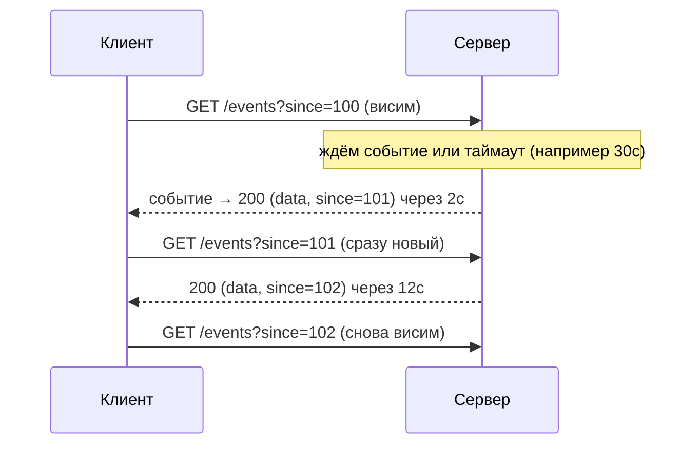
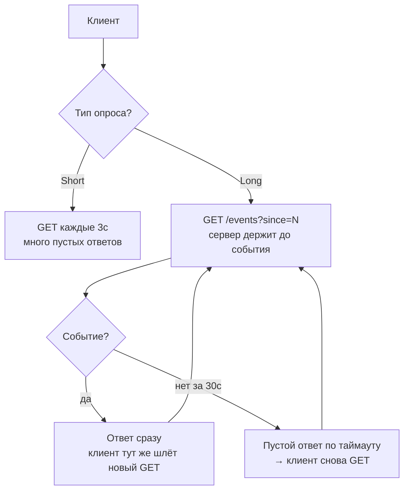

# Long Polling (Длинный опрос)

## Определение

**Long Polling (Длинный опрос)** — техника получения обновлений поверх обычного HTTP: клиент отправляет запрос, а сервер **не отвечает сразу**, а удерживает соединение до тех пор, пока не появится новое событие (или не истечёт таймаут удержания). Как только сервер отвечает — клиент **немедленно отправляет следующий запрос**. Так формируется «почти push» без WebSocket, без `Upgrade`, на любом HTTP/1.1.

## Зачем нужно

- **Push-обновления на старых стеках** — работают везде, где есть обычный HTTP (браузеры, прокси, CDN, без поддержки WebSocket).
- **Простота и совместимость** — никаких долгих сокетов и upgrade: то же HTTP, тот же load balancer, тот же кеш на пустой ответ.
- **Понимание эволюции** — зная long polling, видно, зачем появились **SSE** (авто-переподключение) и **WebSocket** (двусторонний, без повторных запросов).



## Как работает

1. **Клиент** отправляет `GET /events?since=<версия>` — «дай всё новее версии N, но не спеши: жди, если нет».
2. **Сервер** регистрирует ожидание (каналы-очереди, event queue) и держит ответ: событие появилось — вернуть сразу; тишина — вернуть пустой ответ по таймауту (обычно 20–60 с).
3. **Клиент получает**: если событие — обработать; в любом случае **перезаписать `since`** и сразу повесить новый запрос.
4. **Цикл непрерывен**: после каждого ответа клиент тут же отправляет новый запрос — соединение «дышит», и клиент никогда не бывает «без запроса».

**Short polling vs Long polling:**

| | Short Polling | Long Polling |
|---|---|---|
| Периодичность | фиксированная (каждые 2–5 с) | событие или таймаут |
| Задержка | до N секунд (средняя N/2) | почти мгновенно после события |
| Нагрузка | тысячи пустых запросов | запросы редкие, «по событию» |
| Сеть | много маленьких ответов | соединения висящие + переподключения |



## Примеры кода

> «Сервер, который ждёт»: регистрация запроса в очередь ожидания и ответ по событию или таймауту.

### TypeScript (Express + реестр ожидающих)

```typescript
import express from 'express'

const app = express()
// данные: Map<номер события, payload>; ждущие запросы в Set
let counter = 0
const events = new Map<number, unknown>()
const waiters = new Set<(data: unknown, v: number) => void>()

app.get('/events', async (req, res) => {
  const since = Number(req.query.since ?? 0)
  const latest = counter
  if (since < latest) return res.json(events.get(latest)) // есть готовое

  await new Promise<void>((resolve) => {
    const t = setTimeout(() => {
      waiters.delete(onEvent)
      resolve() // таймаут — пустой оборот
    }, 30_000)
    const onEvent = (data: unknown, v: number) => {
      clearTimeout(t)
      waiters.delete(onEvent)
      res.json(data)
      resolve()
    }
    waiters.add(onEvent)
  })
})
```

### Go (канал + select с таймером)

```go
type Broker struct {
	subs   map[chan event]struct{}
	mu     sync.Mutex
	latest int
}

func (b *Broker) subscribe() (chan event, func()) {
	b.mu.Lock()
	defer b.mu.Unlock()
	ch := make(chan event, 1)
	b.subs[ch] = struct{}{}
	return ch, func() { b.mu.Lock(); delete(b.subs, ch); b.mu.Unlock() }
}

func (b *Broker) poll(w http.ResponseWriter, r *http.Request) {
	ch, unsub := b.subscribe()
	defer unsub()

	select {
	case ev := <-ch: // событие пришло → отвечаем сразу
		writeJSON(w, ev)
	case <-time.After(30 * time.Second): // тишина → 200 (no data)
		w.WriteHeader(http.StatusOK)
	}
}
```

### Java (CompletableFuture + таймаут)

```java
public class LongPollEndpoint {
    private final Map<CompletableFuture<Event>, Long> waiters = new ConcurrentHashMap<>();

    public CompletableFuture<Event> waitEvent(long since, Duration timeout) {
        CompletableFuture<Event> future = new CompletableFuture<>();
        waiters.put(future, since);
        // по таймауту — завершаем пустым результатом (можно null)
        future.completeOnTimeout(null, timeout.toMillis(), TimeUnit.MILLISECONDS);
        return future;
    }

    public void publish(Event ev) { // событие пришло — будим всех
        waiters.forEach((f, sinceV) -> {
            if (ev.seq > sinceV) f.complete(ev);
        });
    }

    // в контроллере: return CompletableFuture<Event> -> сервер не займёт поток (async)
}
```

## Пример использования: интеграция

> Прод: event-шина (очередь/подписки), курсор-версии, кластер через pub/sub, таймауты — и аккуратно с «тихим каналом».

### Express: очередь ожиданий + курсор (TypeScript)

```typescript
import express from 'express'
const app = express()

// хранилище событий + ждущие
const journal: unknown[] = []
const waiting: Array<(e: unknown) => void> = []
const HOLD_MS = 30_000

app.get('/events', async (req, res) => {
  const since = Number(req.query.since ?? -1)
  res.setHeader('Cache-Control', 'no-store') // нельзя кешировать долгий ответ

  if (since < journal.length - 1) {
    return res.json(journal.slice(since + 1)) // есть новые события
  }
  const t = setTimeout(() => res.json([]), HOLD_MS) // тишина → []
  waiting.push((e: unknown) => {
    clearTimeout(t)
    res.json([e])
  })
})

export function publish(ev: unknown) {
  journal.push(ev)
  while (waiting.length) waiting.shift()!(ev) // раздаём событие всем ожидающим
}
```

### Go: кластер через Redis pub/sub

```go
// Инстанс кластера получил событие — отдать ожидающим НА ВСЕХ узлах
func (s *Server) subscribeStream(ctx context.Context) <-chan event {
	ch := make(chan event, 1)
	go func() {
		sub := redis.Subscribe(ctx, "updates")
		for msg := range sub.Channel() {
			ch <- parse(msg.Payload)
		}
	}()
	return ch
}
```

### Spring: DeferredResult — async без занятия потоков (Java)

```java
import org.springframework.web.context.request.async.DeferredResult;
import org.springframework.web.bind.annotation.*;

@RestController
public class EventsController {
    private final LongPollEndpoint bus = new LongPollEndpoint();

    @GetMapping("/events")
    public DeferredResult<Event> events(@RequestParam long since) {
        DeferredResult<Event> result = new DeferredResult<>(30_000L);// таймаут
        bus.waitEvent(since, Duration.ofSeconds(30))
           .thenAccept(e -> result.setResult(e)); // событие или null-пауза
        return result;
    }
}
```

## Паттерны использования

- **Хранить курсор/версию** — клиент знает последний номер события и запрашивает «всё новее» (`since`), переживает переподключение.
- **Клиент всегда «висит» в новом запросе** — получил ответ (событие/таймаут) → немедленно следующий.
- **Таймаут удержания на сервере** — для любого балансировщика/прокси, которые обрывают долгие соединения; иначе клиент уйдёт сам (см. Timeouts).
- **Серверный таймаут меньше клиентского** — сервер отвечает (пусто) раньше, клиент успевает переподключиться без разрыва.
- **Агрегировать события** — если событий много, копить и отдавать сразу пакетом (меньше оборотов).
- **Кластер — через pub/sub** — сообщение пришло на один инстанс: пробросить всем через Redis/брокер (см. WebSockets).
- **Нет событий → пустой ответ** — не держать соединение бесконечно: таймаут и новый цикл.

## Антипаттерны и ловушки

- **Слишком долгий HOLD на сервере** — клиентские/прокси/балансировочные таймауты оборвут соединение; ответ должен приходить раньше.
- **Держать соединение «навсегда»** — «долгий опрос» не равен «вечному»; всегда таймаут.
- **Клиент не обновляет курсор** — повторное получение старых событий/пропуск — хаос.
- **Переподключение без backoff** — при массовом сбое все клиенты разом «вешаются» → «бьющее стадо» (см. Retries/Backoff).
- **Сервер без pub/sub в кластере** — события приходят на узел A, клиент висит на узле B — «тишина».
- **Ответ нельзя кешировать/CDN** — длинный ответ не должен попасть в кеш; обязательно `Cache-Control: no-store`.
- **Использовать для очень частых событий** — при высокой частоте обновлений long-polling — просто дорогой короткий опрос: лучше стрим (SSE/WS).

## Когда использовать / когда НЕ использовать

**Использовать:**
- Сервисы, которые обязаны работать на чистом HTTP/1.1 (старые прокси, интеграции без upgrade).
- Fallback-механизм, если WebSocket/SSE недоступны (некоторые корпоративные сети).
- «Редкий push» с малым числом пользователей и событий (рейтинг, статус-обновления).

**НЕ использовать (с осторожностью):**
- Высокочастотные обновления (каждые миллисекунды) — используем SSE/WebSocket.
- Много пользователей одновременно — тысячи «висящих» соединений + обороты: нагрузки.
- Когда доступен **Server-Sent Events** — он проще и умеет автопереподключение (см. SSE).
- Когда нужен **двусторонний** обмен — только **WebSocket**.

## Связанные темы

- **Server-Sent Events** — современная замена long polling для одностороннего push: обычный HTTP, авто-переподключение.
- **WebSockets** — двусторонний постоянный канал; long polling — его fallback.
- **HTTP/2 and HTTP/3** — мультиплексирование/QUIC меняют цену «висящих» соединений, но long polling жив на HTTP/1.1.
- **Timeouts** — таймаут удержания ответа — ключевая точка настройки long polling.
- **Load Balancing** — балансировщик не должен обрывать долгие GET; sticky-сессии не обязательны (каждый оборот — новый HTTP), но нужны консистентные версии.
- **Message Queues / Pub-Sub** — на сервере ждущие подписаны на источник событий (брокер/Redis).

## Вопросы

### Q1
**В чём суть long polling?**
- [ ] Клиент опрашивает каждые 2 секунды
- [x] HTTP-запрос удерживается сервером до события или таймаута, затем немедленно следует следующий
- [ ] Клиент шлёт UDP
- [ ] Сервер сам звонит клиенту

Пояснение: запрос «висит» как можно дольше; ответ — по событию или по таймауту; затем цикл повторяется.

### Q2
**Чем long polling лучше short polling?**
- [ ] Сервер сам присылает события по расписанию (каждые 5 секунд)
- [x] Ответ приходит сразу после события (а не к ближайшему тику); меньше пустых запросов
- [ ] Быстрее сеть
- [ ] Не нужен HTTP

Пояснение: сервер ждёт события и отвечает мгновенно, когда оно есть; пустых «тиков» гораздо меньше.

### Q3
**Зачем клиенту курсор/версия (`since`)?**
- [x] Чтобы при переподключении не потерять события и не получить повторы
- [ ] Для шифрования
- [ ] Для скорости
- [ ] Чтобы кешировать

Пояснение: `since` = номер последнего полученного события; сервер отдаёт «всё новее», клиент не пропускает и не дублирует.

### Q4
**Почему важен серверный таймаут удержания ответа?**
- [ ] Он ускоряет события
- [x] Балансировщики/прокси обрывают слишком долгие соединения; таймаут на сервере < клиентского — клиент переподключится без ошибок
- [ ] Увеличивает пропускную способность
- [ ] Заменяет heartbeat

Пояснение: бесконечно держать GET нельзя — прокси и балансировщики рвут; короче серверный HOLD + повторный запрос = надёжный цикл.

### Q5
**Когда long polling предпочтительнее WebSocket?**
- [ ] Нужен двусторонний обмен
- [x] Когда нет поддержки WebSocket (старые прокси/сети) — как fallback на чистом HTTP
- [ ] Когда событий очень много
- [ ] Когда нужен низкий RTT

Пояснение: совместимость — главный плюс; в современных условиях для push чаще лучше SSE, а двусторонники — WebSocket.

## Источники

- MDN — Server-sent events (сравнение с long polling): https://developer.mozilla.org/en-US/docs/Web/API/Server-sent_events
- Ably — Long polling explained: https://ably.com/topic/long-polling
- Push vs polling (Okta blog, real-time): https://developer.okta.com/blog/2017/09/25/all-the-ways-to-make-a-web-app-happy
- RFC 6455 (WebSocket) — как вытек из polling: https://datatracker.ietf.org/doc/html/rfc6455
- Wikipedia — Comet / long polling: https://en.wikipedia.org/wiki/Comet_(programming)
