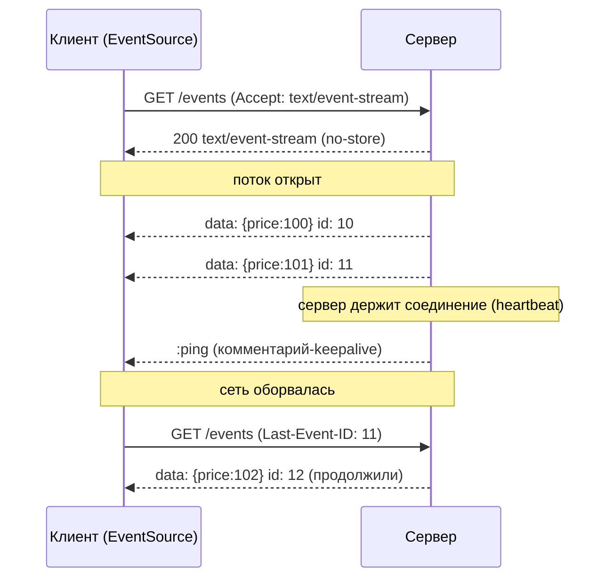
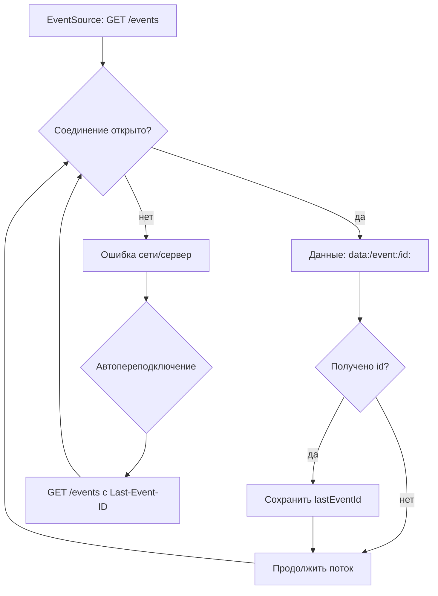

# Server-Sent Events (События с сервера)

## Определение

**Server-Sent Events (SSE)** — стандарт **одностороннего push** с сервера на клиент через обычный HTTP. Клиент открывает поток (`text/event-stream`), сервер пишет в него события по мере появления; соединение держится долго и не закрывается до конца потока. Клиентский API `EventSource` умеет **автоматически переподключаться** и продолжать с места разрыва (`id`/`Last-Event-ID`). В отличие от WebSocket, SSE — только «сервер → клиент».

## Зачем нужно

- **Push уведомлений и потоков** — лента, доска, прогресс, токены LLM-ответов, live-котировки: сервер «толкает», клиент показывает.
- **Проще, чем WebSocket** — это обычный HTTP: никакого upgrade, работает через прокси/CDN/балансировщики, используется `fetch`-класс.
- **Автопереподключение из коробки** — `EventSource` сам переустанавливает поток и продолжает по `Last-Event-ID`.
- **Дешёвый обмен** — одно соединение на много событий, без повторных HTTP-запросов (vs long polling).



## Как работает

1. Клиент отправляет `GET /events` с `Accept: text/event-stream`.
2. Сервер отвечает `200`, `Content-Type: text/event-stream`, `Cache-Control: no-store`; поток — это **обычный HTTP-ответ**, который не заканчивается.
3. Формат строк в потоке: `data: <строка>` — данные события, `id: <номер>` — идентификатор (для переподключения), `event: <тип>` — именованное событие, `: комментарий` — комментарий (часто используется как **heartbeat**), `retry: <мс>` — интервал переподключения.
4. Отдельное событие — блок строк `data:` (несколько строк = многострочные данные), завершённый пустой строкой.
5. Клиент (`EventSource`) обрабатывает `message`/именованные события; при разрыве — автоматически переподключается с `Last-Event-ID: <последнее>`.



## Примеры кода

> Минимальный сервер SSE + клиент: сервер пишет поток, клиент читает.

### TypeScript (node:http + EventSource)

```typescript
import http from 'node:http'

const server = http.createServer((req, res) => {
  res.writeHead(200, {
    'Content-Type': 'text/event-stream',
    'Cache-Control': 'no-store',
    Connection: 'keep-alive',
  })

  let id = 0
  const timer = setInterval(() => {
    res.write(`id: ${id++}\ndata: {"price": ${Math.floor(Math.random() * 100)}}\n\n`)
  }, 1000)

  req.on('close', () => clearInterval(timer))
})
server.listen(8080)

// Клиент (браузер):
const source = new EventSource('/events')
source.onmessage = (event) => console.log(event.data) // JSON-строка
source.onerror = () => console.log('reconnecting...') // авто!
```

### Go (http.Flusher)

```go
import (
	"net/http"
	"fmt"
)

func stream(w http.ResponseWriter, r *http.Request) {
	w.Header().Set("Content-Type", "text/event-stream")
	w.Header().Set("Cache-Control", "no-store")
	flusher, ok := w.(http.Flusher)
	if !ok {
		http.Error(w, "no flusher", http.StatusInternalServerError)
		return
	}

	// пишем событие и обязательно Flush() — иначе буфер сервера/прокси задержит
	fmt.Fprintf(w, "id: %d\ndata: %s\n\n", 1, `{"price":100}`)
	flusher.Flush()
}
```

### Java (Spring SseEmitter)

```java
import org.springframework.web.bind.annotation.*;
import org.springframework.web.servlet.mvc.method.annotation.SseEmitter;

@RestController
public class EventsController {
    @GetMapping(value = "/events", produces = "text/event-stream")
    public SseEmitter stream() throws IOException {
        SseEmitter emitter = new SseEmitter(60_000L); // таймаут потока
        executor.execute(() -> {
            try {
                for (int i = 0; i < 10; i++) {
                    emitter.send(SseEmitter.event()
                            .id(i + "")           // id для resume
                            .name("price")
                            .data("{\"price\":" + i + "}"));
                    Thread.sleep(1000);
                }
                emitter.complete();
            } catch (Exception e) {
                emitter.completeWithError(e);
            }
        });
        return emitter; // Spring отдаёт text/event-stream
    }
}
```

## Пример использования: интеграция

> Прод-сценарий: heartbeat (комментарий-`:`), `retry`, `id` для переподключения, буферизация на прокси.

### Express: поток событий с heartbeat (TypeScript)

```typescript
import express from 'express'
const app = express()

app.get('/events', async (req, res) => {
  res.writeHead(200, {
    'Content-Type': 'text/event-stream',
    'Cache-Control': 'no-store',
    'X-Accel-Buffering': 'no', // отключаем буферизацию nginx
  })

  // клиент шлёт последний полученный id
  const last = Number(req.headers['last-event-id'] ?? 0)
  let current = last + 1

  const send = (data: unknown) => {
    res.write(`id: ${current++}\ndata: ${JSON.stringify(data)}\n\n`)
  }
  const heartbeat = setInterval(() => res.write(': keepalive\n'), 15_000)

  // подписка на источник событий (шина/брокер/Redis)
  const unsub = bus.subscribe(send)
  req.on('close', () => {
    clearInterval(heartbeat)
    unsub()
  })
})
```

### Go: SSE через канал + таймаут, автопереподключение (id)

```go
func events(w http.ResponseWriter, r *http.Request) {
	flusher := w.(http.Flusher)
	// клиент резюмирует с Last-Event-ID
	last := r.Header.Get("Last-Event-ID")
	seq, _ := strconv.Atoi(last)

	for {
		select {
		case ev := <-eventsCh: // событие из шины
			seq++
			fmt.Fprintf(w, "id: %d\nevent: %s\ndata: %s\n\n", seq, ev.Type, ev.JSON())
			flusher.Flush()
		case <-time.After(15 * time.Second):
			fmt.Fprint(w, ": keepalive\n") // heartbeat-комментарий
			flusher.Flush()
		case <-r.Context().Done(): // клиент ушёл
			return
		}
	}
}
```

### Spring: WebFlux + Flux как SSE-поток (Java)

```java
import org.springframework.http.codec.ServerSentEvent;
import org.springframework.web.bind.annotation.*;
import reactor.core.publisher.Flux;

@RestController
public class StreamController {
    @GetMapping(value = "/stream", produces = "text/event-stream")
    public Flux<ServerSentEvent<String>> stream() {
        return Flux.interval(Duration.ofSeconds(1))
                .map(i -> ServerSentEvent.<String>builder()
                        .id(i.toString())       // resume-id
                        .event("tick")
                        .data("{\"n\":" + i + "}")
                        .build());
    }
}
```

## Паттерны использования

- **SSE — только «сервер → клиент»** — уведомления, лента, курс, прогресс, токены LLM.
- **`id` на каждом событии** — клиент резюмирует с `Last-Event-ID`; не теряем события при разрыве.
- **Heartbeat** — комментарий `:` (или `ping`-событие) каждые 10–30 с — соединение не «уснёт» у прокси.
- **`Cache-Control: no-store`** — поток нельзя кешировать.
- **Отключить буферизацию прокси** — `X-Accel-Buffering: no` (nginx), `flush` в приложении — иначе события «грудятся».
- **`retry: <мс>`** — клиентская частота переподключения из потока.
- **Один поток = один потребитель** — каждый клиент = своё соединение + подписка на источник событий (для кластера — pub/sub, см. WebSockets).
- **Таймаут потока** — SSE-эмиттеры с таймаутом закрывать, чтобы не «мёртвые» соединения (см. Timeouts).

## Антипаттерны и ловушки

- **Использовать SSE для «клиент → сервер»** — это односторонний канал; для двустороннего нужен WebSocket.
- **Не ставить `id`** — при разрыве клиент продолжит «с нуля» и может потерять/продублировать события.
- **Пропускать heartbeat / flush** — прокси увидит «тишину» и оборвёт соединение; события «соберутся пачкой».
- **Не отключать буферизацию** — nginx/envoy буферизуют ответ по умолчанию: события приходят редко и с задержкой.
- **Без `Cache-Control: no-store`** — кеш/CDN могут повторить/склеить поток.
- **Бинарные данные** — SSE — текст (UTF-8); для бинарного потока — WebSocket.
- **Лимит соединений браузера** — HTTP/1.1: браузер держит ~6 соединений на домен; много SSE-потоков на страницу упирается (при h2 можно разделять потоком, но осторожно).
- **Reconnect без контроля** — при массовом сбое EventSource всех клиентов мгновенно висит заново → «бьющее стадо» (см. Backoff).

## Когда использовать / когда НЕ использовать

**Использовать:**
- Push с сервера на клиент: уведомления, лента активности, курсы/котировки, прогресс загрузки, ChatGPT-подобные stream-ответы (токены).
- Когда нужна простота над WebSocket: обычный HTTP, EventSource, автопереподключение.
- Совместная работа — многие сценарии «живой страницы» (курсор, коллеги).

**НЕ использовать (с осторожностью):**
- Двусторонний интерактив (чат «и туда и сюда», игры) — нужен WebSocket.
- Бинарный/гейм-тайловый низколатентный трафик — WebSocket/QUIC.
- Очень высокая плотность клиентов на одном домене (лимит соединений HTTP/1.1) — оценить рабочее распределение.
- Сценарии, где клиенту надо управлять потоком (пауза/дозирование), а не получать «поток всегда» — там gRPC-/WS-streaming.

## Связанные темы

- **WebSockets** — двусторонний канал; SSE — простая альтернатива для одностороннего push (автопереподключение).
- **Long Polling** — исторический предшественник; SSE устраняет «обороты» и добавляет resume по `id`.
- **HTTP/2 and HTTP/3** — SSE ход на h1/h2; мультиплексирование/потоки меняют цену «долгих GET» (передают по h2).
- **Load Balancing** — балансировка long-lived GET; в кластере события должны доехать до любого инстанса (pub/sub).
- **Timeouts/Backpressure** — таймаут потока, heartbeat и обработка медленного клиента.
- **Observability** — считать открытые SSE-потоки, latency событий, обрывы (см. Observability).

## Вопросы

### Q1
**В чём главное ограничение SSE как протокола?**
- [ ] Нет шифрования
- [x] Только односторонний поток «сервер → клиент» (клиент не шлёт в том же канале)
- [ ] Работает только по UDP
- [ ] Нужен upgrade

Пояснение: SSE — unidirectional: сервер толкает, клиент не передаёт данные в том же потоке; для двустороннего — WebSocket.

### Q2
**Почему в SSE полезен `id` на каждом событии?**
- [ ] Для шифрования
- [x] При обрыве EventSource переподключается и продолжает с `Last-Event-ID` — без потерь/повторов
- [ ] Ускоряет передачи
- [ ] Это требование CDN

Пояснение: id — «закладка» потока; на reconnect клиент передаёт `Last-Event-ID`, сервер продолжает оттуда.

### Q3
**Что такое «heartbeat» в SSE-потоке?**
- [x] Периодический комментарий `:` (или событие ping), чтобы прокси не оборвали «тихое» соединение
- [ ] Шифрование ключами
- [ ] Автопереподключение
- [ ] Проверка подлинности

Пояснение: без периодических данных соединение выглядит «зависшим» для балансировщика/прокси — heartbeat поддерживает его живым.

### Q4
**Почему важно `Cache-Control: no-store` и отключение буферизации прокси?**
- [x] Поток длинный и «живой»; кеш/CDN/буферизация задержат или продублируют события
- [ ] Это ускоряет SSL
- [ ] Без этого клиент не откроет соединение
- [ ] Требование для JSON

Пояснение: SSE — длинный ответ без фиксированной длины; буферы накапливают и выдают «рывками», кеш может повторить — нужен no-store + flush.

### Q5
**Когда WebSocket уместнее, чем SSE?**
- [ ] Простой push уведомлений
- [x] Нужен двусторонний обмен и/или бинарные данные (чат, игры)
- [ ] Курс валют на странице
- [ ] Токены LLM-ответа

Пояснение: WebSocket — full-duplex и binary-capable; SSE хорош, когда сервер только отправляет текст.

## Источники

- WHATWG HTML — Server-Sent Events (спецификация EventSource): https://html.spec.whatwg.org/multipage/server-sent-events.html
- MDN — Server-sent events: https://developer.mozilla.org/en-US/docs/Web/API/Server-sent_events
- MDN — EventSource API: https://developer.mozilla.org/en-US/docs/Web/API/EventSource
- Cloudflare — SSE: https://developers.cloudflare.com/workers/runtime-apis/request/
- Spring — SseEmitter и ServerSentEvent (WebFlux): https://docs.spring.io/spring-framework/reference/web/webmvc/mvc-controller/ann-methods-sse.html