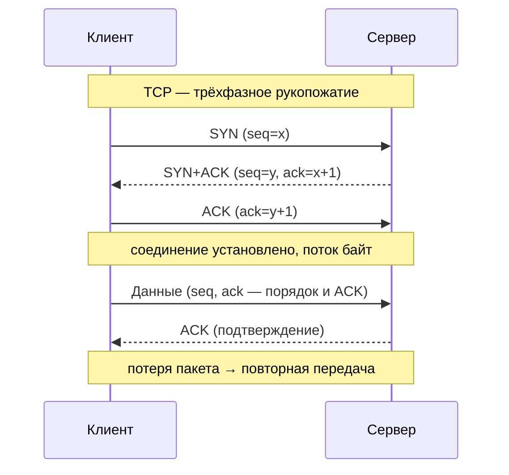
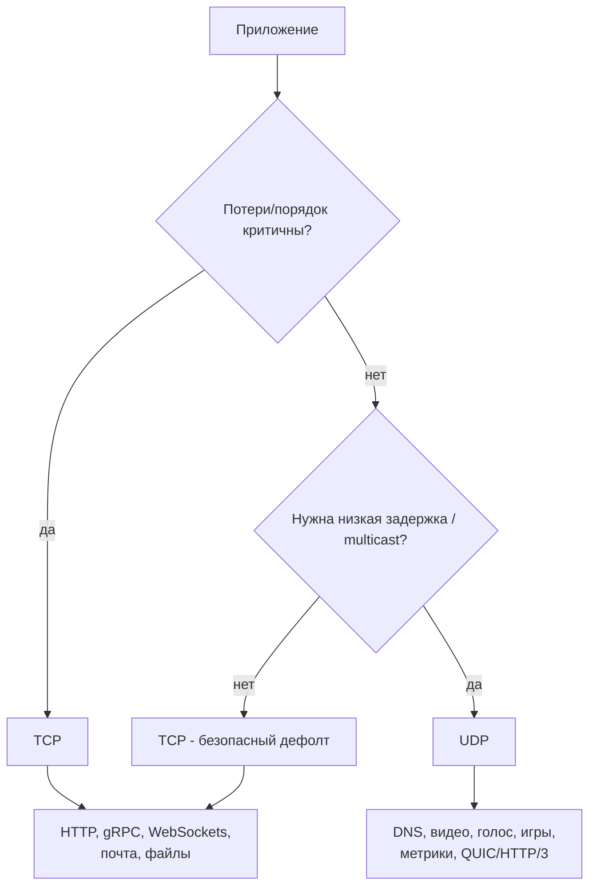

# TCP vs UDP (Транспортный уровень)

## Определение

**TCP (Transmission Control Protocol)** — надёжный **потоковый** транспорт: устанавливает соединение, упорядочивает байты, гарантирует доставку (ACK, повторная передача), управляет потоком и перегрузкой. Поверх него работают HTTP/1.1, HTTP/2, WebSockets, почта, gRPC (по умолчанию).

**UDP (User Datagram Protocol)** — лёгкий **дейтаграммный** транспорт «без состояния»: отправили дейтаграммы и забыли — без гарантий доставки, порядка, целостности потока. Быстрый, с низкой задержкой, не держит соединение. Поверх него — DNS, VoIP/стриминг, онлайн-игры, мониторинг, QUIC (HTTP/3).

## Зачем нужно различие

- **TCP выбирают, когда потеря недопустима** — файлы, страницы, платежи, управляющий трафик: приложение хочет «доставь и не искази».
- **UDP выбирают, когда важнее скорость/задержка** — видео, голос, игры, метрики: потерять пакет дешевле, чем ждать повторную передачу (latency > 200мс заметна).
- **Понимание, что HTTP/sockets работают поверх** конкретного транспорта — диагностика «медленного TCP» и «потерянного UDP» — разные инструменты.



## Как работает

**TCP:**
- **Соединение**: 3-way handshake (SYN → SYN+ACK → ACK), состояние на обоих концах (ESTABLISHED, FIN, RST...), полузакрытие (одна сторона может закрыть свою сторону, другая — продолжить).
- **Надёжность**: последовательные номера (seq), ACK, тайм-ауты повторной передачи, «окно» (window) скользящее для потока.
- **Flow control**: получатель сообщает, сколько может принять (`rwnd`).
- **Congestion control**: медленный старт, избегание перегрузки, fast retransmit — TCP тормозит сам себя при потерях в сети.
- **Модель**: **поток байт**. У TCP нет «границ сообщений»: приложение само знает, где заканчивается фрейм (длина/разделители).

**UDP:**
- **Без соединения**: нет рукопожатия, нет состояния на сервере (меньше памяти у сервера, поддержка мультикаст).
- **Дейтаграммы**: каждая датаграмма — самостоятельная единица с границами; возможно дублирование, потеря, переупорядочивание — приложение решает.
- **Минимум поверх**: checksum (опционально), без повторной передачи (поверх прикладной уровень может добавить).
- **Latency & throughput**: нет рукопожатия/окна → низкая задержка; потеря пакетов не тормозит поток (как в TCP).

| Характеристика | TCP | UDP |
|---|---|---|
| Соединение | Да (handshake, состояние) | Нет (fire-and-forget) |
| Надёжность | Доставка, порядок, целостность | Не гарантирует |
| Модель | Поток байт (границ нет) | Дейтаграммы (границы есть) |
| Контроль перегрузки | Да (slow start и т.д.) | Нет (приложение само) |
| Задержка | Выше (handshake, ACK) | Ниже |
| Use-cases | HTTP, gRPC, WebSocket, файлы | DNS, видео, игры, метрики |



## Примеры кода

> Демонстрация обеих моделей: ТCP-сокет (поток) и UDP-сокет (дейтаграмма).

### TypeScript (node:net vs node:dgram)

```typescript
import net from 'node:net'
import dgram from 'node:dgram'

// TCP: поток — сервер читает строку за строкой (разделитель \n)
const server = net.createServer((socket) => {
  socket.on('data', (chunk) => {
    socket.write(`echo: ${chunk}`)
  })
})
server.listen(3000)

// UDP: дейтаграммы — каждый message отдельная единица
const udp = dgram.createSocket('udp4')
udp.on('message', (msg, rinfo) => {
  udp.send(`echo: ${msg}`, rinfo.port, rinfo.address)
})
udp.bind(4000)
```

### Go (net.TCPAddr vs net.UDPAddr)

```go
import "net"

func tcpEcho() error {
	ln, err := net.Listen("tcp", ":3000")
	if err != nil {
		return err
	}
	conn, err := ln.Accept() // установленное соединение
	if err != nil {
		return err
	}
	buf := make([]byte, 1024)
	_, _ = conn.Read(buf) // данные без границ сообщений
	_, _ = conn.Write(buf)
	return nil
}

func udpEcho() error {
	pc, err := net.ListenPacket("udp", ":4000")
	if err != nil {
		return err
	}
	buf := make([]byte, 1024)
	n, addr, _ := pc.ReadFrom(buf) // пришла целая дейтаграмма
	_, _ = pc.WriteTo(buf[:n], addr)
	return nil
}
```

### Java (Socket vs DatagramSocket)

```java
import java.net.*;

void tcpServer() throws IOException {
    try (ServerSocket ss = new ServerSocket(3000)) {
        Socket sock = ss.accept();              // одно соединение
        var in = new BufferedReader(new InputStreamReader(sock.getInputStream()));
        String line = in.readLine();            // читаем до \n — граница в приложении
        sock.getOutputStream().write(("echo: " + line).getBytes());
    }
}

void udpServer() throws IOException {
    try (DatagramSocket ds = new DatagramSocket(4000)) {
        byte[] buf = new byte[1024];
        DatagramPacket p = new DatagramPacket(buf, buf.length);
        ds.receive(p);                          // целая дейтаграмма (границы сохраняются)
        ds.send(new DatagramPacket(buf, p.getLength(), p.getAddress(), p.getPort()));
    }
}
```

## Пример использования: интеграция

> Реальный выбор транспорта: надёжный TCP для бизнес-данных, лёгкий UDP для метрик/стриминга, QUIC (UDP) — когда нужны низкая задержка и надёжность, но не хочется платить за TCP.

### HTTP поверх TCP vs UDP-метрики (TypeScript)

```typescript
import dgram from 'node:dgram'

async function sendMetrics(host: string, port: number) {
  const sock = dgram.createSocket('udp4')
  // метрики во время пиков могут теряться — согласованный риск,
  // зато продюсер не блокируется на slow TCP (backpressure)
  sock.send(Buffer.from('req.count 42'), port, host)
  sock.send(Buffer.from('latency.p99 182'), port, host)
  sock.close()
}

// Надёжный путь — тот же процесс шлёт ордера по TCP/HTTP:
// fetch('https://orders/api/orders') — TCP + retries (см. Retries)
```

### TCP-сервер команд + UDP пульс (Go)

```go
// Управляющий канал — TCP (надёжность), «пульс» — UDP (латентность не обязательна).
func serve() error {
	tcpLn, _ := net.Listen("tcp", ":7000") // командные операции
	udpPC, _ := net.ListenPacket("udp", ":7001") // heartbeat/статусы

	go func() {
		for {
			conn, _ := tcpLn.Accept()
			go handleCommand(conn) // потеря недопустима
		}
	}()

	buf := make([]byte, 64)
	for {
		if _, _, err := udpPC.ReadFrom(buf); err != nil {
			continue // heartbeat потеряли — это не фатальна
		}
		_ = updateStatus() // метаданные ок
	}
}
```

### Socket (TCP) + Datagram (UDP) в Spring (Java)

```java
// Клиент хранит и TCP, и UDP-потоки отдельно:
// WebSocket (TCP) — двусторонний обмен сообщениями чата (см. WebSockets)
// UDP-канал — периодические метрики задержки клиента (потеря допустима)
try (Socket chat = new Socket("chat.api", 443);                     // надёжный
     DatagramSocket telemetry = new DatagramSocket()) {             // бросающий
    OutputStream out = chat.getOutputStream();
    out.write(("hi").getBytes());
    DatagramPacket p = new DatagramPacket(
        "ping".getBytes(), 4, InetAddress.getByName("stats.api"), 9000);
    telemetry.send(p);
}
```

## Паттерны использования

- **TCP — дефолт для «доставь обязательно»** — HTTP, gRPC, WebSockets, почта, файлы; применяется по умолчанию.
- **UDP — когда потеря дешевле задержки** — видео/голос (дроп кадра лучше, чем задержка), онлайн-игры, мониторинг, DNS, мультикаст.
- **QUIC/HTTP/3 (UDP)** — берём надёжность TCP-уровня, но без head-of-line blocking: хорошо для приложений, чувствительных к задержке (см. HTTP/2 vs HTTP/3).
- **Фрейминг поверх TCP** — определяем собственные границы сообщений: длина-префикс, разделители, JSON-lines (serialize/deserialize в Go).
- **Keep-alive/Nagle**: `TCP_NODELAY`/NoDelay для интерактивных протоколов, keepalive — для долгих соединений (WebSockets).
- **Поверх UDP — прикладные гарантии**, если они нужны: seq + ACK + таймауты (как делает QUIC) или «best-effort + retry на другом канале».
- **Выделять порты/логика на сокет** — отдельные порты для TCP и UDP в одном сервисе — нормальный паттерн.

## Антипаттерны и ловушки

- **UDP для критичных данных без прикладных гарантий** — потеряли запись и «уже не узнаем»: плакал гарантия.
- **TCP для стриминга/голоса** — при потерях TCP ждёт повторную передачу и увеличивает latency (голос ощущается, как «каша»): head-of-line blocking.
- **Трактовать TCP как «границы сообщений»** — каждый `read` не равен одному сообщению; нужен фрейминг (длина/разделитель).
- **Приводить UDP к «гарантии» наивным retry без seq** — дубли и перемешивание сломают логику.
- **Игнорировать MTU и большой дейтаграмму** — UDP-пакет > MTU фрагментируется/отбрасывается (IPv4 фраг; IPv6 → размер надо знать).
- **Блокирующие read без таймаутов** — и TCP, и UDP-сокеты, ожидающие данных бесконечно, «съедают потоки» (см. Timeouts).
- **Игнор контроля перегрузки на TCP-пленке** — «я перешёл на UDP, теперь шлю без лимитов» — чужие сети и балансировщики её всё равно считают (обычно хуже) — сбивать резкостью нельзя.

## Когда использовать / когда НЕ использовать

**Использовать:**
- **TCP**: HTTP/HTTPS, gRPC, WebSockets, SMTP/IMAP, файлы (SFTP), anything, где доставка важнее скорости.
- **UDP**: DNS, аудио/видео-стриминг, VoIP, игры (player state), мониторинг/телеметрия, broadcast/multicast, QUIC (HTTP/3).

**НЕ использовать (с осторожностью):**
- UDP для транзакций и бизнес-операций без прикладных гарантий (идемпотентность, retry, подтверждения).
- TCP, если главная задача — минимальная задержка при потерях (голос) — там компромисс с QUIC (UDP) стоит взвесить.
- Тонкие interconnect'ы (например, внутри кластера) где юзаете TCP по умолчанию, а UDP-мультикаст обещает латентность — надо проверить сетевые ограничения.

## Связанные темы

- **DNS** — работает по UDP:53 (и TCP для больших ответов) — классика «UDP для коротких запросов».
- **HTTP/2 и HTTP/3** — HTTP/3 = QUIC (UDP) — «надёжный UDP»; HTTP/1.1 и HTTP/2 — поверх TCP.
- **gRPC** — обычно поверх TCP/HTTP/2; понимание транспорта важно для настройки.
- **WebSockets / Long Polling / SSE** — живут поверх TCP (HTTP-соединение); «тишина» и heartbeat — темы соединений.
- **Load Balancing** — L4 (TCP/UDP) vs L7 (HTTP) балансировка решает, что видит приложение.
- **Observability** — потери (retransmits), RTT, queue drift — диагностика сети поверх TCP/UDP.

## Вопросы

### Q1
**Какое ключевое отличие TCP от UDP?**
- [ ] TCP быстрее UDP
- [x] TCP — надёжный поток с соединением (порядок, ACK, повторная передача); UDP — дейтаграммы без гарантий
- [ ] UDP шифрует данные
- [ ] TCP работает только внутри сети интернет

Пояснение: различие — надёжность и модель (поток vs дейтаграммы); TCP жертвует задержкой ради гарантий доставки.

### Q2
**Что такое 3-way handshake?**
- [ ] Обмен тремя пакетами данных
- [ ] Шифрование соединения
- [x] Установление TCP-соединения: SYN → SYN+ACK → ACK
- [ ] Прощальные FIN пакеты

Пояснение: SYN → SYN+ACK → ACK — фаза установления соединения; UDP этого не делает (нет соединения).

### Q3
**Какие приложения в первую очередь выбирают UDP?**
- [ ] Почтовый сервер
- [x] Голос/видео, онлайн-игры, DNS, метрики — где потеря дешевле задержки
- [ ] gRPC API
- [ ] Файловый сервер

Пояснение: UDP — там, где важна низкая задержка и соглашаются на потери (дроп кадра < ожидания повторной передачи).

### Q4
**Почему нельзя «просто читать» из TCP-сокета по одному сообщению?**
- [ ] TCP шифрует побайтово
- [x] TCP — поток байт без границ сообщений; приложение само фреймингует (длина/разделитель)
- [ ] read возвращает только целые пакеты
- [ ] Сокет не хранит буфер

Пояснение: TCP не сохраняет границы отправленных `send` — данные склеиваются/режутся; нужен фрейминг (длина-префикс, `\n`, JSON-lines).

### Q5
**Как QUIC (HTTP/3) умудряется быть «и UDP, и надёжным»?**
- [ ] Просто переписали TCP
- [x] Поверх UDP приложение (QUIC) само добавляет соединение, порядок, повторную передачу и устраняет head-of-line blocking
- [ ] QUIC использует TCP:53
- [ ] QUIC шифрует каждый пакет вручную

Пояснение: QUIC — «надёжный UDP»: работает по UDP, но имеет собственные последовательности, ACK и контроль потока, без блокировки очереди TCP.

## Источники

- RFC 793 — Transmission Control Protocol (TCP): https://datatracker.ietf.org/doc/html/rfc793
- RFC 9293 — TCP (обновлённая спецификация, 2022): https://datatracker.ietf.org/doc/html/rfc9293
- RFC 768 — User Datagram Protocol (UDP): https://datatracker.ietf.org/doc/html/rfc768
- RFC 8085 — UDP Usage Guidelines: https://datatracker.ietf.org/doc/html/rfc8085
- Cloudflare Learning — TCP vs UDP: https://www.cloudflare.com/learning/ddos/glossary/tcp-vs-udp/
- QUIC — IETF HTTP/3: https://datatracker.ietf.org/doc/html/rfc9114
