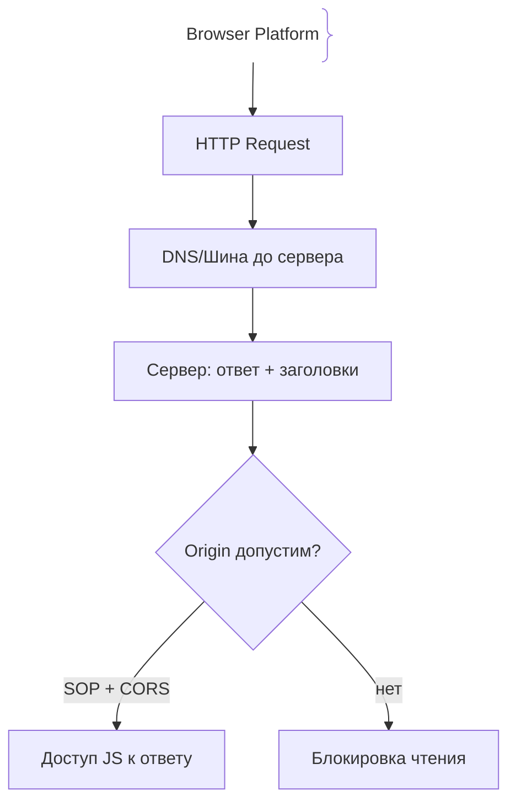
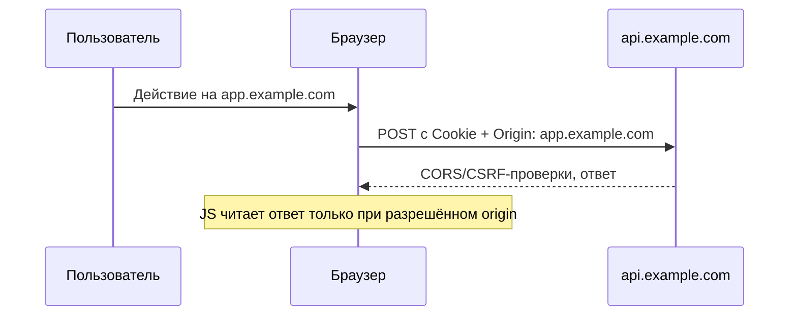

# Веб и браузер (Web Platform)

Браузер — это доверенная граница между публичным HTTP и личными данными пользователя, понимание которой определяет безопасность приложения.

## Определение

Веб-платформа (Web Platform) — совокупность стандартов и возможностей, предоставляемых браузером: HTTP, HTML/CSS и DOM, cookies, хранилища и политики безопасности (Same-Origin Policy, CORS, secure defaults для cookies).

## Зачем нужно понимать веб-платформу

Разработка «в браузере» не тождественна разработке API: правила браузера меняют логику.
- **Same-Origin Policy:** Кросс-доменные запросы ограничены политикой безопасности по умолчанию.
- **Куки и сессии:** Cookie отправляются автоматически, что порождает классы атак (CSRF).
- **XSS-контекст:** Любой ввод пользователя рендерится в DOM и требует экранирования.

## Как работает веб-платформа





## Примеры кода

### TypeScript (настройка cookie сессии)

```ts
res.cookie('session', token, {
  httpOnly: true,
  sameSite: 'strict',
  secure: true,
  maxAge: 7 * 24 * 3600 * 1000,
})
```

Безопасная cookie: недоступна JS (HttpOnly), не уходит кросс-сайтно (SameSite) и передаётся только по HTTPS (Secure).

## Пример использования: интеграция

Клиентское приложение с куками и серверный CORS-белый список на один домен:

```ts
// сервер: разрешаем только real-домен фронта
app.use(cors({ origin: 'https://app.example.com', credentials: true }))

// клиент: отправка браузером cookies того же приложения
const res = await fetch('https://api.example.com/data', {
  credentials: 'include',
})
```

Cookie отправляются браузером автоматически, поэтому аутентификация через cookie требует продуманного CORS и защиты от CSRF.

## Паттерны использования

- **SOP сначала** — понимай, что разрешает кросс-origin, прежде чем открывать CORS.
- **Cookie с HttpOnly + SameSite** — токены недоступны JS и не уходят кросс-сайтно.
- **Минимальный CORS-белый список** — только домены фронтенда, никаких `*` с credentials.
- **Content-Security-Policy** — ограничивает источники скриптов на стороне клиента.
- **Secure defaults в заголовках** — HSTS, X-Frame-Options, правильные привилегии.

## Антипаттерны и ловушки

- **`Access-Control-Allow-Origin: *` при credentials** — браузер блокирует ответ с куками.
- **Хранение токенов в localStorage** — XSS получает к ним доступ напрямую.
- **Cookie без `Secure`/`HttpOnly`** — утекает по открытому каналу и читается скриптами.
- **Доверять только CORS** — политика браузера, а не защита от curl/SDK-запросов.

## Когда использовать / когда НЕ использовать

- **Использовать:** браузерные SPA и классические web-приложения с куками и кросс-доменными API.
- **НЕ использовать:** строго server-to-server интеграции — там нет браузерных политик, к ним применяются сети, mTLS и аутентификация.

## Связанные темы

- **cors** — кросс-origin доступ к API из браузера.
- **csrf** — как волшебная отправка cookie превращается в атаку.
- **xss** — рендеринг ввода и утечка сессий.

## Вопросы

### Q1
**Что определяет «origin» (источник) запроса?**
- [x] Схему (протокол), хост и порт
- [ ] Только доменное имя
- [ ] IP-адрес сервера
- [ ] Название браузера

Пояснение: origin — это scheme + host + port, например `https://app.example.com:443`.

### Q2
**Зачем нужен атрибут SameSite у cookies?**
- [ ] Для шифрования содержимого куки
- [x] Чтобы ограничить отправку куки кросс-сайтными запросами
- [ ] Для ускорения доставки данных
- [ ] Для хранения больших объёмов данных

Пояснение: SameSite=Lax/Strict не даёт браузеру отправлять куку в кросс-сайтных запросах, закрывая базовый вектор CSRF.

### Q3
**Что происходит при CORS-preflight (OPTIONS)?**
- [x] Браузер спрашивает сервер, разрешены ли метод и заголовки, прежде чем отправить реальный запрос
- [ ] Браузер повторяет запрос 3 раза
- [ ] Кэш принудительно очищается
- [ ] Токен аутентификации продлевается

Пояснение: для нетривиальных кросс-origin запросов браузер выполняет preflight (OPTIONS) и затем основной запрос.

### Q4
**Какой атрибут cookie снижает опасность XSS-кражи токенов?**
- [x] HttpOnly
- [ ] Max-Age
- [ ] Path
- [ ] Secure

Пояснение: HttpOnly делает cookie недоступной для JavaScript, чтобы инъекция скрипта не украла сессию.

### Q5
**CORS защищает:**
- [ ] Сервер от любых API-запросов
- [x] Пользователя от чтения кросс-origin ответов браузерными страницами без разрешения
- [ ] Базу данных от SQL-инъекций
- [ ] Пароли от перебора

Пояснение: CORS — политика браузера о доступе к ответам; сервер от запросов из curl/SDK она не защищает.

## Источники

- MDN - Same-origin policy: https://developer.mozilla.org/en-US/docs/Web/Security/Same-origin_policy
- MDN - HTTP cookies: https://developer.mozilla.org/en-US/docs/Web/HTTP/Cookies
- MDN - Cross-Origin Resource Sharing (CORS): https://developer.mozilla.org/en-US/docs/Web/HTTP/CORS