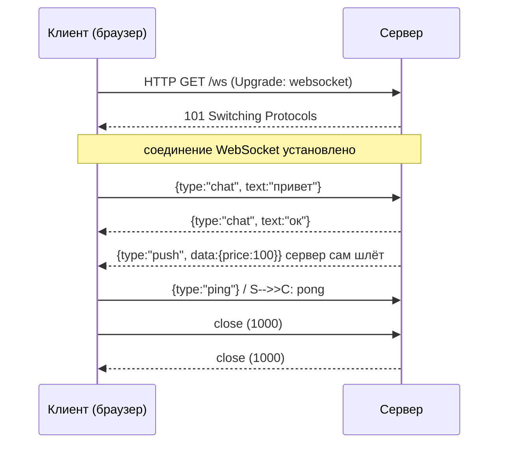
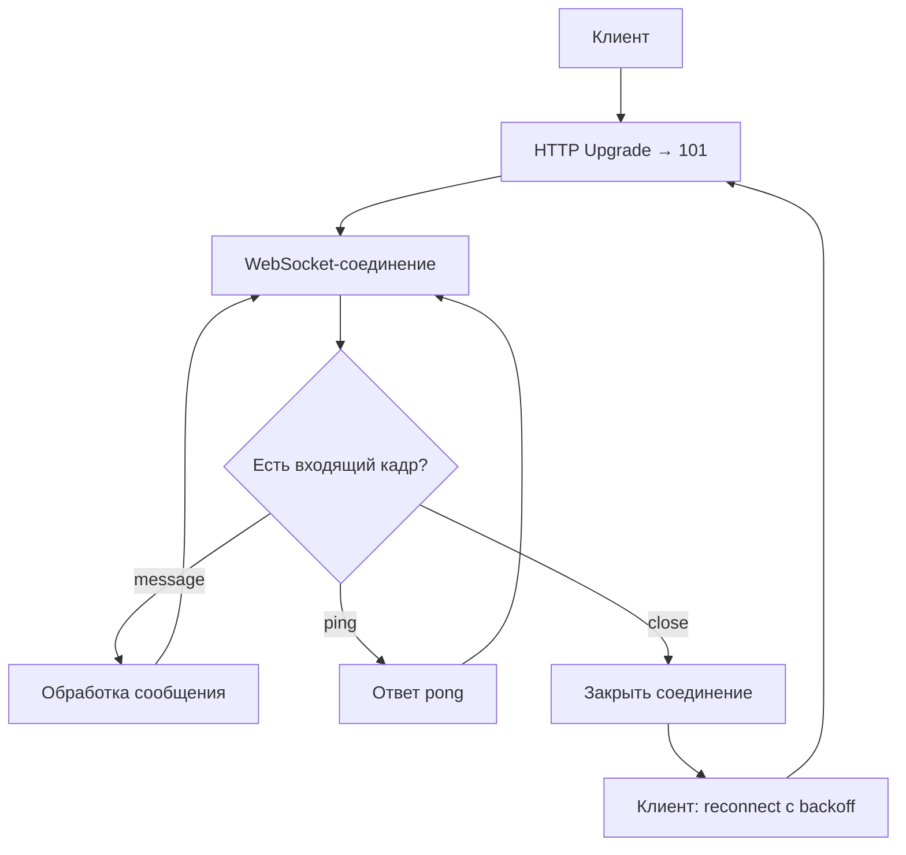

# WebSockets (Двусторонний обмен поверх TCP)

## Определение

**WebSocket** — протокол **полнодуплексной двусторонней связи** между клиентом и сервером поверх одного TCP-соединения. Начинается как HTTP-запрос с upgrade (`101 Switching Protocols`), после чего **обе стороны могут отправлять сообщения в любой момент** (режим «непрерывного канала», в отличие от HTTP request/response). Передаёт текстовые и бинарные кадры.

## Зачем нужно

- **Push-уведомления и realtime** — чат, котировки, live-таблица, совместное редактирование, игры: сервер «толкает» обновления без запроса клиента.
- **Меньше оверхеда, чем polling** — одно установленное соединение вместо постоянных GET-запросов каждые N секунд (см. Long Polling).
- **Двунаправленность** — и клиент, и сервер инициируют передачу; не только «клиент спросил — сервер ответил».
- **Потоковая модель** — кадры (текст/бинар), близка к socket-у: удобно для игр, стримов, живой аналитики.



## Как работает

1. **HTTP-рукопожатие**: клиент шлёт `GET /ws` с заголовками `Upgrade: websocket`, `Connection: Upgrade`, `Sec-WebSocket-Key`; сервер отвечает `101 Switching Protocols` + `Sec-WebSocket-Accept` (хэш ключа).
2. **Кадры (frames)**: текстовые (опcode 1), бинарные (2), ping (9), pong (10), close (8). Опциональная фрагментация (длительные сообщения).
3. **Жизненный цикл**: `open → message(s) → close`. После disconnect соединение закрыто; клиенты обычно **переподключаются с backoff** (см. Retries/Backoff).
4. **Heartbeat**: приложения шлют `ping`/`pong` (или свой уровень) для обнаружения «мертвых» соединений (сеть могла оборваться без close-кадра).
5. **URL**: `ws://` / `wss://` (TLS). Всё то же, что при HTTPS — шифрование через прокси.



## Примеры кода

> Сервер и клиент: минимальный эхо-чат + отправка сообщений.

### TypeScript (библиотека ws + браузерный WebSocket)

```typescript
// Сервер (npm: ws)
import { WebSocketServer } from 'ws'

const wss = new WebSocketServer({ port: 8080 })

wss.on('connection', (socket) => {
  socket.on('message', (data) => {
    // отправить всем подключённым
    wss.clients.forEach((c) => c.readyState === socket.OPEN && c.send(data))
  })
  socket.on('close', () => console.log('closed'))
})

// Клиент (браузер или node)
const ws = new WebSocket('wss://example.com/ws')
ws.onopen = () => ws.send(JSON.stringify({ type: 'chat', text: 'привет' }))
ws.onmessage = (event) => console.log('recv', event.data)
```

### Go (gorilla/websocket)

```go
import (
	"net/http"
	"github.com/gorilla/websocket"
)

var upgrader = websocket.Upgrader{
	CheckOrigin: func(r *http.Request) bool { return true }, // прод: проверять Origin!
}

func chatHandler(w http.ResponseWriter, r *http.Request) {
	conn, err := upgrader.Upgrade(w, r, nil) // 101 Switching Protocols
	if err != nil {
		return
	}
	defer conn.Close()
	for {
		mt, message, err := conn.ReadMessage() // блокирует до кадра
		if err != nil {
			break // соединение закрыто/ошибка
		}
		if err := conn.WriteMessage(mt, message); err != nil {
			break
		}
	}
}
```

### Java (Spring WebSocket)

```java
import org.springframework.web.socket.*;
import org.springframework.web.socket.handler.TextWebSocketHandler;

public class ChatHandler extends TextWebSocketHandler {
    @Override
    protected void handleTextMessage(WebSocketSession session, TextMessage msg) {
        // двусторонний доступ: session.sendMessage() — сервер может слать сам
        session.sendMessage(new TextMessage("echo: " + msg.getPayload()));
    }
}
```

## Пример использования: интеграция

> Прод-сценарий: heartbeat, обход «мёртвых» соединений, backpressure, масштабирование на кластер.

### Heartbeat + таймауты чтения (TypeScript, ws)

```typescript
import { WebSocketServer, WebSocket } from 'ws'

const wss = new WebSocketServer({ port: 8080 })
const HEARTBEAT = 30_000

wss.on('connection', (socket) => {
  socket.isAlive = true
  socket.on('pong', () => (socket.isAlive = true)) // клиент подтверждает
})

const interval = setInterval(() => {
  wss.clients.forEach((socket) => {
    if (socket.isAlive === false) return socket.terminate() // мёртвое — закрыть
    socket.isAlive = false
    socket.ping() // ждём pong в течение HEARTBEAT
  })
}, HEARTBEAT)
```

### Свойство «backpressure при отправке» (Go)

```go
// Для медленных потребителей: если Send буферизован и полон — закрываем,
// чтобы один медленный клиент не притормаживал всех (см. Backpressure).
func slowDrop(conn *websocket.Conn, ch chan []byte) {
	for msg := range ch {
		conn.SetWriteDeadline(time.Now().Add(5 * time.Second))
		if err := conn.WriteMessage(websocket.TextMessage, msg); err != nil {
			return // клиент медленный/оборван — закрываем соединение
		}
	}
}

// приём списка клиентов, выдача push (без полного блока):
func sendTo(socket *websocket.Conn, pay []byte) {
	select {
	case clients[socket] <- pay:
	default:
		connClosed(socket) // буфер полон — сигнал давления
	}
}
```

### Spring с Redis pub/sub для кластера (Java)

```java
import org.springframework.data.redis.core.RedisTemplate;

@Service
public class WsPubSub {
    // WS-соединение живёт на конкретном инстансе; для кластера слушаем
    // события публично через Redis pub/sub и пушим ВСЕ инстансы.
    private final RedisTemplate<String, String> redis;

    public void notifyAllMachines(String room, String payload) {
        redis.convertAndSend("ws:" + room, payload); // любые подписанные push
    }

    // @EventListener(Message.class) — на каждом инстансе получаем и делаем
    // session.sendMessage(...) всем, у кого есть соединение по этому room.
}
```

## Паттерны использования

- **Heartbeat (ping/pong)** — обязаны, чтобы находить «мёртвые» соединения (сеть оборвалась без close).
- **Таймауты на чтение/запись** — `SetReadDeadline`/`SetWriteDeadline` не дают «зависнуть» (см. Timeouts).
- **Backpressure при отправке** — медленные клиенты: буфер + drop/close, а не неограниченный рост буфера (см. Backpressure).
- **Ограничение размера сообщений** — лимит на кадр/заголовок, чтобы не съели память (обычно 1–10 МБ).
- **Graceful close** — коды закрытия (1000 normal, 1001 going away), отвечать на close и завершать соединение; клиент — переподключение с backoff.
- **Только ws://wss://** — `wss` (TLS) для прод; передача из браузера идёт через `wss`.
- **Масштабирование: pub/sub** — соединение привязано к инстансу; push для кластера — Redis pub/sub / брокер.
- **Наблюдаемость** — счётчики подключений, «мёртвых» соединений, latency, message size (см. Observability).

## Антипаттерны и ловушки

- **Нет heartbeat** — копятся «зомби»-соединения, которые съедают файловые дескрипторы/память сервера.
- **Блокирующая отправка** — `send` в потоке блокирует; медленный клиент тормозит всех (нужен буфер/таймауты).
- **Без лимита размера сообщения** — гигантский JSON в кадре: память/CPU лавиной.
- **Переподключения без backoff** — миллионы клиентов синхронно переподключаются → «бьющее стадо» (см. Exponential Backoff).
- **Обращение к `session` после close** — отправка в закрытое соединение кидает ошибку; проверять состоянии соединения.
- **Не учитывать Origin** — кросс-доменные WebSocket без проверки `Origin` — простор для атак (см. Security).
- **Явные reconnecting в одном месте не оставить** — дублирование reconnect-логики (клиент и gateway) часто ломает соединение.
- **Игнорировать протокол масштабирования** — «Всё работает на одном инстансе»: при кластере push не дойдёт до клиента другого узла.

## Когда использовать / когда НЕ использовать

**Использовать:**
- Реальные чаты, уведомления, лайв-таблицы/котировки/спортивные результаты, совместное редактирование.
- Игры и интерактивные приложения (bidirectional, low latency).
- Двусторонний stream, когда клиент тоже активно шлёт сообщения в обе стороны.
- Вебхуки наоборот — push сервера браузер-клиенту.

**НЕ использовать (или с осторожностью):**
- Обычные request/response — REST/HTTP проще, кешируется, совместим с прокси/CDN.
- Длинные фоновые рассылки, где клиент ничего не шлёт — чаще проще **Server-Sent Events** (односторонняя, автоматически переподключается, проще).
- Сценарии, где нужен heartbeat-мониторинг и протокол с близкой семантикой: есть SSE/long-polling альтернативы.
- Если за клиентом нет поддержки WebSocket (старые прокси, без Upgrade) — нужен fallback (long polling).

## Связанные темы

- **Server-Sent Events** — односторонний push поверх HTTP; проще WebSocket, если сервер только шлёт.
- **Long Polling** — исторический fallback: клиент висит на незакрытом GET; WebSocket — эволюция.
- **HTTP/2 and HTTP/3** — WebSocket долго жил на HTTP/1.1-upgrade; HTTP/2 меняет мультиплексирование (extended CONNECT); QUIC-HTTP/2 развивается в областях низкой задержки.
- **gRPC (bidi-streaming)** — альтернативный стримминг для сервер-сервер; WebSocket — для браузера.
- **TCP vs UDP** — WebSocket — TCP; для игр с допустимой потерей бывает нужен UDP/QUIC вместо этого.
- **Load Balancing** — sticky-сессии (родные соединения) критичны; без них сбивается WebSocket на баунсах.
- **Security** — wss, Origin, подписи, допустимые миграции сети.

## Вопросы

### Q1
**Как начинается WebSocket-соединение?**
- [x] HTTP-запрос с `Upgrade: websocket` → сервер отвечает `101 Switching Protocols`
- [ ] Прямой TCP без HTTP
- [ ] Через DNS-запрос
- [ ] GET с long-polling

Пояснение: WebSocket стартует как HTTP upgrade; после `101` обе стороны свободно шлют кадры.

### Q2
**Зачем нужен heartbeat (ping/pong)?**
- [ ] Ускорить передачу
- [x] Находить «мёртвые» соединения, где сеть порвалась без кадра close
- [ ] Шифровать трафик
- [ ] Балансировать нагрузку

Пояснение: сеть может оборваться без close-кадра; ping/pong говорит «я жив» и откладывает троттлинг, а сервер закрывает зависшие соединения (timeout).

### Q3
**Какой главный риск «медленных клиентов» при отправке push?**
- [ ] Лишний трафик сети
- [x] Блокировка/рост буфера: медленный клиент притормаживает остальных (нужен таймаут и закрытие)
- [ ] Данные искажаются
- [ ] Неверный формат

Пояснение: без backpressure (см. Backpressure) один медленный получатель давит буфер сервера и задерживает рассылку.

### Q4
**Когда лучше выбрать SSE вместо WebSocket?**
- [ ] Нужен двусторонний обмен
- [x] Сервер только шлёт (push), клиент не отправляет: односторонне, автоматическое переподключение, проще
- [ ] Нужны игры
- [ ] Нужен wss

Пояснение: если достаточно «сервер → клиент» (уведомления, курс валют), SSE проще (обычный HTTP, авто-reconnect, легко через прокси).

### Q5
**Что делать при масштабировании WebSocket на кластер?**
- [ ] Достаточно одного инстанса
- [x] Push через pub/sub (Redis, Кафка): соединение привязано к конкретному инстансу
- [ ] Увеличить TTL DNS
- [ ] Использовать UDP

Пояснение: WebSocket живёт на инстансе; чтобы сообщение дошло до клиента любого узла, инстансы обмениваются событиями через pub/sub.

## Источники

- RFC 6455 — The WebSocket Protocol: https://datatracker.ietf.org/doc/html/rfc6455
- MDN — WebSocket API: https://developer.mozilla.org/en-US/docs/Web/API/WebSocket
- ws (Node.js библиотека): https://github.com/websockets/ws
- gorilla/websocket (Go): https://github.com/gorilla/websocket
- Spring — WebSocket support: https://docs.spring.io/spring-framework/reference/web/websocket.html
- WebSockets Security (OWASP): https://owasp.org/www-community/attacks/WebSocket_Security
