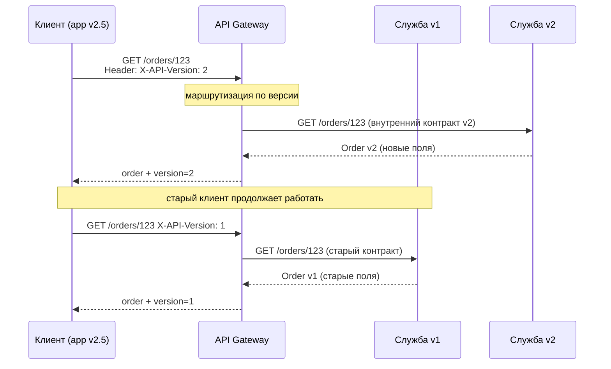
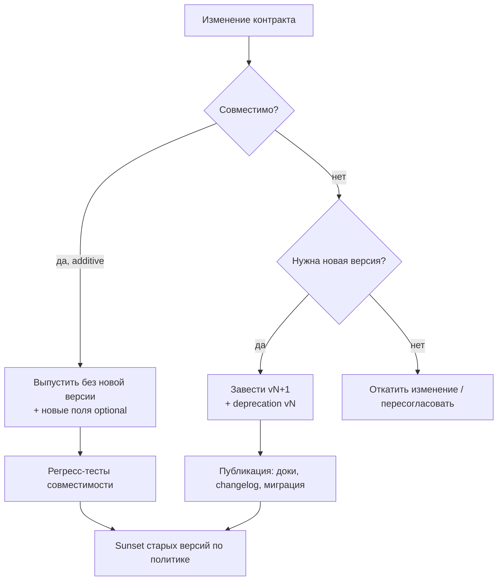

# API Versioning (Версионирование API)

## Определение

**API Versioning (Версионирование API)** — практика управления изменением контракта API: каждое «несовместимое» изменение (удаление поля, изменение типа, переименование ресурса) выпускается как **отдельная версия** контракта, чтобы старые клиенты продолжали работать, а новые получали новые возможности. Версия — это явный артефакт (часть URL, заголовок или тип медиа), по которому и клиент, и сервер, и наблюдатель определяют семантику ответа.

## Зачем нужно

- **Не ломать существующих клиентов** — мобильные приложения, сторонние интеграции и старые сервисы не обновляются разом; смена контракта без версии = мгновенные 5xx по всему миру.
- **Независимые релизные циклы** — бэкенд может выпускать изменения чаще, чем клиенты успевают обновляться.
- **Постепенная миграция** — дать клиентам время перейти на новый контракт, а потом закрыть старый.
- **Возможность отката** — при проблемах новой версии можно переключить трафик обратно без изменения кода клиентов.
- **Договорные гарантии (SLA/SLO)** — версия — это формализованный контракт: v1 не меняется произвольно, v2 выпускается с миграционным планом.

## Как работает

Версионирование — это **договорённость о том, как клиент сообщает серверу ожидаемый контракт** и как сервер отвечает именно этим контрактом. Основные стратегии:

- **URI path versioning** (`/v1/orders`) — версия в пути. Простой, кэшируется CDN, виден в логах/мониторинге, но «засоряет» URL и усложняет рост числа версий.
- **Query parameter versioning** (`/orders?version=1`) — версия в query. Простая, но легко потерять при проксировании, не идемпотентна к кэш-ключам.
- **Header versioning** (`X-API-Version: 1`) — пользовательский заголовок. URL чистый, но заголовки не видны в кэше CDN по умолчанию.
- **Media type (content negotiation)** (`Accept: application/vnd.api+json;version=1`) — версия внутри `Accept`/`Content-Type`. Самый «HTTP-правильный», умеет комбинировать версию и сериализацию, но сложнее для клиентов и прокси.
- **Date-based versioning** (Stripe: `2019-03-14`) — версия = дата релиза контракта. Удобна для длительной поддержки одной ленты изменений без «вечных» веток.
- **gRPC/Proto versioning** — версионируется сам контракт (`.proto`), используется совместимость на уровне типа (additive changes), break — через новую версию пакета/метода.



Ключевые понятия:

- **Breaking change (несовместимое изменение)** — удаление поля, изменение типа, переименование ресурса, изменение семантики ошибок. Такое требует новой версии.
- **Additive change (расширяющее изменение)** — добавление поля/метода при сохранении совместимости. Новые поля безопасны для старых клиентов (они их игнорируют), если те не требуют их.
- **Deprecation policy (политика вывода из эксплуатации)** — объявляем v1 deprecated, публикуем сроки, логируем использование, затем **sunset** с шумным заголовком `Sunset`/`Deprecation`.
- **Version skew (перекос версий)** — клиент и сервер говорят на разных версиях одновременно; норма для распределённых систем, нужно проектировать интероперируемость.
- **Compatibility matrix** — таблица «какие версии API клиент может использовать и какие версии сервера их обслуживают».



## Примеры кода

> Базовые варианты: зарегистрировать версию в роутинге, выбрать контракт из заголовка, декларировать версию в контракте gRPC.

### TypeScript (Express: версия в пути)

```typescript
import express from 'express'

const app = express()

async function getOrderV1(id: string) {
  return { id, status: 'shipped' } // старый контракт
}

async function getOrderV2(id: string) {
  return { id, status: 'shipped', trackingUrl: '/track/abc123' } // новый
}

app.get('/v1/orders/:id', async (req, res) => {
  res.json(await getOrderV1(req.params.id))
})

app.get('/v2/orders/:id', async (req, res) => {
  res.json(await getOrderV2(req.params.id))
})

app.listen(3000)
```

### Go (net/http: версия из заголовка)

```go
package main

import "net/http"

type orderV1 struct{ ID, Status string }
type orderV2 struct {
	ID          string
	Status      string
	TrackingURL string
}

func ordersHandler(w http.ResponseWriter, r *http.Request) {
	switch r.Header.Get("X-API-Version") {
	case "2":
		writeJSON(w, orderV2{ID: "123", Status: "shipped", TrackingURL: "/track/abc"})
	case "1", "":
		writeJSON(w, orderV1{ID: "123", Status: "shipped"})
	default:
		http.Error(w, `{"error":"unsupported version"}`, http.StatusBadRequest)
	}
}

func main() {
	http.HandleFunc("/orders", ordersHandler)
	http.ListenAndServe(":8080", nil)
}

func writeJSON(w http.ResponseWriter, v any) {
	w.Header().Set("Content-Type", "application/json")
	json.NewEncoder(w).Encode(v)
}
```

> Примечание: `encoding/json` импортируется в реальном коде; здесь для краткости предположен.

### Java (Spring: медиа-тип `application/vnd.api.v2+json`)

```java
import org.springframework.web.bind.annotation.*;

@RestController
public class OrderController {

    // старый контракт отдаётся по умолчанию
    @GetMapping(value = "/orders/{id}", produces = "application/json")
    public OrderV1 getOrderV1(@PathVariable String id) {
        return new OrderV1(id, "shipped");
    }

    @GetMapping(value = "/orders/{id}", produces = "application/vnd.api.v2+json")
    public OrderV2 getOrderV2(@PathVariable String id) {
        return new OrderV2(id, "shipped", "/track/abc");
    }

    record OrderV1(String id, String status) {}
    record OrderV2(String id, String status, String trackingUrl) {}
}
```

## Пример использования: интеграция

> Версионный **middleware/Interceptor** в однострочном виде: читает версию, выбирает трансформер ответа, помечает ответ заголовком.

### TypeScript (middleware: версия + трансформация + заголовок)

```typescript
import { NextFunction, Request, Response } from 'express'

export function versioned(handlers: Record<number, (req: Request) => unknown>) {
  return async (req: Request, res: Response, next: NextFunction) => {
    const requested = Number(req.header('X-API-Version') ?? req.query.version ?? 1)
    const handler = handlers[requested]
    if (!handler) {
      return res.status(400).json({ error: `unsupported version: ${requested}` })
    }
    res.setHeader('X-API-Version', String(requested))
    res.json(await handler(req))
    next()
  }
}

app.get('/orders/:id', versioned({
  1: req => ({ id: req.params.id, status: 'shipped' }),
  2: req => ({ id: req.params.id, status: 'shipped', trackingUrl: '/track/' + req.params.id }),
}))
```

### Go (Interceptor: логирование версии и deprecation-отметка)

```go
func versionInterceptor(next http.HandlerFunc) http.HandlerFunc {
	return func(w http.ResponseWriter, r *http.Request) {
		v := r.Header.Get("X-API-Version")
		if v == "" {
			v = "1"
		}
		if v == "1" {
			w.Header().Set("Deprecation", "true")
			w.Header().Set("Sunset", "Sun, 31 Dec 2026 23:59:59 GMT")
		}
		w.Header().Set("X-API-Version", v)
		next(w, r)
	}
}
```

### Java (Spring Interceptor: маршрутизация по версии и валидация)

```java
import jakarta.servlet.http.HttpServletRequest;
import jakarta.servlet.http.HttpServletResponse;
import org.springframework.web.servlet.HandlerInterceptor;

public class VersionInterceptor implements HandlerInterceptor {

    @Override
    public boolean preHandle(HttpServletRequest request,
                             HttpServletResponse response,
                             Object handler) {
        String version = request.getHeader("X-API-Version");
        if (version == null || version.isBlank()) {
            version = "1";
        }
        // "1" — только read-only; запись разрешена с версии "2"
        if ("1".equals(version)
                && request.getMethod().equalsIgnoreCase("POST")) {
            response.setStatus(HttpServletResponse.SC_METHOD_NOT_ALLOWED);
            return false;
        }
        response.setHeader("X-API-Version", version);
        return true;
    }
}
```

### TypeScript (клиент: каталог версий и миграция)

```typescript
type ApiVersion = '1' | '2'

let apiVersion: ApiVersion = '1'

export const client = {
  setVersion(v: ApiVersion) { apiVersion = v },
  async getOrder(id: string) {
    return fetch(`/orders/${id}`, {
      headers: { 'X-API-Version': apiVersion },
    }).then(r => r.json())
  },
}

// миграция клиента: переключение по feature-флагу
if (process.env.ORDER_API_V2 === 'on') client.setVersion('2')
```

```typescript
// семантика версий клиента: ответ содержит версию — легко логировать
const order = await client.getOrder('123')
console.log('order', order, 'apiVersion', apiVersion)
```

## Паттерны использования

- **Версию определять при первом контракте** — закладывать механизм версионирования с самого первого релиза, а не «когда сломается».
- **Deprecation policy с датами** — объявлять устаревание заранее, слать заголовки `Deprecation`/`Sunset`, логировать `X-API-Version` для подсчёта использования.
- **Минимальные break** — сначала additive-изменения; break-версии выпускать редко и пачками.
- **Decoupling через API Gateway** — gateway маршрутизирует `/v1/orders` и `/v2/orders` на разные бэкенды, скрывая версии внутри (см. API Gateway).
- **Трансформация старых контрактов** — одна бизнес-логика, разные представления: v2-модель → трансформер в v1 для старых клиентов.
- **Тесты совместимости** — регресс: «все существующие клиенты проходят против обеих версий».
- **Метрики версий** — доля запросов по версиям; рост v1 → сигнал для sunset.

## Антипаттерны и ловушки

- **Версионировать всё подряд** — каждая мелочь становится новой версией, версий размножается и никто не может их поддерживать (router hell).
- **Не объявлять deprecation** — старые версии живут вечно, ресурсы утекают на поддержку.
- **Версия в части тела ответа/без контракта** — версия, о которой ни клиент, ни сервер не могут договориться заранее (только в ответе: «вот что ты получил»).
- **Кэширование без версии в ключе** — CDN кэширует v1-ответ под URL `/orders/123` и отдаёт его клиенту v2.
- **Удаление поля вместо добавления optional** — сломает строгие парсеры и десериализаторы.
- **Breaking change «молча»** — изменение семантики без смены версии — худший случай: код работает, данные — нет.
- **Слишком агрессивный sunset** — закрытие версии без учёта медленных клиентов (mobile old builds, enterprise).

## Когда использовать / когда НЕ использовать

**Использовать:**
- Публичные и сторонние API, где клиенты не контролируются (мобильные приложения, партнёры).
- Долгоживущие сервисы внутри компании с множеством потребителей.
- Отдельная версия для договорных независимых контрактов (платежи, события, экспорт данных).

**НЕ использовать (или с осторожностью):**
- Внутренние сервисы, обновляемые синхронно — версионирование добавляет накладные расходы; используйте additive changes + одностороннюю совместимость.
- Когда на платформе стандартизирована более сильная схема (gRPC/Proto с совместимостью полей, GraphQL).
- Если версий становится больше ~2–3 одновременно и нет automation для sunset.
- Для прототипа/MVP, где контракт ещё не стабилизирован, — фиксируйте версию только при первом «внешнем» потребителе.

## Связанные темы

- **Semantic Versioning** — формализация номеров версий (`v1.2.3`) как источника истины о совместимости (см. отдельную тему).
- **API Gateway** — место концентрации версионирования/маршрутизации и трансформации контрактов.
- **HTTP/2 и HTTP/3** — мультиплексирование упрощает параллельные запросы к разным версиям; заголовки — переносчики версии.
- **gRPC** — версионирование контрактов через Proto, совместимость типов, versioned packages.
- **Feature Flags** — альтернатива версионированию для постепенного включения additive-изменений.
- **Rate Limiting** — защита старых версий от злоупотребления до sunset (см. блок 08).

## Вопросы

### Q1
**Какие изменения контракта обязаны привести к новой версии API?**
- [ ] Добавление нового optional-поля в ответ
- [x] Удаление/переименование ресурса или изменение типа поля
- [ ] Оптимизация индекса в базе данных
- [ ] Добавление нового метода (endpoint)

Пояснение: breaking changes (удаление, переименование, изменение типа/семантики) требуют новой версии; additive-изменения — совместимы.

### Q2
**Какой механизм передаёт версию в «пути» (path-based) подходе?**
- [x] Часть URL, например `/v2/orders/123`
- [ ] Заголовок `X-API-Version`
- [ ] Параметр в теле POST
- [ ] Файл конфигурации клиента

Пояснение: path-based — версия явно в пути; он прост и виден в логах и кэше CDN.

### Q3
**Что означает заголовок `Sunset: Sun, 31 Dec 2026 23:59:59 GMT`?**
- [ ] Время жизни TLS-сертификата
- [x] Дата, после которой версия API будет удалена/выключена
- [ ] Время кэширования ответа
- [ ] Время истечения JWT

Пояснение: `Sunset` — стандартный HTTP-заголовок (RFC 8594) для объявления даты вывода версии/ресурса из эксплуатации.

### Q4
**Почему версия важна для кэширования (CDN)?**
- [ ] Версия увеличивает вес ответа
- [x] Кэш-ключ должен включать версию, иначе клиенты получают чужой контракт
- [ ] Версия отключает HTTP-кеш
- [ ] Версия не влияет на кэш

Пояснение: без версии в кэш-ключе (URL с `/v2/` или вариация по заголовку/Cookie) один ключ смешивает разные контракты.

### Q5
**Когда версионирование чаще всего НЕ оправдано?**
- [ ] Публичный API со множеством внешних клиентов
- [ ] Договорные контракты платежей/событий
- [x] Внутренние сервисы, деплоящиеся синхронно, где достаточно additive changes
- [ ] Мобильное приложение + бэкенд

Пояснение: при синхронном деплое можно обойтись совместимыми расширениями контракта; версии — для независимых циклов.

## Источники

- RFC 8594 — The Sunset HTTP Header Field: https://datatracker.ietf.org/doc/html/rfc8594
- RFC 9110 — HTTP Semantics (content negotiation, Accept): https://datatracker.ietf.org/doc/html/rfc9110
- Stripe API changelog (date-based versioning): https://stripe.com/docs/upgrades
- GitHub REST API versioning: https://docs.github.com/en/rest/overview/versions
- Microsoft API versioning guidance: https://learn.microsoft.com/en-us/azure/architecture/best-practices/api-design