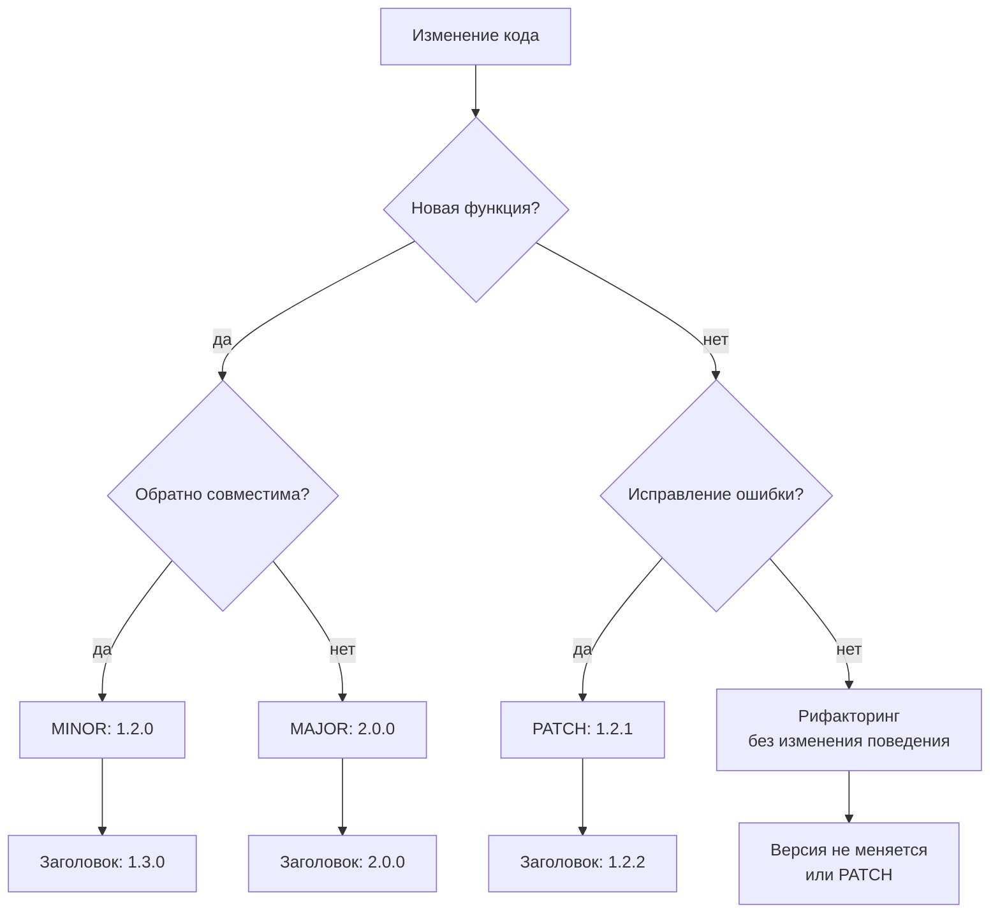
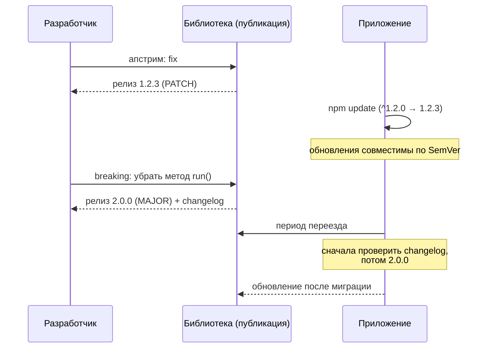

# Semantic Versioning (Семантическое версионирование)

## Определение

**Semantic Versioning (Семантическое версионирование, SemVer)** — формальная схема нумерации версий `MAJOR.MINOR.PATCH` (`1.2.3`), где **каждая позиция несёт смысл совместимости**: `MAJOR` — несовместимые изменения, `MINOR` — обратно-совместимые добавления, `PATCH` — обратно-совместимые исправления. По номеру версии можно предсказать, сломает ли обновление существующих потребителей.

## Зачем нужно

- **Договор о совместимости** — разработчик зависимости сообщает: «обновляйся до PATCH/MINOR — не сломаешься; до MAJOR — читай changelog».
- **Управление зависимостями** — менеджеры пакетов (npm/pnpm, Maven, Go modules, Cargo) используют SemVer для диапазонов: `^1.2.3` — любые совместимые обновления.
- **Предотвращение dependency hell** — без сигналов о совместимости обновление одной библиотеки ломает десятки непрямых зависимостей (см. Dependency Hell).
- **Автоматизация релизов** — SemVer + changelog + CI позволяют по типу коммита вычислять следующую версию (conventional commits / semantic-release).
- **Предсказуемость для потребителя** — чёткие правила, когда можно обновляться «безопасно», а когда — планировать миграцию.

## Как работает

Классическая схема `MAJOR.MINOR.PATCH`:

- **MAJOR** — ломающие (breaking) изменения публичного API. Что-то удалено, переименовано, изменён контракт.
- **MINOR** — новые функции, обратно-совместимые с прошлым (additive changes).
- **PATCH** — исправления ошибок, обратно-совместимые (fix).

Дополнительные соглашения:

- **Pre-release** — `1.0.0-alpha.1`, `-beta.2`, `-rc.1`: нестабильные сборки, «меньше» финального релиза в упорядочении.
- **Build metadata** — `1.0.0+20260314.1234` (после `+`): не влияет на порядок версий.
- **Порядок сравнения** — нумерация по целым числам: `1.10.0 > 1.9.9`; pre-release меньше релиза: `2.0.0-rc.1 < 2.0.0`.
- **`0.y.z` (zero-based)** — договорённость: до `1.0.0` API считается нестабильным; `0.x` — MAJOR-изменения разрешены в любом `x`.
- **`1.0.0`** — «первый стабильный релиз»: с этого момента применяется полное семантическое обещание.
- **Changelog** — в SemVer каждое изменение публикуется в changelog с указанием секции (`Added`, `Changed`, `Removed`, `Fixed`) и версии.





## Примеры кода

> Ключевые сценарии интеграции: **объявить версию**, **парсить/сравнивать версии**, **вычислить следующую по типу коммита**.

### TypeScript (semver: парсинг и сравнение)

```typescript
import semver from 'semver'

const current = '1.2.3'

console.log(semver.valid('1.2.3'))            // '1.2.3'
console.log(semver.major('1.2.3'))            // 1
console.log(semver.minor('1.2.3'))            // 2
console.log(semver.patch('1.2.3'))            // 3
console.log(semver.gt('2.0.0', '1.9.9'))      // true
console.log(semver.satisfies('1.5.0', '^1.2.0')) // true (совместимый диапазон)
console.log(semver.inc('1.2.3', 'minor'))     // '1.3.0'
```

```typescript
// выбор минимальной версии для фичи
const required = '>=1.3.0'
if (semver.satisfies(current, required)) {
  useNewFeature()
} else {
  useFallback()
}
```

### Go (golang.org/x/mod/semver)

```go
package main

import (
	"fmt"
	"golang.org/x/mod/semver"
)

func main() {
	fmt.Println(semver.Compare("v2.0.0", "v1.9.9")) // 1 — v2 больше
	fmt.Println(semver.Major("v1.2.3"))             // "v1"
	fmt.Println(semver.Canonical("v1.2.3"))         // "v1.2.3"
	fmt.Println(semver.IsValid("v2.0.0-rc.1"))      // true
}
```

### Java (SemVer4J или org.semver4j:semver4j)

```java
import org.semver4j.Semver;
import org.semver4j.RangesList;

public class VersionCheck {
    public static void main(String[] args) {
        Semver current = new Semver("1.2.3");
        System.out.println(current.withMinor(0));          // 1.3.0
        System.out.println(current.isGreaterThan("1.0.0")); // true

        // диапазон пакетов в Maven/Java
        com.vdurmont.semver4j.RangesList and = ...; // упрощённо
    }
}
```

## Пример использования: интеграция

> Middleware/зависимости: **генерация версии по коммитам**, **README-бейдж**, **проверка совместимости в CI**.

### TypeScript (semantic-release: версия из типа коммита)

```javascript
// конфиг semantic-release (release.config.js)
module.exports = {
  branches: ['main'],
  plugins: [
    '@semantic-release/commit-analyzer', // commit: feat → MINOR, fix → PATCH, BREAKING → MAJOR
    '@semantic-release/release-notes-generator',
    '@semantic-release/changelog',
    ['@semantic-release/npm', { pkgRoot: 'packages/my-lib' }],
    '@semantic-release/github',
  ],
}
```

```bash
# пример коммитов и итоговой версии
# feat: add retry()             → 1.0.0 → 1.1.0
# fix: handle empty input       → 1.1.0 → 1.1.1
# BREAKING CHANGE: remove run() → 1.1.1 → 2.0.0
```

### Go (верификация версии в CI)

```go
// go.mod  Go требует точного исполнения
// require github.com/user/lib/v2 v2.0.0
```

```go
// обновление в рамках совместимых диапазонов
// go get github.com/user/lib@v1.2.3   (явная версия)
// go get github.com/user/lib@latest   (последняя мажорная?)
```

### Java (Maven: семантические диапазоны и доставка)

```xml
<dependency>
  <groupId>com.example</groupId>
  <artifactId>lib</artifactId>
  <version>[1.2.0,2.0.0)</version> <!-- совместимый диапазон по SemVer -->
</dependency>
```

```xml
<properties>
  <!-- централизованная версия: PATCH-обновления по флагу -->
  <lib.version>1.2.3</lib.version>
</properties>
```

### TypeScript (README-бейдж и пользовательская политика)

```markdown
<!-- badee / счётчик зависимостей в шапке репозитория -->
[](https://github.com/semantic-release/semantic-release)
```

```typescript
// политика потребления своей библиотеки
// ^1.0.0 — minor/patch обновления автоматически
// ~1.2.0 — только patch (консервативно)
// 1.2.3  — точный пин (для репро)
```

## Паттерны использования

- **Conventional commits + semantic-release** — тип коммита определяет следующий номер: автоматизация и changelog из истории.
- **Диапазоны с умом** — `^` для библиотек, `~`/точную версию для приложений и воспроизводимых сборок (lockfile).
- **Changelog вести одновременно с изменениями** — merged PR = строка в `CHANGELOG.md` с секцией и версией.
- **Стабильность публикуем в `0.x` честно** — не обещать SemVer до `1.0.0`; либо быстрее выйти на `1.0.0`.
- **Внутренние пакеты 0.0.0-dev** — до стабилизации использовать отдельный префикс `-dev`/`-next`.
- **Брейкинг-релизы пачками** — накопили breaking-коммиты → один MAJOR-релиз с подробным changelog.
- **Защита от «семантической лжи»** — CI-проверка: если в релизе есть breaking-коммит, но версия не MAJOR — падать.

## Антипаттерны и ловушки

- **Ложное обещание SemVer** — менять публичное поведение без MAJOR: клиент «не сломается», но сломается.
- **Лепить `0.1.x` вечно** — разнестабилили контракт, но боитесь `1.0.0`; потребители не могут планировать.
- **Изменять только PATCH при том же коде** — `1.2.3` → `1.2.4` без видимого изменения: бессмысленный шум в npm.
- **Пин зависимости без версии в метаданных** — без SemVer нельзя накопить диапазоны, появляется dependency hell.
- **Смешивать pre-release и релиз** — публиковать `-rc.1` и снимать его «тихо»: потребитель получил нестабильное без сигнала.
- **Игнорировать changelog при MAJOR** — без описания миграции потребитель не знает, что делать.
- **Автообновление с `@latest` в проде** — каждый деплой — игра в рулетку версий.

## Когда использовать / когда НЕ использовать

**Использовать:**
- Любая библиотека/пакет/модуль с потребителями (npm, Maven, Go modules, Cargo).
- Публичные и внутренние API-контракты (связь с темой API Versioning).
- Плиточные релизы в монорепо с автоматизацией (semantic-release).

**НЕ использовать (или с осторожностью):**
- Приложения, собираемые целиком и разворачиваемые как единое целое — чаще нужен тег релиза/коммита, чем SemVer.
- Пре-1.0 без явной договорённости — SemVer-обещание просто не действует.
- Когда «версия» нужна как дата/сборка (Stripe-style контракты) — там свой механизм.
- Для разовых скриптов/adhoc — лишняя церемония.

## Связанные темы

- **API Versioning** — SemVer даёт номера, API Versioning — механизмы доставки контрактов.
- **Dependency Hell** — следствие отсутствия совместимых сигналов между зависимостями.
- **CI/CD** — место авто-версионирования и проверки «семантической честности».
- **Feature Flags** — способ выпускать функции без изменения публичной версии.
- **Database Migrations / Schema Versioning** — семантика версий и для данных, не только кода.
- **Rollbacks** — выбор версии для отката и ретроспектива релизов.

## Вопросы

### Q1
**Что означает обновление `1.2.3` → `1.3.0`?**
- [ ] Ломающее изменение
- [x] Новая функция, обратно совместимая
- [ ] Исправление ошибки
- [ ] Смена лицензии

Пояснение: MINOR — добавление возможностей без нарушения существующего контракта.

### Q2
**Для какого изменения версия должна стать `2.0.0`?**
- [ ] Оптимизация SQL-запроса
- [x] Удаление публичного метода или изменение его контракта
- [ ] Добавление нового экспозируемого поля
- [ ] Обновление документации

Пояснение: breaking change (удаление/изменение контракта) обязано повысить MAJOR.

### Q3
**Как упорядочены версии `1.0.0`, `2.0.0-rc.1`, `1.9.9`?**
- [ ] `2.0.0-rc.1 < 1.9.9 < 1.0.0`
- [ ] `1.0.0 < 1.9.9 < 2.0.0-rc.1`
- [x] `1.0.0 < 1.9.9 < 2.0.0-rc.1 < 2.0.0`
- [ ] `1.9.9 < 1.0.0 < 2.0.0-rc.1`

Пояснение: MAJOR сравнивается первым; pre-release (`-rc.1`) идёт до финального `2.0.0`.

### Q4
**Что означает диапазон `^1.2.3` в npm?**
- [ ] Только версия `1.2.3`
- [ ] Любая версия выше `2.0.0`
- [x] Совместимые обновления от `1.2.3` до `<2.0.0`
- [ ] Ровно `1.2.3` и `1.3.0`

Пояснение: caret разрешает any Minor/Patch, не нарушающую контракт: мажорная не меняется.

### Q5
**Почему `0.x` версии «нестабильны» по SemVer?**
- [ ] Их нельзя парсить
- [x] До `1.0.0` публичный API считается неконтрактным, под **любой** изменение
- [ ] Они не публикуются в пакетные менеджеры
- [ ] Они используют другую нумерацию

Пояснение: SemVer обещает стабильность с `1.0.0`; до этого breaking допустим в любом `MINOR`.

## Источники

- SemVer.org — официальная спецификация: https://semver.org
- Conventional Commits (типы коммитов → версия): https://www.conventionalcommits.org
- semantic-release (автоматизация версий): https://semantic-release.gitbook.io
- npm — семантическое версионирование и диапазоны: https://docs.npmjs.com/cli/v11/configuring-npm/package-json#dependencies
- Go modules — версии в go.mod: https://go.dev/ref/mod
- Maven — версии и диапазоны: https://maven.apache.org/guides/introduction/introduction-to-dependency-mechanism.html