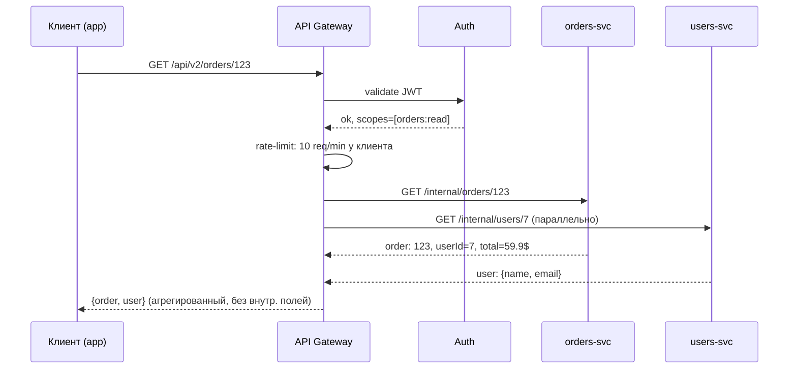
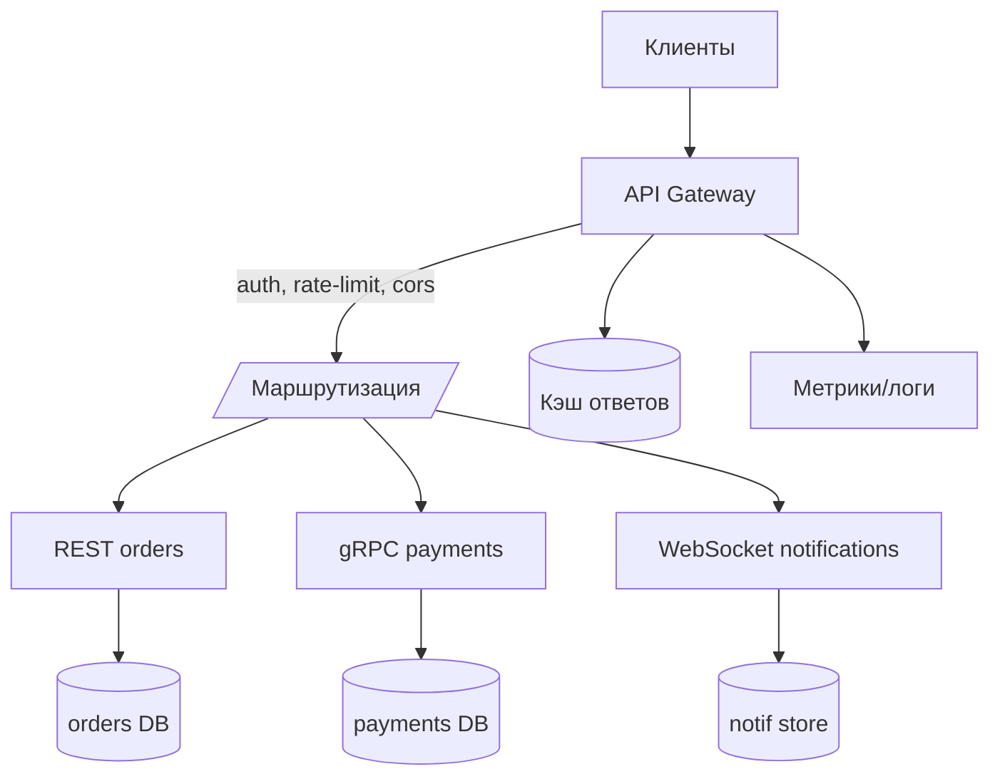

# API-шлюз (API Gateway)

## Определение

**API Gateway (API-шлюз)** — единая **точка входа** для всех клиентов в микросервисную систему: внешний трафик попадает только сюда, а шлюз маршрутизирует запросы к внутренним сервисам, применяя сквозные задачи (аутентификация, rate limiting, версионирование, агрегация, кэширование, логирование). В отличие от обратного прокси, шлюз — не только транспорт, но и **слой бизнес-логики границы**: знает контракты сервисов, может трансформировать и агрегировать ответы.

## Зачем нужно

- **Единая точка контроля** — одна точка для auth, rate-limit, CORS, логирования, версий (вместо дублирования в каждом сервисе).
- **Скрытие внутренней топологии** — клиенты не знают о десятках сервисов; изменение внутренней структуры не трогает API.
- **Агрегация и трансформация** — клиенту нужно одно `GET /order/123` с данными заказа+покупателя, шлюз собирает из нескольких сервисов.
- **Протокольные шлюзы** — WebSocket/SSE/HTTP-контракты наружу, gRPC внутри (protocol translation).
- **Безопасность и SLA** — весь периметр (WAF, rate limit, таймауты, retry) сосредоточен в одном месте.

## Как работает

Поток запроса: **клиент → шлюз → (auth, rate-limit, route, transform) → сервис → ответ → (кэш, лог) → клиент**.

- **Routing (маршрутизация)** — по пути/методу/заголовку шлюз выбирает целевой сервис (через реестр Service Discovery или статические upstreams).
- **Middleware-цепочка** — запрос проходит цепочку обработчиков: JWT-проверка → rate limit → таймаут → retry → circuit breaker → маршрутизация.
- **Aggregation (агрегация)** — шлюз вызывает N сервисов параллельно и собирает составной ответ (BFF-паттерн).
- **Transformation** — переписывание путей, маппинг полей, добавление заголовков, смена протокола.
- **Resilience** — таймауты, ретраи, circuit breaker для каждого роута (см. блок 08).
- **Внешний vs внутренний API** — шлюз может разделять API на клиентский (для мобильных/браузеров) и партнёрский.





## Примеры кода

> Типовые элементы шлюза: **маршрутизация по конфигу**, **auth-middleware**, **параллельная агрегация**.

### TypeScript (Express: маршрутизация + auth)

```typescript
import express from 'express'
import { createProxyMiddleware } from 'http-proxy-middleware'

const app = express()

function requireAuth(req: express.Request, res: express.Response, next: express.NextFunction) {
  const token = req.headers.authorization
  if (!token || !token.startsWith('Bearer ')) {
    return res.status(401).json({ error: 'unauthorized' })
  }
  next() // реально: верификация JWT в Auth-сервисе
}

app.use('/api', requireAuth)

app.use('/api/orders', createProxyMiddleware({
  target: 'http://orders.internal:8080',
  changeOrigin: true,
  pathRewrite: { '^/api/orders': '/orders' },
}))

app.use('/api/users', createProxyMiddleware({
  target: 'http://users.internal:8081',
  changeOrigin: true,
  pathRewrite: { '^/api/users': '/users' },
}))

app.listen(8080)
```

### Go (middleware-цепочка шлюза)

```go
package main

import (
	"net/http"
)

func withRateLimit(next http.Handler) http.Handler {
	return http.HandlerFunc(func(w http.ResponseWriter, r *http.Request) {
		if !allow(r) { // счётчик запросов/секунду по ключу клиента
			http.Error(w, `{"error":"rate_limit"}`, http.StatusTooManyRequests)
			return
		}
		next.ServeHTTP(w, r)
	})
}

func gatewaysHandler() http.Handler {
	r := http.NewServeMux()
	r.Handle("/orders", proxyTo("http://orders.internal:8080"))
	r.Handle("/users", proxyTo("http://users.internal:8081"))
	return withRateLimit(r)
}

func proxyTo(target string) http.Handler {
	return http.HandlerFunc(func(w http.ResponseWriter, r *http.Request) {
		// прямой прокси: метод, заголовки, тело к target + обработка ответа
	})
}
```

### Java (Spring Cloud Gateway)

```yaml
spring:
  cloud:
    gateway:
      routes:
        - id: orders
          uri: lb://orders-service          # load-balanced (из реестра)
          predicates:
            - Path=/api/orders/**
          filters:
            - StripPrefix=2
        - id: users
          uri: lb://users-service
          predicates:
            - Path=/api/users/**
```

## Пример использования: интеграция

> BFF-агрегация и граничные перехваты: **собирать составной ответ**, **единый таймаут**, **подмена ответа под версию клиента**.

### TypeScript (агрегация: заказ + пользователь за один round-trip)

```typescript
app.get('/api/v2/orders/:id', async (req, res) => {
  const [order, userReq] = await Promise.all([
    fetch(`http://orders.internal:8080/orders/${req.params.id}`).then(r => r.json()),
    fetch(`http://users.internal:8081/users/by-order/${req.params.id}`).then(r => r.json()),
  ])

  res.json({
    id: order.id,
    total: order.total,
    customer: { name: userReq.name, email: userReq.email },
  })
})
```

### Go (таймауты и circuit breaker на уровне шлюза)

```go
func withTimeout(d time.Duration, next http.Handler) http.Handler {
	return http.HandlerFunc(func(w http.ResponseWriter, r *http.Request) {
		ctx, cancel := context.WithTimeout(r.Context(), d)
		defer cancel()
		r = r.WithContext(ctx)
		next.ServeHTTP(w, r)
	})
}

// для каждого роута: withTimeout(5s, circuitBreaker(proxyTo(target)))
func route(name, target string, mux *http.ServeMux) {
	mux.Handle("/"+name,
		withTimeout(5*time.Second,
			circuitBreaker(name,
				proxyTo(target))))
}
```

### Java (Spring Cloud Gateway: глобальный фильтр / header)

```java
import org.springframework.cloud.gateway.filter.GatewayFilter;
import org.springframework.cloud.gateway.filter.factory.AbstractGatewayFilterFactory;
import org.springframework.http.HttpHeaders;
import org.springframework.stereotype.Component;
import org.springframework.web.server.ServerWebExchange;

@Component
public class AddVersionHeaderGatewayFilterFactory
        extends AbstractGatewayFilterFactory<AddVersionHeaderGatewayFilterFactory.Config> {

    public AddVersionHeaderGatewayFilterFactory() {
        super(Config.class);
    }

    @Override
    public GatewayFilter apply(Config config) {
        return (exchange, chain) -> {
            ServerWebExchange mutated = exchange.mutate()
                .request(builder -> builder
                    .header(HttpHeaders.ACCEPT, "application/vnd.api.v2+json"))
                .build();
            return chain.filter(mutated);
        };
    }

    public static class Config {}
}
```

## Паттерны использования

- **Конфигурация шлюза версионируется и кодом, и роутами** — роуты/фильтры в git, не «руками» на живой шлюз.
- **Фолбек на реестр (service discovery)** — `lb://`-адреса вместо хардкода, автообновление списка инстансов.
- **Резиленс по каждому роуту** — таймауты/ретраи/CB отдельно под сервисы (медленный analytics не тронет orders).
- **BFF (Backend for Frontend)** — отдельный шлюз под мобильный и под браузерный клиент.
- **Граничные политики выносить в шлюз** — rate-limit, auth, CORS, корсет — на границе, а не в каждом микросервисе.
- **Мониторинг шлюза как периметра** — 4xx/5xx, p99, ошибки auth, rate-limit срабатывания (сигнал для CLI).

## Антипаттерны и ловушки

- **Шлюз как God-service** — вся бизнес-логика в шлюзе: разростание, монолит на границе (см. BFF vs god).
- **Один шлюз на всё** — один route для десятков сервисов с разными SLA и security: лучше шлюзы по доменам (bounded contexts).
- **Двойной rate-limit** — лимит в шлюзе И в сервисе без координации: конфликтующие ограничения.
- **Сквозной буфер тела** — стриминг убит буферизацией: большие файлы/SSE ломаются (см. WebSockets/SSE).
- **Нет таймаутов** — зависший бэкенд держит соединения шлюза → истощение пула → падение всего API.
- **Потеря заголовков/версий** — трансформация рвёт контракт (убери слишком агрессивный pathRewrite).
- **Шлюз — единая точка отказа** — без HA/таймаутов/фолбеков любой инцидент шлюза = весь API мёртв.

## Когда использовать / когда НЕ использовать

**Использовать:**
- Микросервисы с десятками сервисов и разнотипными клиентами (app, web, партнёры).
- Общие задачи периметра (auth, rate-limit, CORS, версионирование) централизованно.
- BFF под конкретные клиенты и агрегацию составных ответов.

**НЕ использовать (или с осторожностью):**
- Малое число сервисов с одним потребителем — шлюз = лишний хоп и точка отказа.
- Если достаточно простого reverse proxy (nginx/Traefik) без бизнес-агрегации.
- Когда клиенты требуют прямого доступа к сервисам (нестандартные случаи; требования низкой задержки при высоком трафике).

## Связанные темы

- **Reverse Proxy** — транспортная основа шлюза (шлюз поверх reverse proxy + логика).
- **Load Balancing** — распределение трафика между инстансами за шлюзом.
- **API Versioning** — версии контрактов зачастую версионируются именно на шлюзе.
- **Rate Limiting** — классическая граничная политика шлюза.
- **Service Discovery** — шлюз резолвит внутренние адреса через реестр (`lb://`).
- **OAuth / Security** — auth на шлюзе; протокольные шлюзы (WebSocket, gRPC-web).

## Вопросы

### Q1
**Какова роль API-шлюза?**
- [ ] Хранить бизнес-данные
- [x] Единая точка входа: маршрутизация, auth, rate-limit, агрегация, трансформация
- [ ] Заниматься балансировкой по инстансам без логики
- [ ] Заменять базу данных

Пояснение: шлюз — границы: routing + сквозные задачи периметра и бизнес-агрегация.

### Q2
**Что делает шлюз при «агрегации» ответа?**
- [ ] Сжимает ответ
- [ ] Шифрует запрос
- [x] Вызывает несколько сервисов и собирает составной JSON-ответ
- [ ] Добавляет заголовок кэширования

Пояснение: BFF/агрегация: один клиентский запрос → N внутренних запросов → единый ответ.

### Q3
**Чем шлюз отличается от «просто» reverse proxy?**
- [x] Шлюз добавляет бизнес-логику границы (auth, версии, агрегация, трансформация), а прокси — транспорт
- [ ] Прокси шифрует, шлюз — нет
- [ ] Это одно и то же
- [ ] Шлюз медленнее всегда

Пояснение: reverse proxy — транспортная маршрутизация; шлюз — слой с политиками и бизнес-агрегацией.

### Q4
**Какая политика периметра обычно живёт на шлюзе?**
- [ ] Внутренние кэши индексов БД
- [x] Rate limiting, аутентификация, CORS, таймауты, версионирование
- [ ] Сборка контейнерных образов
- [ ] Резервное копирование

Пояснение: сквозные вопросы периметра выносят на шлюз, чтобы не дублировать в каждом сервисе.

### Q5
**Почему «шлюз как толстый монолит» — антипаттерн?**
- [ ] Он слишком быстрый
- [x] Вся бизнес-логика собирается в одном месте: рост, низкая сопровождаемость, единая точка отказа
- [ ] Он слишком слабый к BFF
- [ ] Нет антипаттерна

Пояснение: God-service: логика в шлюзе размывает границы сервисов и увеличивает риски единой точки отказа.

## Источники

- Microsoft — API Gateway pattern: https://learn.microsoft.com/en-us/azure/architecture/patterns/gateway-routing
- NGINX — What Is an API Gateway: https://www.nginx.com/learn/api-gateway/
- Spring Cloud Gateway (документация): https://docs.spring.io/spring-cloud-gateway/docs/current/reference/html/
- Kong (популярный OSS-шлюз): https://konghq.com
- Chris Richardson — API Gateway pattern: https://microservices.io/patterns/apigateway.html