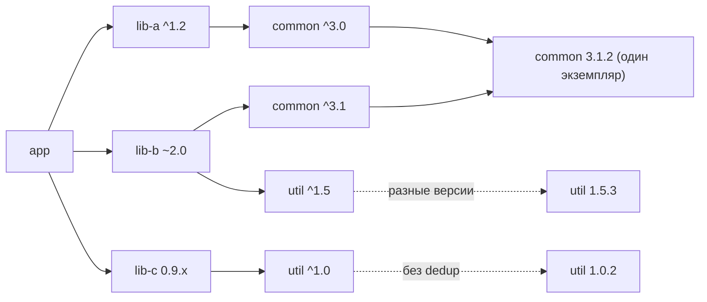
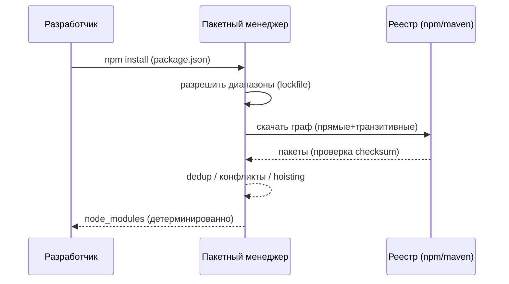

# Dependency Hell (Ад зависимостей)

## Определение

**Dependency Hell (Ад зависимостей)** — состояние проекта, когда управление пакетами/библиотеками превращается в хаос: конфликтующие версии транзитивных зависимостей, несовместимые контракты, огромный и неконтролируемый граф, «чужой» код внутри по непонятной причине. Систематическая причина — **семантическая ложь** версий (SemVer нарушается), грызущиеся диапазоны и распределённость графа (A→B→C, B→D, C→D разных версий).

## Зачем нужно управлять зависимостями

- **Воспроизводимость сборок** — команда/CI/прод должны собирать одно и то же из одного lockfile.
- **Безопасность** — старые уязвимые пакеты в чужих транзитивах = дыра без вашего участия (см. Supply Chain).
- **Размер и производительность** — тысячи пакетов замедляют установку и сборку (build caching).
- **Ясность для онбординга и аудита** — «что именно и почему здесь есть».
- **Безопасность SemVer-диапазонов** — «^1.2.3» обещает совместимость, но реальные брейкинг-выпуски нарушают её (см. Semantic Versioning).

## Как работает

Пакетный менеджер выстраивает **граф зависимостей**: прямое объявление (`package.json`, `go.mod`, `pom.xml`) → транзитивные зависимости → их транзитивные → ... Хост менеджер:

- **SemVer-диапазоны** разрешаются в конкретные версии согласно lockfile (`package-lock.json`, `yarn.lock`, `go.sum`, `pom.lock`/Maven lock).
- **Deduplication (дедупликация)** — если две ветки могут взять одну и ту же версию → один экземпляр.
- **Конфликты** — разные ветки требуют несовместимые версии одного пакета → две версии рядом (дублирование) или крах.
- **BOM / версия центрально** (Java): «один источник правды» для версий общих либ в компании.
- **Monorepo hoisting** — общий корень зависимостей, избегание дублирующих инстансов.





## Примеры кода

> Сценарии: **диапазоны и lockfile**, **override зависимостей при конфликте**, **центральные версии в BOM**, **обновление безопасных версий**.

### npm (package.json: явные диапазоны + override)

```json
{
  "name": "orders-api",
  "dependencies": {
    "express": "^4.19.2",
    "lib-a": "^1.2.0",
    "lib-b": "~2.0.1"
  },
  "overrides": {
    "lib-a": {
      "lib-c": "3.1.2"
    }
  }
}
```

### pom.xml (Maven: dependencyManagement — единые версии)

```xml
<dependencyManagement>
  <dependencies>
    <dependency>
      <groupId>com.company</groupId>
      <artifactId>common-lib</artifactId>
      <version>3.1.2</version>
    </dependency>
  </dependencies>
</dependencyManagement>
```

### go.mod (Go: точные версии + go.sum чексуммы)

```
module github.com/company/orders

go 1.22

require (
    github.com/lib/a v1.2.3
    github.com/lib/b v2.0.1
)
```

## Пример использования: интеграция

> Практика: **проверка уязвимых зависимостей в CI**, **обновление по типу брейкинг**, **мониторинг размера графа**.

### npm audit (безопасность графа)

```bash
npm install
npm audit --prod              # уязвимости prod-зависимостей
npm audit fix                 # обновить до безопасных в пределах совместимого
# или реже: npm audit fix --force  (возможны breaking!)
```

### Dependabot / Renovate (авто-обновление с проверкой)

# конфиг Dependabot (.github/dependabot.yml)
updates:
  - package-ecosystem: npm
    directory: "/"
    schedule:
      interval: weekly
    open-pull-requests-limit: 10
    versioning-strategy: increase-if-necessary

### Java (проверка уязвимостей: dependency-check в CI)

```xml
<plugin>
  <groupId>org.owasp</groupId>
  <artifactId>dependency-check-maven</artifactId>
  <version>8.4.0</version>
  <configuration>
    <format>HTML</format>
  </configuration>
</plugin>
```

### Go (сканирование в CI)

```bash
# набрать список зависимостей в SBOM
go list -m -json all > go-deps.json
# проверка уязвимостей (govulncheck)
govulncheck ./...
```

## Паттерны использования

- **Lockfile в git и в CI** — детерминированная сборка из зафиксированного графа.
- **Редко, но явно обновлять** — обновление до новых major с анализом changelog, а не `npm update` пачкой.
- **Central BOM / dependencyManagement** — единая правда версий внутри компании (Java), единый реестр внутри (npm private registry).
- **Audit зависимостей в CI** — блокировка PR с известными уязвимостями.
- **Автообновление только для patch/minor** — безопасные обновления автоматизируются, major — через отдельный контроль.
- **Минимизация зависимостей** — меньше пакетов → меньше графа, атак, клейма в SBOM.
- **SBOM (Software Bill of Materials)** — экспорт списка зависимостей для аудиторов и безопасников.

## Антипаттерны и ловушки

- **Нет lockfile в git** — каждая установка даёт «свой» граф: сборки невоспроизводимы.
- **`npm update` наавтопилоте** — массовые изменения версий без changelog → сюрпризы в проде.
- **Игнорировать audit-предупреждения** — уязвимые пакеты годами живут в проде.
- **Версии «на глаз» в pom** — отсутствие dependencyManagement → дрейф версий между сервисами.
- **Транзитивы как чёрный ящик** — не знать, что внутри графа; нельзя контролировать напрямую.
- **Раздувание графа «на всякий случай»** — лишний пакет притягивает десятки зависимостей.
- **Самим нарушать SemVer в пакетах** — мастер-класс «как выкопать ад» (см. Semantic Versioning).

## Когда использовать / когда НЕ использовать

**Использовать:**
- Любой проект с внешними пакетами (npm, Maven, Go modules, PyPI/Cargo).
- Публичную библиотеку — строгие SemVer-контракты, changelog, минимальный граф.
- Командные монорепо/многосервисные системы — централизованный контроль версий.

**НЕ использовать (или с осторожностью):**
- Скип-контроль зависимостей ради скорости (старый прием «забить») — всегда audit.
- Обновлять прод-зависимости без прогона тестов/канареечного деплоя.
- Автоматические major-обновления без детального код-ревью — только патч/миниор.

## Связанные темы

- **Semantic Versioning** — фундамент разумения совместимости версий.
- **API Versioning** — семантика контрактов, которую надо соблюдать в пакетах.
- **CI/CD** — место автоматических проверок и обновлений зависимостей.
- **Docker** — изоляция окружений; версии системных пакетов тоже в графе.
- **Monorepo / Build Caching** — управление общностью зависимостей в монорепо (см. блок 12 / 15).
- **Supply Chain / Supply-chain security** — уязвимости и подмены пакетов (см. Security).

## Вопросы

### Q1
**Что вызывает «dependency hell»?**
- [ ] Слишком быстрый интернет
- [x] Конфликтующие/несовместимые версии транзитивных зависимостей + нарушение SemVer
- [ ] Малое число пакетов
- [ ] Только в Python

Пояснение: граф зависимостей конфликтует по версиям; SemVer врут → «дьявол в деталях».

### Q2
**Зачем lockfile (package-lock.json / go.sum) в git?**
- [ ] Для скорости
- [x] Зафиксировать точный граф версий → детерминированная, воспроизводимая сборка
- [ ] Он нужен только локально
- [ ] Для лицензий

Пояснение: без lockfile установка в разное время даёт разные графы из-за диапазонов; с lockfile — один и тот же результат.

### Q3
**Что делает Maven dependencyManagement?**
- [ ] Удаляет конфликты мгновенно
- [x] Задаёт единую версию пакета для всего проекта/набора (единая правда версий)
- [ ] Подключает тесты
- [ ] Шифрует jar

Пояснение: dependencyManagement централизует версии общих либ — нет дрейфа между модулями/сервисами.

### Q4
**Что означает «npm audit fix»?**
- [ ] Удаляет package.json
- [x] Обновляет пакеты до версий без известных уязвимостей (в пределах совместимых диапазонов)
- [ ] Добавляет comment
- [ ] Скачивает всё заново

Пояснение: audit — проверка графа по базе уязвимостей; fix — патч внутри совместимого (не всегда возможен без брейкинга).

### Q5
**Как правильно обновлять major-версию зависимости?**
- [ ] npm update без лимитов
- [ ] Оставить навечно
- [x] Проанализировать changelog/breaking changes, прогон тестов/канареечный деплой, часто cloud
- [ ] Просто поменять номер

Пояснение: major — потенциально ломающий; нужен чанжлог, регресс и контролируемый выкат.

## Источники

- npm — Зависимости и lockfile: https://docs.npmjs.com/cli/v10/configuring-npm/package-lock-json
- Maven — Dependency mechanism (dependencyManagement): https://maven.apache.org/guides/introduction/introduction-to-dependency-mechanism.html
- Go modules reference (go.sum): https://go.dev/ref/mod
- OWASP Dependency-Check: https://owasp.org/www-project-dependency-check/
- Snyk — dependency security / SBOM: https://snyk.io/learn/dependency-management/