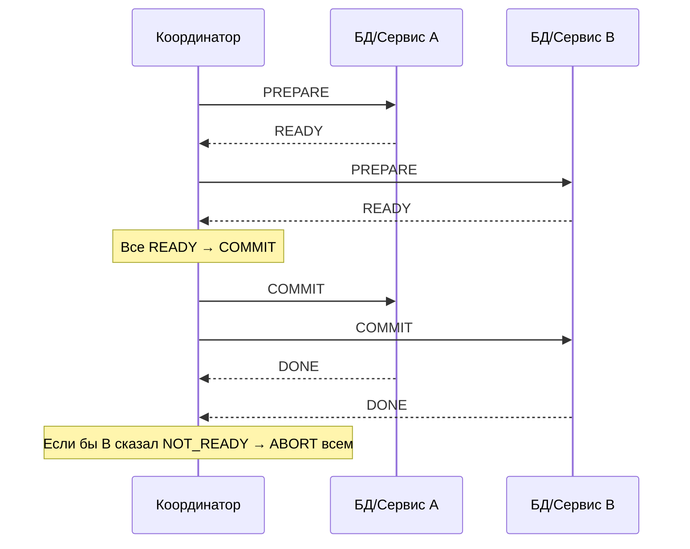
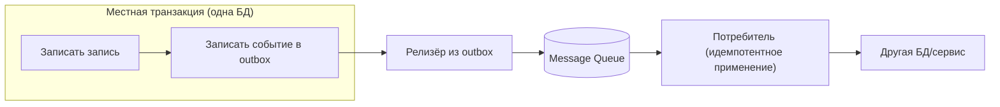

# Распределённые транзакции (Distributed Transactions)

## Определение

**Distributed Transactions (Распределённые транзакции)** — транзакции, которые затрагивают данные **в нескольких системах/базах данных** и требуют согласованного commit/rollback между ними. Проблема: классический ACID работает внутри одной БД; между разными БД/сервисами нужна координация (2PC, XA, сага, outbox), потому что «атомарно» здесь — инженерная задача, а не свойство движка.

## Зачем нужно

- **Гарантия согласованности между системами** — дебет в одном сервисе, кредит в другом; обе записи должны «состояться» или «откатиться» вместе.
- **Целостность финансовых операций** — платежи, инвентарь, заказы.
- **Единственная правда нескольких БД** — без координации «полу»-транзакции оставляют неконсистентное состояние (см. CAP/Eventual Consistency).
- **Целостность для аудита** — при распределённых шагах нужны журналы (recovery log) для восстановления.

## Как работает

Два главных подхода:

### 2PC (Two-Phase Commit)

Участники и координатор:
1. **Phase 1 — Prepare**: координатор спрашивает всех участников «готовы ли закоммитить?»; каждый участник записывает изменения, но внешне не проявляет их (локально подготовлен).
2. **Phase 2 — Commit/Abort**: если ВСЕ ответили prepare-ok — все участники коммитят; если кто-то сказал abort / не ответил — все откатывают.

Проблемы:
- **Гетерогенные участники** — разное ПО, разное XA: драйверы/БД часто не поддерживают XA.
- **Блокировка ресурсов** — prepare держит блокировки надолго (минуты/часы) — снижение параллелизма.
- **Координатор — точка отказа** — если он упал между phases, участники «зависли» (нужен recovery log).
- **Сеть/таймаут** — не все ответили → неопределённость.



### Сага и Outbox (альтернативы)

- **Saga** — цепочка локальных транзакций + компенсации (см. Saga Pattern). Нет длинных блокировок, работает с eventual consistency.
- **Outbox Pattern** — в одной локальной транзакции записываем изменения БД + событие в outbox-таблицу; релизёр шлёт события в очередь (см. Outbox). Даёт «атомарность» между БД и очередью.
- **Transactional Outbox + Idempotency** — приложение записывает факт + событие в ту же транзакцию → очередь, подписчики идемпотентно применяют.



## Примеры кода

> Ключевые сценарии: **2PC через XA/JTA**, **outbox в одной транзакции**, **идемпотентные потребители событий**.

### Java (JTA/XA на примере Spring / Atomikos)

```java
import javax.transaction.*;
import org.springframework.stereotype.Service;

@Service
public class TransferService {

    @Transactional
    public void transfer(long fromId, long toId, int amount) {
        // обе БД управляются одним UserTransaction-менеджером (XA)
        accountDao.debit(fromId, amount);
        accountDao.credit(toId, amount);
        // commit/rollback обоих источников данных атомарно (2PC)
    }
}
```

### Go (outbox в одной транзакции)

```go
package outbox

import (
	"context"
	"database/sql"
	"encoding/json"
)

func CreateUser(ctx context.Context, db *sql.DB, u User) error {
	tx, err := db.BeginTx(ctx, nil)
	if err != nil {
		return err
	}
	defer tx.Rollback()

	if _, err := tx.ExecContext(ctx,
		`INSERT INTO users (id, email) VALUES ($1, $2)`, u.ID, u.Email); err != nil {
		return err
	}

	event, _ := json.Marshal(map[string]string{
		"type": "user.created",
		"data": u.Email,
	})
	// событие в той же транзакции, что и данные
	if _, err := tx.ExecContext(ctx,
		`INSERT INTO outbox (aggregate, payload) VALUES ($1, $2)`, u.ID, event); err != nil {
		return err
	}
	return tx.Commit() // атомарно: запись + событие
}
```

### TypeScript (идемпотентный потребитель события)

```typescript
type Event = { id: string; type: string; payload: unknown }

export async function handleUserCreated(event: Event): Promise<void> {
  // проверяем, обработано ли событие ранее — идемпотентность
  if (await alreadyProcessed(event.id)) return

  await upsertUser(event.payload as { email: string }) // только если ключа нет

  // после успешной обработки — сохраняем processed marker
  await markProcessed(event.id)
}
```

## Пример использования: интеграция

> Реальные сценарии: **двухфазный коммит через Coordinator с RecoveryLog**, **transactional outbox для создания заказа**, **webhook/очередь + идемпотентность**.

### Java (RecoveryLog: координатор 2PC)

```java
// Координатор фиксирует состояние каждого участника
class TransactionCoordinator {
    private final Log log = new Log("tlog"); // журнал восстановления

    void twoPhaseCommit(List<Participant> participants) {
        // 1. prepare всех + записать log.PREPARED
        if (participants.stream().allMatch(Participant::prepare)) {
            log.append(TransactionStatus.COMMITTING);
            participants.forEach(Participant::commit);
        } else {
            log.append(TransactionStatus.ABORTING);
            participants.forEach(Participant::rollback);
        }
        log.append(TransactionStatus.COMMITTED_OR_ABORTED);
    }
}
```

### TypeScript (transactional outbox + relay из одного хранилища)

```typescript
async function createOrder(deps: Deps, order: Order) {
  const { db, outbox, producer } = deps

  await db.transaction(async (tx) => {
    await tx.orders.insert(order)
    await tx.outbox.insert({
      aggregateId: order.id,
      type: 'order.created',
      payload: order,
    })
  })

  // outbox-releaser читает непрочитанные строки и шлёт в очередь
  await relayPendingOutbox(outbox, producer)
}
```

### Go (outbox-relayer горутина с ретраями)

```go
func relayLoop(ctx context.Context, db *sql.DB, publish func(Event) error) {
	for {
		select {
		case <-ctx.Done():
			return
		case <-time.Tick(time.Second):
			rows, err := db.QueryContext(ctx,
				`SELECT id, aggregate, payload FROM outbox WHERE sent_at IS NULL LIMIT 100`)
			if err != nil {
				continue
			}
			for rows.Next() {
				var e Event
				_ = rows.Scan(&e.ID, &e.Aggregate, &e.Payload)
				if err := publish(e); err == nil {
					_, _ = db.ExecContext(ctx,
						`UPDATE outbox SET sent_at = now() WHERE id = $1`, e.ID)
				}
			}
		}
	}
}
```

## Паттерны использования

- **Transactional outbox + idempotent consumers** — атомарность БД↔queue без 2PC (проверено практикой).
- **2PC только когда иначе нельзя** (два источника XA-стек) и при коротких шагах.
- **Recovery log у координатора** — чтобы не «зависнуть» на полпути.
- **Идемпотентные операции на приёме** — повторная доставка/компенсация не дублирует.
- **Saga для длинных процессов** — блокировки не держим (см. Saga).
- **Watch несогласованность** — eventual consistency контролировать метриками/шлюзами сверки.

## Антипаттерны и ловушки

- **2PC на всех распределённых операциях** — дорого, долгое блокирование, падение под нагрузкой.
- **Координатор без recovery log** — сервис упал → вечная «неопределённость» участников.
- **Неисидемпотентные потребители** — повтор события = двойной эффект.
- **Outbox + отдельная очередь без транзакции** — событие отправлено, а данные не сохранены (или наоборот).
- **Игнорирование network partitions** — 2PC в partition зависает (см. CAP/Network Partitions).
- **Saga вместо единственной транзакции** — злоупотребление компенсациями при возможной простой БД.

## Когда использовать / когда НЕ использовать

**Использовать:**
- Финансовые/бизнес-операции с несколькими хранилищами данных.
- Системы, где «атомарность» критична и нет способа обойтись одной БД.
- Асинхронная доставка событий с целостностью (outbox).

**НЕ использовать (или с осторожностью):**
- Когда можно сознательно перейти на eventual consistency + компенсации (сага).
- Когда трафик высокой параллельности и блокировки неприемлемы (2PC).
- Когда та самая «транзакция» может быть одной локальной БД-транзакцией (см. Saga).

## Связанные темы

- **Saga Pattern** — главная альтернатива (цепочка локальных транзакций + компенсаций).
- **Outbox Pattern** — атомарность БД↔события (см. блок 04 Event-Driven).
- **CAP Theorem / Eventual Consistency** — почему «сильная согласованность везде» тяжела.
- **Idempotency** — фундамент надёжных потребителей/компенсаций.
- **Network Partitions** — поведение координации в разделении кластера.
- **Message Queues / Dead Letter Queues** — транспорт событий outbox/saga.

## Вопросы

### Q1
**В чём ключевая сложность распределённых транзакций?**
- [ ] Синтаксис SQL
- [x] ACID работает только в одной БД; между системами нужна координация и атомарность
- [ ] БД не поддерживают запись
- [ ] Только в скорости

Пояснение: распределённые транзакции — координация commit/rollback между системами, где ACID-свойств одного движка нет.

### Q2
**Что делает prepare-фаза 2PC?**
- [ ] Отправляет запросы
- [x] Участники локально подготавливают изменения и отвечают «готов/не готов»
- [ ] Снимает блокировки
- [ ] Завершает транзакцию сразу

Пояснение: prepare — проверка «все могут закоммитить?» до того, как что-то изменено видимо.

### Q3
**Почему 2PC часто не подходит для высокораспределённых систем?**
- [ ] Он слишком быстрый
- [x] Долгое блокирование ресурсов, coordinator — точка отказа без recovery log, проблемы с гетерогенными участниками
- [ ] Он универсальный
- [ ] Он лишён минусов

Пояснение: 2PC держит блокировки и зависит от координатора; в распределённой системе это дорого и хрупко.

### Q4
**Что даёт transactional outbox?**
- [ ] Ускоряет SELECT
- [x] Атомарность «запись в БД + событие в очередь» в одной локальной транзакции
- [ ] Заменяет 2PC полностью на паритете
- [ ] Шифрует события

Пояснение: outbox пишет факт данных и событие в одну транзакцию; релизёр выносит событие в очередь — БД и очередь согласованы.

### Q5
**Когда предпочесть сагу вместо 2PC?**
- [ ] Когда сервисов два
- [ ] Когда координатор уже есть
- [x] Для длинных бизнес-процессов/высокого параллелизма, где длинные блокировки и XA недопустимы
- [ ] Когда данные в одной БД

Пояснение: сага использует локальные транзакции + компенсации, не держит глобальные блокировки.

## Источники

- Microsoft — Distributed transactions / 2PC и альтернативы: https://learn.microsoft.com/en-us/azure/architecture/patterns
- Chris Richardson — Outbox Pattern (Transactional Outbox): https://microservices.io/patterns/data/transactional-outbox.html
- Midu — Saga Pattern comparisons (orchestration vs choreography)
- Enterprise Integration Patterns (G. Hohpe) — обработка распределённых транзакций
- PostgreSQL — Two-Phase Commit: https://www.postgresql.org/docs/current/two-phase.html