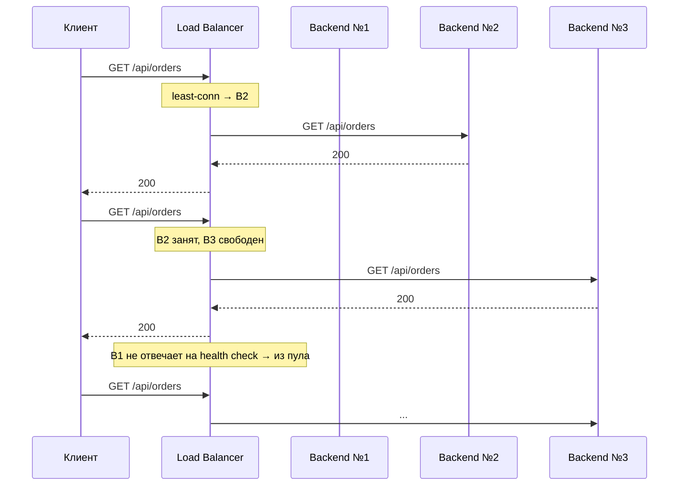
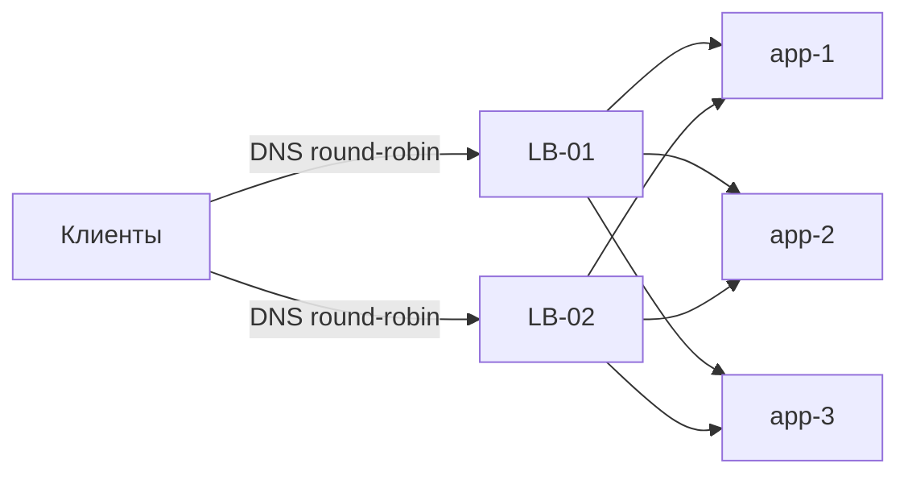

# Балансировка нагрузки (Load Balancing)

## Определение

**Load Balancing (Балансировка нагрузки)** — распределение входящего трафика между несколькими серверами/инстансами одной службы так, чтобы ни один из них не был перегружен, а отказ одного не обрушил сервис. Балансировщик принимает запросы и направляет их на выбранный бэкенд по алгоритму (round-robin, least-connections, IP-hash, consistent hashing, weighted).

## Зачем нужно

- **Масштабирование горизонтально** — добавляем инстансы, трафик распределяется между ними; отказоустойчивость.
- **Отказоустойчивость** — упавший бэкенд выводится из пула, трафик идёт на живые.
- **Стабильная задержка** — без балансировки один «горячий» сервер становится узким местом (см. Latency/P99).
- **Обслуживание без downtime** — rolling deploy: выводим бэкенд из пула, обновляем, возвращаем (см. Rolling Deployments).
- **Использование «дешёвых» инстансов** — weighted-балансировка по мощности.

## Как работает

Балансировщик стоит между клиентом и пулом бэкендов и выбирает, на какой инстанс направить запрос:

- **Round-Robin** — по кругу, равномерно (нет учёта нагрузки).
- **Weighted RR** — пропорционально весам (мощь инстансов).
- **Least-Connections** — на бэкенд с наименьшим числом активных соединений (лучше для долгих запросов).
- **Least-Response-Time** — по последнему времени ответа/активным соединениям.
- **IP Hash / Session affinity (sticky)** — клиент из одного IP всегда попадает на один бэкенд (нужно при локальном состоянии/кэше сессии).
- **Consistent Hashing** — по ключу (user_id, cache key) в кольцо: стабильный выбор при добавлении/удалении узлов (важно для кэшей/CDN).
- **На уровне DNS** — `A`-записи с несколькими IP (round-robin на стороне DNS), без единой точки отказа (см. DNS).

Внутри пула:

- **Health checks** — балансировщик периодически проверяет бэкенды (ping/HTTP) и выводит мёртвые (см. Health Checks).
- **Drain (вывод из пула)** — перед обновлением/снятием инстанс перестаёт получать новые соединения и обслуживает текущие.





## Примеры кода

> Практика: **клиентский round-robin**, **consistent hashing для кэшей**, **least-connections**, **конфиг nginx/HAProxy**.

### TypeScript (client-side round-robin выбор инстанса)

```typescript
const instances = ['10.0.0.1:8080', '10.0.0.2:8080', '10.0.0.3:8080']
let cursor = 0

export function nextInstance(): string {
  const idx = cursor % instances.length
  cursor += 1
  return instances[idx]
}

export async function callBalanced(path: string): Promise<Response> {
  const base = nextInstance()
  return fetch(`http://${base}${path}`)
}
```

### Go (consistent hashing)

```go
package lb

import "hash/crc32"

type Consistent struct {
	ring  []uint32
	nodes map[uint32]string
}

func (c *Consistent) pick(key string) string {
	h := crc32.ChecksumIEEE([]byte(key))
	// бинарный поиск по кольцу — первый узел с hash >= h
	for _, v := range c.ring {
		if v >= h {
			return c.nodes[v]
		}
	}
	return c.nodes[c.ring[0]]
}
```

### Java (Spring Cloud LoadBalancer: RoundRobin/Retry)

```java
import org.springframework.cloud.client.loadbalancer.LoadBalanced;
import org.springframework.web.client.RestTemplate;

@Configuration
public class BalanceConfig {

    @Bean
    @LoadBalanced          // резолвит "orders-service" через реестр + старая политика пула
    public RestTemplate restTemplate() {
        return new RestTemplate();
    }
}
```

## Пример использования: интеграция

> Применение в реальных системах: **sticky-session за балансировщиком**, **weighted для мощности**, **graceful drain при деплое**.

### nginx (least_conn + weighted + fail_timeout)

```nginx
upstream app {
    least_conn;
    server 10.0.0.1:8080 max_fails=3 fail_timeout=10s;
    server 10.0.0.2:8080 weight=2;          # инстанс мощнее
    server 10.0.0.3:8080;
}

location /api/ {
    proxy_pass http://app;
    proxy_set_header X-Forwarded-For $proxy_add_x_forwarded_for;
}
```

### Go (фоновая проверка и вывод из пула)

```go
package lb

import (
	"log"
	"net/http"
	"sync"
	"time"
)

type Backend struct {
	URL   string
	alive bool
	mu    sync.RWMutex
}

func (b *Backend) isAlive() bool {
	b.mu.RLock()
	defer b.mu.RUnlock()
	return b.alive
}

func (b *Backend) setState(alive bool) {
	b.mu.Lock()
	b.alive = alive
	b.mu.Unlock()
}

func healthCheck(b *Backend, every time.Duration) {
	for range time.Tick(every) {
		resp, err := http.Get(b.URL + "/health") // 2xx → жив
		b.setState(err == nil && resp.StatusCode == 200)
		if !b.isAlive() {
			log.Printf("backend down: %s", b.URL)
		}
	}
}
```

### Java/Kubernetes (drain через readinessProbe)

```yaml
# k8s: Pod выводится из Service до того, как терминально остановлен
spec:
  terminationGracePeriodSeconds: 30
  containers:
    - name: app
      readinessProbe:      # пока не false — под не получает трафик
        httpGet:
          path: /health
          port: 8080
```

## Паттерны использования

- **Тип балансировки под нагрузку** — RR для коротких запросов, least-conn для долгих, consistent hashing для кэшей.
- **Sticky только где нужно** — сессии/локальное состояние; иначе мешает равномерности.
- **Health-check + drain** — каждый инстанс проверяем и выводим до «смерти».
- **Внешний LB + внутренний LB** — на периметре (nginx/cloud LB), внутри кластера (k8s Service/Envoy).
- **Тестировать влияние балансировки на латентность** — «горячий хвост» побеждается распределением (см. P99 Latency/Tail Latency).
- **Metric-driven** — балансировка по метрикам (CPU, соединения, latency), не только «на глаз».

## Антипаттерны и ловушки

- **Round-robin без health-check** — половина запросов в мёртвый инстанс.
- **Sticky вечно** — при ротации инстансов/днях связи клиент застревает на одном бэкенде.
- **Все запросы на один «сильный» инстанс** — нет весов/учёта мощности.
- **DNS-кэш слишком долгий** — смена A-записей не подхватывается клиентами (см. DNS TTL).
- **Балансировщик сломал стриминг/WebSocket** — буферизация тела и агрессивные upgrade-правила (см. WebSockets).
- **Синхронная балансировка по IP без awareness регионов** — весь трафик в один AZ на пике.
- **Не учитывать «горячий» инстанс после деплоя** — контейнер перегружен прогревом; вывод до старта запроса.

## Когда использовать / когда НЕ использовать

**Использовать:**
- Любой сервис с более чем одним инстансом (основной путь к масштабированию).
- Веб, API, WebSocket, gRPC — горизонтально масштабируемые слои.
- Кэши/сессии — там, где нужен stable mapping (consistent hashing/sticky).

**НЕ использовать (или с осторожностью):**
- Один инстанс без плана роста — балансировка добавит хоп без выгоды.
- Долгие блокирующие серверы, где ограничены соединения — нужен least-conn и мониторинг, а не RR.
- Когда трафик уже распределён другим механизмом (например, K8s headless + client-side).

## Связанные темы

- **Reverse Proxy / API Gateway** — дом, где живёт балансировщик (nginx/Traefik → upstream).
- **Service Discovery** — откуда балансировщик берёт свежий список инстансов.
- **DNS** — A-записи/RR как «плоский» LB без точки отказа.
- **Autoscaling** — рост/спад инстансов; балансировка «следует» за пулом.
- **Rolling Deployments / Blue-Green** — работа с drain и health при выкатах.
- **P99/Tail Latency** — метрики, на которые влияет балансировка.
- **Consistent Hashing** — стратегия для кэшей/CDN.

## Вопросы

### Q1
**Что делает load balancer?**
- [ ] Хранит базу ответов
- [x] Распределяет трафик между инстансами одной службы (RR, least-conn, weighted)
- [ ] Шифрует все запросы
- [ ] Заменяет кэш

Пояснение: LB — распределение трафика + отказоустойчивость пула бэкендов.

### Q2
**Для каких систем нужен consistent hashing?**
- [ ] Для статики
- [x] Для кэшей/CDN/сессий, где нужен стабильный выбор узла по ключу при добавлении/удалении нод
- [ ] Только для балансировки БД
- [ ] Для секретов

Пояснение: consistent hashing минимизирует перераспределение ключей при изменении пула (важно для кэша).

### Q3
**Чем least-connections лучше round-robin (по общему правилу)?**
- [x] Направляет на наименее занятый бэкенд — лучше для долгих/неравномерных запросов
- [ ] Он шифрует трафик
- [ ] Он быстрее по CPU
- [ ] Ничем

Пояснение: RR не знает о нагрузке; least-conn балансирует «на лету» по активным соединениям.

### Q4
**Что делает drain инстанса перед выкатом?**
- [ ] Удаляет данные
- [x] Перестаёт получать новые соединения, обслуживает текущие и выходит из пула
- [ ] Ускоряет запросы
- [ ] Сжимает логи

Пояснение: drain — подготовка к рестарту: новые запросы идут на другие бэкенды, текущие завершаются (graceful).

### Q5
**Зачем weight у бэкенда?**
- [ ] Вес ускоряет кэш
- [x] Учитывает мощность инстанса — он получает пропорционально больше/меньше трафика
- [ ] Это пароль для health-check
- [ ] Вес фиксирует клиентов

Пояснение: weighted RR/least-conn отправляет трафик пропорционально весам (мощность инстансов).

## Источники

- NGINX — Load balancing (документация): https://nginx.org/en/docs/http/load_balancing.html
- HAProxy — Balancing algorithms: https://www.haproxy.com/blog/load-balancing-101
- NGINX Resources — Load Balancing: https://www.nginx.com/resources/glossary/load-balancing/
- Consistent Hashing (Tom White): https://tom-e-white.com/2007/11/consistent-hashing.html
- Google Cloud — Load balancing types: https://cloud.google.com/load-balancing/docs/choosing-load-balancer