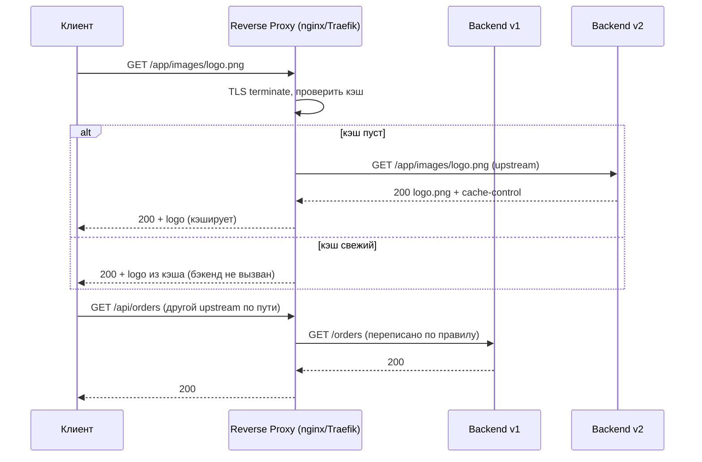
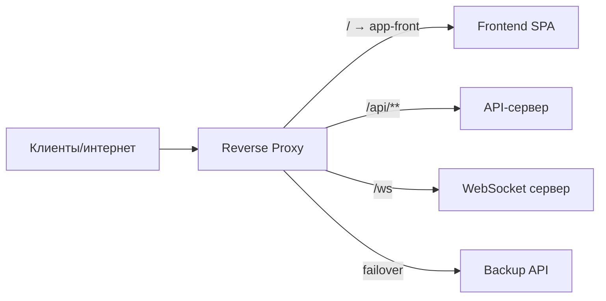

# Обратный прокси (Reverse Proxy)

## Определение

**Reverse Proxy (Обратный прокси)** — сервер, который принимает запросы **снаружи** и пересылает их на **внутренние** серверы приложений от имени клиента, скрывая их от внешнего мира. Клиент общается только с прокси: маршрутизация, TLS-терминация, кэширование и балансировка происходят за одним адресом. Классика: nginx, HAProxy, Traefik, Envoy.

## Зачем нужно

- **Защита внутренних серверов** — внешний мир видит только прокси, не знает внутренних адресов и портов.
- **TLS-терминация** — единая точка для TLS-сертификатов; внутренний трафик может идти по plaintext HTTP (см. TLS).
- **Балансировка нагрузки** — распределение запросов между несколькими инстансами приложения (см. Load Balancing).
- **Кэширование** — кэш статики/ответов на краю сети (см. Caching/Edge Caching).
- **Маршрутизация по правилам** — по пути/host/заголовку разные бэкенды (path routing, host routing, A/B).

## Как работает

Клиент → **обратный прокси** → выбранный внутренний сервер.

- Реверс-прокси переписывает запрос: сверяет правила (host/path/headers), выбирает upstream, берёт из пула соединений, получает ответ и возвращает клиенту.
- **Keepalive** — соединения с бэкендами переиспользуются (экономия на установке TCP/TLS).
- **Timeouts/retries** — прокси задаёт таймауты чтения/записи и может повторить запрос на другом бэкенде.
- **Buffering** — буферизирует тело ответа и отдаёт клиенту пачками (in-memory или на диск).
- **WebSocket upgrade** — прокси пробрасывает upgrade-трафик (streaming) без буферизации.





## Примеры кода

> Сценарии: **конфиг nginx**, **прокси-сервер на Go**, **проксирование на Java (Spring)**.

### nginx (конфиг: TLS + балансировка + ws upgrade)

```nginx
http {
    upstream api {
        least_conn;
        server 10.0.0.2:8080;
        server 10.0.0.3:8080;
    }

    server {
        listen 443 ssl;
        server_name example.com;

        ssl_certificate     /certs/fullchain.pem;
        ssl_certificate_key /certs/privkey.pem;

        location /api/ {
            proxy_pass http://api;
            proxy_set_header Host $host;
            proxy_set_header X-Real-IP $remote_addr;
        }

        location /ws/ {
            proxy_pass http://api;
            proxy_http_version 1.1;
            proxy_set_header Upgrade $http_upgrade;
            proxy_set_header Connection "upgrade";
        }
    }
}
```

### Go (простой reverse proxy через httputil)

```go
package main

import (
	"log"
	"net/http"
	"net/http/httputil"
	"net/url"
	"strings"
)

func main() {
	backend, _ := url.Parse("http://10.0.0.2:8080")
	proxy := httputil.NewSingleHostReverseProxy(backend)

	// кастомный Director: переписывание пути и форвардинг заголовков
	proxy.Director = func(r *http.Request) {
		r.URL.Scheme = backend.Scheme
		r.URL.Host = backend.Host
		r.URL.Path = strings.TrimPrefix(r.URL.Path, "/app") // /app/x → /x
		r.Host = backend.Host
	}

	log.Fatal(http.ListenAndServeTLS(":443", "cert.pem", "key.pem", proxy))
}
```

### Java (proxy через HttpClient / Spring)

```java
import org.springframework.http.ResponseEntity;
import org.springframework.web.client.RestTemplate;
import org.springframework.web.bind.annotation.*;
import jakarta.servlet.http.HttpServletRequest;

@RestController
public class ProxyController {

    private final RestTemplate rest = new RestTemplate();

    @GetMapping("/api/{backend}/**")
    public ResponseEntity<byte[]> proxy(@PathVariable String backend,
                                        HttpServletRequest request) {
        String target = "http://" + backend + ":" + 8080 + request.getRequestURI();
        // RestTemplate: GET/METHOD на target и возврат ответа
        return rest.exchange(target,
                HttpMethod.valueOf(request.getMethod()),
                null, byte[].class);
    }
}
```

## Пример использования: интеграция

> Реверс-прокси в поде/инфраструктуре: **front+api на одном домене**, **health-проверка бэкендов**, **limiting + caching**.

### nginx (health check + fallback upstream)

```nginx
upstream api {
    server 10.0.0.2:8080 max_fails=3 fail_timeout=30s;
    server 10.0.0.3:8080 backup;   # резервный, если основной мёртв
    server 10.0.0.4:8080 max_fails=3 fail_timeout=30s;
}

location /api/ {
    proxy_pass http://api;
    proxy_connect_timeout 2s;
    proxy_read_timeout    30s;
}
```

### Go (динамические upstreams через резолвер)

```go
package main

import (
	"net/http"
	"net/http/httputil"
	"net/url"
	"sync"
)

type dynamicProxy struct {
	mu       sync.RWMutex
	backends map[string]*httputil.ReverseProxy
}

func (p *dynamicProxy) ServeHTTP(w http.ResponseWriter, r *http.Request) {
	// выбор бэкенда по Host/пути, обновление через чанк-канал
	target, err := url.Parse("http://orders.internal:8080")
	if err != nil {
		http.Error(w, "bad upstream", http.StatusBadGateway)
		return
	}
	p.proxyFor(target).ServeHTTP(w, r)
}

func (p *dynamicProxy) proxyFor(target *url.URL) *httputil.ReverseProxy {
	p.mu.RLock()
	proxy := p.backends[target.String()]
	p.mu.RUnlock()
	if proxy != nil {
		return proxy
	}
	proxy = httputil.NewSingleHostReverseProxy(target)
	p.mu.Lock()
	p.backends[target.String()] = proxy
	p.mu.Unlock()
	return proxy
}
```

### Java (Spring Cloud Gateway как reverse proxy на Java)

```yaml
spring:
  cloud:
    gateway:
      routes:
        - id: static
          uri: http://static.internal:8080
          predicates:
            - Path=/**
          filters:
            - RewritePath=/assets/(?<segment>.*), /assets/$1
```

## Паттерны использования

- **TLS terminate на краю** — сертификаты в одном месте, быстро разворачивать/ротировать, внутренний трафик — HTTP/2 (см. TLS).
- **Реверс-прокси перед приложением** — кэширование статики, сжатие (gzip/brotli), безопасность на границе.
- **Разделение по пути/host** — `/api` → сервисы, `/assets` → CDN/статика, `/ws` → WebSocket.
- **Retry на другой инстанс** — только для идемпотентных запросов (GET/HEAD; см. Idempotency).
- **Логирование периметра** — access log прокси содержит всё: реальный IP, latency, upstream, статус.
- **IPv6 + HTTP/2 + keepalive на бэкендах** — меньше хопов, меньше задержек.

## Антипаттерны и ловушки

- **Прокси без таймаутов** — зависший бэкенд держит все соединения → истощение пула на периметре.
- **Буферизация больших стримов** — SSE/WebSocket/файлы ломаются, если прокси глотает в память (см. Server-Sent Events, WebSockets).
- **Забыть про `Host`-заголовок** — бэкенд (virtual host) отдаёт не тот сайт/контракт; править `proxy_set_header Host`.
- **Повторные попытки на неидемпотентных методах** — POST продублирует операцию (см. Idempotency).
- **Медленный DNS/upstream в конфиге** — resolver без fail и cold-cache долго не обновляет список.
- **Проксирование тела в память** — огромные uploads упираются в лимиты worker'а.

## Когда использовать / когда НЕ использовать

**Использовать:**
- Любое приложение, выходящее в интернет/через периметр (staging, prod, партнёры).
- Микросервисы: обратный прокси перед каждым доменом/службой с k8s-ingress.
- Статика + API на одном домене: разграничение по пути.

**НЕ использовать (или с осторожностью):**
- Внутри подового трафика без необходимости (если есть Service-discovery без периметра).
- Когда нужна бизнес-агрегация/версии/auth с логикой — это уровень API Gateway (см. API Gateway).
- Не добавляйте прокси ради прокси: каждый хоп — задержка и потенциальная точка отказа.

## Связанные темы

- **API Gateway** — бизнес-шлюз поверх reverse proxy (агрегация, auth, версии).
- **Load Balancing** — upstream-логика балансировки внутри прокси/шлюза.
- **TLS** — терминация и ротация сертификатов на прокси.
- **HTTP/2 и HTTP/3** — производительность и мультиплексирование на периметре.
- **WebSockets / Server-Sent Events** — проброс streaming через прокси (upgrade, buffering).
- **Caching / Edge Caching** — кэш на прокси/CDN.
- **WAF** — безопасность на периметре перед прокси/за ним.

## Вопросы

### Q1
**Для чего служит reverse proxy?**
- [ ] Для прямой отправки запросов в интернет
- [ ] Для аналитики клиентов
- [x] Принимает запросы снаружи и пересылает внутренним серверам, скрывая их топологию
- [ ] Только для шифрования ссылок

Пояснение: обратный прокси — точка входа для внешнего трафика, скрывает внутренние серверы и применяет правила.

### Q2
**Что делает «TLS-termination»?**
- [x] Завершает TLS-шифрование в одной точке (прокси), дальше — трафик во внутренней сети
- [ ] Увеличивает длину ключей
- [ ] Проверяет срок сертификатов у клиентов
- [ ] Убирает TLS вовсе

Пояснение: прокси принимает TLS на 443 и общается с внутренними серверами по внутреннему протоколу (https/plain) — единая точка управления сертификатами.

### Q3
**Какая директива nginx отвечает за балансировку между несколькими серверами?**
- [ ] `proxy_pass`
- [ ] `server_name`
- [x] upstream-блок (least_conn / round-robin / ip_hash)
- [ ] `location`

Пояснение: `upstream { server ...; server ...; }` определяет группу бэкендов и стратегию балансировки.

### Q4
**Чем reverse proxy отличается от forward proxy?**
- [ ] Размером шифрования
- [x] Forward proxy от имени клиента ходит за ресурсами; reverse proxy принимает трафик для внутренних серверов
- [ ] Они идентичны
- [ ] Reverse при этом — всегда TLS

Пояснение: forward proxy — прокси от лица клиента куда-то; reverse — точка приёма трафика на стороне серверов.

### Q5
**Почему для WebSocket/SSE не подходит агрессивная буферизация ответа?**
- [ ] Потому что WebSocket не зашифрован
- [ ] Потому что это ускоряет клиент
- [x] Streaming-каналы требуют мгновенной передачи: буфер задерживает/рвёт поток сообщений
- [ ] Нет верных ответов

Пояснение: WebSocket upgrade и SSE-потоки — постоянные/долгодействующие; буферизация тел задерживает поток и ломает live-события.

## Источники

- NGINX — Reverse proxy: https://nginx.org/en/docs/beginners_guide.html
- MDN — Reverse proxy: https://developer.mozilla.org/en-US/docs/Web/HTTP/Proxy_servers_and_tunneling
- Traefik — документация (OSS reverse proxy): https://doc.traefik.io/traefik/
- HAProxy — документация: https://www.haproxy.org/documentation/
- Envoy — документация (прокси для сервисной сети): https://www.envoyproxy.io/docs