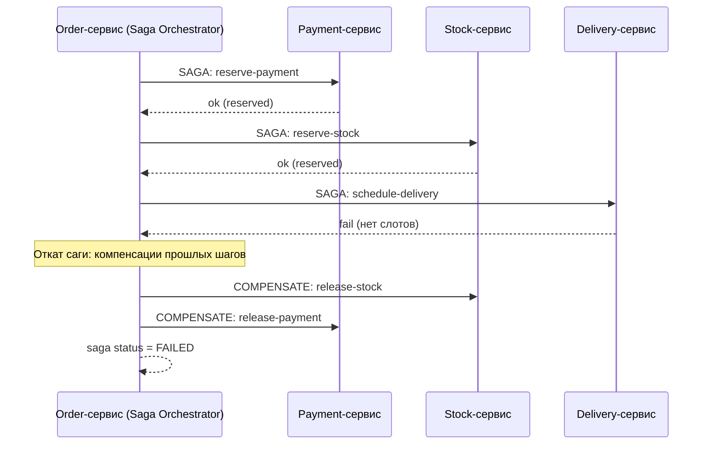
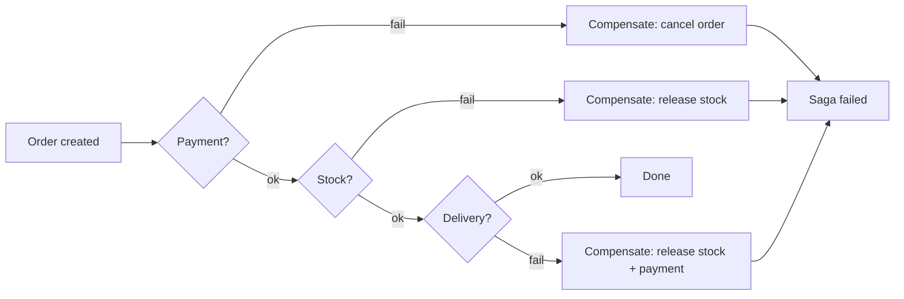

# Паттерн Saga (Saga Pattern)

## Определение

**Saga (Сага) / Saga Pattern** — способ управления **распределённой транзакцией** в микросервисной системе без единой ACID-транзакции: вся операция — это **цепочка локальных транзакций** в разных сервисах, каждая со своим **компенсирующим действием** (rollback на уровне саги). Если шаг упал — вызываются компенсации пройденных шагов, система возвращается в согласованное состояние (eventual consistency). Способы координации: **orchestration (оркестрация)** — центральный координатор, и **choreography (хореография)** — сервисы общаются событиями без центра.

## Зачем нужно

- **Нет распределённой транзакции 2PC** — ACID на нескольких БД дорого/невозможно; сага не зависит от сильно-согласованных XA.
- **Состояние согласовано в конце** (достижимо eventual) при любом сценарии (успех/частичный отказ).
- **Компенсации в каждом сервисе** — каждый участник умеет «откатить» свой шаг и вернуть данные.
- **Независимость сервисов** — они не держат блокировки чужих ресурсов (в отличие от distributed locks).
- **Длительные бизнес-процессы** — бронирование, оформление заказа, оплата, доставка: операции, длящиеся секунды-минуты (saga не держит транзакцию).

## Как работает

Основных координационных стилей два:

- **Orchestration (оркестрация)**: есть саги-координатор (Saga Orchestrator), который знает порядок шагов и, при падении, вызывает compensation-шаги. Простая отладка/контроль, но центральная точка.
- **Choreography (хореография)**: сервисы публикуют события; следующий шаг подписывается и продолжает. Нет центра, но логика размазана по событиям, сложнее наблюдать.

Каждый шаг саги — **событие/вызов + подтверждение + компенсация**:

- `step(success)` — что делает шаг при успехе.
- `stepCompensate()` — что откатывается, если дальше по цепи ошибка.
- Idempotency: шаги и компенсации должны быть идемпотентными (повтор вызова не дублирует эффект).





## Примеры кода

> Практика: **оркестрированная сага (координатор шагов)**, **хореография через события**, **компенсация/идемпотентность шага**.

### TypeScript (Saga orchestrator — управление шагами)

```typescript
type Step<T> = {
  name: string
  run: (ctx: T) => Promise<void>
  compensate?: (ctx: T) => Promise<void>
}

export async function runSaga<T>(ctx: T, steps: Step<T>[]) {
  const executed: Step<T>[] = []
  try {
    for (const step of steps) {
      await step.run(ctx)
      executed.push(step)
    }
    return { ok: true }
  } catch (err) {
    // компенсации в обратном порядке
    for (const done of [...executed].reverse()) {
      if (done.compensate) await done.compensate(ctx)
    }
    return { ok: false, error: (err as Error).message }
  }
}

const orderSaga = [
  { name: 'payment', run: ctx => pay(ctx), compensate: ctx => releasePay(ctx) },
  { name: 'stock', run: ctx => reserveStock(ctx), compensate: ctx => releaseStock(ctx) },
  { name: 'delivery', run: ctx => scheduleDelivery(ctx) },
]
```

### Go (компенсация с идемпотентным ключом)

```go
package saga

type Step struct {
	Name run func(ctx context.Context, sagaID string) error
	Undo func(ctx context.Context, sagaID string) error
}

func Execute(ctx context.Context, sagaID string, steps []Step) error {
	done := []Step{}
	for _, s := range steps {
		if err := s.Name(ctx, sagaID); err != nil {
			for i := len(done) - 1; i >= 0; i-- {
				// компенсация прошлых шагов; сама по себе идемпотентна по sagaID
				_ = done[i].Undo(ctx, sagaID)
			}
			return err
		}
		done = append(done, s)
	}
	return nil
}
```

### Java (Spring: компенсация шага с idempotency-key)

```java
import org.springframework.web.bind.annotation.*;

@RestController
public class PaymentSagaStep {

    @PostMapping("/saga/payment/reserve")
    public ResponseEntity<?> reserve(@RequestHeader("Idempotency-Key") String key) {
        // проверить, не выполнялся ли шаг с этим key; иначе выполнить
        return executeOnce(key, () -> reserveFunds(key));
    }

    @PostMapping("/saga/payment/release")
    public ResponseEntity<?> release(@RequestHeader("Idempotency-Key") String key) {
        // компенсация: вернуть резерв
        return executeOnce(key, () -> releaseFunds(key));
    }
}
```

## Пример использования: интеграция

> Применение: **хореография через события + явные статусы**, **coordinator с персистентным состоянием**, **retry/outbox для надёжности событий**.

### TypeScript (choreography: статусы через события)

```typescript
// Service A публикует событие; Service B продолжает цепочку
const eventBus = new EventBus()

eventBus.subscribe('order.created', async (orderId) => {
  await reserveStock(orderId)          // шаг 2 (хореография)
  eventBus.publish('stock.reserved', orderId)
})

eventBus.subscribe('stock.reserved', async (orderId) => {
  await chargePayment(orderId)         // шаг 3
  eventBus.publish('payment.charged', orderId)
})
```

### Go (оркестратор с персистированным состоянием саги)

```go
package saga

type Saga struct {
	ID    string `json:"id"`
	Status string `json:"status"` // running | succeeded | compensating | failed
	Step  int    `json:"step"`
}

func (s *Saga) persist() { /* записать в БД: id, status, step */ }

func (s *Saga) next(ctx context.Context, run func() error) error {
	if err := run(); err != nil {
		s.Status = "compensating"
		s.persist()
		return err
	}
	s.Step++
	s.persist() // после каждого шага — журнал для восстановления при сбое
	return nil
}
```

### Java (Outbox + saga для надёжной публикации шагов)

```java
// Каждый шаг пишет результат в свою БД + в outbox-таблицу;
// релизёр копирует outbox → message queue (см. Outbox Pattern)
@Transactional
public void paymentStep(SagaRequest req) {
    paymentDao.reserve(req);            // локальная транзакция
    outboxDao.insert(new OutboxEvent(   // в той же транзакции
       msgId(req.getSagaId()), "payment.reserved", req));
}
```

## Паттерны использования

- **Компенсации идемпотентны** — повтор компенсации не дублирует эффект (по sagaID/step key).
- **Журнал состояний саги** — этап и статус персистятся; при сбое координатора сага восстанавливается (не теряется).
- **Orchestration для средних сложных цепочек** — контроль и видимость; Choreography — для простых асинхронных потоков.
- **Compensation + happy-path разделены** — не связывать идемпотентные компенсации с бизнес-логикой успеха.
- **Шаги по событию с outbox** — события не теряются при падении БД/сети (см. Outbox).
- **Таймауты саги** — координатор ждёт ответ шага ограниченное время, иначе запускает компенсации (см. Timeouts).

## Антипаттерны и ловушки

- **Saga без журнала состояния** — координатор упал → сага «потеряна», безвозвратно не согласована.
- **Компенсация неидемпотентная** — двойной вызов отката откатывает чужую операцию/деньги.
- **Поздняя компенсация нарушает бизнес** — выпустили груз, а потом отменили сагу → надо проверять граничные шаги.
- **Нет таймаутов шагов** — зависший сервис блокирует всю сагу.
- **Orchestrator тоже микросервис** (не раздувать) — та же логика God-service.
- **Хореография без observable состояния** — невозможно ответить «где сейчас заказ?» — нужны явные статусы/трейсы.
- **Сага с тяжёлыми блокировками** — сервисы не должны держать блокировки на чужие ресурсы.

## Когда использовать / когда НЕ использовать

**Использовать:**
- Многошаговые бизнес-процессы через несколько сервисов (заказ→оплата→доставка).
- Если распределённая 2PC/ACID невозможна или слишком тяжёлая.
- Асинхронные процесс-флоу с eventual consistency и наблюдением через статусы/события.

**НЕ использовать (или с осторожностью):**
- Когда возможна одна локальная ACID-транзакция (один сервис, одна БД).
- Для высоких гарантий согласованности в средние времени (некоторые данные могут требовать 2PC/строй блокировок) — подумать о компромиссе.
- Если шаги не имеют компенсаций вовсе (нельзя откатить физически, e.g., отправка SMS) — сага должна знать границы «необратимого».

## Связанные темы

- **Distributed Transactions** — альтернатива 2PC; сага — практический заменитель.
- **Event-Driven Architecture / Message Queues** — транспорт событий для хореографии.
- **Outbox Pattern** — надёжная публикация шагов (см. блок 04).
- **Idempotency** — основа идемпотентных компенсаций.
- **Dead Letter Queues** — обработка событий, которые не удалось провести.
- **Eventual Consistency** — целевое состояние системы после саги.
- **Timeouts / Retries** — ограничение времени шагов и повторные вызовы.

## Вопросы

### Q1
**Что такое Sagas в контексте микросервисов?**
- [ ] Схема хранения событий
- [x] Цепочка локальных транзакций в разных сервисах с компенсациями
- [ ] Разновидность ACID-транзакции
- [ ] Очередь для Яндекс-услуг

Пояснение: сага — распределённая обработка без единой ACID-транзакции, через локальные шаги и компенсации.

### Q2
**Чем orchestration отличается от choreography?**
- [ ] Только названием
- [x] Орchestration: центральный координатор; choreography: сервисы общаются событиями без центра
- [ ] Choreography быстрее всегда
- [ ] Or orchestration — это база

Пояснение: оркестрация — явный центр (координатор), хореография — децентрализованные события.

### Q3
**Что случится, если шаг саги (например delivery) упал?**
- [ ] Ничего, останавливаемся
- [x] Запускаются компенсации пройденных шагов (в обратном порядке), состояние приводится к согласованному
- [ ] Вся транзакция атомарно откатывается
- [ ] Дублируется шаг

Пояснение: сага реагирует на отказ цепочкой компенсаций; атомарного отката нет, нужен compensate.

### Q4
**Почему компенсации должны быть идемпотентными?**
- [ ] Чтобы быстрее
- [x] Повторный вызов компенсации не должен дублировать эффект (деньги/сток)
- [ ] Чтобы компенсировать больше
- [ ] Только для синхронных

Пояснение: retry/double-call компенсации возможен при сбоях сети; идемпотентность не даёт двойного отката.

### Q5
**Когда сага НЕ нужна?**
- [ ] Когда сервисов несколько
- [ ] Когда есть события
- [x] Когда операцию можно выполнить одной локальной ACID-транзакцией в одной БД
- [ ] Когда есть очередь

Пояснение: если всё помещается в одну транзакцию одного сервиса — сага избыточна.

## Источники

- Chris Richardson — Saga (Microservices.io): https://microservices.io/patterns/data/saga.html
- Microsoft — Saga distributed transactions pattern: https://learn.microsoft.com/en-us/azure/architecture/reference-architectures/saga/saga
- AWS — Managing distributed transactions (Saga, Orchestration/Choreography): https://docs.aws.amazon.com/prescriptive-guidance/latest/patterns/implement-the-saga-pattern.html
- Eventuate Tram (реализация саги): https://eventuate.io
- Kent Weare — Saga orchestration vs choreography (разбор на примере)