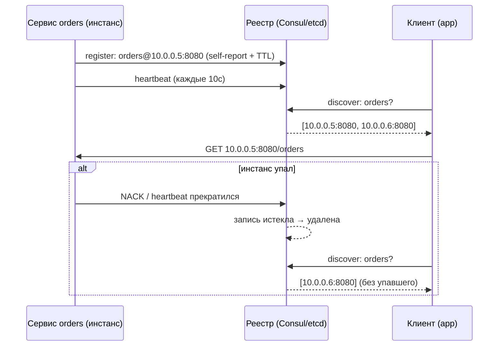
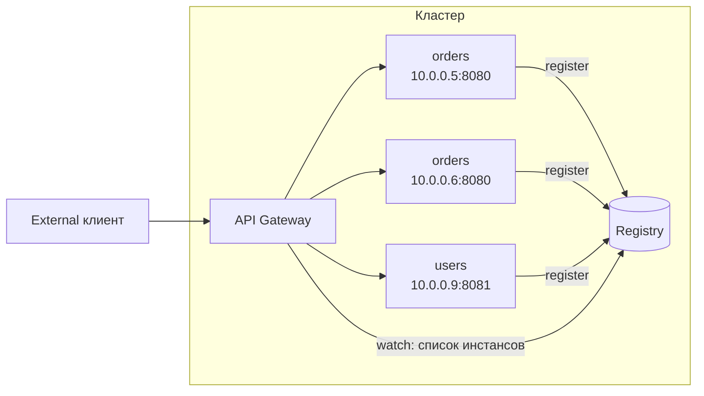

# Service Discovery (Обнаружение сервисов)

## Определение

**Service Discovery (Обнаружение сервисов)** — механизм, который позволяет клиенту найти **актуальные сетевые адреса (host:port)** экземпляров сервиса в динамической среде, где инстансы постоянно создаются, погибают, масштабируются и переезжают. Вместо захардкоженных адресов клиент спрашивает **реестр (registry)**: «где сейчас сервис orders и какие инстансы живы?» и получает список.

## Зачем нужно

- **Динамичность инстансов** — автоскейлинг, деплой, сбои: адреса меняются постоянно, вручную их не поддерживать.
- **Отвязка клиентов от топологии** — клиент знает только «логическое имя» сервиса, а не конкретные IP.
- **Балансировка и фолбек** — клиент получает список живых инстансов и распределяет трафик (см. Load Balancing).
- **Health-осведомлённость** — реестр исключает упавшие/незарегистрированные инстансы до того, как клиент сходит на них.
- **Zero-config подключение** — новый сервис сам регистрируется, старые обновляются без пересборки клиентов.

## Как работает

Есть две классические модели:

- **Client-side discovery** — клиент сам спрашивает реестр (Consul/etcd), сам выбирает инстанс (random/RR/smooth) и сам ходит на него. Минус — логика в клиенте, нужна в каждой библиотеке/языке.
- **Server-side discovery** — клиент ходит на стабильный адрес (API Gateway / Load Balancer), а тот уже знает инстансы из того же реестра. Логика централизована, но появляется лишний хоп.

Ключевые элементы:

- **Registry (реестр)** — хранилище «сервис → список инстансов `{host, port, метаданные}`» с TTL и heartbeat: Consul, etcd, ZooKeeper, встроенно в K8s.
- **Registration (регистрация)** — self-registration (сервис сам пишет себя) или third-party registration (регистратор следит за сервисами).
- **Heartbeat / TTL** — инстанс периодически «стучит в реестр», иначе запись истекает и удаляется (защита от «живых» адресов после краша).
- **DNS-based discovery** — `orders.default.svc.cluster.local` в Kubernetes, SRV-записи для host+port (см. DNS).
- **Watch / streaming** — клиенты подписываются на изменения списка инстансов (WebSocket/gRPC-stream в Consul) вместо поллинга.





## Примеры кода

> Практика: **клиент, который резолвит сервис**, **self-registration**, **DNS/SRV-резолвинг**.

### TypeScript (клиент к реестру + выбор инстанса)

```typescript
import { Consul } from 'consul'

const client = new Consul({ host: 'consul.service.consul' })

async function resolveHealthy(service: string): Promise<string> {
  const instances = await client.catalog.service.nodes(service)
  const healthy = instances.filter((i: { Checks?: { Status: string }[] }) =>
    (i.Checks ?? []).every(c => c.Status === 'passing'))

  if (healthy.length === 0) throw new Error(`no healthy instances for ${service}`)

  // round-robin выбор инстанса
  const pick = healthy[Math.floor(Math.random() * healthy.length)]
  return `${pick.Address}:${poolPort(pick)}`
}

function poolPort(service: { ServicePort?: number; Node?: string }): number {
  return service.ServicePort ?? 8080
}
```

### Go (клиент gRPC-resolver для Kubernetes)

```go
package main

import (
	"context"
	"google.golang.org/grpc"
	"google.golang.org/grpc/credentials/insecure"
)

func dial(ctx context.Context, target string) *grpc.ClientConn {
	// target: "dns:///orders.default.svc.cluster.local:8080"
	// resolver берёт имена из DNS/SRV, round-robin раскидывает инстансы
	conn, err := grpc.DialContext(ctx, target,
		grpc.WithTransportCredentials(insecure.NewCredentials()),
		grpc.WithDefaultServiceConfig(`{"loadBalancingPolicy":"round_robin"}`),
	)
	if err != nil {
		panic(err)
	}
	return conn
}
```

### Java (Consul-based discovery через Spring Cloud)

```java
import org.springframework.cloud.client.ServiceInstance;
import org.springframework.cloud.client.discovery.DiscoveryClient;
import org.springframework.stereotype.Component;
import java.util.List;

@Component
public class OrdersClient {

    private final DiscoveryClient discoveryClient;

    public OrdersClient(DiscoveryClient discoveryClient) {
        this.discoveryClient = discoveryClient;
    }

    public String firstOrdersBaseUrl() {
        // вернёт реальный адрес инстанса, зарегистрированного в Consul
        List<ServiceInstance> instances =
            discoveryClient.getInstances("orders-service");
        if (instances.isEmpty()) {
            throw new IllegalStateException("orders-service is down");
        }
        ServiceInstance inst = instances.get(0);
        return "http://" + inst.getHost() + ":" + inst.getPort();
    }
}
```

## Пример использования: интеграция

> Middleware-эффект: **обёртка запроса через реестр + ретраи**, **self-registration при старте приложения**, **readiness-window в реестре**.

### TypeScript (обёртка вызова через resolve + retry на другой инстанс)

```typescript
async function callWithDiscovery<T>(
  service: string,
  path: string,
  attempt = 0,
): Promise<T> {
  const target = await resolveHealthy(service)
  try {
    const res = await fetch(`http://${target}${path}`)
    if (!res.ok) throw new Error(`HTTP ${res.status}`)
    return res.json() as Promise<T>
  } catch (err) {
    if (attempt < 2) return callWithDiscovery(service, path, attempt + 1) // next instance
    throw err
  }
}
```

### Go (self-registration при старте сервиса)

```go
package main

import (
	"context"
	"time"

	api "github.com/hashicorp/consul/api"
)

func register(ctx context.Context, address, port int) {
	client, _ := api.NewClient(api.DefaultConfig())

	// self-registration: адрес и health-check самого сервиса
	client.Agent().ServiceRegister(&api.AgentServiceRegistration{
		ID:      "orders-01",
		Name:    "orders",
		Address: address,
		Port:    port,
		Check: &api.AgentServiceCheck{
			HTTP:     "http://orders:8080/health",
			Interval: "10s",
		},
	})
}
```

### Java (авторегистрация и де-регистрация в Spring Boot)

```yaml
# application.yml: включить discovery и реестр
spring:
  cloud:
    consul:
      host: consul.service.consul
      discovery:
        instance-id: orders-${random.uuid}
        register-health-check: true
        health-check-path: /actuator/health
```

```java
// приложение само регистрируется в Consul при старте и
// снимает регистрацию при остановке (graceful shutdown),
// что скрывает его от клиентов в момент выката
@SpringBootApplication
public class OrdersApplication {
    public static void main(String[] args) {
        SpringApplication.run(OrdersApplication.class, args);
    }
}
```

## Паттерны использования

- **Self-registration с health-check** — каждый инстанс сам регистрируется и показывает реестру флаг «готов» (см. Health Checks).
- **Heartbeat с коротким TTL** — краш инстанса быстро выпадает из реестра (classic: heartbeat ≤ TTL/3).
- **Watch вместо поллинга** — подписка на изменения списка инстансов снижает задержку реакции и нагрузку на реестр.
- **Client-side + round-robin в библиотеке** — gRPC-резолверы и клиенты Consul делают это под капотом.
- **DNS/SRV как универсальный реестр** — в Kubernetes headless-сервисы отдают SRV-записи инстансов без отдельного реестра.
- **Региональная близость** — выбирать инстанс из того же AZ/региона клиента (метаданные инстансов + сплющивание по близости).

## Антипаттерны и ловушки

- **Хардкод IP адрес в конфиге** — первый же деплой инстанса ломает клиент.
- **Реестр как точка отказа** — если реестр упал, а клиенты его спрашивают синхронно — каскад падений; нужны кэши и фолбеки (см. Circuit Breakers).
- **No health-check в реестре** — клиенты получают адреса «мёртвых» инстансов (реестр знает, но сервис не отвечает).
- **Игнорирование TTL/heartbeat** — запись «вечно жива» → трафик на погибший инстанс.
- **Синхронное резолвинг-на-каждый-запрос** — каждый запрос = запрос в реестр: задержка + нагрузка; нужен кэш списка.
- **Рассинхрон регистрации и готовности** — сервис зарегистрирован, но ещё не захэндлил порт (ready) — клиенты бьют в пустоту.

## Когда использовать / когда НЕ использовать

**Использовать:**
- Микросервисы на Kubernetes/Consul, где инстансы динамичны.
- Клиенты (REST/gRPC), которым нужна устойчивость к смене топологии сервиса.
- Балансировка нагрузки на уровне клиента (client-side discovery).

**НЕ использовать (или с осторожностью):**
- Один-два сервиса на статических адресах — реестр = лишняя сложность (достаточно DNS + балансировщика).
- Если реестр и его стойкость не обеспечены инфраструктурой (сам реестр нужен высокодоступным).
- Когда достаточно стабильного ingress/API Gateway (server-side discovery) без логики в клиентах.

## Связанные темы

- **API Gateway** — server-side discovery: шлюз скрывает реестр от внешних клиентов.
- **Load Balancing** — выбор инстанса из реестра: RR/weighted/least-conn.
- **DNS** — DNS/SRV-резолвинг как механизм реестра и базовые записи.
- **gRPC** — встроенные DNS/name-resolvers и round-robin балансировка.
- **Kubernetes** — Service/headless + DNS-based discovery из коробки.
- **Health Checks** — пробы жизни/готовности для реестра.
- **Circuit Breakers** — защита от «зомби»-адресов из реестра.

## Вопросы

### Q1
**Зачем нужен реестр (registry) в микросервисах?**
- [ ] Для хранения больших данных
- [x] Чтобы клиенты находили актуальные адреса живых инстансов сервиса
- [ ] Чтобы шифровать трафик
- [ ] Для кэширования ответов

Пояснение: реестр — источник правды о «где сейчас инстансы», отвечает на запрос discover динамической топологии.

### Q2
**Что происходит с записью инстанса в реестре, если он перестал слать heartbeat?**
- [ ] Она остаётся навсегда
- [x] Запись истекает по TTL и удаляется, клиенты перестают получать этот адрес
- [ ] Реестр сам перезапускает сервис
- [ ] Трафик продолжает идти в него

Пояснение: heartbeat + TTL — механизм защиты от «мёртвых» адресов; без удаления адреса клиенты ходят на погибший инстанс.

### Q3
**Чем client-side discovery отличается от server-side?**
- [ ] Разницей в микросервисной шине
- [x] Client-side: клиент сам спрашивает реестр и выбирает инстанс; server-side: клиент ходит на стабильный шлюз/балансировщик
- [ ] Сервер сам определяет клиентов
- [ ] Ничем не отличается

Пояснение: в client-side логика выбора в клиенте (gRPC-resolver); в server-side — шлюз/балансировщик скрывает топологию.

### Q4
**Какой механизм использует Kubernetes для discovery?**
- [ ] Только ZooKeeper
- [x] DNS: `service.namespace.svc.cluster.local` (+ headless-сервисы с SRV-записями для портов)
- [ ] TCP-handshake к каждому узлу
- [ ] JSON-конфиг каждого поды

Пояснение: K8s регистрирует Service в внутреннем DNS; headless Service также отдаёт SRV-записи с портами инстансов.

### Q5
**Почему health-check в реестре важен?**
- [ ] Он ускоряет реестр
- [x] Без него клиенты получают адреса инстансов, которые «зарегистрированы», но не отвечают
- [ ] Он заменяет резервные копии
- [ ] Он шифрует данные

Пояснение: health-check связывает регистрацию с готовностью; иначе запись есть, а сервис мёртв.

## Источники

- Consul — Service Discovery (HashiCorp): https://developer.hashicorp.com/consul/docs/architecture
- Kubernetes — DNS для сервисов и подов: https://kubernetes.io/docs/concepts/services-networking/dns-pod-service/
- gRPC — Naming and Discovery: https://grpc.io/docs/guides/dns-load-balancing/
- etcd — распределённое хранилище (реестр): https://etcd.io
- Martin Fowler — Service Discovery: https://martinfowler.com/articles/patterns-of-distributed-systems/service-discovery.html