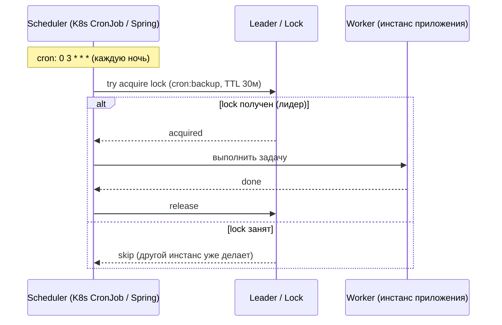
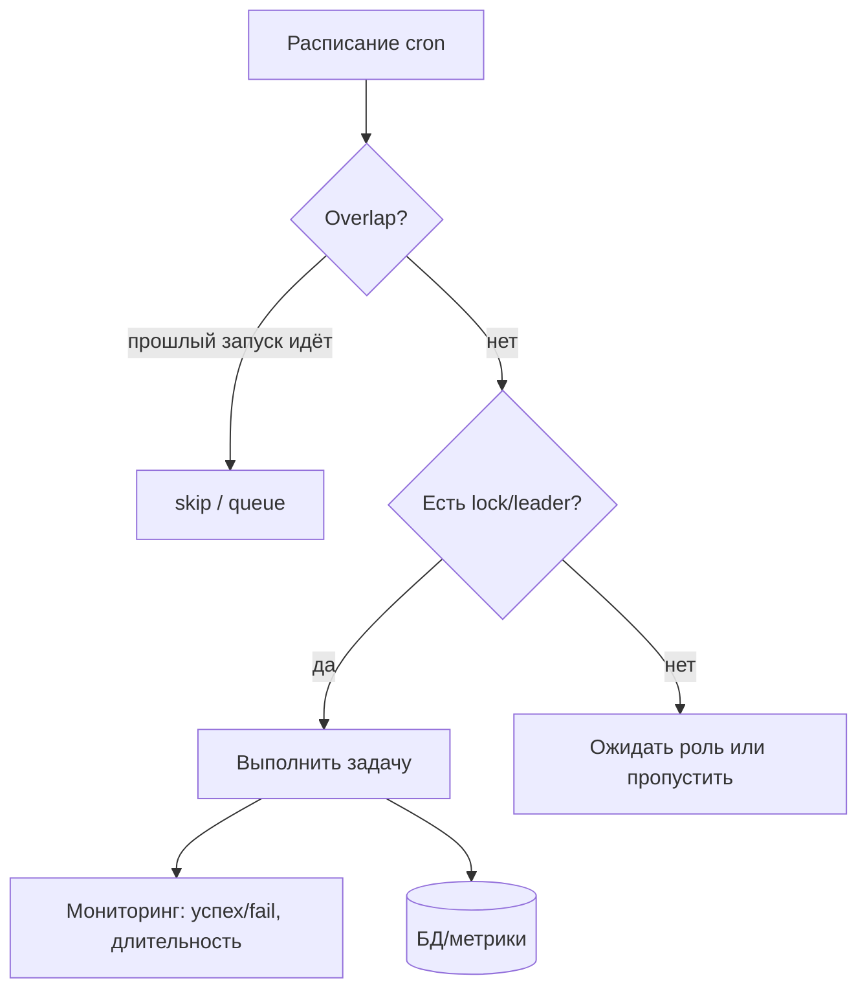

# Cron-задачи (Cron Jobs)

## Определение

**Cron Job (Cron-задача)** — запланированная фоновая задача, которая выполняется **по расписанию** (раз в минуту, час, день и т.д.). Синтаксис cron-выражения `min hour day month weekday` (`0 3 * * *` = каждую ночь в 3:00). В микросервисных системах cron часто превращается в **распределённую задачу**: несколько реплик приложения, но выполнить задачу должен **один** (через leader election / distributed lock), иначе дублирование.

## Зачем нужно

- **Периодическая работа** — бэкапы, отчёты, ротация логов, очистка данных (см. Backups).
- **Фоновые процессы** — ресолвенсер, почтовые рассылки по расписанию, синхронизация.
- **Согласованность в распределённом мире** — «собрать метрики за день», «почистить stale-записи».
- **Основа N-процессов** — многие async-сценарии запускаются по расписанию, а не событийно.
- **Устойчивые планы** — без service-специфичного sleep/таймеров; декларируется в конфиге.

## Как работает

Ключевые элементы:

- **Cron expression** — `* * * * *` (minute, hour, day-of-month, month, day-of-week): `0 2 * * 1` — в 2:00 по понедельникам.
- **Cron daemon / scheduler** — процесс, запускающий команды по расписанию (cron в Linux, Quartz, node-cron, Spring @Scheduled, K8s CronJob).
- **Catch-up / overlap** — что делать, если прошлый запуск ещё идёт (skip, queue, асинхронный).
- **Распределённое выполнение** — в кластере запустить только на одной ноде: через distributed lock / leader election (см. Distributed Locks, Leader Election).
- **Опоздание / пропуск** — cron не навёрстывает пропущенное (no catch-up), важно для точных расписаний (бэкап в 03:00).





## Примеры кода

> Практика: **cron с расписанием**, **синхронная настройка K8s KJob**, **реализация обёрток в Go/java**.

### TypeScript (node-cron)

```typescript
import cron from 'node-cron'

// каждую ночь в 03:00
cron.schedule('0 3 * * *', async () => {
  await backupDatabase()
}, { timezone: 'Europe/Moscow' })

// каждые 15 минут — очистка кэша
cron.schedule('*/15 * * * *', async () => {
  await purgeExpiredSessions()
})
```

### Go (robfig/cron)

```go
package main

import (
	"log"

	"github.com/robfig/cron/v3"
)

func main() {
	c := cron.New()

	// раз в час
	_, _ = c.AddFunc("@hourly", func() {
		log.Println("rotation start")
	})

	// каждые 12 часов отчет
	_, _ = c.AddFunc("0 0 */12 * * *", func() {
		generateReport()
	})

	c.Start()
	select {}
}
```

### Java (Spring: @Scheduled)

```java
// Spring: @Scheduled — расписание
@Component
public class ScheduledTasks {

    @Scheduled(cron = "0 30 2 * * *") // 02:30 каждый день
    public void nightBackup() {
        backupManager.run();
    }

    @Scheduled(fixedDelay = 300_000)   // каждые 5 минут после завершения прошлой
    public void purge() {
        cleanup.run();
    }
}
```

## Пример использования: интеграция

> Распределённые cron: **K8s CronJob**, **SingleFlight/DistributedLock**, **консистентность перезапуска**.

### Kubernetes (CronJob — распределённый cron без дублей)

```yaml
apiVersion: batch/v1
kind: CronJob
metadata:
  name: nightly-backup
spec:
  schedule: "0 3 * * *"     # в 03:00
  concurrencyPolicy: Forbid  # не запускать параллельно
  successfulJobsHistoryLimit: 3
  jobTemplate:
    spec:
      template:
        spec:
          restartPolicy: OnFailure
          containers:
            - name: backup
              image: my-app:latest
              command: ["/app/bin/backup"]
```

### Go (распределённая задача через Distributed Lock)

```go
package jobs

import (
	"context"
	"time"

	"github.com/go-redis/redis/v9"
)

// Только один инстанс кластера выполняет задачу (via Redis SET NX EX)
func runOnceEverywhere(ctx context.Context, rdb *redis.Client,
	jobName string, ttl time.Duration, fn func(ctx context.Context) error) error {
	ok, err := rdb.SetNX(ctx, "job:"+jobName, "1", ttl).Result()
	if err != nil {
		return err
	}
	if !ok {
		return nil // другой инстанс уже держит lock — пропускаем
	}
	defer rdb.Del(ctx, "job:"+jobName)
	return fn(ctx)
}

func nightly(ctx context.Context, rdb *redis.Client) {
	_ = runOnceEverywhere(ctx, rdb, "backup", 30*time.Minute, runBackup)
}
```

### Java (Spring Boot: Scheduled в многоподовом кластере)

```java
// ShedLock или Quartz cluster — исключить дубли @Scheduled между репликами
import net.javacrumbs.shedlock.spring.annotation.SchedulerLock;

@Scheduled(cron = "0 15 23 * * *")
@SchedulerLock(name = "nightlyPurge", lockAtMostFor = "PT30M", lockAtLeastFor = "PT5M")
public void purge() {
    // выполнится только на одном инстансе кластера (ShedLock + таблица lock)
    repository.purgeStale();
}
```

## Паттерны использования

- **Один лидер выполняет** — distributed lock / leader election, чтобы cron не дублировался на N репликах (см. Distributed Locks).
- **Idempotent работа задачи** — даже если запустилась дважды (retry), эффект один (см. Idempotency).
- **Мониторинг выполнения** — логи, метрики «успех/длительность», алерты на пропуск (см. Monitoring).
- **ConcurrencyPolicy** — «Forbid»/«Skip» при overlap — не запускать параллельно тяжёлые задачи.
- **Catch-up сознательно** — cron не догоняет пропущенное: если важно — отдельный реплей запуск.
- **Задачи по событиям, когда можно** — для асинхронных потоков лучше событие/очередь, cron — для точного расписания.
- **Отчёты/бэкапы в низкую нагрузку** — ночью (window) — минимум влияния на пользователей.

## Антипаттерны и ловушки

- **Cron на каждой реплике без lock** — бэкап запускается N раз дублируюсь.
- **Тяжёлая работа в основном потоке** — блокирует приложение (для кластеров, где cron в app).
- **Без мониторинга пропусков** — тихая потеря бэкапов/отчётов на месяцы.
- **Хардкод расписания в коде нескольких мест** — конфликтующие расписания; центрировать.
- **Overlap без политики** — прошлый запуск ещё идёт, новый стартовал → гонка.
- **Не учитывать timezone+dst** — «в 03:00» в три зоны/переход времени — неожиданные скачки.
- **Использовать cron для всех async** —event-driven проще и надёжнее для реактивных сценариев.

## Когда использовать / когда НЕ использовать

**Использовать:**
- Периодические операции с фиксированным временем (бэкап в 3:00, отчёт по понедельникам).
- Очистка данных, ротация логов, сбор статистики по расписанию.

**НЕ использовать (или с осторожностью):**
- Для реактивных процессов, лучше запускать по событию/очереди (меньше задержка, надёжнее).
- Когда запуск зависит от «когда готовы данные» — лучше отложенная обработка/очередь.

## Связанные темы

- **Message Queues** — дел异步-сценарии через очередь вместо/вместе с cron.
- **Event-Driven Architecture** — события вместо периодического опроса.
- **Leader Election / Distributed Locks** — как гарантировать единственный исполнитель.
- **Idempotency** — безопасность повторного запуска cron.
- **Backups / Disaster Recovery** — классический сценарий cron.
- **Monitoring / Alerts** — видимость выполнения и пропусков.

## Вопросы

### Q1
**Что означает cron-выражение `0 3 * * *`?**
- [ ] Каждые 3 минуты
- [ ] Каждый час в 3 минуты
- [x] Каждый день в 03:00
- [ ] Каждую 3-ю неделю

Пояснение: формат `minute hour day month weekday`: `0 3 * * *` — минута 0, час 3, любые день/месяц/неделя = ежедневно в 03:00.

### Q2
**Почему в микросервисах cron часто дублируется?**
- [ ] Из-за сети
- [x] Каждая реплика/под запускает расписание — задача выполняется N раз, если нет lock/лидера
- [ ] Из-за часовых поясов
- [ ] Из-за нехватки памяти

Пояснение: при нескольких инстансах приложения все выполняют @Scheduled; нужен distributed lock или leader election.

### Q3
**Что делает concurrencyPolicy: Forbid в Kubernetes CronJob?**
- [ ] Увеличивает реплики
- [ ] Отключает cron
- [x] Запрещает запуск новой задачи, пока прошлая ещё выполняется (защита от overlap)
- [ ] Шифрует задачи

Пояснение: Forbid/Replace управляют тем, что делать при наложении запусков; Forbid — не параллелить.

### Q4
**Почему cron не стоит использовать для «реактивных» процессов?**
- [ ] Потому что он быстрый
- [x] Реактивность требует мгновенной реакции (событие), cron добавляет задержку расписания и хрупкость
- [ ] Потому что он платный
- [ ] Он надёжнее событий

Пояснение: для «когда произошло» подходит событие/очередь; cron — для «в конкретное время», с задержкой.

### Q5
**Что важно проверить при распределённом cron с бэкапом?**
- [x] Что выполняет только один инстанс (lock/лидер), и мониторинг пропусков
- [ ] Скорость сети
- [ ] Размер сообщения
- [ ] Ничего

Пояснение: дубли бэкапов опасны; пропуск без мониторинга теряет данные. Lock + метрики/алерты обязательны.

## Источники

- Cron — man/расписание: https://man7.org/linux/man-pages/man5/crontab.5.html
- Kubernetes — CronJob: https://kubernetes.io/docs/concepts/workloads/controllers/cron-jobs/
- Spring — Scheduling Tasks (@Scheduled): https://docs.spring.io/spring-framework/reference/integration/scheduling.html
- ShedLock — распределённые lock для @Scheduled: https://github.com/lukas-krecan/ShedLock
- node-cron — npm: https://github.com/kelektiv/node-cron