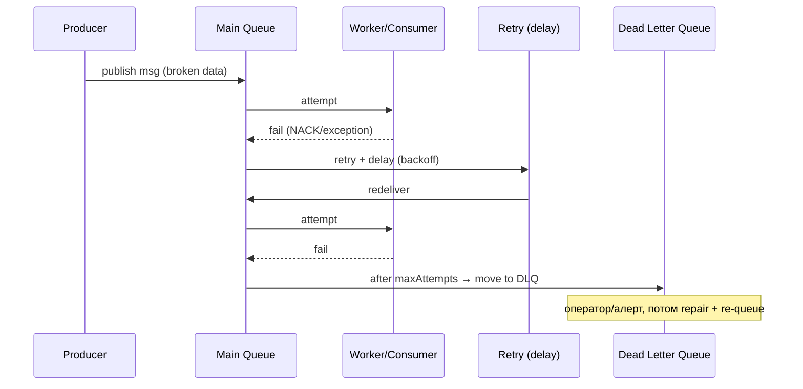
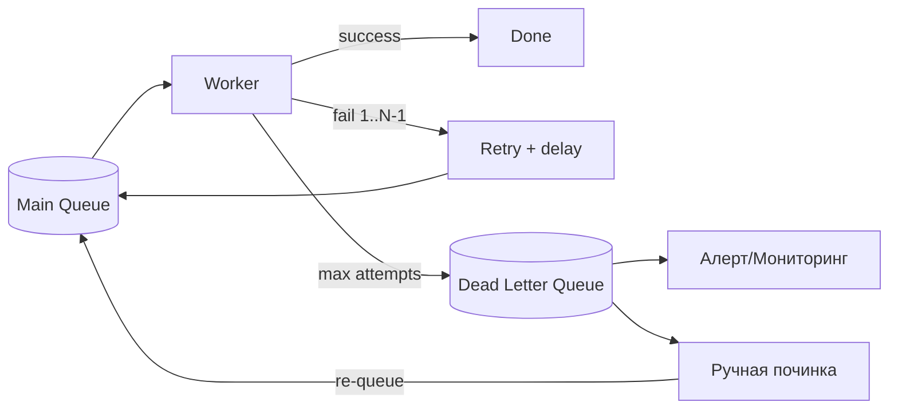

# Dead Letter Queues (Очереди недоставленных сообщений)

## Определение

**Dead Letter Queue (DLQ, очередь недоставленных/«мёртвых» сообщений)** — специальная очередь, в которую брокер (или обработчик) помещает сообщения, которые **не удалось обработать** после определённого числа попыток (ретраев). Такие сообщения выводятся из основного потока: они не блокируют обработку здоровых, но остаются доступными для анализа, починки и повторной отправки. DLQ — стандарт в RabbitMQ, AWS SQS, Azure Service Bus, Kafka (в SQS — dead-letter queue, в Kafka — DLQ-топик).

## Зачем нужно

- **Не блокировать поток** — одно «ядовитое» сообщение (poison message) не должно застрять в начале очереди навсегда.
- **Наблюдаемость и диагностика** — упавшие сообщения видны отдельно: почему упало, каково содержимое, когда случилось.
- **Контролируемые ретраи** — конечное число попыток + backoff, а не бесконечное кружение.
- **Починка и реплей** — оператор разбирает «мёртвые» сообщения, чинит, возвращает в основную очередь (или отбрасывает).
- **Аудит failures** — вечная история «не прошло» для анализа причин и метрик.

## Как работает

Типовой жизненный цикл:

1. Сообщение из основной очереди попадает в обработчик.
2. Обработчик бросает исключение/ошибку → брокер ретраит (N-попыток, обычно с `delay`/`backoff`).
3. После исчерпания попыток брокер перемещает сообщение в **DLQ** (не удаляет и не возвращает в бесконечность).
4. Оператор/автоматика читает DLQ: анализирует, чинит данные, re-queue (обратно в основную) либо гасит уведомлением.

Элементы:

- **Max attempts (maxDeliveryCount)** — «сколько раз доставлять до DLQ».
- **Redelivery policy** — как часто повторять (delay/backoff, см. Exponential Backoff).
- **Retry queue + DLQ** — path: main queue → retry (с задержкой) → DLQ.
- **Poison message** — сообщение, которое никогда не обработается (битый формат, некорректные данные).
- **Monitoring DLQ depth** — рост очереди «мёртвых» = алерт (см. Monitoring/Alerts).





## Примеры кода

> Практика: **настройка DLQ у брокера**, **обработчик с ретраями и переходом в DLQ**, **консюмер DLQ**.

### RabbitMQ (declaration: main queue + DLQ exchange)

```bash
# 1) DLX (dead letter exchange) + DLQ
declare queue orders.dlq durable=true

# 2) основная очередь со ссылкой на DLX и числом попыток
# (через x-dead-letter-exchange, x-dead-letter-routing-key)
declare queue orders
  durable=true
  arguments=x-dead-letter-exchange:dlx, x-message-ttl:30000, x-max-priority:...
```

```typescript
import amqp from 'amqplib'

async function setupDlq() {
  const conn = await amqp.connect('amqp://localhost')
  const ch = await conn.createChannel()

  // dead-letter exchange + очередь "мёртвых"
  await ch.assertExchange('dlx', 'direct', { durable: true })
  await ch.assertQueue('orders.dlq', { durable: true })
  await ch.bindQueue('orders.dlq', 'dlx', 'orders.failed')

  // основная очередь: после TTL/отказов → в dlx
  await ch.assertQueue('orders', {
    durable: true,
    arguments: {
      'x-dead-letter-exchange': 'dlx',
      'x-dead-letter-routing-key': 'orders.failed',
    },
  })
}
```

### Go (обработчик: N попыток, потом в DLQ через консьюмер)

```go
package worker

import amqp "github.com/rabbitmq/amqp091-go"

func consumeWithDlq(ch *amqp.Channel) error {
	msgs, err := ch.Consume("orders", "", false, false, false, false, nil)
	if err != nil {
		return err
	}

	for msg := range msgs {
		if err := process(msg); err != nil {
			// после maxAttempts → публикуем в DLQ и ack/признаём обработанным
			if msg.Redelivered && msg.MessageCount > maxAttempts { // пример
				ch.Publish("dlx", "orders.failed", false, false,
					amqp.Publishing{Body: msg.Body, DeliveryMode: amqp.Persistent})
				msg.Ack(false)
				continue
			}
			msg.Nack(false, !msg.Redelivered) // первый раз — requeue, потом — DLQ
			continue
		}
		msg.Ack(false)
	}
	return nil
}
```

### Java (Spring RabbitListener: retry → DLQ автоматически)

```yaml
spring:
  rabbitmq:
    listener:
      simple:
        retry:
          enabled: true
          max-attempts: 3
          initial-interval: 1s
          multiplier: 2        # экспоненциальный backoff
          max-interval: 60s
```

```java
import org.springframework.amqp.rabbit.annotation.RabbitListener;
import org.springframework.stereotype.Component;

@Component
public class OrderConsumer {

    @RabbitListener(queues = "orders")
    public void onOrder(OrderEvent order) {
        try {
            process(order);
        } catch (Exception e) {
            // retry исчерпан → Spring переносит в настроенный DLQ (orders.dlq)
            // через DeadLetterPublishingRecoverer
            throw new AmqpRejectAndDontRequeueException(e);
        }
    }
}
```

## Пример использования: интеграция

> Практика: **реальный консьюмер DLQ с пере-публикацией**, **мониторинг глубины DLQ**, **analyzer+repair+replay**.

### TypeScript (консьюмер DLQ: анализ + возврат в основную очередь)

```typescript
async function consumeDlq(ch: amqp.Channel) {
  await ch.consume('orders.dlq', async (msg) => {
    if (!msg) return
    const event = JSON.parse(msg.content.toString())

    if (isRepairable(event)) {
      await fixAndRequeue(ch, event)   // чиним и возвращаем в orders
      return ch.ack(msg)
    }

    await notifyOncall(event)          // не починить — алерт дежурному
    ch.ack(msg)                        // убрать из DLQ, оставив след в audit
  })
}

async function fixAndRequeue(ch: amqp.Channel, event: { orderId: string }) {
  ch.publish('', 'orders', Buffer.from(JSON.stringify({
    ...event, fixed: true   // помечаем починенное
  })), { persistent: true })
}
```

### Go (метрика глубины DLQ + алерт)

```go
package main

import (
	"log"
	"time"

	amqp "github.com/rabbitmq/amqp091-go"
)

func monitorDlq(ch *amqp.Channel) {
	for range time.Tick(30 * time.Second) {
		q, err := ch.QueueDeclarePassive("orders.dlq", true, false, false, false, nil)
		if err != nil {
			continue
		}
		// Глубина DLQ в метрики: dlq_depth{queue="orders"}  q.Messages
		log.Printf("orders.dlq depth=%d", q.Messages)
		if q.Messages > 100 {
			// тревога: много «мёртвых» — вероятно, баг в обработчике
			log.Printf("ALERT: DLQ depth high: %d", q.Messages)
		}
	}
}
```

### Java (Spring: DeadLetterPublishingRecoverer + listener DLQ)

```java
@Configuration
public class DlqConfig {

    @Bean
    public DeadLetterPublishingRecoverer dlqRecoverer(RabbitTemplate template) {
        // любой фатал после retry → публикуется в "orders.dlq"
        return new DeadLetterPublishingRecoverer(template,
            m -> new MessageProperties(), // routing по приложению
            (msg, props) -> new RoutingKey("orders.failed"));
    }

    @Bean
    public SimpleRabbitListenerContainerFactory rabbitListenerContainerFactory(
            ConnectionFactory cf, DeadLetterPublishingRecoverer recoverer) {
        SimpleRabbitListenerContainerFactory f = new SimpleRabbitListenerContainerFactory();
        f.setConnectionFactory(cf);
        f.setRetryTemplate(// retry: 3 попытки, backoff
            RetryInterceptorBuilder.stateless().maxAttempts(3)
                .recoverer(recoverer).build());
        return f;
    }
}
```

## Паттерны использования

- **Конечное число ретраев** — не бесконечный requeue; DLQ — место, где сообщение «останавливается».
- **Delay/backoff в ретраях** — экспоненциальный рост задержки, а не мгновенный повтор (см. Exponential Backoff).
- **Мониторинг и алерты** — глубина DLQ и её рост — первые сигналы проблем обработчика.
- **Repair + re-queue** — операционная практика: чиним данные и возвращаем «мёртвые» в поток.
- **Ack даже после DLQ** — обработчик подтверждает удаление и фиксирует данные в audit.
- **Отдельный DLQ-консьюмер** — не смешивать с основной логикой.

## Антипаттерны и ловушки

- **Бесконечный requeue без лимита** — ядовитое сообщение вечно занимает образованные воркер'ы и блокирует порядок.
- **Искать в DLQ неделями «вручную»** — без мониторинга глубины; нужно прийти как алерт.
- **DLQ без лимитов попыток** — настроен неверно: сообщения вообще не доходят до DLQ (вечный retry).
- **Игнорировать содержимое DLQ** — накопление без анализа скрывает реальный баг.
- **Простая пере-публикация без фикса данных** — сообщение вернётся и снова уйдёт в DLQ по кругу.
- **Не делать idempotency** — повторно обработать починенное — двойной эффект.

## Когда использовать / когда НЕ использовать

**Использовать:**
- Любые очереди/топики с обработчиками, где возможны постоянные ошибки (формат данных, external API).
- Системы, где важно не блокировать поток и сохранить «мёртвые» для диагностики.

**НЕ использовать (или с осторожностью):**
- Когда сообщения должны быть гарантированно обработаны с первой попытки (без ретраев) — DLQ бесполезен без ретраев.
- При очень низкой нагрузке и ручном мониторинге DLQ менее критична, но всё равно полезна.

## Связанные темы

- **Message Queues / Pub/Sub** — где DLQ живут (брокер).
- **Retries / Exponential Backoff** — как управлять повторами до DLQ.
- **Idempotency** — обработка повторных сообщений без побочных эффектов.
- **Monitoring / Alerts** — следить за глубиной DLQ.
- **Saga Pattern** — в сагах DLQ для «неотменяемых» шагов.

## Вопросы

### Q1
**Что такое dead letter queue?**
- [ ] Быстрый кэш
- [x] Очередь для сообщений, которые не удалось обработать после исчерпания попыток
- [ ] Очередь приоритетов
- [ ] Уровень ОС

Пояснение: DLQ — куда сообщение уходит по истечении maxAttempts/retries, чтобы не блокировать поток.

### Q2
**Почему poison message — проблема?**
- [ ] Он быстрый
- [x] Он никогда не обработается и при безлимитном requeue блокирует порядок и воркеров
- [ ] Он ломает шифрование
- [ ] Он безвреден

Пояснение: если битое сообщение удерживает голову очереди — здоровые за ним ждут; DLQ решает.

### Q3
**Что определяет «max attempts» / redelivery?**
- [ ] Скорость брокера
- [x] Сколько раз доставлять сообщение до перемещения в DLQ
- [ ] Размер сообщения
- [ ] Количество брокеров

Пояснение: лимит попыток + задержка — конечные ретраи, после которых — DLQ.

### Q4
**Что делает оператор с сообщением в DLQ?**
- [ ] Удаляет без следов
- [ ] Игнорирует
- [x] Анализирует, чинит данные и возвращает (re-queue) или гасит с фиксацией
- [ ] Шифрует его

Пояснение: DLQ живёт для диагностики: repair + реплей, либо осознанный отказ с audit-следом.

### Q5
**Как сигнализирует о проблемах глубина DLQ?**
- [ ] Ускоряет трафик
- [ ] Сжимает данные
- [x] Рост «мёртвых» — индикатор бага обработчика/формата; алерт при росте
- [ ] Никак

Пояснение: метрика dlq_depth и её рост — ранний сигнал сбоя обработчика данных.

## Источники

- RabbitMQ — Dead Letter Exchanges: https://www.rabbitmq.com/docs/dlx
- AWS SQS — Dead-letter queues: https://docs.aws.amazon.com/AWSSimpleQueueService/latest/SQSDeveloperGuide/sqs-dead-letter-queues.html
- Azure Service Bus — Dead-letter: https://learn.microsoft.com/en-us/azure/service-bus-messaging/service-bus-dead-letter-queues
- Spring AMQP — Retry and DLQ: https://docs.spring.io/spring-amqp/docs/current/reference/html/#async-annotated-messaging
- Martin Fowler — Poison message patterns