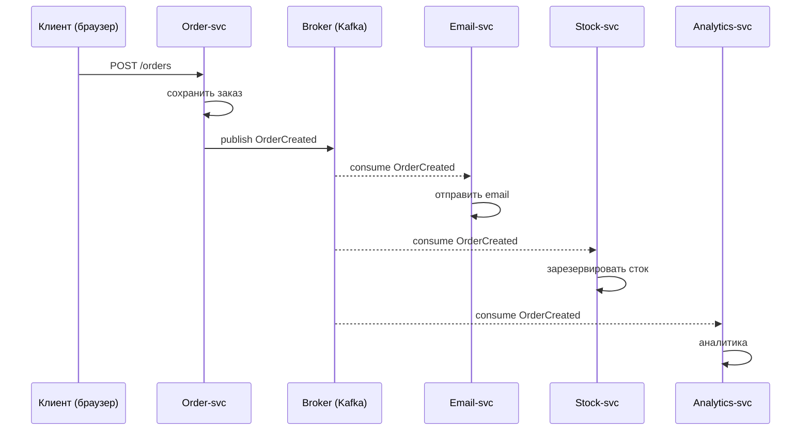
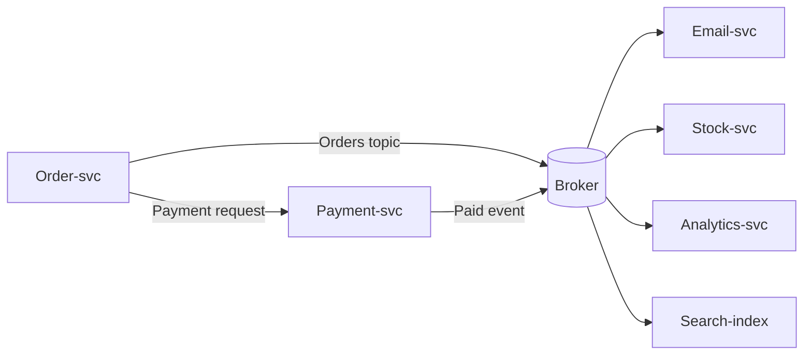

# Событийная архитектура (Event-Driven Architecture)

## Определение

**Event-Driven Architecture (Событийная архитектура, EDA)** — стиль построения систем, в котором сервисы общаются **асинхронно через события**: одно действие порождает событие (`order.created`), которое транслируется, а остальные компоненты **реагируют** на него — без прямых синхронных вызовов. События становятся фактами произошедшего и распространяются по всей топологии через брокер (Kafka, RabbitMQ, NATS).

## Зачем нужно

- **Слабая связность** — сервисы не зависят от других в момент вызова: всё через события.
- **Масштабирование и устойчивость** — потребители независимы, каждый масштабируется и падает сам по себе.
- **Отражает реальные бизнес-процессы** — «заказ создан», «оплата получена» — события как факты.
- **Историчность и replay** — храня события, можно перевоспроизвести состояние (event sourcing).
- **Асинхронная доставка множеству потребителей** — аналитика, уведомления, поиск, кэши.

## Как работает

Основные элементы:

- **Event (событие)** — факт, произошедший в прошлом: `OrderCreated`, `PaymentSucceeded`. Не команда.
- **Producer / Source** — компонент, порождающий событие (не знает о потребителях).
- **Broker / Bus** — транспорт: Kafka, RabbitMQ, AWS EventBridge, NATS (см. Pub/Sub).
- **Consumer / Subscriber** — реагирует на событие, обычно идемпотентно.
- **Event sourcing** — вместо хранения только текущего состояния хранить последовательность событий и реплеить их.
- **CQRS** — разделение чтения/записи, когда события питают проекции чтения.
- **Transactional Outbox** — для надёжности: публикация событий атомарно с данными.

Ключевой приём — **каждый сервис владеет данными, а изменения выражаются событиями**:





## Примеры кода

> Сценарии: **публикация событий из сервиса**, **подписчик с обработкой**, **event-модель на Spring/Kafka**.

### TypeScript (агрегат порождает события)

```typescript
type DomainEvent = { type: string; id: string; at: Date }

export class Order {
  events: DomainEvent[] = []

  constructor(public id: string, private status: string) {}

  create() {
    this.status = 'created'
    this.events.push({ type: 'order.created', id: this.id, at: new Date() })
  }

  pay() {
    this.status = 'paid'
    this.events.push({ type: 'order.paid', id: this.id, at: new Date() })
  }

  collectEvents(): DomainEvent[] {
    const out = this.events
    this.events = []
    return out // после save персистим и публикуем
  }
}
```

### Go (продюсер: save + publish через outbox)

```go
package order

import (
	"context"
	"database/sql"
	"encoding/json"
)

type Event struct {
	Type string `json:"type"`
	ID   string `json:"id"`
}

// Атомарно: пишем состояние и событие (Transactional Outbox)
func Create(ctx context.Context, db *sql.DB, broker Publisher, id string) error {
	tx, err := db.BeginTx(ctx, nil)
	if err != nil {
		return err
	}
	defer tx.Rollback()

	if _, err := tx.ExecContext(ctx,
		`INSERT INTO orders (id, status) VALUES ($1, 'created')`, id); err != nil {
		return err
	}
	ev, _ := json.Marshal(Event{Type: "order.created", ID: id})
	if _, err := tx.ExecContext(ctx,
		`INSERT INTO outbox (aggregate, payload) VALUES ($1, $2)`, id, ev); err != nil {
		return err
	}
	if err := tx.Commit(); err != nil {
		return err
	}
	return broker.Publish(ctx, Event{Type: "order.created", ID: id})
}

type Publisher interface {
	Publish(ctx context.Context, e Event) error
}
```

### Java (Spring + Kafka: событийный обработчик с идемпотентностью)

```java
import org.springframework.context.event.EventListener;
import org.springframework.kafka.annotation.KafkaListener;
import org.springframework.stereotype.Service;

@Service
public class OrderProjector {

    // Kafka listener: реагируем на событие из другого сервиса
    @KafkaListener(topics = "order.created", groupId = "order-projector")
    public void onOrderCreated(String orderId) {
        // идемпотентное обновление проекции чтения
        upsertIntoReadModel(orderId);
    }

    // локальное событие (Spring) внутри приложения
    @EventListener
    public void localEvent(OrderCreated order) {
        notifyMonitoring(order.id());
    }
}
```

## Пример использования: интеграция

> Оркестрация событий: **проекции чтения (CQRS)**, **компенсация через события** (saga), **подписка на несколько топиков**.

### TypeScript (проекция чтения заказа из событий)

```typescript
async function projectOrder(db: OrderReadStore, event: DomainEvent) {
  // реплеим события в состояние чтения (CQRS read model)
  await db.apply(event.type, event.id, {
    order: await fetchOrderFor(event.id),
  })
}
```

### Go (компенсирующие события саги через топик)

```go
// сервис inventory реагирует на order.created → резервирует сток,
// затем публикует order.stock.reserved; если стока нет — order.stock.failed,
// на который order-svc отвечает setStatus("failed") и компенсацией.
func (s *Service) onOrderCreated(ctx context.Context) {
	event := s.nextEvent(ctx) // order.created
	qty := s.reserve(event.OrderID)
	if qty == 0 {
		// публикуем компенсирующее событие
		s.publish(ctx, Event{Type: "order.stock.failed", ID: event.OrderID})
	} else {
		s.publish(ctx, Event{Type: "order.stock.reserved", ID: event.OrderID})
	}
}
```

### Java (проекция чтения с подпиской нескольких топиков)

```java
@Service
public class OrderHistoryProjection {

    // из событий собираем полную историю заказа в read-model
    @KafkaListener(topics = {"order.created", "order.paid", "order.shipped"})
    public void consume(String body) {
        OrderEvent ev = parse(body);
        historyTable.upsert(ev.orderId(), ev.type(), ev.at());
    }
}
```

## Паттерны использования

- **Транзакционный outbox** — события публикуются атомарно с изменением состояния (никогда не потеряны).
- **Идемпотентные потребители** — повторные события не дают двойного эффекта.
- **Версионирование событий** — `order.created.v2` при изменении контракта (см. API Versioning).
- **Event sourcing** — для важной истории, с планом миграций.
- **CQRS** — чтение через проекции событий, запись через агрегаты.
- **Replay** — новые сервисы читают историю топиков (Kafka retention).
- **Мониторинг потоков** — распределённая трассировка и метрики событий (см. Observability).

## Антипаттерны и ловушки

- **События как команды** — «делай X» с ожиданием ответа — это не событие, а вызов.
- **Расчёт на глобальный порядок** — в EDA его нет, проектировать stateless-обработчики.
- **Пропуск событий** — без outbox/retention гарантии «событие существует» нет.
- **Идемпотентность не реализована** — повторные обработки портят данные.
- **Один топик «все события»** — невозможно узко подписываться и инстструментировать.
- **Нет схемы событий (schema registry)** — ломаются консьюмеры, провал версионирования.

## Когда использовать / когда НЕ использовать

**Использовать:**
- Микросервисы, которые независимо масштабируются и требуют слабой связности.
- Процессы с фоновыми подписчиками (email, аналитика, индексация).
- Долгие бизнес-процессы/саги.

**НЕ использовать (или с осторожностью):**
- Для простых синхронных запросов — HTTP проще и даёт прямой ответ.
- Когда потребность в ACID и жёсткой согласованности → проще синхронная связь.
- Когда команда не выстроила мониторинг потоков — высокий порог наблюдаемости.

## Связанные темы

- **Pub/Sub / Message Queues** — механизмы обмена сообщениями.
- **Saga Pattern** — компенсации через события (event-driven saga).
- **CQRS / Event Sourcing** — проекции чтения и история из событий.
- **Outbox Pattern** — атомарная публикация событий.
- **Dead Letter Queues** — обработка «необрабатываемых» событий.
- **Observability / Distributed Tracing** — видимость потоков событий.

## Вопросы

### Q1
**Что означает «событие» в EDA?**
- [ ] Команда на выполнение
- [x] Факт, который уже произошёл (OrderCreated, PaymentSucceeded), распространяемый по системе
- [ ] HTTP-запрос
- [ ] Очередь задач

Пояснение: событие — факт прошлого, транслируется через брокер; потребители реагируют.

### Q2
**Каков ключевой выигрыш event-driven архитектуры?**
- [ ] Ускорение синхронных вызовов
- [x] Слабая связность сервисов, независимое масштабирование, реактивные подписчики
- [ ] Меньше микросервисов
- [ ] Гарантия порядка

Пояснение: сервисы общаются событиями, не вызывают друг друга синхронно — связность низкая.

### Q3
**Почему события должны публиковаться атомарно с данными (outbox)?**
- [ ] Для красоты
- [x] Иначе БД обновится, а событие потеряется (или наоборот) — система рассинхронизируется
- [ ] Для сжатия
- [ ] Только для Kafka

Пояснение: Transactional Outbox гарантирует «состояние записано» ⟺ «событие опубликовано» при сбое.

### Q4
**Что такое event sourcing?**
- [ ] Способ шифрования
- [x] Хранить последовательность событий и пере-материализовывать состояние из них
- [ ] База данных событий вместо состояния
- [ ] Аналог кэша

Пояснение: event sourcing: состояние — производная от истории событий (replay).

### Q5
**Почему «событие как команда» — антипаттерн?**
- [ ] Это быстрее
- [ ] Это надёжнее
- [x] Команда требует ответа и знает потребителя — это не событие, а синхронный вызов
- [ ] Нет антипаттерна

Пояснение: событие — прошлый факт; команда — запрос на действие с ожиданием результата (прямой вызов).

## Источники

- Martin Fowler — Event-Driven Architecture: https://martinfowler.com/articles/201701-event-driven.html
- Microsoft — Event-driven architectures: https://learn.microsoft.com/en-us/azure/architecture/guide/architecture-styles/event-driven
- Confluent — Event-Driven Architecture (Kafka): https://www.confluent.io/learn/event-driven-architecture/
- Chris Richardson — Event Sourcing and CQRS: https://microservices.io/patterns/data/event-sourcing.html
- AWS — Event-Driven Architecture: https://aws.amazon.com/event-driven-architecture/