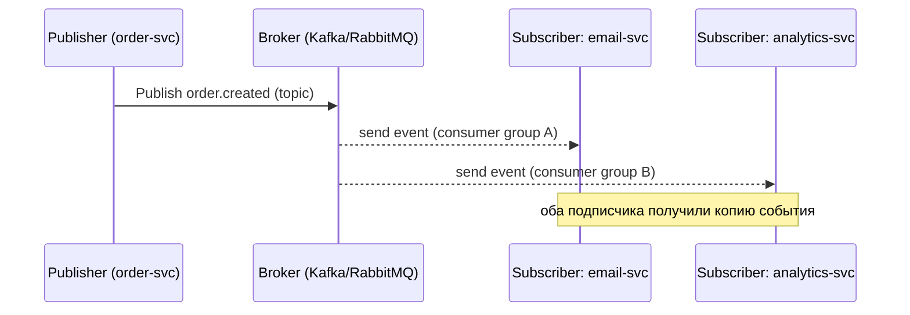
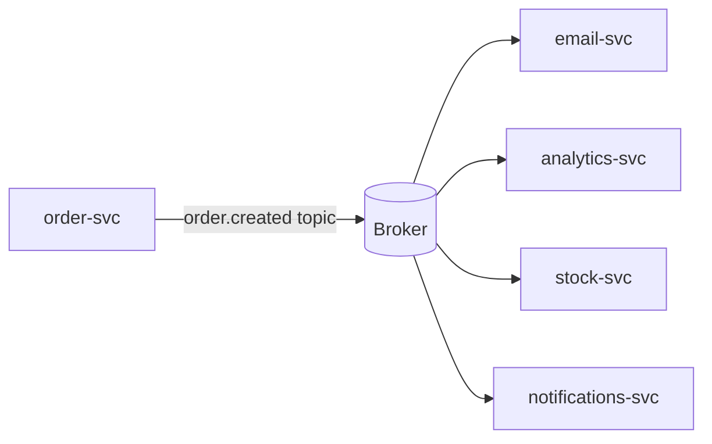

# Pub/Sub (Издатель-подписчик)

## Определение

**Pub/Sub (Publish/Subscribe, Издатель-подписчик)** — паттерн асинхронной передачи сообщений: **издатель (publisher)** публикует событие в **топик (topic)**, а **подписчики (subscribers)** получают все копии, подписавшись на этот топик. В отличие от очереди (где сообщение получает один консьюмер), здесь сообщение **доставляется всем подписчикам** — разным сервисам/приложениям. Реализации: Kafka, RabbitMQ (topics/fanout), Google Pub/Sub, SNS, NATS, Redis Pub/Sub.

## Зачем нужно

- **Один источник события → много потребителей** — заказ создан: почта + аналитика + склад + уведомления подписываются на `order.created`.
- **Слабое связывание** — издатель не знает подписчиков: добавился новый подписчик — ничего не меняем у издателя.
- **Распространение событий по системе** — event-driven системы, микросервисы общаются событиями (см. Event-Driven Architecture).
- **Фильтрация/маршрутизация** — подписчик может подписаться с фильтром (Kafka: конкретные ключи/топики; Google Pub/Sub: фильтры).
- **Временная независимость** — публикация идёт, даже если подписчика сейчас нет (брокер хранит/догоняет).

## Как работает

Ключевые элементы:

- **Topic (топик)** — именованный канал событий: `order.created`, `user.updated`. Издатель пишет в топик.
- **Subscription (подписка)** — связка «топик → группа подписчиков»: каждый подписчик получает копию события.
- **Broker** — хранит топик, распределяет сообщения подписчикам (Kafka — партициями, RabbitMQ — exchanges).
- **Fan-out (веерная рассылка)** — RabbitMQ fanout/topic: одному топику=несколько консьюмеров/групп.
- **Consumer group (группа потребителей)** — Kafka: несколько воркеров одной группы делят партиции (аналог конкуренции), а разные группы = разные подписчики получают все сообщения.
- **Delivery guarantee** — at-least-once/at-most-once/effect-safe (см. Message Queues / Idempotency).
- **Ordering** — Kafka: порядок в пределах партиции; RabbitMQ: в пределах топика при одном консьюмере.





## Примеры кода

> Практика: **публикация в топик**, **подписка (fanout/группа)**, **обмен через exchanges у RabbitMQ**.

### TypeScript (amqplib: publish/exchange fanout + subscribe)

```typescript
import amqp from 'amqplib'

const EXCHANGE = 'order.events'

async function publishOrderCreated(orderId: string) {
  const conn = await amqp.connect('amqp://localhost')
  const ch = await conn.createChannel()

  await ch.assertExchange(EXCHANGE, 'fanout', { durable: true })
  ch.publish(EXCHANGE, '', Buffer.from(JSON.stringify({
    type: 'order.created', orderId,
  }))) // fanout: всем подписчикам топика
}

async function subscribe(onOrder: (orderId: string) => Promise<void>) {
  const conn = await amqp.connect('amqp://localhost')
  const ch = await conn.createChannel()
  await ch.assertExchange(EXCHANGE, 'fanout', { durable: true })

  const { queue } = await ch.assertQueue('', { exclusive: true }) // свой queue каждому подписчику
  await ch.bindQueue(queue, EXCHANGE, '')
  ch.consume(queue, async (msg) => {
    if (!msg) return
    const { orderId } = JSON.parse(msg.content.toString())
    await onOrder(orderId)
    ch.ack(msg)
  })
}
```

### Go (Kafka via segmentio/kafka-go: consume topic)

```go
package main

import (
	"context"
	"log"

	"github.com/segmentio/kafka-go"
)

func subscribe(ctx context.Context, topic, group string) {
	r := kafka.NewReader(kafka.ReaderConfig{
		Brokers:     []string{"localhost:9092"},
		Topic:       topic,          // order.created
		GroupID:     group,          // каждая группа получает ВСЕ сообщения
		MinBytes:    10e3,
		MaxBytes:    10e6,
	})

	for {
		m, err := r.ReadMessage(ctx)
		if err != nil {
			log.Fatal(err)
		}
		log.Printf("msg: %s offset=%d", m.Value, m.Offset)
		// процесс + при необходимости MarkMessage (autocommit per group)
	}
}

// Публикация в топик:
func publish(ctx context.Context, topic string, value []byte) error {
	w := &kafka.Writer{
		Addr:  kafka.TCP("localhost:9092"),
		Topic: topic,
	}
	defer w.Close()
	return w.WriteMessages(ctx, kafka.Message{Value: value})
}
```

### Java (Spring Kafka: listener + producer)

```java
import org.springframework.kafka.annotation.KafkaListener;
import org.springframework.kafka.core.KafkaTemplate;
import org.springframework.stereotype.Service;

@Service
public class OrderEvents {

    private final KafkaTemplate<String, String> kafka;

    public OrderEvents(KafkaTemplate<String, String> kafka) {
        this.kafka = kafka;
    }

    public void orderCreated(String orderId) {
        kafka.send("order.created", orderId); // публикация в топик
    }

    @KafkaListener(topics = "order.created", groupId = "email-service")
    public void onOrderCreated(String orderId) {
        sendEmail(orderId); // получает это сообщение только "email" group
    }

    @KafkaListener(topics = "order.created", groupId = "analytics")
    public void onOrderAnalytics(String orderId) {
        trackAnalytics(orderId); // отдельная группа → тоже получает копию
    }
}
```

## Пример использования: интеграция

> Integration: **fanout нескольких групп**, **client-side подписка с ретраями**, **retention/ordering**.

### Spring Kafka (несколько групп на одном топике — деливера по назначению)

```java
@Service
public class MultiGroupSubscriber {

    // Группа A: email — получает все order.created
    @KafkaListener(topics = "order.created", groupId = "email")
    public void email(String orderId) { /* ... */ }

    // Группа B: stock — тоже получает все
    @KafkaListener(topics = "order.created", groupId = "stock")
    public void stock(String orderId) { /* ... */ }

    // Группа C (partitioned): 2 воркера делят партиции (конкуренция)
    @KafkaListener(topics = "order.created", groupId = "workers",
                   concurrency = "2")
    public void concurrentWorkers(String orderId) { /* ... */ }
}
```

### TypeScript (подписка с ретраями и DLQ)

```typescript
async function safeSubscribe(deps: Deps) {
  const { ch, EXCHANGE } = deps
  const { queue } = await ch.assertQueue('notifications', { durable: true, })
  await ch.bindQueue(queue, EXCHANGE, '')

  ch.consume(queue, async (msg) => {
    if (!msg) return
    const event = JSON.parse(msg.content.toString())

    for (let attempt = 0; attempt < 3; attempt++) {
      try {
        await handleEvent(event)
        return ch.ack(msg)
      } catch (err) {
        if (attempt === 2) await sendToDlq(deps, event) // после 3 попыток — DLQ
      }
    }
  })
}
```

### Go (Kafka: ручная метка offset — контроль над ретраем)

```go
func withManualCommit(ctx context.Context, r *kafka.Reader, handler func(kafka.Message) error) error {
	for {
		m, err := r.FetchMessage(ctx)
		if err != nil {
			return err
		}
		// Обработка и ТОЛЬКО после успеха фиксируем offset вручную
		if err := handler(m); err != nil {
			continue // не коммитим: сообщение переподпишется
		}
		if err := r.CommitMessages(ctx, m); err != nil {
			return err
		}
	}
}
```

## Паттерны использования

- **Fan-out по группам** — каждая группа (email/analytics/stock) — свой подписчик с копией событий.
- **События версионировать** — `order.created.v2` в имени топика/типа для обратной совместимости (см. API Versioning).
- **Идемпотентные подписчики** — at-least-once доставка → дубликатов не бояться.
- **Outbox + Pub/Sub** — события публикуются атомарно с данными (см. Distributed Transactions/Outbox).
- **Retention политика** — Kafka хранит сообщения N дней: новые подписчики могут читать историю, реплеить.
- **Мониторинг lag** — отставание подписчика от брокера — сигнал к масштабированию группы.

## Антипаттерны и ловушки

- **Использовать Pub/Sub как очередь** — если нужен один консьюмер, а не все — это message queue, не топик.
- **Слишком общие топики** — «все события всего» → шум, слабая наблюдаемость, сложный контракт.
- **Не идемпотентные обработчики** — повторная доставка двойных эффектов в каждом подписчике.
- **Нет версионирования событий** — upgrade подписчика ломает контракт всем остальным.
- **Огромный backlog** — подписчик отстаёт, топик без retention → сообщения теряются.
- **Порядок сообщений не гарантирован** — если критичен — ограничение на партицию/один консьюмер.

## Когда использовать / когда НЕ использовать

**Использовать:**
- События, которые потребляются несколькими разделами системы одновременно.
- Event-driven системы, децентрализованные сторочные процессы (аналитика, нотификации, поиск).
- Интеграция сервисов без прямых вызовов (уведомления, репликация, аудит).

**НЕ использовать (или с осторожностью):**
- «Один обработчик на сообщение» — тогда проще очередь (см. Message Queues).
- Очень низкий лоад и малые события — overhead брокера не оправдан.
- Строгие глобальные порядок и синхронный ответ — это не для Pub/Sub.

## Связанные темы

- **Message Queues** — «один на один» варимент; Pub/Sub — «один на многих».
- **Event-Driven Architecture** — стратегия построения систем на событиях.
- **Webhooks** — HTTP-аналог «подписки» на стороне потребителя.
- **Server-Sent Events / WebSockets** — доставка событий в реальном времени клиентам.
- **Dead Letter Queues** — обработка неисправимых сообщений топика.
- **Idempotency** — надёжность подписчиков.

## Вопросы

### Q1
**Что принципиально отличает Pub/Sub от очереди?**
- [ ] Скорость брокера
- [x] В Pub/Sub сообщение получают ВСЕ подписчики, в очереди — один консьюмер
- [ ] Размер сообщений
- [ ] Ничего: это синонимы

Пояснение: очередь — FIFO с «одним победителем»; Pub/Sub — веерная доставка всем подпискам/группам.

### Q2
**Зачем в Kafka consumer group?**
- [x] Группа воркеров делит партиции (конкуренция); разные группы — независимые подписчики (все получают)
- [ ] Для хранения метаданных
- [ ] Это переименование очереди
- [ ] Только для аналитики

Пояснение: группа — доля сообщений; несколько групп по одному топику = разные подписчики каждый со своей копией.

### Q3
**Какая стратегия сегментирует граф событий системы?**
- [ ] Очередь жёстко
- [x] Топик + подписки по доменам (почта/аналитика/склад)
- [ ] Только вызов по HTTP
- [ ] База событий

Пояснение: топики и подписчики по доменам — способ сегментировать события по потребителям.

### Q4
**Когда Pub/Sub — неверный выбор?**
- [ ] При многих подписчиках
- [ ] При событийной архитектуре
- [x] Когда обработчик должен быть ровно один (это очередь)
- [ ] При логическом развязывании

Пояснение: если событие нужно одному обработчику, веерная рассылка избыточна — нужна очередь.

### Q5
**Как бороться с повторной доставкой в Pub/Sub?**
- [ ] Удалить брокера
- [x] Идемпотентные обработчики (проверка дубликатов, уникальные ключи)
- [ ] Отключить retention
- [ ] Использовать только вебхуки

Пояснение: Pub/Sub при at-least-once доставляет повторы; консьюмер обязан быть идемпотентным.

## Источники

- Kafka — официальная документация: https://kafka.apache.org/documentation/
- RabbitMQ — Tutorial (Pub/Sub via exchanges): https://www.rabbitmq.com/tutorials/tutorial-three-java.html
- Google Cloud Pub/Sub — документация: https://cloud.google.com/pubsub/docs/overview
- AWS SNS — про Pub/Sub недвижимость: https://docs.aws.amazon.com/sns/latest/dg/sns-mobile-application-as-subscriber.html
- Martеin Fowler — Event-Driven Architecture (основа Pub/Sub): https://martinfowler.com/articles/201701-event-driven.html