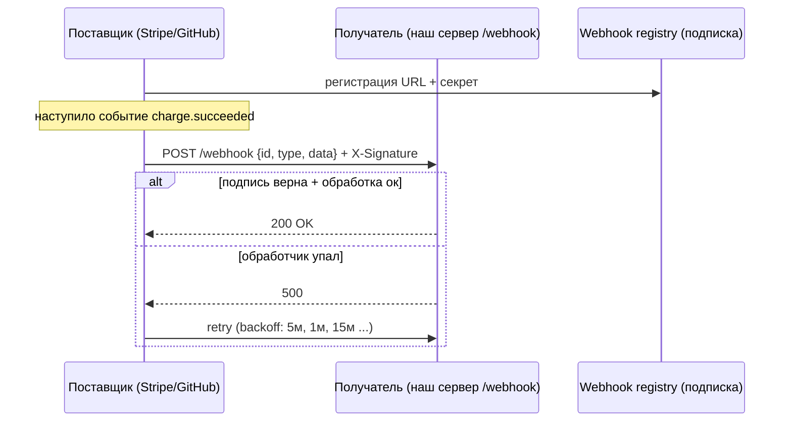
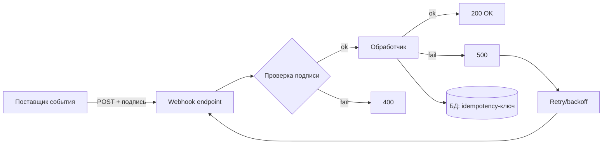

# Webhooks (Вебхуки)

## Определение

**Webhook (Вебхук)** — механизм асинхронного уведомления: когда в системе происходит событие, она **сама делает HTTP-запрос** (обычно POST) на заранее зарегистрированный URL получателя. В отличие от API (где получатель опрашивает), вебхук — «обратный вызов»: поставщик доставляет событие потребителю по **push**-модели через обычный HTTP. Примеры: GitHub (события репо), Stripe (события платежей), платежные шлюзы, CI.

## Зачем нужно

- **Push вместо polling** — потребитель получает событие моментально, без периодических запросов (экономия ресурсов, меньше latency).
- **Реакция на чужие события** — интегрируемся с внешними системами: точно знаем «что случилось», не опрашивая API.
- **Асинхронность** — поставщик не ждёт ответа бизнес-логики потребителя.
- **Событийная интеграция без брокера** — прямое HTTP-уведомление, не нужен общий Message Bus.
- **Простота инфраструктуры** — получатель — это обычный HTTP endpoint (публичный).

## Как работает

**Получатель** регистрирует URL (вебхук-endpoint) у поставщика. При наступлении события поставщик формирует **payload** (JSON события) и делает POST на URL. Надёжность строится на:

- **Ретраи** — при неудачной доставке (5xx/таймаут, не 2xx-ответ) поставщик повторяет с экспоненциальным backoff (обычно N раз, см. Exponential Backoff).
- **Подпись (signature)** — поставщик подписывает payload секретом (HMAC-SHA256); получатель проверяет, что запрос реально от поставщика (см. Secret Management).
- **Идемпотентность** — повторная доставка должна быть безопасна: получатель обрабатывает один раз по id события (см. Idempotency).
- **Версионирование событий** — типы/форматы событий версионируются (см. API Versioning).
- **endpoint отказ** — постоянный отказ → поставщик «отключает» вебхук (disabled), нужен мониторинг.





## Примеры кода

> Практика: **приём вебхука с проверкой подписи**, **идемпотентная обработка**, **регистрация и доставка**.

### TypeScript (Express: webhook с HMAC-подписью)

```typescript
import express, { Request, Response } from 'express'
import crypto from 'node:crypto'

const app = express()
app.use(express.raw({ type: '*/*' })) // сырое тело для проверки подписи

const WEBHOOK_SECRET = process.env.STRIPE_WEBHOOK_SECRET!

app.post('/webhook', (req: Request, res: Response) => {
  const signature = req.header('stripe-signature')
  const payload = (req.body as Buffer).toString('utf8')

  // HMAC-SHA256: t=...,v1=...
  const expected = crypto
    .createHmac('sha256', WEBHOOK_SECRET)
    .update(payload)
    .digest('hex')

  if (!signature?.includes(expected)) {
    return res.status(400).json({ error: 'bad signature' })
  }

  const event = JSON.parse(payload)

  // идемпотентность по event.id
  if (seenEvents.has(event.id)) return res.sendStatus(200)
  seenEvents.add(event.id)

  handleEvent(event)          // асинхронная обработка
  res.sendStatus(200)
})
```

### Go (приём webhook с проверкой подписи и retry-ответом)

```go
package main

import (
	"crypto/hmac"
	"crypto/sha256"
	"encoding/hex"
	"io"
	"log"
	"net/http"
)

var secret = []byte("webhook-secret")

func webhookHandler(w http.ResponseWriter, r *http.Request) {
	body, _ := io.ReadAll(r.Body)
	mac := hmac.New(sha256.New, secret)
	mac.Write(body)
	sign := hex.EncodeToString(mac.Sum(nil))

	if !hmac.Equal([]byte(sign), []byte(r.Header.Get("X-Signature"))) {
		http.Error(w, "bad signature", http.StatusBadRequest)
		return
	}

	// обработали; иначе вернём 5xx и поставщик повторит (retry+backoff)
	if err := handle(body); err != nil {
		http.Error(w, "failed", http.StatusInternalServerError)
		return
	}
	w.WriteHeader(http.StatusOK)
}

func main() {
	http.HandleFunc("/webhook", webhookHandler)
	log.Fatal(http.ListenAndServe(":8080", nil))
}
```

### Java (Spring: обработчик вебхука с идемпотентностью)

```java
import org.springframework.web.bind.annotation.*;

@RestController
public class WebhookController {

    private final WebhookService service;

    @PostMapping("/webhook")
    public ResponseEntity<?> receive(@RequestBody String payload,
                                     @RequestHeader("X-Hub-Signature-256") String signature) {
        if (!service.verifySignature(payload, signature)) {
            return ResponseEntity.status(401).body("invalid signature");
        }

        // идемпотентность: повторные события возвращают 200 без эффекта
        boolean duplicated = service.isAlreadyProcessed(payload);
        if (!duplicated) {
            service.handle(payload);
        }
        return ResponseEntity.ok().build();
    }
}
```

## Пример использования: интеграция

> Практика: **регистрация вебхука у поставщика**, **endpoint с per-event обработкой + dlq**, **мониторинг доставки**.

### Stripe/типовые: как настроить вебхук

```bash
# зарегистрировать endpoint у поставщика (пример Stripe CLI локально)
stripe listen --forward-to localhost:8080/webhook
# или веб-панель: Settings → Webhooks → Add endpoint → URL + типы событий
```

```typescript
// payload: Stripe event
// { id: "evt_...", type: "charge.succeeded", data: { object: { amount, currency } } }
```

### Go (обработчик с персистентным idempotency-ключом)

```go
func handleWebhook(w http.ResponseWriter, r *http.Request, db *sql.DB) {
	// ev.id — уникальный ключ в таблице webhook_processed
	res, err := db.Exec(`INSERT INTO webhook_processed (event_id, payload)
		VALUES ($1, $2) ON CONFLICT (event_id) DO NOTHING`, event.ID, payload)
	if err != nil {
		http.Error(w, "failed", http.StatusInternalServerError)
		return
	}
	n, _ := res.RowsAffected()
	if n == 0 {
		w.WriteHeader(http.StatusOK) // уже обработали — дубликат
		return
	}
	processEvent(event)
	w.WriteHeader(http.StatusOK)
}
```

### Java (Spring: обработка типов событий через роутер)

```java
@Service
public class WebhookRouter {

    private final Map<String, Consumer<WebhookEvent>> handlers = Map.of(
        "order.paid", this::onOrderPaid,
        "invoice.created", this::onInvoiceCreated,
        "subscription.updated", this::onSubscriptionUpdated);

    public void handle(WebhookEvent event) {
        handlers.getOrDefault(event.type(), e -> log.warn("unknown: {}", e.type()))
                .accept(event);
    }
}
```

## Паттерны использования

- **HMAC-подпись на каждый вебхук** — получатель проверяет источник и целостность (см. Secret Management).
- **Секрет через Secret Manager** — не в коде; ротация секретов (см. Secret Management/JWT Rotation по идее).
- **Идемпотентность по id события** — повторные доставки без дублей (таблица webhook_processed).
- **Возвращаемый ответ** — 2xx = обработано; поставщик ретраит 5xx/таймауты (см. Exponential Backoff).
- **Ограничение размера и типов** — принимать только ожидаемые типы событий, не «всё подряд» (защита от мусора/атак).
- **Async обработка** — вернуть 200 быстро, обработку в фоне (очередь).
- **Мониторинг доставки** — endpoint упал → алерты; поставщик отключает вебхук (disabled) — потеря интегр.

## Антипаттерны и ловушки

- **Не проверять подпись** — любой может послать фейковое событие (платёж «успешен» без верификации).
- **Синхронная тяжёлая обработка в вебхуке** — долгий ответ → поставщик ретраит/таймаутит, дубли.
- **Неидемпотентная обработка** — повторная доставка создаёт дубли данных.
- **Хранить секрет в коде/гите** — компрометация → подпись подделана.
- **Игнорировать retry и мониторинг endpoint'а** — поставщик «отключает» вебхук, и события теряются.
- **Принимать любые типы событий** — сюрпризы формата, незнакомые payload.

## Когда использовать / когда НЕ использовать

**Использовать:**
- Интеграции со внешними системами, где поставщик шлёт события сам (платёж, GitHub, CRM).
- Уведомления по push-модели без polling.

**НЕ использовать (или с осторожностью):**
- Когда нужен надёжный брокер/гарантии внутри системы — проще очередь/топик (см. Message Queues).
- При строгих требованиях к доставке и гарантированности (вебхук — best effort + retry, не «точно один раз»).
- Когда ответ нужен мгновенно и синхронно — это API, не вебхук.

## Связанные темы

- **Pub/Sub / Event-Driven** — вебхук — HTTP-аналог «подписки событий».
- **Server-Sent Events / WebSockets** — реальном времени варианты push.
- **Idempotency** — повторные доставки безопасны.
- **Exponential Backoff / Retries** — как поставщик повторяет доставку.
- **Secret Management** — безопасное хранение секрета подписи.
- **API Versioning** — версии событий и endpoint'ов.
- **Monitoring / Alerts** — наблюдение за отказом доставки.

## Вопросы

### Q1
**Что делает вебхук?**
- [ ] Опрашивает API по таймеру
- [x] Поставщик сам делает HTTP-запрос на URL получателя при событии (push)
- [ ] Публикует события в Kafka
- [ ] Хранит события в БД

Пояснение: вебхук — обратный вызов HTTP: событие на стороне поставщика → POST на endpoint получателя.

### Q2
**Чем вебхук лучше polling?**
- [ ] Он быстрее по сети всегда
- [x] Мгновенная push-доставка без периодических запросов и лишних ресурсов
- [ ] Он не использует HTTP
- [ ] Ничем

Пояснение: webhook доставляет событие в момент состояния, а polling опрашивает периодически (задержка + нагрузка).

### Q3
**Зачем HMAC-подпись в вебхуке?**
- [ ] Для сжатия
- [x] Получатель проверяет, что событие реально от поставщика и не изменено
- [ ] Для маршрутизации
- [ ] Только для логов

Пояснение: подпись (HMAC с секретом) — аутентификация/целостность payload; без неё можно подделать событие.

### Q4
**Что возвращать, если обработка вебхука упала?**
- [ ] 200 OK всегда
- [x] 5xx/timeout — поставщик повторит доставку (backoff)
- [ ] 301
- [ ] Ничего

Пояснение: 2xx = «обработано», иначе поставщик ретраит (если вернуть 200 на провал — событие потеряно).

### Q5
**Зачем нужна идемпотентность по id события?**
- [ ] Для скорости
- [x] Повторная доставка (ретрей) не должна создавать дубли эффектов
- [ ] Для шифрования
- [ ] Для подписи

Пояснение: поставщик повторяет после сбоев; обработчик по event.id применяет эффект ровно один раз.

## Источники

- GitHub — Webhooks: https://docs.github.com/en/webhooks
- Stripe — Webhooks: https://stripe.com/docs/webhooks
- Svix — Webhook signature verification (стандарт): https://docs.svix.com/receiving/verifying-payloads
- Standard Webhooks (открытая спецификация): https://www.standardwebhooks.com
- Stripe — Signing and verifying webhook signature (подробно)