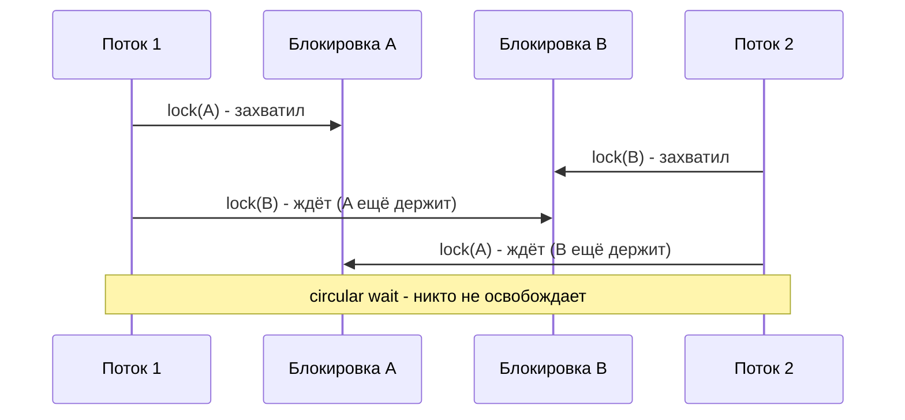
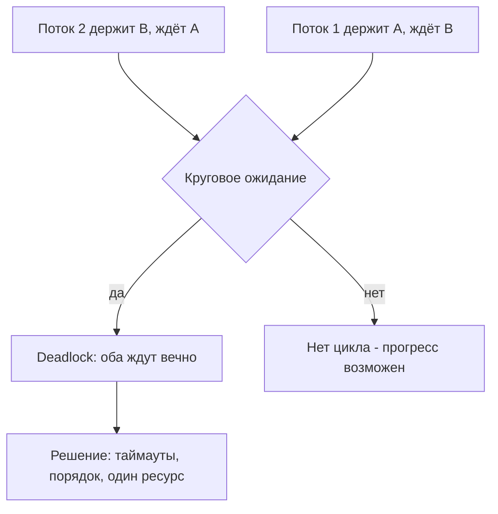

# Deadlocks (Взаимные блокировки)

## Определение

**Deadlock (взаимная блокировка)** — ситуация, в которой два или более потока (процесса) бесконечно ждут друг друга: каждый удерживает ресурс (блокировку), необходимый другому. Ни один поток не может продолжить работу, и программа «зависает». Частные случаи: **live lock** (потоки работают, но бесконечно «вежливо» уступают друг другу) и **starvation** (один поток голодает, другие захватывают ресурс).

## Зачем нужно

- **Предотвращать зависания** — deadlock в проде — это непроходящие запросы и недоступный сервис.
- **Понимать условия возникновения** — чтобы проектировать порядок блокировок и избегать взаимных ожиданий.
- **Уметь детектировать** — дампы потоков, метрики времени ожидания, watchdog.
- **Строить устойчивые лимиты** — таймауты на захват блокировки превращают deadlock в управляемую ошибку.
- **Отличать от родственных проблем** — race condition, starvation, live lock лечатся по-разному.

## Как работает

Классические **четыре условия Коффмана** (должны выполняться все одновременно):

1. **Mutual exclusion (взаимное исключение)** — ресурс используется одним потоком в каждый момент.
2. **Hold and wait (удержание и ожидание)** — поток держит один ресурс и ждёт другой.
3. **No preemption (отсутствие вытеснения)** — ресурс нельзя отнять у держащего, он сам его освободит.
4. **Circular wait (круговое ожидание)** — между потоками есть цикл ожидания (A ждёт B, B ждёт A).

Если нарушить хотя бы одно условие — deadlock невозможен. Поэтому стратегии предотвращения ломают каждое из них:

- **Нет no-preemption** — таймауты при захвате (`tryLock`), освободить и попробовать снова.
- **Нет circular wait** — глобальный упорядоченный порядок захвата блокировок (по id ресурса).
- **Нет hold-and-wait** — захватывать все ресурсы одним приёмом (атомарно).





## Примеры кода

### TypeScript (классический deadlock на двух мьютексах)

```typescript
class Bank {
  constructor(private balance: number) {}

  async transfer(
    other: Bank,
    amount: number,
    lock: (fn: () => Promise<void>) => Promise<void>
  ) {
    // Deadlock при переводе A->B и B->A одновременно:
    // каждый поток ждёт блокировку другого счёта.
    await lock(async () => {
      await this.waitRandom()
      await other.lockAgain()
    })
  }

  private waitRandom() {
    return new Promise((r) => setTimeout(r, Math.random() * 50))
  }

  private async lockAgain() {}
}
```

### TypeScript (фикс: глобальный порядок по id)

```typescript
class Bank {
  constructor(readonly id: number, private balance: number) {}

  async transfer(other: Bank, amount: number) {
    // Всегда захватывать блокировки в порядке возрастания id.
    const first = this.id < other.id ? this : other
    const second = this.id < other.id ? other : this

    await withLock(first, async () => {
      await withLock(second, async () => {
        this.balance -= amount
        other.balance += amount
      })
    })
  }
}
```

### Go (deadlock на двух мьютексах)

```go
package main

import (
	"fmt"
	"sync"
	"time"
)

type Account struct {
	mu sync.Mutex
	// balance
}

func transfer(a, b *Account) {
	a.mu.Lock()          // берём A
	defer a.mu.Unlock()

	time.Sleep(time.Millisecond) // другой поток уходит вперёд и берёт B
	b.mu.Lock()          // ждём B, а B-поток ждёт A - deadlock
	defer b.mu.Unlock()
}

// go run -race и просто запуск покажут:
// fatal error: all goroutines are asleep - deadlock!
```

### Java (deadlock: порядок захвата)

```java
class Account {
    final Object monitor = new Object();
    int balance;
}

// Deadlock: поток 1 берёт this->other, поток 2 — other->this
void transfer(Account from, Account to, int amount) {
    synchronized (from.monitor) {
        synchronized (to.monitor) {
            from.balance -= amount;
            to.balance += amount;
        }
    }
}

// Фикс: сортировка мониторов по глобальному id
void transferSafe(Account from, Account to, int amount) {
    Object m1 = from.monitor;
    Object m2 = to.monitor;
    if (System.identityHashCode(m1) > System.identityHashCode(m2)) {
        Object tmp = m1; m1 = m2; m2 = tmp;
    }
    synchronized (m1) {
        synchronized (m2) {
            from.balance -= amount;
            to.balance += amount;
        }
    }
}
```

## Пример использования: интеграция

> Практика: **tryLock с таймаутом**, **порядок блокировок**, **Detector для продакшена**.

### TypeScript (tryLock через таймаут)

```typescript
async function withLock<T>(
  key: string,
  fn: () => Promise<T>,
  timeoutMs = 1000
): Promise<T> {
  const acquired = await acquire(key, timeoutMs)
  if (!acquired) {
    throw new Error(`lock timeout for ${key}`) // не deadlock, а ошибка
  }
  try {
    return await fn()
  } finally {
    release(key)
  }
}
```

### Go (tryLock: не ждать вечно)

```go
import "time"

// Go 1.18+: TryLock не блокируется
if a.mu.TryLock() {
    defer a.mu.Unlock()
    if b.mu.TryLock() {
        defer b.mu.Unlock()
        // работаем с критической секцией
    } else {
        // не получили B - отдаём A и пробуем иначе (нет hold-and-wait)
    }
}
```

### Java (ReentrantLock.tryLock + таймаут)

```java
import java.util.concurrent.locks.ReentrantLock;
import java.util.concurrent.TimeUnit;

ReentrantLock lockA = new ReentrantLock();
ReentrantLock lockB = new ReentrantLock();

if (lockA.tryLock(1, TimeUnit.SECONDS)) {
    try {
        if (lockB.tryLock(500, TimeUnit.MILLISECONDS)) {
            try {
                // размещённый обмен — оба замка в руках
            } finally {
                lockB.unlock();
            }
        } // else: освобождаем A и повторяем (break условия hold-and-wait)
    } finally {
        lockA.unlock();
    }
}
```

## Паттерны использования

- **Единый порядок захвата** — нумеровать ресурсы и брать блокировки только по возрастанию id (break circular wait).
- **Один ресурс на операцию**, когда возможно — нет hold-and-wait на другом ресурсе.
- **Таймауты на захват** — `tryLock`, `TryLock`, `lock(timeout)` — deadlock превращается в ошибку.
- **Иерархия блокировок** — центральная, глобальная — редко захватываемая сверху вниз.
- **Мониторинг time-in-lock** — алерты на подозрительно долгое удержание.
- **Проверка дампа потоков** — jstack/горутин трассировка при подозрении на зависание.

## Антипаттерны и ловушки

- **Разный порядок захвата** — A->B в одном месте и B->A в другом — самый частый источник deadlock.
- **Вложенные блокировки без таймаута** — no-preemption + unknown wait-time = висит вечно.
- **Скрытые блокировки** — вызов кода «под замком», который сам берёт другой замок.
- **Проверка на «кто-то другой ждёт»** — наивный deadlock-detect вручную ненадёжен; используй инструменты.
- **Пул потоков + блокировки** — задача ждёт ресурс, который выполняет другая задача в том же пуле (потоки исчерпаны).
- **Захват блокировки в цикле с ожиданием результата** — тот же пул потоков, но самоблокировка.

## Когда использовать / когда НЕ использовать

**Использовать:**
- Когда несколько потоков работают с несколькими разделяемыми ресурсами — порядок блокировок обязателен.
- Таймауты захвата везде, где возможна конкуренция за ресурс.

**НЕ использовать (или пересмотреть):**
- Собственные ручные «детекторы» deadlock в коде — лучше инструменты и упрощение схемы.
- Глубокие вложенные блокировки, если их можно заменить одним замком или атомарной операцией.
- Модель «ждём простаивающего потока» — сигнализировать каналом/условием, а не блокировать.

## Связанные темы

- **Race Conditions** — гонка и deadlock — разные стороны плохой синхронизации.
- **Thread Safety** — какой код считается потокобезопасным и как этого достигать.
- **Distributed Locks** — deadlock на уровне процессов в кластере (Redis/лидер).
- **Optimistic / Pessimistic Locking** — как базы данных решают ту же проблему ресурсов.
- **Timeouts** — таймаут на операцию — внешняя страховка от бесконечного ожидания.

## Вопросы

### Q1
**Что такое deadlock?**

- [ ] Ошибка переполнения памяти
- [x] Потоки бесконечно ждут друг друга, зажав ресурсы, которые нужны остальным
- [ ] Ускорение конкурентных операций
- [ ] Сбой компилятора при параллелизме

Пояснение: deadlock — взаимное бесконечное ожидание из-за удерживаемых блокировок; ни один поток не освобождает ресурс.

### Q2
**Сколько условий Коффмана должны выполняться одновременно?**

- [ ] Одно
- [ ] Все плюс ещё одно
- [x] Все четыре: mutual exclusion, hold-and-wait, no-preemption, circular wait
- [ ] Ни одного

Пояснение: для deadlock обязательны все четыре условия; нарушение любого делает deadlock невозможным.

### Q3
**Какой фикс ломает условие «circular wait»?**

- [ ] Увеличить время ожидания
- [x] Захватывать блокировки в глобально упорядоченном порядке (по id ресурсов)
- [ ] Сделать ресурсы быстрее
- [ ] Добавить ещё один поток

Пояснение: единый порядок захвата исключает цикл ожидания — никто не ждёт ресурс, который другой держит «назад по порядку».

### Q4
**Что делает tryLock с таймаутом, если ресурс занят?**

- [ ] Падает сразу навсегда
- [ ] Ждёт бесконечно
- [x] Ждёт заданное время и возвращает «не получено» — вместо вечного ожидания
- [ ] Автоматически убивает другой поток

Пояснение: tryLock ломает no-preemption/бесконечное ожидание: поток уступает и может попробовать ещё раз или обработать ошибку.

### Q5
**Live lock отличается от deadlock тем, что...**

- [ ] Это синонимы
- [x] Потоки активны, но бесконечно уступают друг другу и не делают работы
- [ ] Потоки замерзают полностью
- [ ] Live lock бывает только в Go

Пояснение: live lock — потоки крутятся и «вежливо» пропускают очередь, но прогресса нет; deadlock — полный простой ожидающих потоков.

## Источники

- Термин и условия Коффмана (Wikipedia): https://en.wikipedia.org/wiki/Deadlock
- Go sync — TryLock: https://pkg.go.dev/sync#Mutex.TryLock
- java.util.concurrent — ReentrantLock.tryLock: https://docs.oracle.com/en/java/javase/17/docs/api/java.base/java/util/concurrent/locks/ReentrantLock.html
- IBM — Diagnosing deadlocks (jstack): https://www.ibm.com/docs/en/zkpf/8.6.0?topic=problems-diagnosing-deadlocks