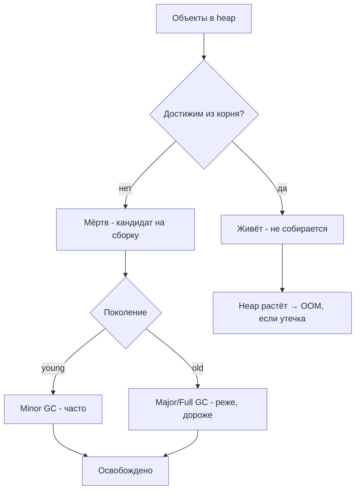
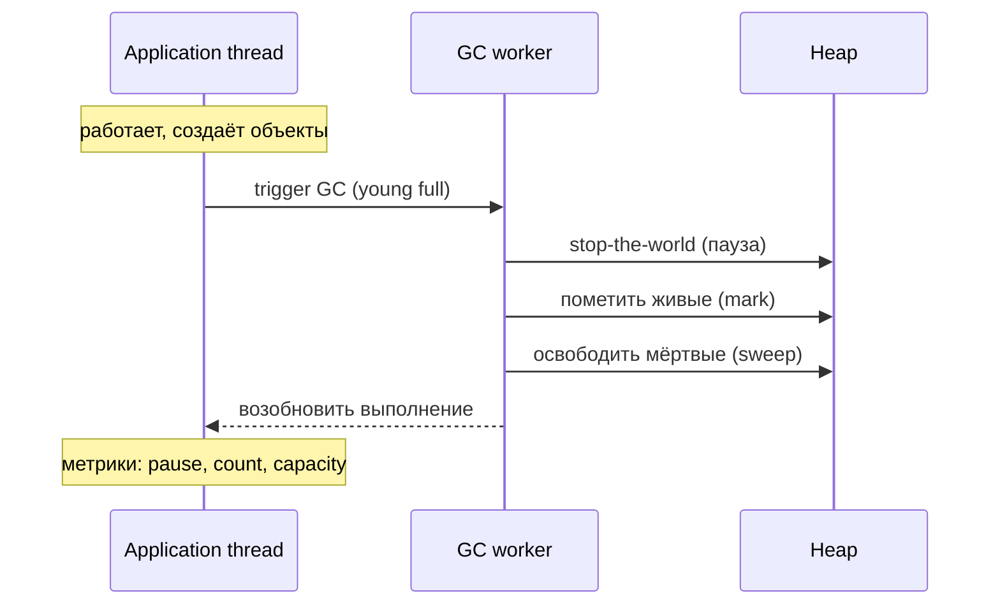

# Сборка мусора (Garbage Collection)

## Определение

**Garbage Collection (сборка мусора, GC)** — автоматическое управление памятью: рантайм (JVM, V8, Go runtime) сам находит объекты, которые больше недоступны программе, и освобождает их память. В противоположность ручному управлению (C/C++ с `free`). Ключевые метрики GC: **пауза (pause time)**, **частота**, **пропускная способность (throughput)**, **stop-the-world** (моменты, когда потоки приложения приостановлены).

## Зачем нужно

- **Убрать ручное управление памятью** — нет `free`/`malloc`-багов, утечек через «забыл освободить».
- **Устойчивость** — GC очищает достижимые-из-корня объекты автоматически.
- **Производительность** — понимание GC-пауз нужно для p99-латенси и стабильного SLO.
- **Выбор настроек** — размер heap, тип GC (G1/ZGC/ParallelGC), генерируемая стратегия.
- **Диагностика** — метрики GC-количества/длительности помогают искать утечки и перегруженные пути.

## Как работает

Базовые идеи:

- **Heap разделён на поколения (young/old)** — большинство объектов живёт недолго (предположение о «молодости» объектов).
- **Трассировка от корней (GC roots)** — алгоритм находит достижимые объекты от статических полей, стеков, потоков.
- **Ранние поколения собираются часто (Minor GC)**, старые — реже (Major/Full GC).
- **Stop-the-world** — часть/вся компиляция приостанавливает потоки приложения.
- **Разные коллекторы** — Serial, Parallel, CMS, G1, ZGC (Java); Tri-color marking + concurrent (Go); V8 — generational + incremental + idle-time GC.

Компактное представление типовых коллекторов:

| Коллектор | Кто использует | Паузы | Когда выбирают |
|---|---|---|---|
| G1 | Java default (до 17) | Средние, инкрементальные | Сервисы общего назначения |
| ZGC/Shenandoah | Java | Очень малые (мс) | p99-критичные |
| Concurrent-GC | Go | Короткие, параллельно | Серверы-сервисы |
| V8 (Orinoco) | Node/браузер | Инкрементальные | UI/потокобезопасность JS |





## Примеры кода

### TypeScript (инициирование / наблюдение GC)

```typescript
// Node.js: только с флагом --expose-gc
// экспериментальный контроль - обычно не нужен и вреден
if (globalThis.gc) {
  globalThis.gc() // настойчивая просьба (не директива)
}

// метрики памяти для мониторинга GC-эффектов
import { performance } from 'node:perf_hooks'
import { performance as perf } from 'node:perf_hooks'

const mem = () => process.memoryUsage()

export function trackGc(): () => void {
  // смотрим рост heapUsed на интервале времени
  const before = mem()
  return () => {
    const after = mem()
    const growthMB = Math.round((after.heapUsed - before.heapUsed) / 1024 / 1024)
    return growthMB
  }
}
```

### Go (настройка и метрики GC)

```go
package main

// runtime/debug - тонкая настройка (не рекомендуется без нужды)
import (
	"runtime"
	"runtime/debug"
)

func main() {
	debug.SetGCPercent(100) // порог: когда heap растёт на 100% - GC
	// 0 - GC отключён, -1 - GC вручную

	var stats runtime.MemStats
	runtime.ReadMemStats(&stats)
	// stats.Alloc - текущая занятая память
	// stats.NumGC - число завершённых сборок
	// stats.PauseTotalNs - суммарные паузы
}
```

### Java (управление GC через флаги)

```java
// Настройки JVM (в контейнере или командной строке):
//
// java -Xms512m -Xmx2g 
//      -XX:+UseG1GC
//      -XX:MaxGCPauseMillis=100
//      -XX:+PrintGCDetails
//      MyApp
//
public class App {
    public static void main(String[] args) {
        // GC работает в фоне; код не управляет им напрямую.
        System.out.println("App running (see GC logs)");
    }
}
```

## Пример использования: интеграция

> Практика: **мониторинг GC-метрик**, **выбор стратегии для p99**, **предотвращение GC-атак**.

### TypeScript (мониторинг heap по времени)

```typescript
import { performance } from 'node:perf_hooks'
const heap = process.memoryUsage()

// каждые 60с - логировать + собирать в метрики
export function initMemMetrics(): void {
  setInterval(() => {
    const m = process.memoryUsage()
    console.log(JSON.stringify({
      rssMB: Math.round(m.rss / 1024 / 1024),
      heapMB: Math.round(m.heapUsed / 1024 / 1024),
    }))
  }, 60_000)
}
```

### Go (экспорт GC-метрик для Prometheus)

```go
import (
	"runtime"
)

// сниппет для метрик: count GC, pause (из runtime.MemStats)
func gcStats() (count uint32, totalPauseNs uint64) {
	var s runtime.MemStats
	runtime.ReadMemStats(&s)
	return s.NumGC, s.PauseTotalNs
}

// далее - отдать в /metrics (Prometheus): gc_count, gc_pause_total
```

### Java (Spring Actuator: GC-метрики)

```java
// dependency: spring-boot-starter-actuator + micrometer
// GET /actuator/metrics/jvm.gc.pause
// GET /actuator/metrics/jvm.gc.memory.allocated
//
// Алерты:
// jvm.gc.pause > 500ms - повышена латенция
// jvm.memory.used близок к Xmx - возможна утечка
@RestController
public class GcMetricsExample {
    // Актуатор уже экспонирует jvm.* метрики.
    // Добавляем лишь описание для команды.
}
```

## Паттерны использования

- **Не звать GC вручную** — `gc()`, `System.gc()` — это «просьбы», а не директива; обычно ухудшают паузы.
- **Мониторить количество/длительность пауз** — метрики GC в Prometheus/jfr.
- **Адекватный размер heap** — не «на глаз»: Xmx = потребность + запас под всплески.
- **Проверять p99-латенсию при GC** — паузы обычно влияют на хвост распределения (см. P99 Latency).
- **Избегать аллокаций в горячем пути** — меньше объектов = реже и короче GC.
- **Знать стратегию своего языка** — G1/ZGC (Java), concurrent (Go), generational (V8).

## Антипаттерны и ловушки

- **РагSystem.gc() в цикле** — сбои пауз, вызовы, без реальной пользы.
- **Кэш, держащий всё в памяти** — имитирует утечку и заставляет GC делать больше работы (см. Memory Leaks).
- **Слишком маленький Xmx** — частые Full GC, деградация p99.
- **Слишком большой Xmx + little RAM контейнера** — OOM со стороны ОС (пэйджинг).
- **Игнорировать метрики GC** — рост NumGC/пауз первый сигнал проблемы.
- **Глобальные статики с накоплением** — в Java/Go/V8 «живут» долго, GC их не трогает.

## Когда использовать / когда НЕ использовать

**Использовать:**
- Везде, где рантайм есть (Java/Go/Node) — автоматическое управление памятью обязательно и бесплатно.
- Для p99-критичных сервисов — правильно выбрать коллектор и размер heap.

**НЕ использовать (или пересмотреть):**
- Ожидать «нулевых» GC-пауз — они есть у всех; цель — малые и редкие.
- Ручной вызов GC для «срочно освободить» — почти всегда бесполезен или вреден.
- Рассчитывать на GC как на решение утечек — достижимые-из-корня объекты GC не соберёт.

## Связанные темы

- **Memory Leaks** — то, что GC не может исправить: достижимые-из-корня объекты.
- **P99 Latency / Latency** — GC-паузы влияют на хвост распределения задержек.
- **Observability / Monitoring** — метрики GC — обязательный набор для сервисов.
- **Thread Safety** — конкурентные GC-коллекторы не делают код потокобезопасным «в обмен».
- **Performance** — эффективные структуры снижают нагрузку на GC.

## Вопросы

### Q1
**Что делает сборщик мусора?**

- [ ] Освобождает всю память процесса
- [x] Находит недостижимые из корней объекты и освобождает их память
- [ ] Очищает таблицу маршрутизации
- [ ] Ускоряет компиляцию кода

Пояснение: GC трассирует объекты от корней (статические поля, стеки, потоки) и собирает только недостижимые; «живые» объекты не трогаются.

### Q2
**Что значит stop-the-world?**

- [ ] Приложение завершает работу
- [x] Потоки приложения приостанавливаются на время фазы сборки
- [ ] Сеть отключается
- [ ] Иногда GC останавливается сам

Пояснение: stop-the-world — синхронная пауза приложения ради фазы GC (отметить/собрать). Разные коллекторы минимизируют её (G1/ZGC).

### Q3
**Почему вызов System.gc() не гарантирует полную сборку?**

- [x] Потому что это «просьба» рантайму, а не директива
- [ ] GC работает только по ночам
- [ ] Память нельзя освобождать через JVM
- [ ] Мусор нельзя собрать

Пояснение: System.gc() — рекомендация; JVM может проигнорировать или запустить её позже. В проде такие вызовы обычно ухудшают паузы.

### Q4
**Какой коллектор в Java минимизирует паузы за счёт несколько фаз?**

- [ ] Serial
- [x] G1 (и ZGC/Shenandoah) — инкрементальные/конкурентные
- [ ] Parallel только
- [ ] MarkSweep-старый

Пояснение: G1 разбивает heap на регионы и собирает по частям, ограничивая паузы; ZGC — миллисекундные паузы при любом размере heap.

### Q5
**Почему «стимуляция GC через System.gc() в цикле» — плохая практика?**

- [ ] Может ускорить работу
- [ ] GC без пауз не бывает
- [x] Частые запросы GC увеличивают затраты времени/пауз и не «для дела»
- [ ] Это безопасный приём для одиночных серверов

Пояснение: лишние GC-вызовы создают stop-the-world паузы без выгоды; рантайм сам решает, когда собирать.

## Источники

- Oracle — HotSpot VM Garbage Collection Tuning Guide: https://docs.oracle.com/javase/8/docs/technotes/guides/vm/gctuning/index.html
- Go runtime — GC (runtime/doc): https://go.dev/doc/gc-guide
- V8 — Orinoco (Oilpan) GC описание: https://v8.dev/blog/trash-talk
- Eclipse — спецификация JVM (GC roots): https://docs.oracle.com/javase/specs/jvms/se17/html/jvms-se4.html