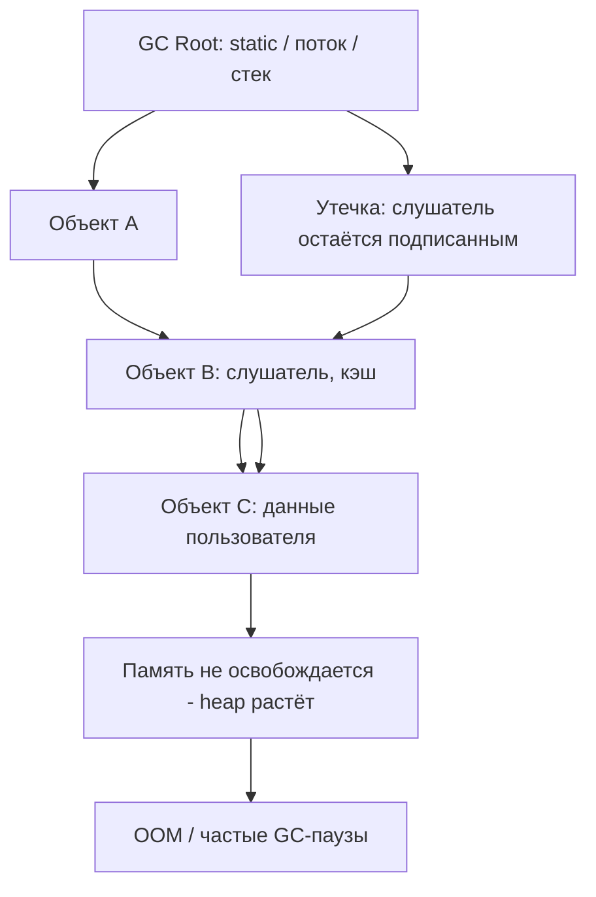
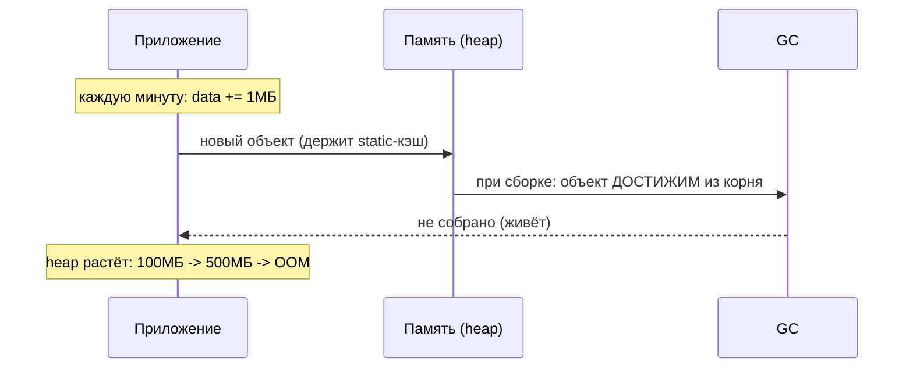

# Утечки памяти (Memory Leaks)

## Определение

**Memory leak (утечка памяти)** — ситуация, когда приложение удерживает память, которая больше не нужна, и не отдаёт её сборщику мусора или ОС. В managed-средах (Java, Go, JS) «утечка» — это **недоступный сервису** объект, но **достижимый из корней** (static, кэш, ThreadLocal, замыкание). Память растёт до OOM, деградации GC, падения или «замораживания» приложения.

## Зачем нужно

- **Стабильность сервиса** — неконтролируемый рост heap → OOM, рестарты, деградация.
- **Предсказуемые паузы GC** — чем больше занятая память, тем чаще и длиннее GC-стопы.
- **Защита SLA** — метрики памяти/GC-пауз позволяют поймать утечку заранее.
- **Экономия инфраструктуры** — меньше памяти → дешевле поды/контейнеры.
- **Диагностика в проде** — heap dump, профилировщик, метрики для поиска удержания.

## Как работает

Что удерживает память в managed-средах:

- **Корни (GC roots)** — статические поля, активные потоки, стеки вызовов, глобальные пулы.
- **Достижимость** — объект жив, пока до него есть путь от корня; недостижимые — кандидаты на сборку (см. Garbage Collection).
- **Утечка = живущий объект**, который «забыли» освободить: кэш без eviction, listener без dispose, ThreadLocal без remove.
- **Boolean-безумство** — «растёт по малому капле» — редко видно сразу, проявляется через дни/недели.

Типовые сценарии:

- Небыстрорастущий static-кэш, который никогда не вытесняет элементы.
- Регистрация подписчиков/слушателей без отписки.
- Закрытые объекты, которые кто-то держит через замыкание/коллбек.
- ThreadLocal с данными запроса в пуле потоков (thread переиспользуется).
- Неосвобождаемые дескрипторы: сокеты, файлы, соединения.





## Примеры кода

### TypeScript (утечка через listener / замыкание)

```typescript
// Утечка: слушатель добавляется каждый раз и не удаляется
class Emitter {
  private listeners = new Set<() => void>()

  on(fn: () => void) {
    this.listeners.add(fn)
  }

  off(fn: () => void) {
    this.listeners.delete(fn)
  }
}

const emitter = new Emitter()

function register() {
  const bigData = new Array(1_000_000).fill(0) // тяжёлые данные
  emitter.on(() => console.log(bigData.length)) // замыкание держит bigData
  // off() не вызывается -> замыкание живёт в listeners вечно
  return () => emitter.off // забыли вызвать
}
```

### Go (утечка: горутина ждёт навсегда)

```go
package main

func main() {
	ch := make(chan int)
	for i := 0; i < 1000; i++ {
		go func() {
			<-ch // горутина заблокирована навсегда: никто не пошлёт
		}()
	}
	// горутины не завершатся -> goroutine leak, память/стеки закреплены
}
```

### Java (утечка через static-коллекцию)

```java
import java.util.ArrayList;
import java.util.List;

class CacheStore {
    // static список растёт вечно - никогда не очищается
    private static final List<byte[]> CACHE = new ArrayList<>();

    static void addData(byte[] data) {
        CACHE.add(data); // объект достижим из статического корня
    }
}
```

### Java (фикс: LRU-кэш вместо бесконечного списка)

```java
import java.util.LinkedHashMap;
import java.util.Map;

class LruCache {
    private final Map<String, byte[]> map;

    LruCache(int maxSize) {
        map = new LinkedHashMap<>(16, 0.75f, true) {
            @Override
            protected boolean removeEldestEntry(Map.Entry<String, byte[]> e) {
                return size() > maxSize;
            }
        };
    }
}
```

## Пример использования: интеграция

> Практика: **профилирование heap**, **следить за метриками**, **искать коллекторов в пулах**.

### TypeScript (мониторинг памяти и рост heap)

```typescript
// process.memoryUsage() - сниппет для метрик
import { performance } from 'node:perf_hooks'

export function memSnapshot(): Record<string, number> {
  const m = process.memoryUsage()
  return {
    rssMB: Math.round(m.rss / 1024 / 1024),
    heapUsedMB: Math.round(m.heapUsed / 1024 / 1024),
    heapTotalMB: Math.round(m.heapTotal / 1024 / 1024),
    externalMB: Math.round(m.external / 1024 / 1024),
  }
}
```

### Go (pprof: находим утечку)

```go
import (
	"net/http"
	_ "net/http/pprof" // подключает /debug/pprof
)

// в main():
go func() {
	_ = http.ListenAndServe("localhost:6060", nil)
}()

// go tool pprof http://localhost:6060/debug/pprof/heap
// посмотреть, какие функции держат память (top, list)
```

### Java (jmap + анализатор heap dump)

```java
// Запуск приложения с флагами для борьбы с OOM
// -Xmx512m -XX:+HeapDumpOnOutOfMemoryError -XX:HeapDumpPath=/tmp/dump.hprof

// Диагностика:
// 1) jps - список JVM
// 2) jmap -dump:format=b,file=heap.hprof <pid>
// 3) открыть в Eclipse MAT / JProfiler: "Leak Suspects Report"
// 4) искать "dominant object" и пути от GC-root
```

## Паттерны использования

- **Кэши с eviction** — LRU/TTL-кэш, а не бесконечный static-лист (см. Caching Basics).
- **Отписка от событий** — всегда `dispose`/`off` для listeners и подписчиков.
- **ThreadLocal-с cleanup** — удалять в `finally`/`afterProcess`, особенно в пулах потоков.
- **Context timeout** — не давать горутинам/задачам ждать вечно: deadline и cancel.
- **Закрытие ресурсов** — файлы, сокеты, connection-пулы — через try-with-resources/defer.
- **Профилирование в CI** — периодические heap-профили статических путей.

## Антипаттерны и ловушки

- **Static-переменные под общим именем** — живут как класс/приложение; легко накопить всё.
- **Кэш без лимита** — «немного подрастёт» → через месяц память закончилась.
- **Невызванный dispose** — подписка создана в цикле и никем не закрыта.
- **Горутина, ждущая канал, который уже не придёт** — goroutine leak: стек и контекст удержаны.
- **ThreadLocal в пуле потоков** — поток переиспользуется, объект «прилипает» на время жизни пула.
- **Огромные объекты в замыкании** — коллбек, который держит большую структуру дольше нужного.

## Когда использовать / когда НЕ использовать

**Использовать:**
- Для всех долгоживущих сервисов — heap-мониторинг и профилирование обязательны.
- Кэшировать с ограничением размера/TTL всегда, когда данные «могут расти».

**НЕ использовать (или пересмотреть):**
- Хранение больших структур в static/глобально без чёткого lifecycle.
- Подписчики/коллбеки без парного unsubscribe.
- Рост живучих коллекций «на всякий случай» вместо их очистки.

## Связанные темы

- **Garbage Collection** — как managed-память освобождается и почему «живые» объекты не собираются.
- **Observability / Monitoring** — метрики heap и GC-пауз для поиска утечек.
- **Thread Safety** — синхронизация нужна и для очистки общего состояния.
- **Race Conditions** — гонки могут «украсть» cleanup (двойная отписка и т.п.).
- **Timeouts** — таймауты ограничивают жизнь висящих задач и держателей памяти.

## Вопросы

### Q1
**Почему managed-память (Java/Go/JS) всё равно «утекает»?**

- [ ] Сборщик мусора не работает
- [ ] ОС забирает память
- [x] Объект остаётся достижимым из корня (static, кэш, слушатель), хотя больше не нужен
- [ ] GC непредсказуем по времени

Пояснение: утечка — это не недостижимый объект, а «живой» из-за ссылки из корня: кэш, подписка, ThreadLocal.

### Q2
**Что в первую очередь показывает heap dump при утечке?**

- [ ] Скорость сети
- [x] Объекты, которые ПОЛАГАЕТСЯ освободить, но они достижимы
- [ ] Кодировку файлов
- [ ] Количество процессоров

Пояснение: heap dump показывает достижимые объекты из корней; утечку ищем через «paths to GC root» и dominant-object.

### Q3
**Какая из этих конструкций — классическая утечка в Go?**

- [ ] defer close с ошибкой
- [x] Горутина, навсегда ждущая сообщения в канал, который никто не заполнит
- [ ] Обычная рекурсия
- [ ] Использование fmt.Println

Пояснение: горутина блокируется на чтение из канала без будущих сообщений — это goroutine leak, стек и память не освобождаются.

### Q4
**Почему ThreadLocal без remove() в пуле потоков опасен?**

- [ ] Просто медленный
- [x] Поток переиспользуется, объект живёт на время жизни всего пула
- [ ] Не имеет значения в Java
- [ ] Очищается сам через GC

Пояснение: ThreadLocal хранит значение на поток; пул переиспользует потоки, поэтому «персональные» данные запроса прилипают надолго.

### Q5
**Каким должен быть кэш, чтобы не утекать?**

- [ ] Без лимита «на всякий случай»
- [x] С ограничением размера и/или TTL (eviction политика)
- [ ] Только static-field
- [ ] Хранящий все данные в памяти

Пояснение: кэш с eviction/LRU/TTL не даёт памяти расти бесконечно; безлимитный кэш — классическая утечка.

## Источники

- Oracle — Memory management (GC roots, heap): https://docs.oracle.com/javase/specs/jvms/se17/html/jvms-se4.html
- Go pprof (net/http/pprof): https://pkg.go.dev/net/http/pprof
- Node.js — process.memoryUsage(): https://nodejs.org/api/process.html#processmemoryusage
- Eclipse MAT (анализатор heap dump): https://eclipse.dev/mat/