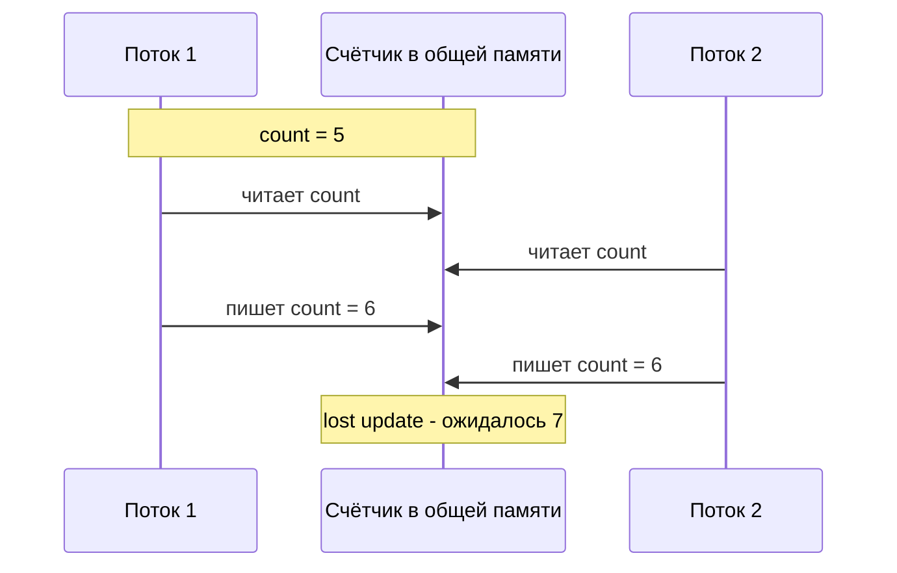
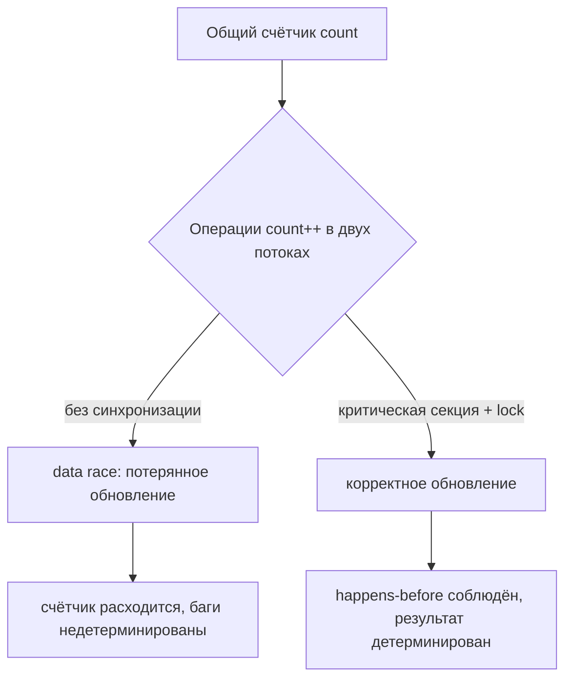

# Состояния гонки (Race Conditions)

## Определение

**Race Condition (состояние гонки)** — дефект, при котором результат работы зависит от непредсказуемого порядка и тайминга конкурентных операций (потоков, горутин, процессов), обращающихся к общему изменяемому состоянию без синхронизации. Частный случай — **data race (гонка данных)**: два потока одновременно читают и пишут одну несинхронизированную память. Гонка проявляется недетерминированно: код работает то так, то иначе.

## Зачем нужно

- **Писать корректный параллелизм** — без понимания гонок конкурентные программы дают случайные сбои.
- **Находить дефекты раньше** — race detector и тесты с конкуренцией ловят проблемы до продакшена.
- **Проектировать разделяемое состояние** — решить, что делить между потоками, а что локализовать.
- **Понимать гарантии языка** — happens-before, атомарность, видимость памяти (см. Thread Safety).
- **Избегать «плавающих» багов** — гонка может миллион раз работать и один раз упасть.

## Как работает

Ключевые понятия:

- **Interleaving (перемежение)** — потоки выполняются на одном ядре поочерёдно, планировщик решает, в каком порядке выполнятся отдельные операции.
- **Критическая секция** — участок, который должны выполнять потоки строго по одному (защищается блокировкой).
- **Read-modify-write** — последовательность «прочитать → изменить → записать» (например `count++`) — не атомарна и может терять обновления.
- **Check-then-act** — «проверить условие, потом действовать по нему» (например проверить кэш, потом наполнить) — классический источник гонок.
- **Lost update (потерянное обновление)** — два потока прочитали старое значение, оба посчитали новые и записали; одно изменение теряется.
- **Visibility (видимость)** — без синхронизации поток может долго не увидеть запись другого потока (кэш ядра).
- **Happens-before** — формальное отношение порядка, гарантирующее видимость записи; соблюдается через мьютексы, атомарные операции, старт/join потоков.





## Примеры кода

### TypeScript (гонка check-then-act на await-границе)

```typescript
// Общий кэш. Два конкурентных вызова getConfig():
// оба видят cache === null ДО завершения fetch, fetch случится дважды.
let cache: Record<string, string> | null = null

async function getConfig(): Promise<Record<string, string>> {
  if (!cache) {
    cache = await fetch('/api/config').then((r) => r.json())
  }
  return cache
}

// Фикс: кэшировать сам Промис, а не результат
let cachePromise: Promise<Record<string, string>> | null = null

function getConfigSafe(): Promise<Record<string, string>> {
  if (!cachePromise) {
    cachePromise = fetch('/api/config').then((r) => r.json())
  }
  return cachePromise
}
```

### Go (data race: неатомарный инкремент)

```go
package main

import (
	"fmt"
	"sync"
)

var count int

func main() {
	var wg sync.WaitGroup
	for i := 0; i < 2; i++ {
		wg.Add(1)
		go func() {
			defer wg.Done()
			for j := 0; j < 1000; j++ {
				count++ // data race: read -> write без синхронизации
			}
		}()
	}
	wg.Wait()
	fmt.Println(count) // не 2000: часть обновлений потеряна
}

// go run -race покажет:
// WARNING: DATA RACE   Write/Read race на count
```

### Java (неатомарный инкремент)

```java
class Counter {
    private int count;

    void inc() {
        count++; // не атомарно: load -> addi -> store
    }
}
```

### Java (фикс: атомарный тип)

```java
import java.util.concurrent.atomic.AtomicInteger;

class Counter {
    private final AtomicInteger count = new AtomicInteger();

    void inc() {
        count.incrementAndGet();
    }
}
```

## Пример использования: интеграция

> Практика: **атомарные счётчики вместо блокировок**, **ThreadLocal-локализация**, **один общий Промис**.

### TypeScript (worker_threads: SharedArrayBuffer + Atomics)

```typescript
// Общий буфер между воркерами: атомарный инкремент без мьютексов
const sab = new SharedArrayBuffer(8)
const stats = new Int32Array(sab)

// любой воркер безопасно увеличивает счётчик
Atomics.add(stats, 0, 1)
const total = Atomics.load(stats, 0)
```

### Go (атомарная метрика в HTTP-хендлере)

```go
import "sync/atomic"

var inFlight atomic.Int64 // общий счётчик активных запросов

func handler(w http.ResponseWriter, r *http.Request) {
	inFlight.Add(1)
	defer inFlight.Add(-1)

	// обработка запроса без блокировок на критическом пути
	handle(w, r)
}
```

### Java (Spring: AtomicLong вместо гонок)

```java
@RestController
public class StatsController {

    private final AtomicLong inFlight = new AtomicLong();

    @GetMapping("/api/items")
    public List<Item> list() {
        inFlight.incrementAndGet();
        try {
            return itemService.list();
        } finally {
            inFlight.decrementAndGet();
        }
    }
}
```

## Паттерны использования

- **Локализация состояния** — если данные не нужны другим потокам, не делать их общими (thread confinement, ThreadLocal).
- **Неизменяемость** — immutable-данные не могут «погоняться» после публикации.
- **Атомарные типы** — `AtomicInteger`, `atomic.Int64`, `Atomics.add` — когда операция одиночная и простая.
- **Блокировки для составных секций** — если нужно проверить и затем действовать (check-then-act), защищать оба шага одной критической секцией.
- **Конкурентные коллекции** — `ConcurrentHashMap`, `sync.Map` вместо ручной синхронизации мапы.
- **Один общий Промис/один лидер** — для долгих операций с дублированием (см. Idempotency, Distributed Locks).
- **Race detector в CI** — `go test -race`, ThreadSanitizer, JUnit-тесты с параллельными вызовами.

## Антипаттерны и ловушки

- **«Добавить sleep»** — не чинит гонку, а маскирует её: на другой нагрузке/машине тайминги меняются.
- **Double-checked locking без volatile/atomic** — второй поток видит неинициализированное поле (нет happens-before).
- **Флаг «готово» без синхронизации** — булева проверка тоже гонка, если нет мьютекса/атомиков.
- **Собственный «кастомный» мьютекс** — наивная spin-реализация хуже стандартной.
- **Порядок блокировок** — захват разных лочек в разном порядке ведёт к deadlock (см. Deadlocks).
- **Полагаться на одинарный поток (Node.js)** — гонки между await-границами возможны и там.
- **Тестировать гонки одним запуском** — недетерминизм требует race detector и повторных прогонов.

## Когда использовать / когда НЕ использовать

**Использовать:**
- Когда без общих изменяемых данных не обойтись, применять синхронизированный доступ за один приём.
- Счётчики, кэши, единичные операции — атомарные типы, а не блокировки.

**НЕ использовать (или пересмотреть):**
- Если данные можно сделать локальными для потока или неизменяемыми.
- Если конкуренция нужна на межпроцессном уровне — это уже распределённые блокировки (см. Distributed Locks).
- Если разделяемое состояние можно заменить передачей сообщений (channel/queue), а не переменными.

## Связанные темы

- **Deadlocks** — неправильный порядок блокировок превращает гонку в взаимоблокировку.
- **Thread Safety** — системный подход к написанию потокобезопасного кода.
- **Optimistic / Pessimistic Locking** — та же проблема в базе данных, другие инструменты.
- **Distributed Locks** — гонки между процессами в кластере, а не потоками одного приложения.
- **Idempotency** — повторная обработка не должна менять результат, защита от last-write-wins.
- **Retries** — при повторных запросах важно, чтобы операция сама была устойчива к гонкам.

## Вопросы

### Q1
**Что такое race condition?**

- [ ] Ошибка компилятора в параллельном коде
- [x] Результат зависит от порядка и тайминга конкурентных операций над общим состоянием
- [ ] Переполнение стека при рекурсии
- [ ] Ошибка переполнения буфера

Пояснение: race condition — недетерминизм из-за конкуренции за общее состояние; проявляется случайным образом.

### Q2
**В чём отличие race condition от data race?**

- [ ] Это полные синонимы
- [ ] Data race бывает только в Go
- [x] Data race — частный случай (несинхронизированные обращения к памяти); гонка — шире, включая check-then-act
- [ ] Гонка бывает только в распределённых системах

Пояснение: data race — про конкретные операции с памятью; race condition — более общий термин про недетерминизм результата.

### Q3
**Два потока выполняют `count++` без синхронизации. Что может произойти?**

- [ ] Ничего, операция всегда атомарна
- [ ] Компилятор выдаст ошибку
- [x] Lost update: оба прочитали старое значение и записали одно из двух
- [ ] Автоматически добавится блокировка

Пояснение: `count++` = read-modify-write. Без синхронизации потоки могут прочитать одно и то же значение, и одно обновление теряется.

### Q4
**Как надёжно детектировать гонки?**

- [ ] Запустить тест один раз в продакшене
- [x] Race detector (`go test -race` / ThreadSanitizer) и тесты с параллельными вызовами
- [ ] Увеличить число потоков до упора
- [ ] Вручную смотреть логи

Пояснение: гонки недетерминированы — нужен инструмент, отслеживающий конфликты доступа к памяти при конкурентном исполнении.

### Q5
**Почему «добавить sleep» не является правильным фиксом?**

- [ ] Sleep замедляет только один поток
- [x] Тайминги на другой машине/нагрузке отличаются — гонка остаётся, просто реже проявляется
- [ ] Sleep полностью синхронизирует память
- [ ] Sleep отключает конкуренцию

Пояснение: sleep не создаёт happens-before и не исключает перемежение; он лишь сдвигает окно гонки.

## Источники

- Go Memory Model — happens-before в Go: https://go.dev/ref/mem
- Java Language Spec, глава 17.4 (Memory Model): https://docs.oracle.com/javase/specs/jls/se17/html/jls-17.html
- ThreadSanitizer (go -race, C++): https://github.com/google/sanitizers/wiki/ThreadSanitizerCppManual
- MDN — Atomics и SharedArrayBuffer: https://developer.mozilla.org/en-US/docs/Web/JavaScript/Reference/Global_Objects/Atomics
- Wikipedia — Race condition: https://en.wikipedia.org/wiki/Race_condition