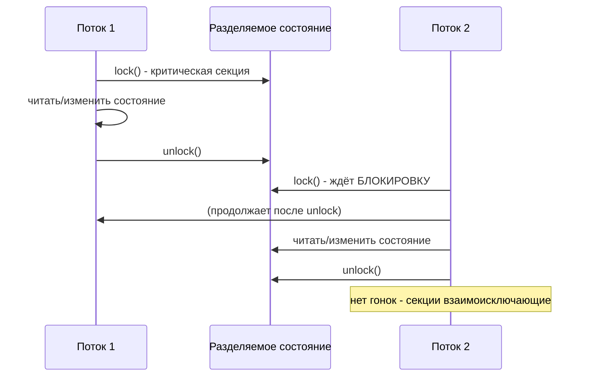
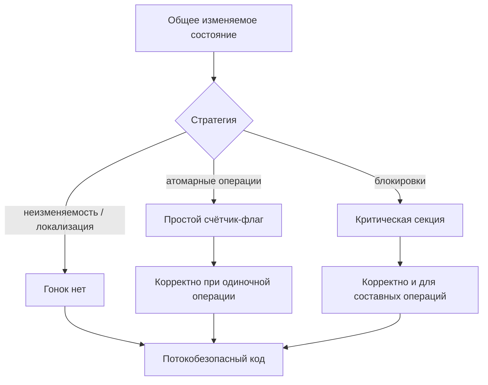

# Потокобезопасность (Thread Safety)

## Определение

**Thread Safety (потокобезопасность)** — свойство кода, которое гарантирует корректное поведение при одновременном обращении нескольких потоков к общим данным: не возникает гонок, потери обновлений и непредсказуемого состояния (см. Race Conditions). Потокобезопасным считается код, использующий один из механизмов: **неизменяемость**, **локализацию (thread confinement)**, **атомарные операции** или **блокировки (mutex/монитор)**.

## Зачем нужно

- **Корректность параллелизма** — без гарантий общее состояние разрушается под нагрузкой.
- **Предсказуемость в проде** — гонки проявляются недетерминированно, чаще на высоких нагрузках.
- **Производственная мощность** — потокобезопасный код позволяет масштабироваться на много ядер без «костылей».
- **Снижение рисков** — регрессии легче отлавливать, код легче поддерживать.
- **Основа библиотек** — коллекции, кэши, счётчики должны быть безопасными «из коробки».

## Как работает

Основные стратегии достижения thread safety:

- **Immutability (неизменяемость)** — объект нельзя модифицировать после публикации; гонок нет, так как нет записи.
- **Thread confinement (локализация в потоке)** — данные принадлежат одному потоку (локальные переменные, ThreadLocal).
- **Atomicity (атомарные операции)** — одиночные неделимые действия: `AtomicInteger`, `atomic.Int64`, `Atomics.add`.
- **Locking (блокировки)** — критическая секция для составных операций: `mutex`, `synchronized`, `ReentrantLock`.
- **Concurrent collections** — готовые синхронизированные структуры (`ConcurrentHashMap`, `sync.Map`), не требующие ручных замков.
- **Happens-before** — гарантия видимости записи одним потоком для другого через блокировку/чтение-запись атомиков.

Key point: потокобезопасность — про **гарантии видимости и атомарности**, а не про то, что «потоки не ругаются».





## Примеры кода

### TypeScript (атомарный счётчик через Atomics)

```typescript
// Один поток JS (main event loop) — но гонки возможны через
// SharedArrayBuffer из worker'ов. Атомики дают неделимость.
const sab = new SharedArrayBuffer(8)
const counter = new Int32Array(sab)

// worker + main: безопасный инкремент без мьютексов
Atomics.add(counter, 0, 1)
const current = Atomics.load(counter, 0)
```

### TypeScript (локализация - single-thread модель)

```typescript
// В Node каждый request обрабатывается на event loop,
// данные запроса не делятся между «потоками».
function processRequest(req: Request): void {
  const local = req.headers['x-trace-id'] // локальная переменная
  handler.handle(local)                    // не покидает поток
}
```

### Go (Mutex-защищённая структура)

```go
package store

import "sync"

type Counter struct {
	mu    sync.Mutex
	value int64
}

func (c *Counter) Add(n int64) {
	c.mu.Lock()
	defer c.mu.Unlock()
	c.value += n
}

// Метод Value() также под замком — гарантия видимости
func (c *Counter) Value() int64 {
	c.mu.Lock()
	defer c.mu.Unlock()
	return c.value
}
```

### Go (атомарный вариант)

```go
import "sync/atomic"

type Counter struct {
	value atomic.Int64
}

func (c *Counter) Add(n int64) {
	c.value.Add(n)
}

func (c *Counter) Value() int64 {
	return c.value.Load()
}
```

### Java (ConcurrentHashMap и потокобезопасный счётчик)

```java
import java.util.concurrent.ConcurrentHashMap;
import java.util.concurrent.atomic.AtomicLong;

class Service {
    private final ConcurrentHashMap<String, AtomicLong> counts = new ConcurrentHashMap<>();

    void increment(String key) {
        counts.computeIfAbsent(key, k -> new AtomicLong()).incrementAndGet();
    }

    long get(String key) {
        AtomicLong c = counts.get(key);
        return c == null ? 0 : c.get();
    }
}
```

## Пример использования: интеграция

> Практика: **кэш с блокировкой в Go**, **ThreadLocal в Java**, **общий счётчик в TS/worker**.

### TypeScript (счётчик через worker_threads)

```typescript
import { Worker, isMainThread, parentPort, workerData } from 'worker_threads'

// Общий счётчик для всех воркеров - используем Atomics.
const sab = new SharedArrayBuffer(4)
const stats = new Int32Array(sab)

if (!isMainThread) {
  Atomics.add(stats, 0, 1)  // безопасно из любого воркера
  parentPort?.postMessage(stats[0])
} else {
  const w1 = new Worker(__filename, { workerData: sab })
  const w2 = new Worker(__filename, { workerData: sab })
}
```

### Go (безопасный кэш с RWMutex)

```go
import "sync"

type Cache struct {
	mu    sync.RWMutex // много читателей, один писатель
	store map[string]string
}

func (c *Cache) Get(key string) (string, bool) {
	c.mu.RLock()
	defer c.mu.RUnlock()
	v, ok := c.store[key]
	return v, ok
}

func (c *Cache) Set(key, val string) {
	c.mu.Lock()
	defer c.mu.Unlock()
	c.store[key] = val
}
```

### Java (ThreadLocal: локализация состояния)

```java
class RequestContext {
    private static final ThreadLocal<String> TRACE_ID = new ThreadLocal<>();

    void beforeProcess(String traceId) {
        TRACE_ID.set(traceId);   // каждый поток - свой экземпляр
    }

    String getTraceId() {
        return TRACE_ID.get();   // без разделяемого состояния
    }

    void afterProcess() {
        TRACE_ID.remove();       // не забыть очистить (см. Memory Leaks)
    }
}
```

## Паттерны использования

- **Immutability** — неизменяемые объекты публикуются безопасно, кэшируются без блокировок.
- **Thread confinement / ThreadLocal** — состояние привязано к потоку, не делится.
- **Атомики для одиночных операций** — счётчик, флаг, ссылка.
- **Блокировки для составных операций** — инкремент+проверка, move, swap.
- **RWMutex для read-heavy** — читатели не блокируют друг друга.
- **Concurrent-коллекции** — использовать готовые, а не оборачивать обычные мапы.

## Антипаттерны и ловушки

- **Синхронизация каждой строки наугад** — хаотичные замки легче приводят к deadlock, чем к безопасности.
- **Публикация состояния без happens-before** — субъект появился в мапе, но поля ещё не видимы.
- **ThreadLocal без remove()** — утечка в пулах потоков (см. Memory Leaks).
- **Двойная проверка кэша (double-checked) без volatile/atomic** — гонка при первом создании.
- **Смешивать atomic и non-atomic доступ** к одному полю — гонка остаётся.
- **Считать, что map «потокобезопасна»** в Go/Java без wrappers — обычные map небезопасны (в Go даже panic).

## Когда использовать / когда НЕ использовать

**Использовать:**
- Общие счётчики, кэши, пулы, реестры — блокировки/атомики обязательны.
- Многопоточные воркеры с разделяемыми данными — локализация или синхронизация.

**НЕ использовать (или пересмотреть):**
- Если данные принадлежат одному потоку — не делить, а локализовать.
- Если можно сделать неизменяемый объект — не вводить замки.
- Если модель событийная (Node) — в одном потоке гонок нет; проблема появляется только с worker-ами.

## Связанные темы

- **Race Conditions** — что именно ломает потокобезопасность.
- **Deadlocks** — неправильная синхронизация превращается в взаимные блокировки.
- **Optimistic / Pessimistic Locking** — потокобезопасность на уровне БД.
- **Memory Leaks** — ThreadLocal и кэши без очистки — источник утечек.
- **Distributed Locks** — потокобезопасность в распределённом приложении.

## Вопросы

### Q1
**Что означает «потокобезопасный код»?**

- [ ] Код, в котором нет потоков
- [x] Код, корректно работающий при одновременном доступе потоков к общим данным
- [ ] Код, который не блокирует процессор
- [ ] Код, написанный только на одном языке

Пояснение: потокобезопасность — про корректность и отсутствие гонок при конкурентном доступе к разделяемому состоянию.

### Q2
**Какая стратегия НЕ устраняет гонки?**

- [ ] Неизменяемость
- [ ] Локализация (thread confinement)
- [ ] Атомарные операции
- [x] Увеличение числа потоков

Пояснение: больше потоков = больше конкуренции. Гонки снимают неизменяемость, локализация, атомики или блокировки.

### Q3
**Зачем блокам нужен «happens-before»?**

- [ ] Чтобы ускорить компиляцию
- [x] Чтобы гарантировать видимость записей одного потока для другого
- [ ] Чтобы избежать лишних блокировок
- [ ] Чтобы навести порядок в именах

Пояснение: happens-before — формальный порядок, гарантирующий, что поток, вступивший в критическую секцию, увидит предыдущие записи освободившего.

### Q4
**Почему обычный map в Go не потокобезопасна?**

- [ ] Она слишком медленная
- [ ] Она «быстро» не значит
- [x] Concurrent read + write вызывает гонку данных (вплоть до panic)
- [ ] Она хранит только строки

Пояснение: стандартные map в Go не синхронизированы; параллельные чтение и запись — data race; нужен mutex или sync.Map.

### Q5
**Что лечит двойную проверку (double-checked locking) в Java?**

- [ ] Убирает блокировку вовсе
- [x] Отсутствие видимости при ленивой инициализации (поля публикуются не полностью)
- [ ] Перезаписывает старые значения
- [ ] Автоматически кэширует объект

Пояснение: без volatile/atomic второй поток может увидеть наполовину созданный объект; volatile/atomic даёт happens-before и полную публикацию.

## Источники

- Wikipedia — Thread safety: https://en.wikipedia.org/wiki/Thread_safety
- Go — Memory Model (happens-before): https://go.dev/ref/mem
- Java — Concurrency Tutorials (java.util.concurrent): https://docs.oracle.com/javase/tutorial/essential/concurrency/
- MDN — Atomics: https://developer.mozilla.org/en-US/docs/Web/JavaScript/Reference/Global_Objects/Atomics