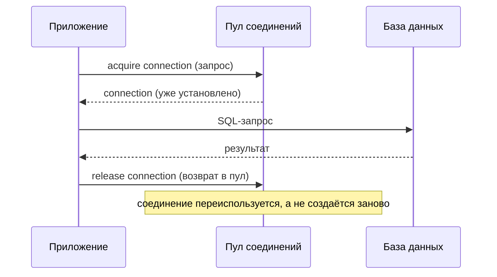
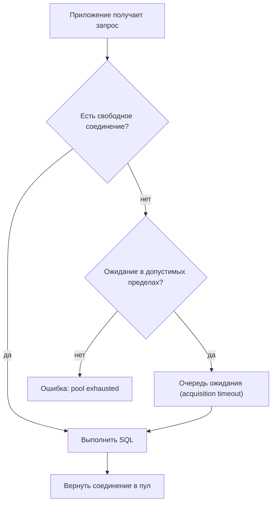

# Пулы соединений (Connection Pooling)

## Определение

**Connection pool (пул соединений)** — набор заранее установленных соединений с БД, переиспользуемых между запросами. Вместо создания нового TCP-подключения на каждый SQL-запрос приложение берёт свободное соединение из пула, выполняет работу и возвращает его. Пулы критичны, потому что установка соединения с БД (TCP+TLS+аутентификация) дорога и долгая.

## Зачем нужно

- **Скорость запросов** — соединение из пула берётся за доли миллисекунды, а не за 10–100 мс на установку.
- **Контроль нагрузки на БД** — максимальное число одновременных соединений ограничено (не бесконечны).
- **Стабильность** — БД имеет лимит соединений (`max_connections`); без пула каждый обработчик может занять всё.
- **Простота** — пулы дают готовые настройки: size, timeout, idle, health-check.
- **ИТФ-паттерн** — пулирование касается не только SQL, но и Redis/HTTP/gRPC соединений (см. Backpressure, Caching).

## Как работает

Ключевые параметры пула:

- **Min/max size** — сколько соединений держать (min) и максимум выдавать (max).
- **Acquisition timeout** — сколько ждать свободное соединение, прежде чем ошибка «pool exhausted».
- **Idle timeout** — сколько держать неиспользуемые соединения (закрывать для экономии).
- **Connection lifetime** — максимальный срок жизни соединения (для репликации/ротации/сброса состояния).
- **Health-check** — проверка живости соединения (ping / SQL), чтобы не выдавать «мёртвые».
- **Очередь ожидания** — при пике все соединения заняты; новые запросы ждут или падают.

Соединения **не создаются на каждый запрос**: они переиспользуются. Пул также помогает пережить всплески: полные пулы дают вежливый отказ или очередь вместо падения БД.





## Примеры кода

### TypeScript (pg-pool)

```typescript
import { Pool } from 'pg'

const pool = new Pool({
  connectionString: process.env.DATABASE_URL,
  // типичные значения для pg-pool
  max: 20,
  idleTimeoutMillis: 30_000,
  connectionTimeoutMillis: 2_000,
})

// берём соединение, работаем, возвращаем
export async function getUser(id: number) {
  const { rows } = await pool.query('SELECT * FROM users WHERE id = $1', [id])
  return rows[0]
}

// либо ручной честный acquire/release:
async function withClient<T>(fn: (c: import('pg').PoolClient) => Promise<T>): Promise<T> {
  const client = await pool.connect()
  try {
    return await fn(client)
  } finally {
    client.release()
  }
}
```

### Go (database/sql + pgxpool)

```go
package main

import (
	"context"
	"time"

	"github.com/jackc/pgx/v5/pgxpool"
)

func newPool(ctx context.Context, dsn string) (*pgxpool.Pool, error) {
	config, err := pgxpool.ParseConfig(dsn)
	if err != nil {
		return nil, err
	}
	config.MaxConns = 20
	config.MinConns = 2
	config.MaxConnLifetime = 30 * time.Minute
	config.MaxConnIdleTime = 5 * time.Minute
	config.HealthCheckPeriod = time.Minute

	pool, err := pgxpool.NewWithConfig(ctx, config)
	if err != nil {
		return nil, err
	}
	return pool, nil
}

// также: database/sql и GORM используют собственные пулы (sql.DB)
```

### Java (HikariCP - стандартный пул для Spring)

```java
// application.properties (Spring Boot + HikariCP - драфт по умолчанию)
// spring.datasource.hikari.maximum-pool-size=20
// spring.datasource.hikari.minimum-idle=5
// spring.datasource.hikari.connection-timeout=2000
// spring.datasource.hikari.idle-timeout=300000
// spring.datasource.hikari.max-lifetime=1800000

// Программно:
HikariConfig cfg = new HikariConfig();
cfg.setJdbcUrl("jdbc:postgresql://db/prod");
cfg.setMaximumPoolSize(20);
cfg.setMinimumIdle(5);
cfg.setConnectionTimeout(2_000);   // мс
cfg.setIdleTimeout(300_000);       // мс
cfg.setMaxLifetime(1_800_000);     // мс

HikariDataSource ds = new HikariDataSource(cfg);
```

## Пример использования: интеграция

> Практика: **выбор размера пула**, **мониторинг занятости**, **обработка пиков**.

### TypeScript (мониторинг пула)

```typescript
// метрики для Prometheus
export function poolMetrics() {
  return {
    totalCount: pool.totalCount,
    idleCount: pool.idleCount,
    waitingCount: pool.waitingCount,
  }
}

// alert если waitingCount > 0 длительное время - пул исчерпан
```

### Go (pgxpanics: пул и проблемы)

```go
// Если pool достиг лимита и время ожидания истекло - pgx вернёт
// ошибку "failed to acquire connection" (ErrPoolAcquireTimeout).
// Стоит логировать и алертить: waiting duration / queue length.

func Query(ctx context.Context, pool *pgxpool.Pool, sql string, args ...any) (pgx.Rows, error) {
	rows, err := pool.Query(ctx, sql, args...)
	if err != nil {
		// пик/пул исчерпан - записываем метрику
		metrics.Inc("pool_errors", err.Error())
		return nil, err
	}
	return rows, nil
}
```

### Java (калибровка размера пула)

```java
// Правила выбора max size для PostgreSQL:
// Postgres отдаёт максимум 1 воркер-процесс на соединение.
// Нет смысла ставить max > (число CPU × 4) в одно-модитном push конфиге.
//
// Правило на практику:
//   workers = ((cpu_count × 2) + 1)   // города и пики
//   max connections = workers (НЕ в сотни)
//
// Если приложение одно-Module-пул — 10-30 обычно достаточно.
public class PoolConfig {
    public static int suggestedMax(int cpuCount) {
        return (cpuCount * 2) + 1;
    }
}
```

## Паттерны использования

- **Адекватный max** — не «10 000»; ориентир (CPU × 2 + 1) или по метрикам очереди.
- **Мониторинг пула** — активность, idle, waiting, acquire-задержки (см. Monitoring).
- **Acquisition timeout** — разумный (1–2 с) — вместо вечного ожидания падать/возвращать 503.
- **Health-check** — проверять живость соединения (pgx HealthCheckPeriod, Hikari validation).
- **Один пул на сервис** — не создавать новый пул на каждый запрос (против прод падения).
- **Connection lifetime** — ограничивать (15–30 мин) для балансировки в БД-кластерах.

## Антипаттерны и ловушки

- **Пул на каждый запрос** — создание пула дороже соединения: утечка и штраф.
- **max на сотни соединений** — БД падает от количества процессов/памяти (each conn = процесс в PG).
- **Слишком маленький acquisition timeout** — при умеренном пике появляются ошибки «нет соединения».
- **Забыть release/close** — держим соединение из пула вечно (утечки пула).
- **Долгие queries в пуле** — медленный запрос занимает соединение долго → pool exhausted быстрее.
- **Игнорировать waiting count** — пул исчерпан давно, а метрики не смотрят.

## Когда использовать / когда НЕ использовать

**Использовать:**
- Все SQL-сервисы (Postgres, MySQL): без пула каждый запрос платит за установку соединения.
- Также для Redis, HTTP keep-alive, gRPC — где повторное соединение дорого.

**НЕ использовать (или пересмотреть):**
- Когда соединения дешёвые и короткие, а пики редки (микросервис с единичными вызовами БД).
- Когда сетевое брокер.Ошибки простого ideal — свои pool под лёгкие колл-холдеры.

## Связанные темы

- **N+1** — много мелких запросов создают искусственную нагрузку на пул.
- **Query Optimization** — чем быстрее запросы, тем меньше занятых соединений.
- **Read Replicas / Replication** — нагрузка на чтение распределяется, пул к каждому DB.
- **Monitoring** — метрики пула (waiting, idle) — индикатор проблем.
- **Timeouts / Backpressure** — acquire-timeout и вежливый сброс при исчерпании.

## Вопросы

### Q1
**Зачем нужен пул соединений?**

- [ ] Чтобы хранить данные
- [x] Чтобы переиспользовать дорогие соединения с БД вместо создания на каждый запрос
- [ ] Чтобы увеличить число процессов
- [ ] Чтобы сортировать запросы

Пояснение: установка соединения (TCP+TLS+auth) дорога; пул держит готовые соединения и выдаёт их на время запроса.

### Q2
**Что произойдёт, если все соединения пула заняты?**

- [ ] БД сама поднимется
- [x] Запросы ждут освобождения (в пределах acquisition timeout) или получают ошибку «pool exhausted»
- [ ] Новые соединения создаются мгновенно без последствий
- [ ] Ничего, пул бесконечен

Пояснение: pool ограничен; при перезагрузке запрос встаёт в очередь ожидания, а по таймауту — ошибка вместо бесконечной задержки.

### Q3
**Почему пул размером «1000 соединений» — плохо для Postgres?**

- [ ] Не хватит памяти клиентов
- [x] Каждое соединение занимает процесс/память в БД; 1000 соединений уронят БД
- [ ] Пул должен быть пустым
- [ ] PostgreSQL не поддерживает пулы

Пояснение: в Postgres каждое соединение — отдельный backend-процесс с памятью; огромный пул деградирует БД, а не ускоряет.

### Q4
**Что делает acquisition timeout?**

- [ ] Закрывает все соединения
- [ ] Поднимает БД
- [x] Ограничивает время ожидания свободного соединения из пула (иначе ошибка)
- [ ] Увеличивает число соединений

Пояснение: без таймаута запросы висят в очереди вечно; acquisition timeout превращает это в управляемую ошибку за приемлемый интервал.

### Q5
**Что измерять первым делом при «нет соединений»?**

- [ ] CPU сервера
- [x] waiting/active/idle метрики пула и медленные запросы
- [ ] Объём диска
- [ ] Кодировку

Пояснение: метрики пула (active≈max, waiting растёт) и медленный запрос прямо показывают причину исчерпания.

## Источники

- PostgreSQL — Connection and Auth: https://www.postgresql.org/docs/current/connectivity.html
- HikariCP — About JDBC Connection Pooling: https://github.com/brettwooldridge/HikariCP#correctness
- pgxpool (pgx) — pool manager: https://pkg.go.dev/github.com/jackc/pgx/v5/pgxpool
- node-postgres — Pool: https://node-postgres.com/features/pooling