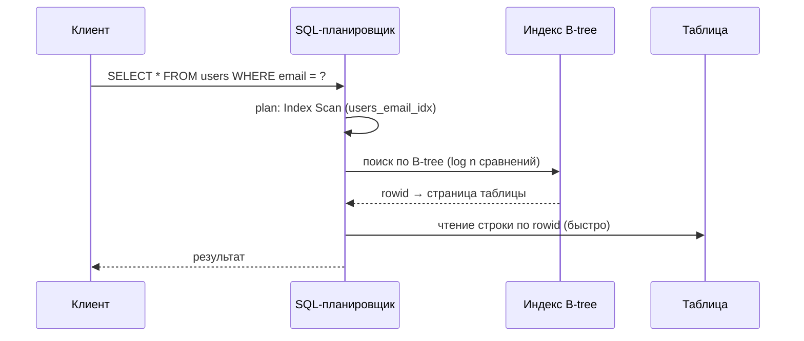
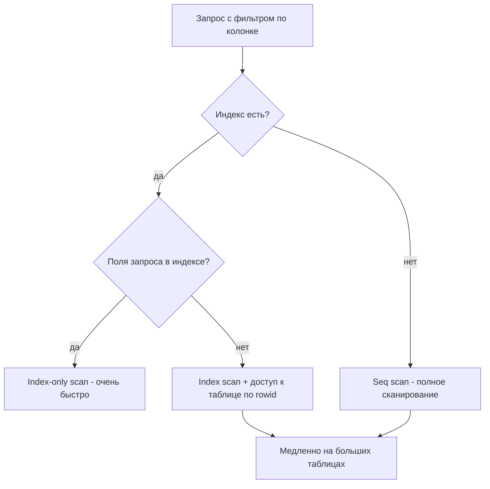

# Индексация баз данных

## Определение

**Index (индекс)** — дополнительная структура данных в БД, которая ускоряет поиск, сортировку и получение данных по отдельным колонкам ценой дополнительного места и затрат на запись. Самый распространённый — **B-tree** (почти все СУБД: Postgres, MySQL InnoDB, Oracle): поддерживает точечные запросы, диапазоны и сортировку. Для полнотекстового поиска и JSON-полей используются другие типы (GIN, глобальные индексы).

## Зачем нужно

- **Ускорение SELECT** — поиск по B-tree вместо полного сканирования таблицы: O(log n) вместо O(n).
- **Сортировка и диапазоны** — `WHERE`, `ORDER BY`, `BETWEEN`, `>` удобны если колонка проиндексирована.
- **Уникальность** — UNIQUE-индекс гарантирует неповторяемость значений колонки.
- **JOIN** — соединение по индексированной колонке значительно быстрее.
- **Покрывающий индекс** — когда все нужные поля уже в индексе, таблица не читается вовсе (index-only scan).

## Как работает

- **B-tree** — многоуровневое дерево: быстрый поиск, вставка, удаление и обход в порядке возрастания. Листья ссылаются на строчки таблицы (или содержат значения для покрывающего индекса).
- **Clustered index** — порядок данных в таблице совпадает с порядком индекса (MySQL InnoDB: primary key — clustered).
- **Covering index / index-only scan** — если запросные поля целиком в индексе, таблицу открывать не нужно.
- **Составной индекс** — (a, b, c): работает для a, (a, b), (a, b, c); НЕ для b или c без старших колонок (leftmost prefix).
- **Селективность** — чем меньше строк отвечает колонка, тем полезнее индекс (id — высокая, пол/статус — низкая).
- **Влияние на запись** — каждая вставка/обновление обновляет индекс (Overhead -> Index is a price).

Принцип поиска по B-tree:





## Примеры кода

### SQL (создание базовых индексов)

```sql
-- простой индекс на колонке
CREATE INDEX idx_users_email ON users (email);

-- уникальный индекс (уникальность на уровне БД)
CREATE UNIQUE INDEX idx_users_phone ON users (phone);

-- составной (для запросов по (status, created_at))
CREATE INDEX idx_orders_status_created ON orders (status, created_at);
```

### TypeScript (Prisma: индекс в схеме)

```typescript
model User {
  id    Int    @id @default(autoincrement())
  email String @unique      // UNIQUE-индекс автоматически
  phone String

  @@index([phone])          // обычный индекс
  @@index([status, createdAt]) // составной
}
```

### Go (GORM: индекс через теги)

```go
package models

type User struct {
	ID    uint   `gorm:"primarykey"`
	Email string `gorm:"uniqueIndex"`        // UNIQUE
	Phone string `gorm:"index"`              // обычный
	Status string `gorm:"index:idx_status_created"` // составной
	CreatedAt time.Time `gorm:"index:idx_status_created"`
}
```

### Java (Spring Data / JPA: индекс в сценарии)

```java
// Аннотационно в JPA (Hibernate) - через @Table(uniqueConstraints) 
// и миграции Liquibase/Flyway
@Entity
@Table(
    indexes = {
        @Index(name = "idx_users_email", columnList = "email"),
        @Index(name = "idx_users_phone", columnList = "phone")
    }
    // uniqueConstraints = { @UniqueConstraint(columnNames = "email") }
)
public class User {
    @Id @GeneratedValue
    private Long id;
    private String email;
    private String phone;
}
```

## Пример использования: интеграция

> Практика: **EXPLAIN**, **медленные запросы**, **индексы под реальные паттерны**.

### SQL (проверка плана выполнения)

```sql
-- смотрим план: используется ли индекс
EXPLAIN ANALYZE
SELECT * FROM orders WHERE user_id = 42 AND created_at > NOW() - INTERVAL '30 days';

-- если Seq Scan - колонки не проиндексированы, добавляем:
CREATE INDEX idx_orders_user_created ON orders (user_id, created_at);
-- повторяем EXPLAIN: Index Scan
```

### TypeScript (логирование медленных запросов)

```typescript
// Postgres: pg_stat_statement - найти медленные запросы
// SELECT calls, total_exec_time, mean_exec_time
// FROM pg_stat_statements ORDER BY mean_exec_time DESC LIMIT 10;

// далее - проверить EXPLAIN(ANALYZE) для первого из списка
export async function findSlowQueries(limit = 10) {
  // через подключение PG (pg-пакет)
  const { rows } = await pool.query(`
    SELECT query, calls, total_exec_time,
           total_exec_time / calls AS mean_ms
    FROM pg_stat_statements
    ORDER BY mean_ms DESC
    LIMIT $1
  `, [limit])
  return rows
}
```

### Go (руководство: как не забыть индекс)

```go
// В команду "проверка перед релизом"
func checkIndex(dsn string) error {
	// SELECT indexname FROM pg_indexes WHERE tablename = 'orders'
	// сверять с обязательным списоком (user_id, created_at, status)
	// если отсутствует - предупредить в CI
	return nil // заглушка
}
```

### Java (модуль поиска: индексы + покрывающий запрос)

```java
// JPA: Аннотация @Query с большим покрытием - SELECT нужных колонок
public interface UserRepository extends JpaRepository<User, Long> {
    // покрывающий индекс ускоряет запрос: выбираем только проиндексированные поля
    @Query("select u.id, u.email from User u where u.status = :status and u.role = :role")
    List<Object[]> findLight(@Param("status") String status, @Param("role") String role);
}
```

## Паттерны использования

- **Индексировать поля фильтров и JOIN** — `WHERE`, `ON`, `ORDER BY` колонки, которые реально используются.
- **Составные индексы по leftmost prefix** — ставить самый селективный префикс первым.
- **Покрывающие индексы под горячие запросы** — index-only scan экономит чтение таблицы.
- **UNIQUE для бизнес-ключей** — email/phone/внешний идентификатор на уровне БД.
- **Мониторинг в проде** — `pg_stat_statements`, медленные логи (см. Monitoring).
- **Индекс не панацея от плохой схемы** — часто помогает нормализация/денатурализация.

## Антипаттерны и ловушки

- **Индекс на колонке с низкой селективностью** — `status`/`boolean` — почти не ускоряет, только тратит место.
- **Слишком много индексов** — каждая запись обновляет все индексы таблицы (degradation на INSERT/UPDATE).
- **Индексы на каждой колонке «на всякий случай»** — лучше консинтанс реальных запросов.
- **Составной индекс с неправильным порядком** — (a, b) бесполезен для запросов только по b.
- **Функции в WHERE без функционального индекса** — `WHERE lower(email) = ?` не использует обычный индекс.
- **Индекс как причина «нет места»** — большие B-tree кратно размеру таблицы.

## Когда использовать / когда НЕ использовать

**Использовать:**
- Горячие выборки по колонке (авторизация по email, заказы по user_id).
- Медленные запросы из мониторинга (EXPLAIN показывает Seq Scan).

**НЕ использовать (или пересмотреть):**
- Частозаписываемые таблицы с множеством индексов без явной пользы.
- Колонки-дихотомии (пол, is_active) сами по себе.
- Если запрос можно решить покрывающим индексом — не плодить просто индексы.
- Полнотекстовый поиск — обычный B-tree не подходит; нужен GIN/trie/fulltext.

## Связанные темы

- **Query Optimization** — индексы — главный инструмент планировщика.
- **N+1** — отсутствие индекса на FK усугубляет проблему циклов запросов.
- **Partitioning / Sharding** — масштабирование больших таблиц, индексы становятся локальными.
- **Replication** — индексы имеют по одной копии на каждой реплике (overhead).
- **Database Migrations** — создание индексов через миграции, блокирующие/неблокирующие.

## Вопросы

### Q1
**Что даёт B-tree индекс при `WHERE type = ?`?**

- [ ] Ничего
- [x] Доступ к данным за O(log n) вместо полного сканирования
- [ ] Меньше места в БД
- [ ] Гарантию уникальности

Пояснение: B-tree ускоряет точечный поиск и диапазоны; полное сканирование — O(n), индексированный поиск — O(log n).

### Q2
**Почему индекс полезен для `ORDER BY created_at`?**

- [ ] Потому что сортировка копится
- [x] B-tree упорядочен, поэтому обход в возрастающем порядке не требует сортировки
- [ ] Индекс хранит данные в дубле
- [ ] Планировщик всегда читает индекс

Пояснение: B-tree поддерживает упорядоченный обход листьев — ORDER BY может быть удовлетворён без отдельного Sort step.

### Q3
**Что значит «leftmost prefix» у составного индекса?**

- [ ] Индекс работает слева направо мгновенно
- [x] Индекс можно использовать только по префиксу колонок (a, a+b, a+b+c), начиная с самой левой
- [ ] Сортировка идёт только по последней колонке
- [ ] Индекс всегда занимает в 2 раза больше места

Пояснение: (a, b, c) работает для фильтров по a, (a,b), (a,b,c); запрос только по b или c индекс не использует.

### Q4
**Какая колонка НЕ подходит под обычный индекс?**

- [ ] id пользователя
- [x] boolean-флаг (is_active, deleted) — низкая селективность
- [ ] email
- [ ] timestamp created_at

Пояснение: значения с малой селективностью (2-3 варианта) почти не уменьшают выборку — индекс почти бесполезен, но добавляет overhead.

### Q5
**Почему много индексов вредно для записи?**

- [ ] Они ускоряют запись
- [x] Каждая вставка/обновление обновляет все индексы таблицы
- [ ] Индексы занимают место только при чтении
- [ ] Запись не зависит от индексов

Пояснение: каждый индекс — отдельная структура, которую нужно обновлять при записи; слишком много индексов деградируют INSERT/UPDATE.

## Источники

- PostgreSQL — Indexes (документация): https://www.postgresql.org/docs/current/indexes.html
- MySQL — How InnoDB Uses Clustered Indexes: https://dev.mysql.com/doc/refman/8.0/en/innodb-index-types.html
- PostgreSQL — pg_stat_statements: https://www.postgresql.org/docs/current/pgstatstatements.html
- INDEX-синтаксис SQL (Wikipedia): https://en.wikipedia.org/wiki/Database_index