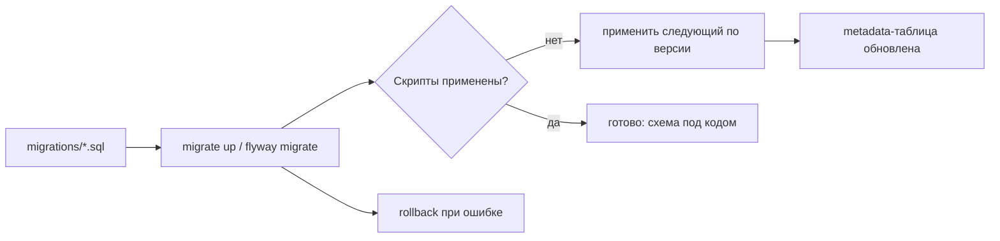
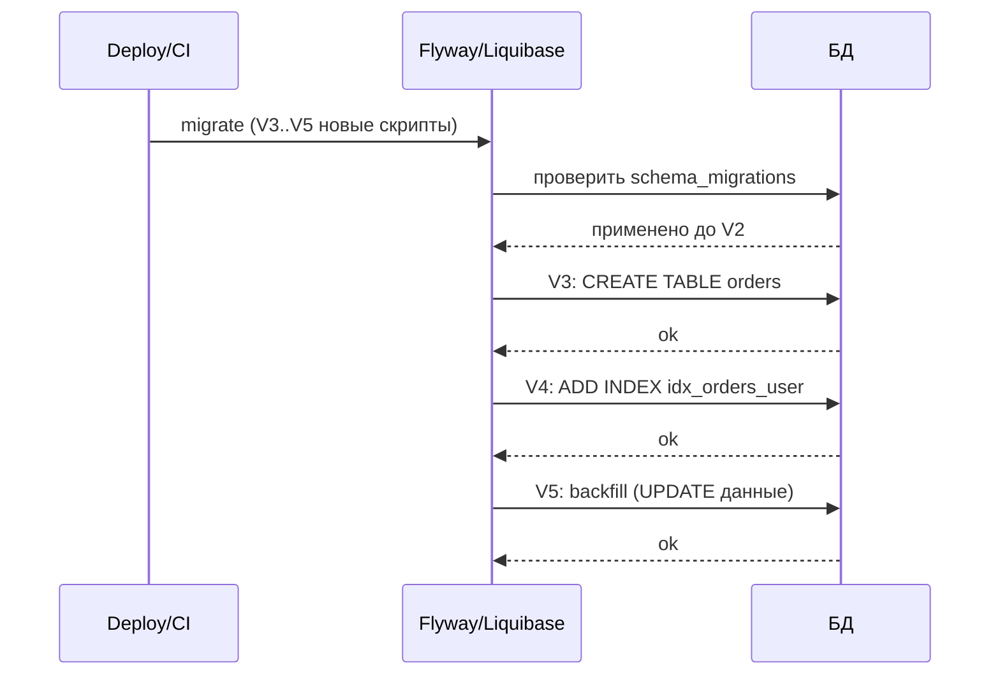

# Миграции баз данных

## Определение

**Database migration (миграция)** — управляемое, версионированное изменение схемы БД: создание/изменение таблиц, индексов, данных. Каждое изменение — отдельный скрипт (например, `V2__add_orders_table.sql`), применяемый по порядку версий. Миграции версионируются вместе с кодом приложения и запускаются при деплое. Инструменты: Flyway, Liquibase (Java), Node (knex, umzug, db-migrate), Go (goose, golang-migrate).

## Зачем нужно

- **Консистентность окружений** — DEV/STAGE/PROD получают одинаковую схему, без ручных правок.
- **Версионирование схемы** — известно, какая версия накатана (metadata-таблица).
- **Деплой с минимумом простоев** — изменения применяют в порядке версии (см. Zero-Downtime).
- **Воспроизводимость** — новичок поднимает БД одной командой.
- **Откат (rollback)** — при баге можно вернуться к предыдущей схеме (история).

## Как работает

- **Скрипты с версиями** — `V<номер>__<имя>.sql`; применяются в лексикографическом порядке версий.
- **Metadata-таблица** — `flyway_schema_history` / `schema_migrations` — запись «какая версия применена».
- **Определение «применено/нет»** — сверка номеров, hash, timestamp.
- **Транзакционность** — миграция применяется в транзакции (где СУБД позволяет; DDL в PSQL транзакционен, MySQL DDL — нет).
- **Обратная (rollback)** — Flyway U-версии или Liquibase rollback; альтернатива — новая forward-миграция.
- **Автоматизация** — `flyway migrate`/`migrate up` на CI; проверка «drift» на этапах.

Совет: редкие сложные миграции — через отдельные шаги, тестировать на стейдже, не менять историю (для продакшена — forward-fix).





## Примеры кода

### SQL (Flyway-миграция)

```sql
-- V3__create_orders.sql
CREATE TABLE orders (
    id          bigserial PRIMARY KEY,
    user_id     bigint NOT NULL REFERENCES users(id),
    total       numeric(12,2) NOT NULL,
    status      text NOT NULL DEFAULT 'pending',
    created_at  timestamptz NOT NULL DEFAULT now()
);

CREATE INDEX idx_orders_user_id ON orders (user_id);

-- backfill отдельная миграция (V4__backfill_status.sql)
UPDATE orders SET status = 'created' WHERE status IS NULL;
```

### TypeScript (knex/umzug-миграция)

```typescript
// 20260917_create_orders.ts (umzug)
import type { Migration } from 'umzug'

export const up: Migration = async ({ context: knex }) => {
  await knex.schema.createTable('orders', (t) => {
    t.bigIncrements('id')
    t.bigint('user_id').references('users.id')
    t.decimal('total')
    t.string('status').defaultTo('pending')
    t.timestamp('created_at').defaultTo(knex.fn.now())
  })
  await knex.schema.alterTable('orders', (t) => {
    t.index('user_id')
  })
}
export const down: Migration = async ({ context: knex }) => {
  await knex.schema.dropTable('orders')
}
```

### Go (goose/golang-migrate)

```go
package migrations

// 000003_create_orders.up.sql (goose)
// CREATE TABLE orders (...)

// 000003_create_orders.down.sql
// DROP TABLE orders;

// программный запуск (golang-migrate)
import (
	"github.com/golang-migrate/migrate/v4"
	_ "github.com/golang-migrate/migrate/v4/database/postgres"
	_ "github.com/golang-migrate/migrate/v4/source/file"
)

func Run() error {
	m, err := migrate.New("file://migrations", "postgres://...")
	if err != nil {
		return err
	}
	return m.Up()
}
```

### Java (Flyway в Spring Boot)

```java
// spring.flyway.enabled=true
// src/main/resources/db/migration/V3__create_orders.sql
// Flyway применяет миграции автоматически при старте приложения.

@Configuration
@EnableScheduling
public class MigrationsConfig {
    // дополнительно: запускать миграции строго до выхода в production-трафик
    // (см. Zero Downtime Deploys: выкатываем миграции раньше приложения)
}
```

## Пример использования: интеграция

> Практика: **версия-в-коде**, **флаги приема**, **expanding-contracting миграции**, **forward-fix вместо редактирования старых скриптов**.

### SQL (keep-forward принцип)

```sql
-- Никогда не редактируй V3 после продакшена.
-- Баг → новая миграция V6__fix_orders_data.sql:

UPDATE orders SET status = 'created'
WHERE status = 'pending' AND total = 0;

-- падение прода : forward-fix, не rollback старого скрипта.
```

### TypeScript (миграция данных с прогрессом)

```typescript
// Переход к новому формату позволяет поэтапно:
// 1) миграция добавляет колонку (forward-compatible)
// 2) приложение пишет в оба поля
// 3) бэкфилл строк
// 4) удалить старое поле (отдельная миграция)
export async function up(knex: Knex) {
  await knex.schema.alterTable('users', (t) => {
    t.string('email_normalized').nullable() // шаг 1
  })
  // шаг 3 - выполняется за пределами синхронно
}
```

### Go (проверка миграций в CI)

```go
// CI: прогон Migrate на пустой БД → schema_migrations вся применена
func VerifyMigrations(t *testing.T, ds string) {
	m, err := migrate.New("file://migrations", ds)
	if err != nil { t.Fatal(err) }
	err = m.Up()
	if err != nil && err != migrate.ErrNoChange { t.Fatal(err) }
	v, dirty, err := m.Version()
	if err != nil { t.Fatal(err) }
	if dirty { t.Fatal("dirty state") }
	t.Logf("schema version: %v", v)
}
```

## Паттерны использования

- **Один скрипт — одно изменение** — мелкие миграции легче ревью и отката.
- **Миграции в репозитории с кодом** — единый источник истины для схемы.
- **Проверка на чистой БД** — CI гоняет все миграции с нуля (дрейф-детекция).
- **Forward-only в долгоживущих системах** — новые версии скриптов вместо правки старых.
- **Разделение schema/data** — DDL отдельно, backfill отдельно (по шагам).
- **Zero-downtime** — новые колонки nullable/с default; миграции до релиза кода.

## Антипаттерны и ловушки

- **Редактировать старые миграции** — сломает применённые окружения и откаты.
- **DDL без теста** — тяжёлая ALTER на гигантской таблице (ADD COLUMN NOT NULL) заблокирует БД.
- **Миграции в ручную на проде** — рассинхрон кода и схемы.
- **Не использовать транзакции** (где возможно) — partial apply при ошибке.
- **Fake-успех** — заметить ошибку миграции и не накатить следующие.
- **Держать schema-managed внешние секции** — DDL в миграцию, не руками в консоли.

## Когда использовать / когда НЕ использовать

**Использовать:**
- Любая БД с кодом приложения (выше MVP). Миграции — обязательный early-level стандарт.
- Схемы, меняющиеся вместе с фичами (добавление колонок, таблицы).

**НЕ использовать (или пересмотреть):**
- Совсем прототипы без персистентности (in-memory, одноразовый код).
- Полностью schema-less хранилища (просто JSON без структуры) — но тогда все равно управление ролями/индексами.

## Связанные темы

- **Версионирование схем** — как миграции кодируют состояние схемы.
- **Database Indexing** — индексы добавлять через миграции, не руками.
- **Zero Downtime Deploys** — порядок миграций и деплоя.
- **Partitioning** — создание партиций через миграции.
- **Feature Flags** — переключение нового кода вместе со схемой.

## Вопросы

### Q1
**Что делает инструмент миграций?**

- [ ] Кэширует запросы
- [x] Применяет версионированные скрипты изменений схемы по порядку
- [ ] Оптимизирует индексы
- [ ] Чистит логи

Пояснение: миграции накатывают изменения схемы версии за версией, фиксируют в metadata-таблице.

### Q2
**Зачем metadata-таблица (schema_migrations)?**

- [ ] Для мусора
- [x] Для отслеживания, какая версия миграции уже применена
- [ ] Для индексов
- [ ] Для кэша

Пояснение: инструмент сверяет применённые номера/хеш и применяет только новые.

### Q3
**Как исправить баг в уже применённой миграции на проде?**

- [ ] Отредактировать старый скрипт
- [x] Новая forward-миграция с фиксом
- [ ] Вручную в psql
- [ ] Удалить таблицу

Пояснение: правка применённого скрипта сломает окружения; правильная практика - forward-fix новым скриптом.

### Q4
**Что делать с ADD COLUMN NOT NULL на большой таблице?**

- [ ] Ничего не делать
- [ ] Выполнять без подготовки
- [x] Сначала nullable/дефолт, потом backfill, потом constraint (по шагам)
- [ ] Дисконнектить приложение

Пояснение: мгновенный NOT NULL может заблокировать таблицу и продакшн; применяют многошаговый подход.

### Q5
**Какой роллбэк стандартен для forward-only миграций?**

- [ ] Rollback всегда авто
- [ ] Удалять старые версии
- [x] Компенсирующая forward-миграция (новый скрипт, откат ролью не обязателен)
- [ ] Игнорировать ошибки

Пояснение: в долгоживущих системах правка/rollback старых версий опасна; проще новая миграция "в обратную".

## Источники

- Flyway documentation: https://flywaydb.org/documentation/
- Liquibase overview: https://docs.liquibase.com/concepts/introduction-to-liquibase.html
- Schema migration pattern — Designing Data-Intensive Applications (Kleppmann)
- GitHub — golang-migrate: https://github.com/golang-migrate/migrate