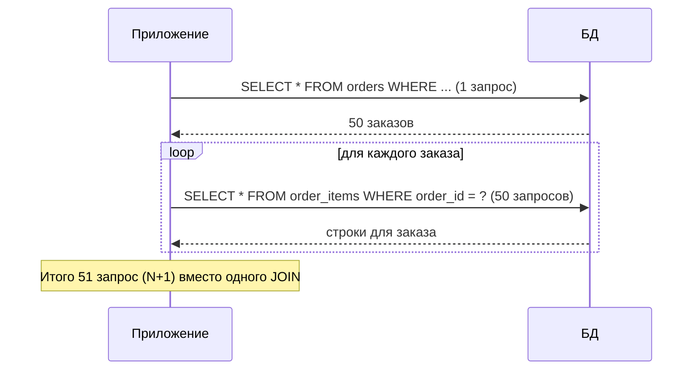
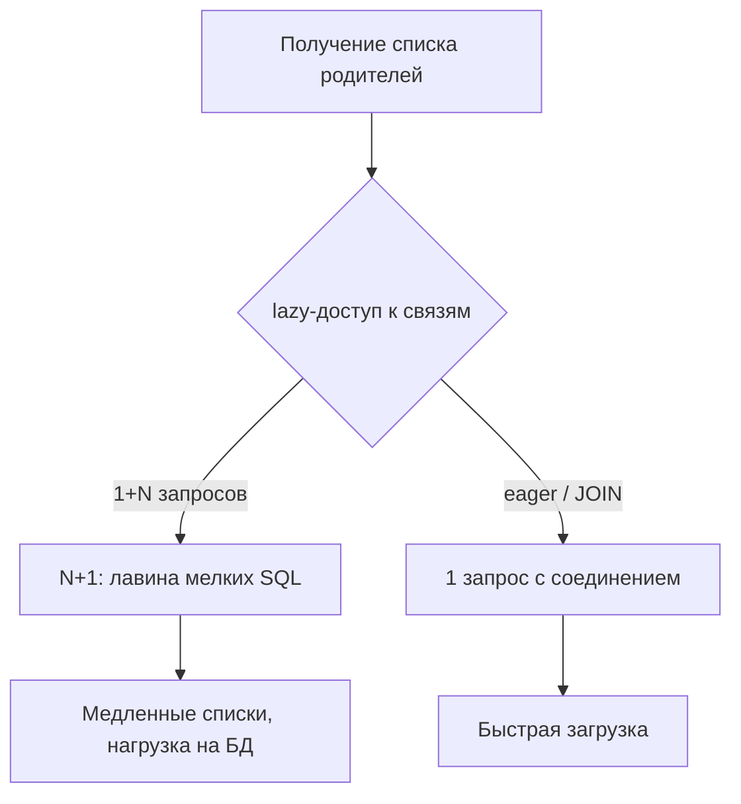

# N+1 запросов

## Определение

**N+1 query problem (проблема N+1)** — когда для загрузки N сущностей и их связанных данных выполняется 1 запрос на сущности + N запросов на связи (по одному на каждую строку). Возникает в ORM при **lazy-loading** (ленивой подгрузке): 100 заказов → 101 запрос вместо одного `JOIN`. Симптом: медленные списки, лавина лёгких обращений к БД.

## Зачем нужно

- **Ускорение списков и деталей** — одна страница с 50 заказами не должна порождать 50+ SQL.
- **Защита БД** — меньше запросов — меньше нагрузка и latency (см. Query Optimization).
- **Понимание ORM** — знать, когда ORM «тихо» делает лишние запросы.
- **Предсказуемость нагрузки** — метрики «запросов на запрос» помогают найти N+1.
- **Правильные инструменты** — eager loading, JOIN, бэтч-загрузка.

## Как работает

Суть N+1:

- ORM при `repo.findAll()` возвращает коллекцию родительских сущностей — 1 запрос.
- При обращении к ленивой связи (`order.items`, `user.profile`) ORM подгружает данные **отдельным запросом на каждый объект** — N запросов.
- Итого 1 + N обращений к БД вместо одного запроса с `JOIN`.

Причины:

- **Lazy-loading** — связь грузится только при доступе из кода; в цикле это N запросов.
- **Доступ к связи в «позднем» месте** — сервис вернул сущности, а связь дёргается в представлении/маппере.
- **Отсутствие batch-size** — даже при batch ORM не всегда группирует подгрузки.
- **Нет индекса на FK** — каждый под-запрос выполняется как Seq Scan.

Методы фикса:

- **Eager loading** — грузить связи сразу (`JOIN FETCH` в JPA, `include` в Prisma, `Preload` в GORM).
- **JOIN** — один запрос с соединением.
- **Бэтч по id** — собрать id родителей, затем один `WHERE id IN (...)`, смапить в памяти.
- **Batch-size** — группы подгрузки (Hibernate `@BatchSize`).





## Примеры кода

### SQL (правильный путь: один JOIN)

```sql
-- Плохо: по запросу на каждый заказ:
--   SELECT * FROM order_items WHERE order_id = <каждый id>
-- Один запрос вместо N+1:
SELECT o.id, oi.*
FROM orders o
LEFT JOIN order_items oi ON oi.order_id = o.id
WHERE o.user_id = ?
ORDER BY o.id;
```

### TypeScript (Prisma: include связей)

```typescript
// Плохо: грузим заказы, потом по каждому дёргаем items
export async function findOrdersSlow(userId: number) {
  const orders = await prisma.order.findMany({ where: { userId } })
  // для каждого заказа - отдельный запрос к items
  return Promise.all(
    orders.map(async (o) => ({
      ...o,
      items: await prisma.orderItem.findMany({ where: { orderId: o.id } }),
    })),
  ) // N+1!
}

// Хорошо: include заранее - один JOIN
export async function findOrdersFast(userId: number) {
  return prisma.order.findMany({
    where: { userId },
    include: { items: true }, // один запрос с соединением
  })
}
```

### Go (GORM: Preload)

```go
package repo

import "gorm.io/gorm"

type OrderRepository struct{ db *gorm.DB }

// Плохо: ленивый доступ к Items в цикле (N+1)
func (r OrderRepository) FindSlow(userID uint) []Order {
	var orders []Order
	r.db.Where("user_id = ?", userID).Find(&orders)
	for i := range orders {
		r.db.Model(&orders[i]).Association("Items").Find(&orders[i].Items) // N запросов
	}
	return orders
}

// Хорошо: Preload - один запрос за раз
func (r OrderRepository) FindFast(userID uint) []Order {
	var orders []Order
	r.db.Preload("Items").Where("user_id = ?", userID).Find(&orders)
	return orders
}
```

### Java (JPA: JOIN FETCH)

```java
@Repository
public interface OrderRepository extends JpaRepository<Order, Long> {

    // Плохо: ленивый доступ к items в цикле (N+1)
    List<Order> findByUserId(Long userId);

    // Хорошо: JOIN FETCH подгружает items одним запросом
    @Query("select o from Order o join fetch o.items where o.userId = :userId")
    List<Order> findByUserIdWithItems(@Param("userId") Long userId);

    // Альтернатива: @EntityGraph
    @EntityGraph(attributePaths = "items")
    @Query("select o from Order o where o.userId = :userId")
    List<Order> findByUserIdGraph(@Param("userId") Long userId);
}
```

## Пример использования: интеграция

> Практика: **эгеg-loading для read-модели**, **batch для больших наборов**, **метрики запросов**.

### TypeScript (batch-загрузка вместо N+1)

```typescript
export async function getOrdersWithStats(userIds: number[]) {
  // 1) один запрос: все заказы
  const orders = await prisma.order.findMany({
    where: { userId: { in: userIds } },
  })

  // 2) один запрос: все items по собранным orderId (id IN ...)
  const orderIds = orders.map((o) => o.id)
  const items = await prisma.orderItem.findMany({ where: { orderId: { in: orderIds } } })

  // 3) мапрапим в памяти - сеть/память, но только 2 SQL
  const byOrder = new Map(items.map((i) => [i.orderId, i]))
  return orders.map((o) => ({ ...o, items: byOrder.get(o.id) }))
}
```

### Go (batch через Preload с условиями)

```go
// Preload с join-условием: подгрузить только активные items одним запросом
func (r OrderRepository) FindActive(userID uint) []Order {
	var orders []Order
	r.db.Preload("Items", "is_active = ?", true).
		Where("user_id = ?", userID).
		Find(&orders)
	return orders
}
```

### Java (Hibernate batch-size)

```java
// entity:
@Entity
class Order {
    @Id private Long id;

    // Hibernate подгружает ленивые связи пакетами по 100, а не по 1
    @BatchSize(size = 100)
    @OneToMany(mappedBy = "order")
    private List<Item> items;
}
```

## Паттерны использования

- **Eager loading для read-моделей** — списки и детали грузить с JOIN (без ленивых связей).
- **JOIN FETCH / include / Preload** — явно декларировать связи в read-запросах.
- **Батч по id (id IN (...))** — для N>100 подгружать пакетно, а не по одному.
- **Batch-size в ORM** — Hibernate @BatchSize, Prisma hint, GORM Preload.
- **Метрики «запросов на запрос»** — логировать и отслеживать; это первый индикатор N+1.
- **Не грузить лишние связи** — только те, что используются в реальном сценарии.

## Антипаттерны и ловушки

- **Циклы `for` с lazy-доступом** — классическая лавина подзапросов.
- **Доступ к связи после отправки ответа** — сущности «оживают» позже, где их сканируют.
- **Отсутствие индекса на FK** — каждая подзагрузка делает Seq Scan: катастрофа.
- **JOIN на 1:N с множественными коллекциями** — возможно дублирование строк; аккуратно с кардинальностью.
- **Пере-грузить все связи разом** — eager-loading всего подряд загружает тонны неиспользуемых данных.
- **«Поможем» маппингом после ORM** — если ленивые связи остались, late access повторит N+1 в хранилище.

## Когда использовать / когда НЕ использовать

**Использовать:**
- Все read-пути (списки, детали, отчёты) с eager-loading или JOIN.
- DTO-проекции вместо целых сущностей, когда нужны лишь несколько полей.

**НЕ использовать (или пересмотреть):**
- Lazy-loading в циклах и «на всякий случай».
- Каскадную загрузку всех связей без понимания, что используется.
- ORM-магию там, где лучше явный SQL-запрос (тяжёлые отчёты).

## Связанные темы

- **Query Optimization** — N+1 — один из источников «медленных запросов».
- **Database Indexing** — индекс на FK решает сторону подзапросов.
- **Connection Pooling** — много мелких запросов = лишние round-trip в пуле.
- **Performance** — общий подход к латенси запросной части.
- **Monitoring** — метрики запросов в проде помогают найти N+1.

## Вопросы

### Q1
**Что такое проблема N+1?**

- [ ] Слишком длинный запрос
- [x] 1 запрос на сущности + N запросов на каждую связанную запись (через ленивую подгрузку)
- [ ] Ошибка парсинга SQL
- [ ] N+1 таблиц в базе

Пояснение: N+1 — когда ORM подгружает связи по одной за раз: 100 заказов порождают 100 запросов к items.

### Q2
**Почему lazy-loading в цикле вызывает N+1?**

- [ ] Потому что ORM кэширует
- [x] При каждом обращении к связи ORM выполняет отдельный запрос для текущего объекта
- [ ] Потому что JOIN запрещён
- [ ] Потому что индексы не нужны

Пояснение: ленивая связь подгружается по требованию — при переборе коллекции для каждой строки выполняется свой SQL.

### Q3
**Какой приём убирает N+1 при списке заказов с items?**

- [ ] Добавить индекс на user_id
- [x] JOIN FETCH / include / Preload — загрузить связи одним запросом
- [ ] Увеличить пул соединений
- [ ] Использовать только селекты по id

Пояснение: eager-загрузка выполняет один запрос с соединением вместо N отдельных подзапросов.

### Q4
**Что даёт @BatchSize в Hibernate?**

- [ ] Ускоряет компиляцию
- [x] Подгружает ленивые связи пакетами по N, а не по одному
- [ ] Запрещает ленивые связи
- [ ] Меняет план SQL через индексы

Пояснение: @BatchSize агрегирует подзапросы в пачки (IN (...)), сокращая число обращений к БД.

### Q5
**Какой индикатор выявляет N+1 в проде?**

- [ ] Рост CPU компилятора
- [x] Метрика «запросов на запрос»: при загрузке 100 сущностей NV запросов
- [ ] Количество индексов
- [ ] Размер SQL-лога

Пояснение: метрика "queries per request" (или лог Hibernate) прямо показывает скачок числа SQL на один HTTP-запрос.

## Источники

- Hibernate — fetching strategies (JPA): https://docs.jboss.org/hibernate/orm/6.2/userguide/html_single/Hibernate_User_Guide.html#fetching
- Prisma — relations (include vs select): https://www.prisma.io/docs/orm/prisma-client/queries/relation-queries
- GORM — Preload (eager loading): https://gorm.io/docs/preload.html
- Common N+1 explanation (Stack Overflow): https://stackoverflow.com/questions/97197/what-is-the-n1-selects-problem-in-orm