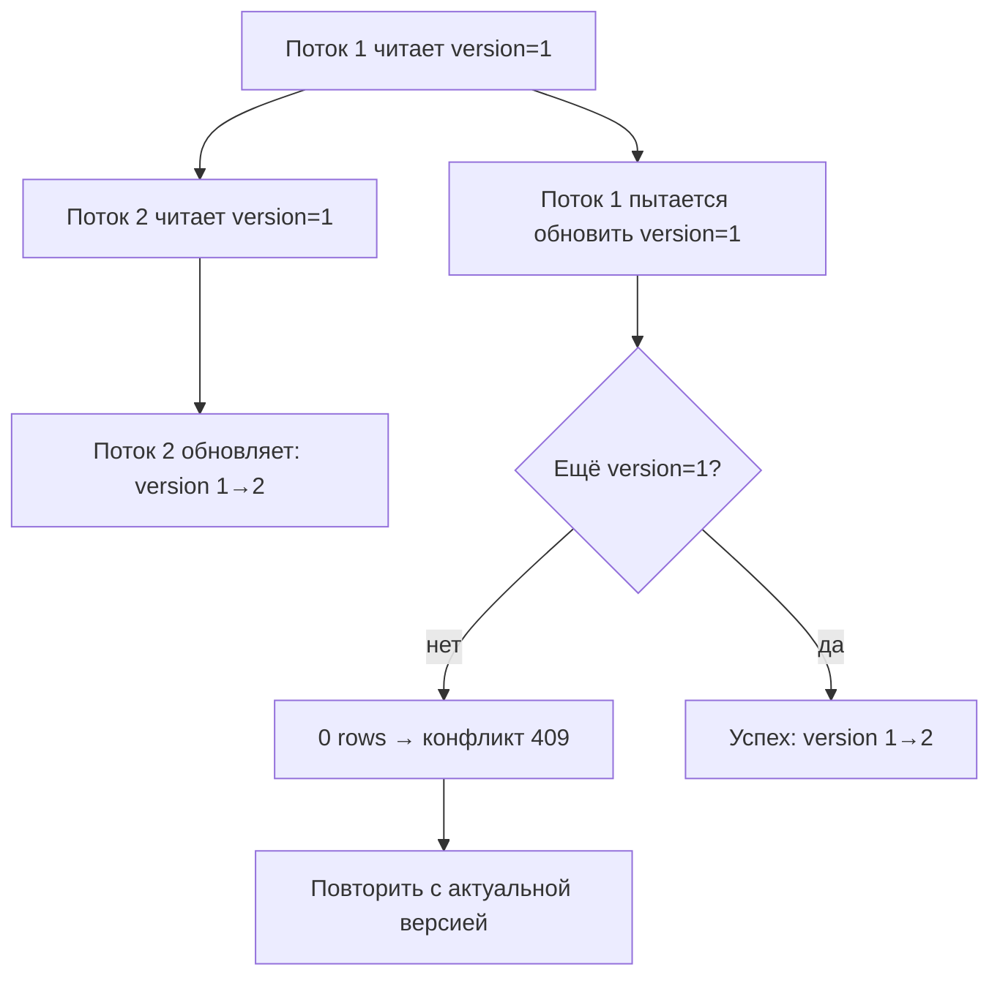
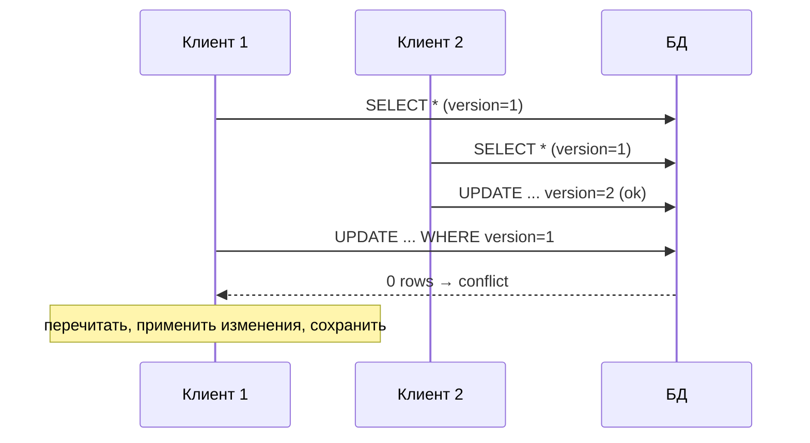

# Оптимистические блокировки

## Определение

**Optimistic locking (оптимистичная блокировка)** — стратегия конкурентного доступа: запись модифицируется с проверкой, что с момента чтения данные не изменились. Обычно используется колонка **version** (или timestamp), которая увеличивается при каждом обновлении. При сохранении проверяют, что version совпадает с ожидаемой; если другой поток успел изменить — возникает конфликт (обычно 409 Conflict), который нужно повторить или сообщить пользователю. Блокирок нет между чтением и записью — «пессимизации» latency нет.

## Зачем нужно

- **Конкурентные обновления** — два пользователя редактируют одну сущность; без проверки последняя запись перезапишет первую.
- **Минимум блокировок и дедлоков** — нет длительного удержания ресурсов, система масштабируется.
- **Работает в распределённых сценариях** — если данные проходят через очередь/внешний сервис.
- **Удобство API** — конфликт детектируется и возвращается клиенту как 409; фронтенд показывает «обновите страницу».

## Как работает

- **Колонка version** — каждое обновление делает `SET version = version + 1` с условием `WHERE id = ? AND version = ?`.
- **UPDATE с условием** — если строки не затронуты (0 rows), значит версия изменилась; определяем конфликт.
- **Потери обновлений** — многопоточность: без версии последняя запись затирает чужое (dirty read исключается изоляцией, смотри Isolation Levels).
- **CAS (compare-and-swap)** — вариант без колонки: `UPDATE ... SET ... WHERE status = 'ACTIVE'` (условие по полям, а не только по версии).
- **Вставка-апдейт** — `INSERT ... ON CONFLICT DO UPDATE` с той же проверкой версии.
- **Read версии в транзакции** — для строгого контроля `SELECT ... FOR SHARE` не нужен; изоляция READ COMMITTED достаточна.

Потенциальный риск: **перечитывание** — план при повторной попытке читает актуальную версию, применяет к ней пользовательские изменения и сохраняет заново.





## Примеры кода

### TypeScript (UPDATE с проверкой version)

```typescript
type Account = { id: number; balance: number; version: number }

export async function updateBalance(
  pool: Pool,
  acc: Account,
  newBalance: number,
): Promise<boolean> {
  const { rowCount } = await pool.query(
    `UPDATE accounts
        SET balance = $1, version = version + 1
      WHERE id = $2 AND version = $3`,
    [newBalance, acc.id, acc.version],
  )
  return rowCount === 1 // false → конфликт
}
```

### Go (петля повтора при конфликте)

```go
// Обновление с оптимистичной блокировкой и ретраем.
func SaveWithVersion(db *sql.DB, a Account) error {
	for attempt := 0; attempt < 3; attempt++ {
		res, err := db.Exec(
			`UPDATE accounts SET balance=$1, version=version+1
			  WHERE id=$2 AND version=$3`,
			a.Balance, a.ID, a.Version)
		if err != nil {
			return err
		}
		n, _ := res.RowsAffected()
		if n == 0 {
			// перечитать актуальную версию
			if err := db.QueryRow(
				`SELECT balance, version FROM accounts WHERE id=$1`,
				a.ID).Scan(&a.Balance, &a.Version); err != nil {
				return err
			}
			continue
		}
		return nil
	}
	return ErrTooManyRetries
}
```

### Java (JPA @Version)

```java
@Entity
public class Account {
    @Id Long id;
    BigDecimal balance;

    // JPA сам инкрементирует версию и проверяет при flush
    @Version
    Long version;
}

// при конфликте: OptimisticLockException
// -> в REST: 409 Conflict
@PostMapping("/accounts/{id}/balance")
void update(@PathVariable Long id, @RequestBody UpdateDto dto) {
    try {
        Account a = repo.findById(id).orElseThrow();
        a.setBalance(dto.balance());
        repo.save(a); // flush проверяет version
    } catch (OptimisticLockException e) {
        throw new ResponseStatusException(CONFLICT);
    }
}
```

## Пример использования: интеграция

> Практика: **REST 409 при конфликте**, **ретрай с повторным чтением**, **version в payload**.

### TypeScript (API: версия приходит от клиента)

```typescript
// PATCH /accounts/:id/balance  {balance, version}
export async function patchAccount(pool: Pool, id: number, dto: UpdateDto) {
  const ok = await updateBalance(pool, { id, balance: dto.balance, version: dto.version }, dto.balance)
  if (!ok) {
    // 409: пусть клиент покажет актуальную версию
    return { status: 409 as const, body: { message: 'Conflict: version not match' } }
  }
  return { status: 200 as const }
}
```

### Go (продолжение: отдаём актуальную версию в 409)

```go
func handleConflictOrOK(w http.ResponseWriter, a Account, err error) {
	if errors.Is(err, ErrTooManyRetries) {
		w.WriteHeader(http.StatusConflict)
		json.NewEncoder(w).Encode(map[string]any{
			"message": "conflict",
			"account": a, // актуальная версия для обновления
		})
		return
	}
	w.WriteHeader(http.StatusOK)
}
```

### Java (Spring: 409 с текущей версией)

```java
// Ошибка при optimistic lock:
@ExceptionHandler(OptimisticLockException.class)
ResponseEntity<?> onConflict() {
    return ResponseEntity.status(CONFLICT)
        .body(Map.of("message", "Конфликт: сущность изменена"));
}
```

## Паттерны использования

- **version — отдельная колонка** — просто и понятно; инкремент на каждом UPDATE.
- **Все обновления через «условие версии»** — UPDATE ... WHERE version = ?
- **REST-контракт** — клиент обязательно присылает version, сервер отвечает 409.
- **Ретраи на клиенте/сервисе** — ограниченное число попыток с повторным чтением.
- **Мягкие конфликты** — для горячих счётчиков (лайки, просмотры) допустимо не ретраить, а сливать/аппроксимировать изменения.
- **Веб-формы** — hidden поле version в форме; последний сохранит победит, остальные увидят конфликт.

## Антипаттерны и ловушки

- **Проверка «version» без условия в UPDATE** — просто сравнили где-то, но UPDATE перезаписал без WHERE version.
- **Рескаят всех конфликтов** — бесконечный ретрай при горячей строке.
- **Считать lock'ами serializable** — optimistic lock не «замораживает» собственные изменения (read-committed).
- **Игнорировать 409** — клиент перезаписывает чужие данные молча.
- **Timestamp вместо version** — одинаковое разрешение (ms) → два потока могут пройти проверку.
- **Долгие транзакции** — держать изменения не нужно; чем короче, тем меньше конфликтов.

## Когда использовать / когда НЕ использовать

**Использовать:**
- Конкурентные записи с редкими конфликтами (редактирование документов, профилей, заказов).
- HTTP/REST-архитектура, где 409 понятен клиенту.
- Долгие пользовательские сценарии «читать → думать → писать».

**НЕ использовать (или пересмотреть):**
- Высокий шанс конкуренции на одной строке (инвентарь, счётчики-добавления) — лучше пессимистичный lock/счётчик.
- Горячая строка: ретраи под нагрузкой — не эффективны.
- Когда нужна строгая сериализация на уровне БД (Serializable) — сочетать сложно.

## Связанные темы

- **Пессимистические блокировки** — противоположная стратегия с блокировкой строк.
- **Транзакции и ACID** — при чём изоляция: READ COMMITTED + version.
- **Isolation Levels** — какие аномалии решает isolation, а какие — версия.
- **Concurrency Control (MVCC)** — как Postgres реализует чтение без блокировок.
- **Pessimistic vs Optimistic** — сравнение двух классов стратегий.

## Вопросы

### Q1
**Что делает optimistic locking?**

- [ ] Блокирует строку на время чтения
- [x] Проверяет при обновлении, что версия/данные не изменились после чтения
- [ ] Сериализует все транзакции
- [ ] Кэширует значение

Пояснение: строки не блокируют заранее; при UPDATE проверяют условие version — если не совпала, конфликт.

### Q2
**Как выглядит UPDATE с optimistic lock в SQL?**

- [ ] SELECT FOR UPDATE
- [x] UPDATE ... SET version=version+1 WHERE id=? AND version=?
- [ ] LOCK TABLE ...
- [ ] UPDATE без WHERE

Пояснение: условие по версии в UPDATE — ключевой шаг; если 0 строк затронуто — конфликт.

### Q3
**Что вернуть клиенту при конфликте?**

- [ ] 200 OK
- [ ] 500 Internal Server Error
- [x] 409 Conflict + актуальные данные
- [ ] 403 Forbidden

Пояснение: 409 сигнализирует клиенту о конфликте; ответ может содержать актуальную версию для повтора.

### Q4
**Чем версия лучше timestamp просто как полей?**

- [ ] Быстрее
- [ ] Не требует индексов
- [x] Монотонна: два потока не могут получить одинаковую версию (в ms timestamp может совпасть)
- [ ] Timestamp нельзя хранить

Пояснение: инкремент гарантирует уникальность «шагов»; timestamp с одинаковым разрешением может не поймать конфликт.

### Q5
**Когда лучше использовать пессимистичные блокировки вместо optimistic?**

- [ ] Всегда
- [x] Высокая частота конфликтов на одной строке (инвентарь, финансовые счётчики)
- [ ] Никогда
- [ ] Только в NoSQL

Пояснение: если шанс конфликта высок, ретраи неэффективны — ранняя блокировка строк снижает шум.

## Источники

- Martin Kleppmann — Designing Data-Intensive Applications (глава про concurrency control)
- PostgreSQL — MVCC и update: https://www.postgresql.org/docs/current/mvcc.html
- Hibernate — Optimistic Locking: https://hibernate.org/orm/documentation/5.4/userguide/html_single/Hibernate_User_Guide.html#locking-optimistic
- System Design Guide — optimistic vs pessimistic locking (архив blogs)