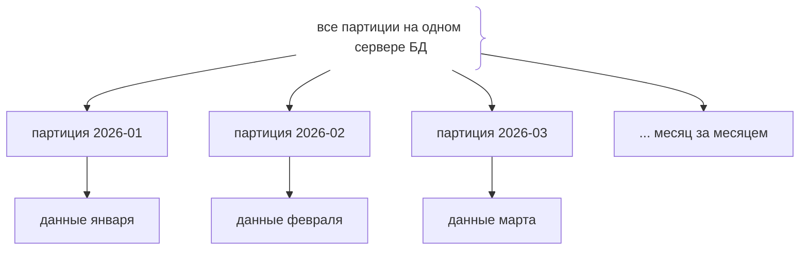
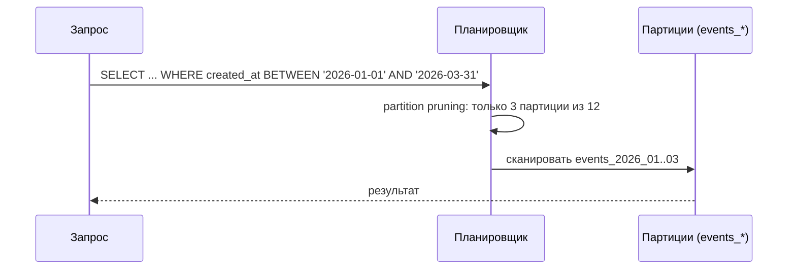

# Партиционирование (Partitioning)

## Определение

**Partitioning (партиционирование)** — разбиение большой таблицы на логические части — **партиции (partitions)** — по ключу (например, по дате, `tenant_id`, диапазону `id`). Все партиции находятся **на одном сервере** (в отличие от шардинга, который распределяет по машинам). Обычный сценарий — **range partitioning по `created_at`**: месячные партиции событий/логов/заказов. Партиции ускоряют запросы, упрощают удаление старых данных и облегчают обслуживание.

## Зачем нужно

- **Ускорение запросов** — при фильтре по ключу партиции читается только нужная секция (partition pruning).
- **Управление ростом** — удаление партиции «старое за месяц» быстрее и дешевле `DELETE` большой таблицы.
- **Обслуживание** — CREATE INDEX, ANALYZE, VACUUM по секции — точечнее, чем всю таблицу.
- **Архивность** — старые партиции — готовый слой архивов и утилизации.
- **Ограничение партиционирования** — не путать с шардингом; данные в одном узле.

## Как работает

- **Партиционный ключ** — колонка, по которой происходит деление (часто `created_at`, `tenant_id`, диапазон `id`).
- **Типы**: `RANGE` (диапазоны: месяцы/дни), `LIST` (перечисление: регионы, тенанты), `HASH` (равномерное распределение по модулю).
- **Partition pruning** — планировщик отбрасывает нерелевантные партиции по условию (если ключ в WHERE).
- **Отдельные таблицы за скобкой** — партиции — физические таблицы, объединённые в родительскую (partitioned table) в Postgres (правда с фильтром/constraint).
- **Вставка направляется** — по ключу определяет партицию автоматически; вручную можно указать партицио-колонку.
- **Падение при crossing** — вставка без соответствующей партиции упадёт (Postgres: relation does not exist), нужна политика с партиционным дефолтом.

Синтаксис (Postgres):

```sql
CREATE TABLE events (
    id          bigint,
    created_at  timestamptz NOT NULL,
    payload     jsonb
) PARTITION BY RANGE (created_at);

CREATE TABLE events_2026_01 PARTITION OF events
    FOR VALUES FROM ('2026-01-01') TO ('2026-02-01');
```





## Примеры кода

### SQL (создание партиционированной таблицы + архив)

```sql
-- месячные партиции по created_at
CREATE TABLE events (
    event_id   bigserial,
    created_at timestamptz NOT NULL,
    payload    jsonb NOT NULL
) PARTITION BY RANGE (created_at);

CREATE TABLE events_2026_01 PARTITION OF events
    FOR VALUES FROM ('2026-01-01') TO ('2026-02-01');
CREATE TABLE events_2026_02 PARTITION OF events
    FOR VALUES FROM ('2026-02-01') TO ('2026-03-01');

-- удаление старого месяца - DROP партиции, а не DELETE
DROP TABLE events_2025_12; -- мгновенно vs DELETE миллиона строк
```

### TypeScript (создание партиций в миграции)

```typescript
// миграция: создать партиционированную таблицу и стартовые секции
export async function up(pool: Pool) {
  await pool.query(`
    CREATE TABLE events (
      event_id   bigserial,
      created_at timestamptz NOT NULL,
      payload    jsonb NOT NULL
    ) PARTITION BY RANGE (created_at)
  `)
  await pool.query(`
    CREATE TABLE events_2026_01 PARTITION OF events
      FOR VALUES FROM ('2026-01-01') TO ('2026-02-01')
  `)
  await pool.query(`
    CREATE TABLE events_2026_02 PARTITION OF events
      FOR VALUES FROM ('2026-02-01') TO ('2026-03-01')
  `)
  // далее - планировщик автоматически создаёт новые секции по cron
}
```

### Go (автосоздание партиций)

```go
package db

import "database/sql"

// создание партиции следующего месяца (вызывается регулярно/cron)
func EnsurePartition(db *sql.DB, start, end string) error {
	_, err := db.Exec(`
		CREATE TABLE IF NOT EXISTS events_`+start[:4]+`_`+start[5:7]+`
			PARTITION OF events
			FOR VALUES FROM ($1) TO ($2)`)
	if err != nil {
		return err
	}
	return nil
}
```

### Java (вставка: данные попадают в нужную партицию)

```java
// Приложение не знает о партициях - Postgres сам направляет запись
// по значению created_at.
public class EventRepository {
    @Insert("insert into events (created_at, payload) values (#{createdAt}, #{payload}::jsonb)")
    void insert(Event e);
    // SELECT с фильтром по created_at: планировщик делает partition pruning
}
```

## Пример использования: интеграция

> Практика: **time-series партиционирование**, **регулярное создание секций**, **архив старых партиций**.

### SQL (автосоздание новых партиций по cron)

```sql
-- каждое 1-е число: создать партицию следующего месяца
DO $$
DECLARE
  start_ts timestamptz := date_trunc('month', now() + interval '1 month');
  end_ts   timestamptz := start_ts + interval '1 month';
  name     text        := 'events_' || to_char(start_ts, 'YYYY_MM');
BEGIN
  EXECUTE format(
    'CREATE TABLE %I PARTITION OF events FOR VALUES FROM (%L) TO (%L)',
    name, start_ts, end_ts
  );
END $$;
```

### TypeScript (архив старой партиции в S3)

```typescript
export async function archivePartition(month: string) {
  // 1) COPY партиции в файл
  await pool.query(`COPY events_${month} TO '/tmp/events_${month}.csv'`)
  // 2) загрузить в S3 (сторонний клиент)
  await uploadToStorage(`events/${month}.csv`, '/tmp/events.csv')
  // 3) удалить получившую секцию
  await pool.query(`DROP TABLE events_${month}`)
}
```

### Go (метрики размера партиций)

```go
// метрика: размеры партиций (для мониторинга, предсказания роста)
SELECT schemaname || '.' || tablename AS name, pg_total_relation_size(tablename) AS bytes
FROM pg_tables WHERE tablename LIKE 'events_%'
ORDER BY 2 DESC;
```

### Java (запрос с pruning — фильтр по ключу)

```java
// Запрос с WHERE по created_at автоматически читает только нужные партиции
@Repository
public interface EventRepository extends JpaRepository<Event, Long> {
    @Query("select e from Event e where e.createdAt between :from and :to")
    List<Event> range(@Param("from") Instant from, @Param("to") Instant to);
}
```

## Паттерны использования

- **Партиция по времени** — события, логи, метрики: месячные/дневные секции.
- **Partition pruning обязательно** — фильтровать запросы по партиционному ключу.
- **Индексы по секциям** — индексы создаются на родительскую таблицу и наследуются партициями.
- **Политика retention** — старое удалять DROP-секции (архив/утилизация).
- **Автосоздание** — cron/миграция создают будущие секции заранее (с запасом месяцев).
- **Инфраструктурный слой** — партицируйте большие таблицы с явным ростом (logs, events, orders).

## Антипаттерны и ловушки

- **Вставка без ключа (пропуск партиции)** — несоответствие → ошибка в Postgres, нужен дефолт-партиция.
- **Pruning не срабатывает** — функция/выражение над колонкой (`date(created_at)`) не партицируется, планировщик читает всю таблицу.
- **Слишком мелкие партиции** — день за днём — тысячи таблиц, overhead планировщика.
- **Слишком крупные (год)** — польза от pruning мала.
- **Путать с шардингом** — партиции в одном сервере; шардинг делит по машинам.
- **JOIN/UPDATE по не-ключу** — операции, не использующие партиционный ключ, работают со всеми секциями.

## Когда использовать / когда НЕ использовать

**Использовать:**
- Тяжёлые таблицы с очевидным ростом по времени (events, логи, метрики, заказы по месяцам).
- Простые удаления старых данных (архив/утилизация).

**НЕ использовать (или пересмотреть):**
- Когда таблицы малые и рост медленный.
- Когда все запросы идут по не-партиционному ключу (нет pruning).
- Вместо настоящего масштабирования записи — для этого новые шарды/шардинг (см. Sharding).

## Связанные темы

- **Sharding** — физическое деление данных по машинам; партиционирование - логическое в одном сервере.
- **Database Indexing** — индексы в пределах партиций (partition-local).
- **Database Migrations** — создание партиций и секций через миграции.
- **Query Optimization** — pruning уменьшает число читаемых секций.
- **Read Replicas** — реплицируется вся партиционированная таблица.

## Вопросы

### Q1
**Что такое партиционирование?**

- [ ] Разделение данных по разным машинам
- [x] Логическое деление большой таблицы на части (партиции) на одном сервере
- [ ] Только индексы
- [ ] Кэширование запросов

Пояснение: партиции - логические секции внутри одной БД; данные остаются на одном сервере.

### Q2
**Что делает partition pruning?**

- [ ] Удаляет старые данные
- [x] Оставляет читать только релевантные партиции по условию с ключом
- [ ] Создаёт индексы
- [ ] Шифрует таблицу

Пояснение: планировщик опирается на условие WHERE и «отсекает» ненужные секции; читает минимум данных.

### Q3
**Как эффективно удалить данные старого месяца при партиционировании?**

- [ ] DELETE по всем строкам
- [x] DROP партиции месяца - мгновенная операция
- [ ] Оставить секции
- [ ] TRUNCATE таблицу

Пояснение: удаление партиции (DROP TABLE секции) освобождает пространство оперативно, без DELETE миллиона строк.

### Q4
**Почему `where date(created_at) = ...` может не дать pruning?**

- [x] Функция над ключом мешает планировщику сопоставить партицию
- [ ] Функции запрещены
- [ ] Индекс не нужен
- [ ] Такого не бывает

Пояснение: применение функции к партиционному ключу скрывает диапазон/значение - планировщик не может определить нужные секции.

### Q5
**В чём различие партиционирования и шардинга?**

- [ ] Нет различий
- [x] Партиционирование - внутри одной БД; шардинг распределяет данные по машинам
- [ ] Шардинг - только для чтения
- [ ] Партиционирование использует шарды

Пояснение: партиции на одном сервере решают размер/управление; шарды - масштабирование нагрузки записи/объёма.

## Источники

- PostgreSQL — Table partitioning: https://www.postgresql.org/docs/current/ddl-partitioning.html
- MySQL — Partitioning: https://dev.mysql.com/doc/refman/8.0/en/partitioning.html
- Citus (Postgres) — partitioning vs sharding: https://docs.citusdata.com/en/latest/faq/faq.html
- TimescaleDB — время-series chunks: https://docs.timescale.com/getting-started/latest/