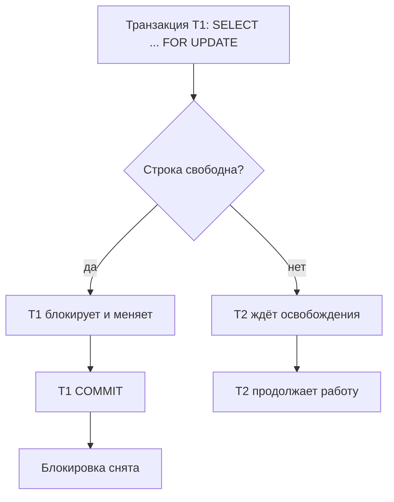
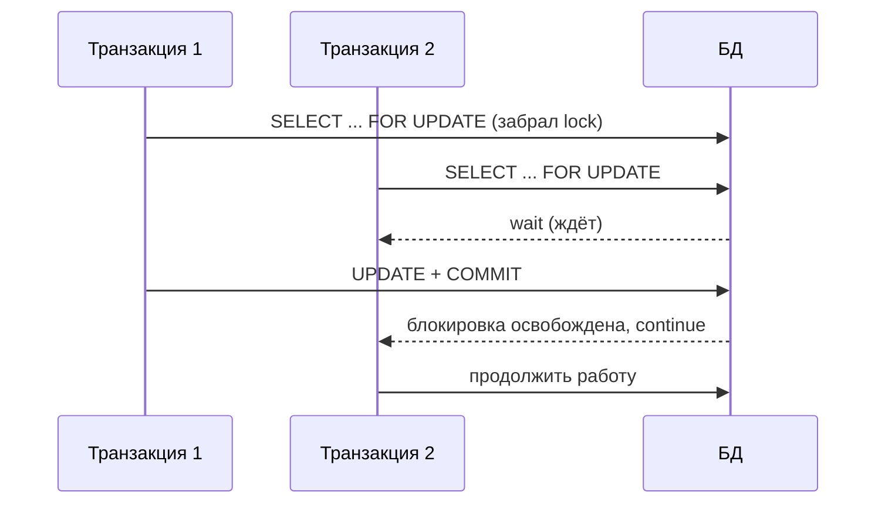

# Пессимистические блокировки

## Определение

**Pessimistic locking (пессимистичная блокировка)** — стратегия конкурентного доступа: перед чтением/изменением строка **блокируется** (например, `SELECT ... FOR UPDATE`), и другой транзакции запрещается изменять её до освобождения. Это гарантирует, что между моментом чтения и записи никто не вмешается (защита от «потерянного обновления»). Цена — время ожидания блокировки (latency) и риск **дедлоков**. Используется, когда конкуренция на строке реальная и частая (инвентарь, баланс счёта).

## Зачем нужно

- **Потерянное обновление** — одновременное изменение одного баланса/остатка: без блокировки одна операция затирает результат другой.
- **Горячие строки** — когда без блокировки почти каждая операция сталкивается с конфликтом.
- **Настоящая очередь** — ожидание блокировки видно пользователю как понятная «очередь» за ресурсом.
- **Простота для разработчика** — сценарий «читаю → меняю → сохраняю» защищён из коробки (без ручной обработки conflicts).

## Как работает

- **SELECT ... FOR UPDATE** — блокирует выбранные строки на время транзакции; другие пишут-запросы ждут.
- **Время блокировки** — до commit/rollback; чем длиннее транзакция — тем дольше другие ждут.
- **NOWAIT / SKIP LOCKED** — не ждать / пропускать занятые строки (полезно для job-очередей).
- **Row vs Table locks** — блок на строку (FOR UPDATE) или на таблицу (LOCK TABLE) — разные горизонты.
- **Основные DBMS** — Postgres row-level, MySQL (InnoDB) row-locks, Oracle аналогично SELECT FOR UPDATE.
- **Дедлоки** — две транзакции ждут строки друг друга; СУБД детектирует и отменяет одну.

В отличие от optimistic locking, пессимистичная блокировка исключает «повторные попытки» — другой клиент просто ждёт. Это хорошо для редких, но ценных операций.





## Примеры кода

### SQL (SELECT FOR UPDATE + COMMIT)

```sql
BEGIN;
-- захват строки на время транзакции
SELECT balance FROM accounts WHERE id = 1 FOR UPDATE;
-- баланс не изменится другими до COMMIT
UPDATE accounts SET balance = balance - 100 WHERE id = 1;
COMMIT;

-- без ожидания: если занята - ошибка сразу
SELECT ... FOR UPDATE NOWAIT;
-- очередь заданий: пропустить занятые записи
SELECT ... FOR UPDATE SKIP LOCKED;
```

### TypeScript (блокировка строки)

```typescript
import { Pool } from 'pg'

export async function withdraw(pool: Pool, accountId: number, amount: number) {
  const client = await pool.connect()
  try {
    await client.query('BEGIN')
    // блокируем строку счёта
    const { rows } = await client.query(
      'SELECT balance FROM accounts WHERE id = $1 FOR UPDATE',
      [accountId],
    )
    const balance = Number(rows[0].balance)
    if (balance < amount) throw new Error('insufficient funds')
    await client.query(
      'UPDATE accounts SET balance = balance - $1 WHERE id = $2',
      [amount, accountId],
    )
    await client.query('COMMIT')
  } catch (e) {
    await client.query('ROLLBACK')
    throw e
  } finally {
    client.release()
  }
}
```

### Go (транзакция с FOR UPDATE)

```go
func withdraw(db *sql.DB, id int64, amount int) error {
	tx, err := db.Begin()
	if err != nil {
		return err
	}
	defer tx.Rollback()
	var bal int
	if err := tx.QueryRow(
		`SELECT balance FROM accounts WHERE id = $1 FOR UPDATE`,
		id).Scan(&bal); err != nil {
		return err
	}
	if bal < amount {
		return ErrInsufficient
	}
	if _, err := tx.Exec(
		`UPDATE accounts SET balance = balance - $1 WHERE id = $2`,
		amount, id); err != nil {
		return err
	}
	return tx.Commit()
}
```

### Java (Spring Data @Lock)

```java
@Repository
public interface AccountRepository extends JpaRepository<Account, Long> {
    // пессимистичная блокировка на уровне JPA
    @Lock(LockModeType.PESSIMISTIC_WRITE)
    @Query("select a from Account a where a.id = :id")
    Optional<Account> lockById(@Param("id") Long id);
}

@Service
public class AccountService {
    @Transactional
    boolean withdraw(Long id, BigDecimal amount) {
        Account a = accountRepository.lockById(id).orElseThrow(); // FOR UPDATE
        if (a.getBalance().compareTo(amount) < 0) return false;
        a.setBalance(a.getBalance().subtract(amount)); // flush на COMMIT
        return true;
    }
}
```

## Пример использования: интеграция

> Практика: **баланс/инвентарь под блокировкой**, **очередь задач с SKIP LOCKED**, **короткие транзакции**.

### SQL (очередь задач без «потребитель-дубль»)

```sql
BEGIN;
-- взять одну свободную задачу, не простаивая на занятых
SELECT id FROM tasks
 WHERE status = 'pending'
 ORDER BY id
 LIMIT 1
 FOR UPDATE SKIP LOCKED;
-- статус меняем сразу, коммит - блокировку снимаем
UPDATE tasks SET status = 'processing' WHERE id = <выбранная>;
COMMIT;
```

### TypeScript (время блокировки под контролем)

```typescript
// keep transactions short: только операция-ячейка.
// если шагов много (валюты, уведомления) - выносить из транзакции.
export async function reserve(pool: Pool, itemId: number, qty: number) {
  const cl = await pool.connect()
  try {
    await cl.query('BEGIN')
    const { rows } = await cl.query(
      `SELECT qty FROM inventory WHERE id = $1 FOR UPDATE`, [itemId],
    )
    if (Number(rows[0].qty) < qty) throw new Error('no stock')
    await cl.query(`UPDATE inventory SET qty = qty - $1 WHERE id = $2`, [qty, itemId])
    await cl.query('COMMIT')
  } catch (e) { await cl.query('ROLLBACK'); throw e } finally { cl.release() }
}
```

### Java (обработка дедлоков ретраем)

```java
// Дедлок СУБД отменит одну из транзакций (PostgreSQL 40P01).
// Приложение ловит и ретраит до N раз.
@Retryable(retryFor = CannotAcquireLockException.class, maxAttempts = 3)
@Transactional
public boolean withdraw(Long id, BigDecimal amount) {
    Account a = accountRepository.lockById(id).orElseThrow();
    ...
}
```

## Паттерны использования

- **FOR UPDATE на чтении ключа** — получаем блокировку сразу, до обработки логики.
- **Короткие транзакции** — меньше держим блокировку → меньше ожиданий и дедлоков.
- **SKIP LOCKED для очередей** — воркеры не стоят в очереди на занятых строках.
- **Порядок блокировок** — все операции берут блокировки в одном порядке (дедлок-профилактика).
- **NOWAIT где допустимо** — если ждать непозволительно (взаимодействие с внешними системами).
- **Мониторинг block и deadlock** — блокирование (pg_stat_activity) и счётчик deadlock'ов.

## Антипаттерны и ловушки

- **Держать блокировку долго** — медленные операции внутри транзакции блокируют всех: wait, затор.
- **Дедлоки** — перекрёстная блокировка; без порядка приобретения неизбежны.
- **FOR UPDATE на агрегате всей таблицы** — SELECT без WHERE заблокирует много строк/всю таблицу.
- **Растущий объём блокировок** — при большом количестве строк lock-менеджер нагружается.
- **Зависание без освобождения** — клиент не делает COMMIT/ROLLBACK — блокировка висит.
- **Применять где редко конфликтуют** — пессимизм платит latency даже когда он не нужен.

## Когда использовать / когда НЕ использовать

**Использовать:**
- Остатки, балансы, брони — данные с высокой конкуренцией на «горячей» строке.
- Очереди воркеров (SKIP LOCKED) — эффективная раздача задач.
- Случаи, где повторная попытка невозможна (перевод, выпуск билета).

**НЕ использовать (или пересмотреть):**
- Конфликтов мало, обновления редки — дешевле optimistic lock и 409 (см. Optimistic Locking).
- Долгие бизнес-транзакции человека («читать → думать → писать») — блок держится неоправданно долго.
- Аналитические выборки по не-ключевым полям — блокировка нерациональна.

## Связанные темы

- **Оптимистические блокировки** — противоположная стратегия без блокировок.
- **Транзакции и ACID** — блокировки живут внутри транзакций (коммит снимает).
- **Isolation Levels** — уровень изоляции задаёт поведение блокировок (SERIALIZABLE и т. д.).
- **Дедлоки** — побочный эффект пессимистичных блокировок.
- **Distributed Locks** — когда строка не в одном сервисе/БД.

## Вопросы

### Q1
**Что делает SELECT ... FOR UPDATE?**

- [ ] Публикует данные
- [x] Блокирует выбранные строки до конца транзакции
- [ ] Создаёт индекс
- [ ] Очищает кэш

Пояснение: FOR UPDATE берёт блокировку записи строк, другие транзакции ждут до COMMIT/ROLLBACK.

### Q2
**Чем SKIP LOCKED полезен для очередей?**

- [ ] Ускоряет индексы
- [x] Пропускает занятые строки вместо ожидания - воркеры берут свободные задачи
- [ ] Удаляет задачи
- [ ] Включает кэш

Пояснение: воркер берёт «свободную» строку, занятые не ждут; параллельные процессы не дублируют обработку.

### Q3
**Какой риск у пессимистичных блокировок?**

- [ ] Потеря данных
- [x] Ожидание (latency) и дедлоки между транзакциями
- [ ] Низкая изоляция
- [ ] Много памяти

Пояснение: блокировка ждёт другая транзакция; взаимные блоки могут привести к дедлоку (СУБД отменяет одну).

### Q4
**Когда предпочесть pessimistic блокировке optimistic?**

- [ ] Конфликтов нет
- [x] Горячая строка с частым конкурентным обновлением (баланс, инвентарь)
- [ ] Чтения преобладают
- [ ] В любом сервисе

Пояснение: если конфликты реальны и часты, ожидание/очередь лучше повторных попыток optimistic.

### Q5
**Как избегать дедлоков?**

- [ ] Не использовать транзакции
- [x] Блокировать строки в согласованном порядке, транзакции короткие
- [ ] Убрать индексы
- [ ] Только SELECT

Пояснение: одинаковый порядок захвата ресурсов и короткие блокировки устраняют большинство дедлоков.

## Источники

- PostgreSQL — Explicit Locking (FOR UPDATE, SKIP LOCKED): https://www.postgresql.org/docs/current/explicit-locking.html
- MySQL InnoDB — Locking: https://dev.mysql.com/doc/refman/8.0/en/innodb-locking.html
- PostgreSQL deadlock detection — 40.6: https://www.postgresql.org/docs/current/transaction-iso.html
- JPA LockModeType — документация Jakarta Persistence