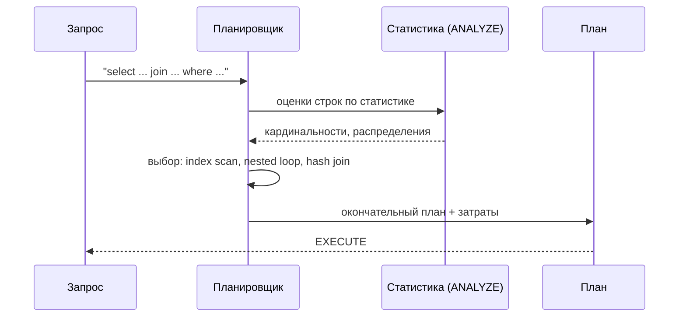
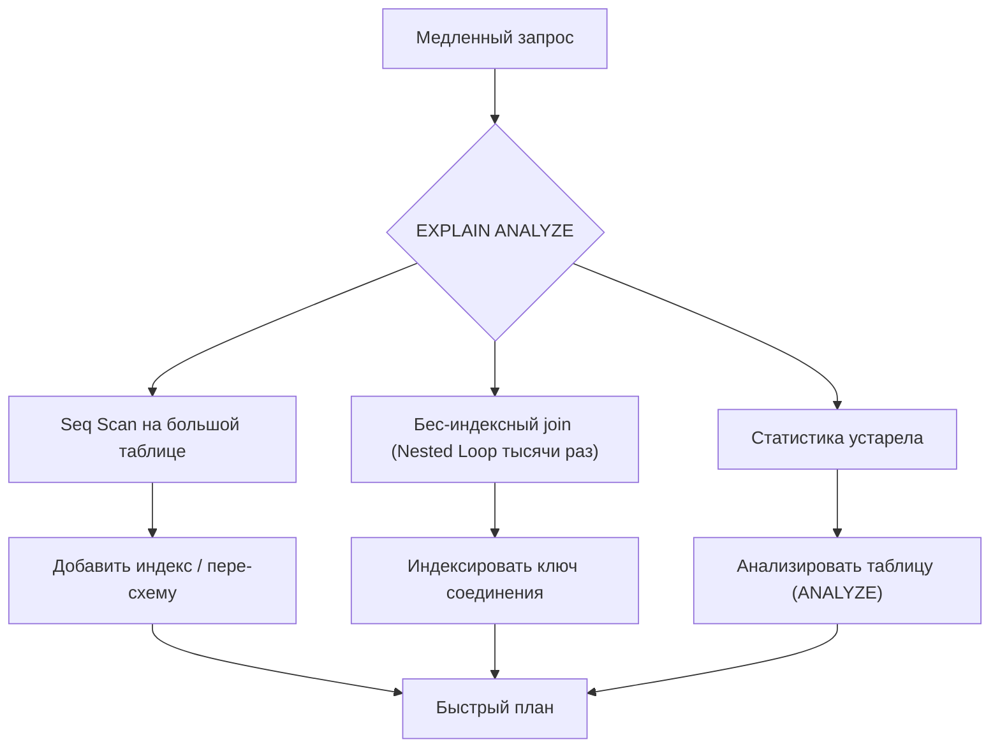

# Оптимизация запросов

## Определение

**Query optimization (оптимизация запросов)** — поиск наиболее эффективного плана выполнения SQL-запроса: какие индексы использовать, в каком порядке соединить таблицы, когда сортировать. Планировщик СУБД строит **execution plan (план выполнения)**; наша задача — помочь ему (индексы, статистика, простые join-ы) и найти узкие места через `EXPLAIN`.

## Зачем нужно

- **Скорость ответа** — плохой план даёт минуты вместо миллисекунд на больших данных.
- **Стабильность под нагрузкой** — медленные запросы «съедают» CPU/IO и ухудшают латенсию всех остальных.
- **Экономия ресурсов** — правильный план снижает нагрузку на БД и позволяет её меньше масштабировать.
- **Контроль стоимости** — понимать, сколько чтений/сканов на запрос.
- **Диагностика** — `EXPLAIN ANALYZE`, медленные логи, метрики (см. Monitoring).

## Как работает

Ключевые понятия:

- **Планировщик (planner/optimizer)** — выбирает план из альтернатив по статистике (число строк, распределение значений).
- **Seq Scan** — полное чтение таблицы; пригодно для маленьких таблиц, не для больших без фильтра.
- **Index Scan / Index-Only Scan** — поиск по индексу (см. Database Indexing); Index-Only не требует чтения таблицы.
- **Nested Loop** — соединение: для каждой строки — индексный снимок по второй таблице (хорошо для малого внешнего набора).
- **Hash Join** — построить хеш-таблицу малой стороны в памяти, затем пройти по большой (хорошо для больших множеств).
- **Merge Join** — оба набора отсортированы по ключу соединения; слияние за O(n).
- **Статистика ANALYZE** — без актуальной статистики планировщик выбирает плохой план (устаревшие гистограммы).
- **EXPLAIN ANALYZE** — показывает и план, и реальные затраты: actual rows, loops, time.

Пример простого плана:





## Примеры кода

### SQL (поиск медленного запроса и фикс)

```sql
-- 1) находим медленные запросы
-- pg_stat_statements:
SELECT query, calls, mean_exec_time
FROM pg_stat_statements
ORDER BY (total_exec_time) DESC
LIMIT 10;

-- 2) изучаем план
EXPLAIN ANALYZE
SELECT o.id, u.email
FROM orders o
JOIN users u ON u.id = o.user_id
WHERE o.status = 'PAID' AND o.created_at > NOW() - INTERVAL '7 days';
```

### TypeScript (анализ плана из Node)

```typescript
import { Pool } from 'pg'

const pool = new Pool({ connectionString: process.env.DATABASE_URL })

export async function explain(query: string, params: unknown[]) {
  // EXPLAIN ANALYZE прямо из приложения
  const { rows } = await pool.query('EXPLAIN ANALYZE ' + query, params)
  return rows.map((r) => (r as { 'QUERY PLAN': string })['QUERY PLAN'])
}

// Использование:
// await explain('SELECT * FROM orders WHERE user_id = $1', [42])
// ->
// [ 'Index Scan using idx_orders_user_id on orders ...' ]
```

### Go (мониторинг медленных запросов)

```go
package main

import (
	"context"
	"time"

	"github.com/jackc/pgx/v5/pgxpool"
)

// обёртка: логировать запросы, которые долго выполняются
func slowQueryLogger(pool *pgxpool.Pool, ctx context.Context, sql string, args ...any) error {
	start := time.Now()
	_, err := pool.Exec(ctx, sql, args...)
	if elapsed := time.Since(start); elapsed > 500*time.Millisecond {
		// сюда - сырые метрики и алерты
		log.Metrics.Record("slow_query", elapsed, sql)
	}
	return err
}
```

### Java (JPA: настройка и профилирование)

```java
// application.properties (Spring Boot + Hibernate)
// spring.jpa.properties.hibernate.format_sql=true
// spring.jpa.show-sql=true            // только dev!
//
// Отладка N+1 и планов:
// 1) Hibernate statistics:
// spring.jpa.properties.hibernate.generate_statistics=true
// 2) Логи с параметрами:
// logging.level.org.hibernate.SQL=DEBUG
public interface OrderRepository extends JpaRepository<Order, Long> {
    // @Query с явным JOIN FETCH решает часть N+1
    @Query("select o from Order o join fetch o.items where o.id = :id")
    Optional<Order> findWithItems(@Param("id") Long id);
}
```

## Пример использования: интеграция

> Практика: **анализ медленных запросов**, **актуальная статистика**, **последовательность фикса**.

### SQL (полный цикл оптимизации)

```sql
-- 1) Метрики: медленные запросы (pg_stat_statements)
-- 2) EXPLAIN ANALYZE для кандидата
-- 3) Устранить причины, одну за другой:
--    а) добавить INDEX (database-indexing)
--    б) изменить JOIN-порядок (JOIN по индексам)
--    в) обновить статистику: ANALYZE таблица;
-- 4) Повторно EXPLAIN: сравнить cost и actual время
```

### TypeScript (дашборд медленных запросов)

```typescript
// сбор в очередь для дашборда
export async function collectSlowQueries(limit = 20) {
  const { rows } = await pool.query(`
    SELECT query,
           calls,
           round(mean_exec_time::numeric, 1) AS mean_ms,
           round(max_exec_time::numeric, 1) AS max_ms
    FROM pg_stat_statements
    WHERE calls > 100
    ORDER BY mean_ms DESC
    LIMIT $1
  `, [limit])
  return rows
}
```

### Go (пере-анализ статистики в планировщике)

```go
import "context"

// после массовых вставок важно обновлять статистику
func analyzeTables(ctx context.Context, pool *pgxpool.Pool, tables []string) error {
	for _, t := range tables {
		if _, err := pool.Exec(ctx, "ANALYZE "+t); err != nil {
			return err
		}
	}
	return nil
}
```

### Java (Spring: отслеживание запросов через Hibernate statistics)

```java
// Если generate_statistics=true, в логах видно:
// Start time, JDBC prepares, SQL Queries, statement cache hits...
//
// Programmatic:
SessionFactory sf = em.getEntityManagerFactory().unwrap(SessionFactory.class);
Statistics stats = sf.getStatistics();
stats.setStatisticsEnabled(true);
// stats.getQueryExecutionCount(); stats.getQueryExecutionMaxTime();
```

## Паттерны использования

- **Начинать с EXPLAIN ANALYZE** — искать Seq Scan на больших таблицах и Nested Loop без индекса.
- **Индексировать ключи JOIN и фильтры** — основную выгоду дают индексы (см. Database Indexing).
- **Править по одной проблеме за раз** — после каждого фикса повторять EXPLAIN.
- **Обновлять статистику** — после больших изменений данных и в таблицах с горячими вставками.
- **Использовать покрывающие индексы** — index-only scan под короткие горячие запросы.
- **Не копировать «индексы всех»** — учитывать реальный профиль чтения/записи.

## Антипаттерны и ловушки

- **«Добавим индекс безусловно»** — индекс без понимания плана добавляет overhead записи.
- **Настройка по одному запросу вне контекста** — оптимизация обслуживает все запросы, не один.
- **Основываться на старой статистике** — без ANALYZE планировщик «устаревший» и берёт плохой план.
- **Пытаться «переписать» всё руками** — иногда достаточно проиндексировать и убрать лишние колонки.
- **Слепое доверие `SELECT *`** — лишние колонки большие, блокировка покрытия индекса.
- **Игнорировать медленные логи** — «медленные запросы в проде» лечатся только если их видно.

## Когда использовать / когда НЕ использовать

**Использовать:**
- Все горячие пути (авторизация, оплата, дашборды) и медленные запросы из метрик.
- Любое изменение схемы (индексы, колонки) — проверять план до и после.

**НЕ использовать (или пересмотреть):**
- Оптимизировать единичные запросы ради одного вызова — польза не окупает сложность.
- Переписывать кешируемые выборки, где уже есть TTL-кэш (см. Caching Basics).
- Руководствоваться «эмпирикой» без EXPLAIN/метрик — план бывает неочевиден.

## Связанные темы

- **Database Indexing** — главный рычаг оптимизации SELECT.
- **N+1** — типичная причина нагрузки на БД из приложения.
- **Connection Pooling** — сколько соединений реально нужно для нагруженного сервиса.
- **Performance / Monitoring** — метрики латенси и медленных запросов в проде.
- **Partitioning / Sharding** — масштабирование, когда один сервер не тянет.

## Вопросы

### Q1
**Что показывает EXPLAIN ANALYZE?**

- [ ] Синтаксическую ошибку
- [x] План выполнения в том числе затраты, стринг/временные значения
- [ ] Содержимое всех таблиц
- [ ] Только число строк

Пояснение: EXPLAIN анализирует съёмочный план (Seq/Index, join-методы, filter, cost); ANALYZE добавляет фактические время и числа.

### Q2
**Когда планировщик выбирает Seq Scan на большой таблице?**

- [x] Когда таблица маленькая или статистика устарела и/или фильтр не селективен
- [ ] Когда есть индекс на колонке
- [ ] Только при джойне
- [ ] При каждой транзакции безусловно

Пояснение: Seq Scan может быть дешевле индекса при малом числе строк или низкой селективности; устаревшая статистика тоже ведёт к выбору Seq Scan.

### Q3
**Чем Hash Join лучше Nested Loop?**

- [ ] Он всегда быстрее в 10 раз
- [x] Для больших множеств он строит хеш-таблицу малой стороны, не делая вложенный обход
- [ ] Он работает без индексов всегда
- [ ] Нет разницы

Пояснение: Nested Loop выполняет просмотр второй стороны для каждой строки первой; Hash Join цеф верен при кардинальных больших соединениях.

### Q4
**Почему важно выполнять ANALYZE после массовых вставок?**

- [ ] Он чистит кэш
- [x] Статистика в планировщике обновляется, план (join-метод, индексирование) становится точным
- [ ] Он добавляет индексы
- [ ] Он запрещает удаления

Пояснение: планировщик опирается на статистику строк/распределений; после больших изменений она устаревает и планы ухудшаются.

### Q5
**Что первым делом сделать при медленном запросе на проде?**

- [ ] Увеличить память БД
- [x] Взять EXPLAIN ANALYZE и найти узкое место (Seq Scan, join без индекса)
- [ ] Отключить логи
- [ ] Добавить индексы на все колонки разом

Пояснение: оптимизация начинается с понимания плана; индексы/память вслепую — догадки, а не анализ данных.

## Источники

- PostgreSQL — Using EXPLAIN: https://www.postgresql.org/docs/current/using-explain.html
- PostgreSQL — pg_stat_statements: https://www.postgresql.org/docs/current/pgstatstatements.html
- Percona — Query Optimization blog (выжимки): https://www.percona.com/blog/
- MySQL — Optimizing Queries with EXPLAIN: https://dev.mysql.com/doc/refman/8.0/en/using-explain.html