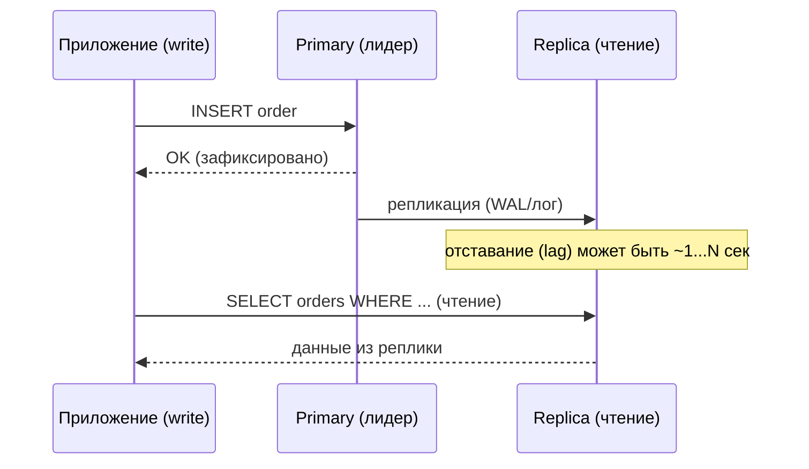
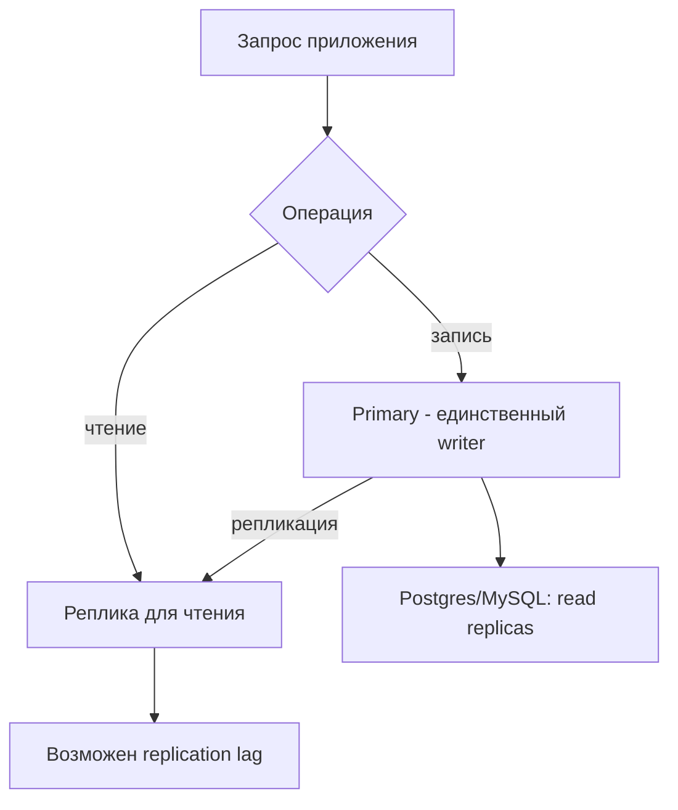

# Реплики для чтения (Read Replicas)

## Определение

**Read replica (реплика для чтения)** — копия данных основной (primary) БД, которая обслуживает read-запросы, пока primary принимает write. Реплики создаются механизмом **replication** (см. Replication): изменения primary передаются на реплики асинхронно или синхронно. Типичная схема: **primary для записей + N реплик для чтения** — разгружают CPU/IO primary на read-heavy нагрузках.

## Зачем нужно

- **Разгрузить primary** — большинство сервисов читают чаще, чем пишут; реплики берут SELECT на себя.
- **Горизонтальное масштабирование чтения** — до чтении можно добавлять реплики без риска записей.
- **Аналитика и отчёты** — тяжёлые репорты и чтение не мешают транзакциям у записи.
- **Отказоустойчивость** — при падении primary реплика может стать новым primary (см. Failover, Disaster Recovery).
- **Покрывающие дашборды** — дашборды и аналитика читают реплику, не нагружая транзакционный сервер.

## Как работает

- **Primary (leader/writer)** — принимает INSERT/UPDATE/DELETE и публикует изменения (WAL/log/бинарный лог).
- **Replica (follower/reader)** — применяет журнал изменений от primary; обслуживает только чтение.
- **Async replica** — задержка копирования (replication lag): данные на реплике могут отставать.
- **Sync replica** — подтверждение записей до коммита (безопаснее, но дороже latency; редко в POSTGRES по умолчанию).
- **Read-your-writes** — после записи на primary клиент может не увидеть свежий результат на реплике: нужен routing/направленный запрос.
- **Routing** — приложение направляет: writes → primary, reads → реплики (часть через прокси/подписки БД).

Задержка репликации — главная специфика: **eventual consistency** (см. Eventual Consistency).





## Примеры кода

### TypeScript (разделение read/write соединения)

```typescript
import { Pool } from 'pg'

// два пула: один для записей, один для чтения
const writePool = new Pool({ connectionString: process.env.DATABASE_URL_WRITER })
const readPool = new Pool({ connectionString: process.env.DATABASE_URL_READER })

export const db = {
  // запись всегда на primary
  async createOrder(o: Order): Promise<Order> {
    const { rows } = await writePool.query(
      `INSERT INTO orders (user_id, amount) VALUES ($1, $2) RETURNING *`,
      [o.userId, o.amount],
    )
    return rows[0]
  },

  // чтение - на реплике (допустимая eventual consistency)
  async listOrders(userId: number): Promise<Order[]> {
    const { rows } = await readPool.query(
      `SELECT * FROM orders WHERE user_id = $1`,
      [userId],
    )
    return rows
  },
}
```

### Go (sql.DB с двумя источниками)

```go
package db

import (
	"database/sql"
	_ "github.com/jackc/pgx/v5/stdlib"
)

// два sql.DB: writer и reader
func New(wDSN, rDSN string) (*Querier, error) {
	w, err := sql.Open("pgx", wDSN)
	if err != nil {
		return nil, err
	}
	r, err := sql.Open("pgx", rDSN)
	if err != nil {
		return nil, err
	}
	return &Querier{writer: w, reader: r}, nil
}

type Querier struct {
	writer, reader *sql.DB
}

func (q *Querier) Write(fn func(tx *sql.Tx) error) error {
	tx, _ := q.writer.Begin()
	if err := fn(tx); err != nil {
		_ = tx.Rollback()
		return err
	}
	return tx.Commit()
}

func (q *Querier) Rows(query string, args ...any) (*sql.Rows, error) {
	return q.reader.Query(query, args...) // чтение - на реплике
}
```

### Java (Spring + RoutingDataSource)

```java
// Конфигурация RoutingDataSource:
import org.springframework.jdbc.datasource.lookup.AbstractRoutingDataSource;

public class RoutingDataSource extends AbstractRoutingDataSource {
    private static final ThreadLocal<Boolean> READ_ONLY = new ThreadLocal<>();

    public static void markReadOnly() { READ_ONLY.set(true); }
    public static void markWritable() { READ_ONLY.set(false); }

    @Override
    protected Object determineCurrentLookupKey() {
        return Boolean.TRUE.equals(READ_ONLY.get()) ? "REPLICA" : "PRIMARY";
    }
}

// В конфигурации задаются два DataSource:
// - PRIMARY (writer)
// - REPLICA (reader)
// Транзакции, помеченные @Transactional(readOnly = true) - идут на реплику.
```

## Пример использования: интеграция

> Практика: **read-heavy маршрутизация**, **построение отчётов на реплике**, **обработка lag**.

### TypeScript (проверка lag перед важным чтением)

```typescript
export async function isRecentWriteVisible(writeTime: Date, maxLagMs = 1000) {
  // без гарантий: на реплике часто нет точного времени записи.
  // Решение: возвращаем время последней операции после write на primary,
  // перед read сравниваем в API с допустимым maxLagMs.
  const age = Date.now() - writeTime.getTime()
  return age <= maxLagMs // Future: может уйти на primary при большом lag
}

// Приемлемо для UI (spinner/retry), критично для консистентных денежных операций.
```

### Go (аналитический отчёт на реплике)

```go
// Тяжёлые отчёты - на реплику, чтобы не нагружать primary.
func (q *Querier) SalesReport(ctx context.Context, from, to time.Time) ([]SaleRow, error) {
	rows, err := q.reader.QueryContext(ctx, `
		SELECT date_trunc('day', created_at) AS day, sum(amount) AS total
		FROM orders
		WHERE created_at BETWEEN $1 AND $2
		GROUP BY 1 ORDER BY 1`, from, to)
	if err != nil {
		return nil, err
	}
	defer rows.Close()

	var out []SaleRow
	for rows.Next() {
		var r SaleRow
		if err := rows.Scan(&r.Day, &r.Total); err != nil {
			return nil, err
		}
		out = append(out, r)
	}
	return out, rows.Err()
}
```

### Java (read-only транзакции через @Transactional)

```java
@Service
public class OrderQueryService {

    private final OrderRepository repo;

    // readOnly = true -> RoutingDataSource направляет на реплику
    @Transactional(readOnly = true)
    public List<Order> listToday() {
        return repo.findByCreatedAtGreaterThan(LocalDate.now().atStartOfDay());
    }
}
```

## Паттерны использования

- **Read-heavy сервисы** — почти все чтения на репликах, записи на primary.
- **Рутинг приложением** — два пула/DataSource (writer/reader) — просто и понятно.
- **Прокси/балансировщик реплик** — PgBouncer/HAProxy при множестве реплик.
- **Read-only транзакции** — @Transactional(readOnly = true), маркировка пулов.
- **Допустимый lag** — для каждого запроса решить: какая консистентность нужна (eventual vs strong).
- **Отчёты на реплике** — тяжёлая аналитика не под общим primary.

## Антипаттерны и ловушки

- **Все чтения на реплике** — «свежие» данные пользователю после операции могут быть невидимы (нет read-your-writes).
- **Моко-данные в read-write цикле** — чтение сразу после записи на реплике даст stale-данные.
- **Слишком много реплик для маленького primary** — копирование/нагрузка на primary растут.
- **Синхронная репликация в одной сети** — повышенная задержка записи; асинхронность разумнее.
- **Отсутствие мониторинга lag** — replica сильно отстала, сервис показывает устаревшее.
- **Писать на реплику** — некоторые СУБД это допускают (мастер-мастер), но пишет primary — иначе конфликты.

## Когда использовать / когда НЕ использовать

**Использовать:**
- Read-heavy нагрузка (CRUD-списки, дашборды, аналитика), когда primary уже нагружен.
- Когда отчёты и аналитика мешают транзакционным операциям.

**НЕ использовать (или пересмотреть):**
- Для всех запросов требований строгой консистентности (без компромисса) — чтение с primary.
- Когда записываемое приложение требует немедленной видимости собственных записей.
- Вместо настоящей масштабируемости записи — реплики не масштабируют записи, только чтение (см. Sharding).

## Связанные темы

- **Replication** — механика передачи изменений primary → replica.
- **Sharding** — разные направление для масштабирования: чтение (реплики) vs данные (шарды).
- **Connection Pooling** — пулы к primary и репликам, размеры по нагрузке.
- **Eventual Consistency** — lag является неотъемлемым свойством реплик.
- **Query Optimization / Indexing** — индексы на репликах такие же, как на primary.
- **Failover / Disaster Recovery** — реплики — база для отказоустойчивости.

## Вопросы

### Q1
**Что такое read replica?**

- [ ] Резервная копия на диске
- [x] Копия primary, обслуживающая только чтение (записи идут на primary)
- [ ] Отдельный сервер для очередей
- [ ] Кэш в памяти приложения

Пояснение: replica - копия данных через репликацию; читается, не пишется напрямую, снимает нагрузку с primary.

### Q2
**Что такое replication lag?**

- [ ] Время запроса
- [ ] Ошибка соединения
- [x] Задержка между применением изменений на primary и на реплике
- [ ] Время жизни соединения

Пояснение: асинхронная репликация даёт отставание; данные на реплике могут быть устаревшими на короткое время.

### Q3
**Почему «записал и сразу считываю с реплики» может вернуть старые данные?**

- [ ] Реплика быстрее
- [x] Репликация асинхронна: запись уже на primary, но ещё не применена к реплике
- [ ] Реплика не имеет индексов
- [ ] Реплики не хранят данные

Пояснение: при eventual consistency нет мгновенной гарантии «read-your-writes»; свежесть надо контролировать.

### Q4
**Как масштабировать запись на read replicas?**

- [ ] Добавить реплики
- [x] Нет — реплики увеличивают только чтение; для записи нужен другой подход (sharding/партиции)
- [ ] Писать одновременно на все реплики
- [ ] Отключить репликацию

Пояснение: реплики разгружают SELECT; конкурентные записи требуют других механизмов (sharding, партиционирование).

### Q5
**Какая операция уместна на реплике?**

- [ ] Атомарный UPDATE
- [x] Тяжёлый SELECT-отчёт (аналитика по большой таблице)
- [ ] INSERT в новую таблицу
- [ ] Очистка таблиц (TRUNCATE)

Пояснение: реплики для чтения годятся под SELECT/аналитику; записи и изменения данных - на primary.

## Источники

- PostgreSQL — Streaming Replication: https://www.postgresql.org/docs/current/warm-standby.html
- AWS RDS — Read Replicas: https://docs.aws.amazon.com/AmazonRDS/latest/UserGuide/USER_ReadRepl.html
- MySQL — Replication: https://dev.mysql.com/doc/refman/8.0/en/replication.html
- Spring — DataSource routing (AbstractRoutingDataSource): https://docs.spring.io/spring-framework/docs/current/javadoc-api/org/springframework/jdbc/datasource/lookup/AbstractRoutingDataSource.html