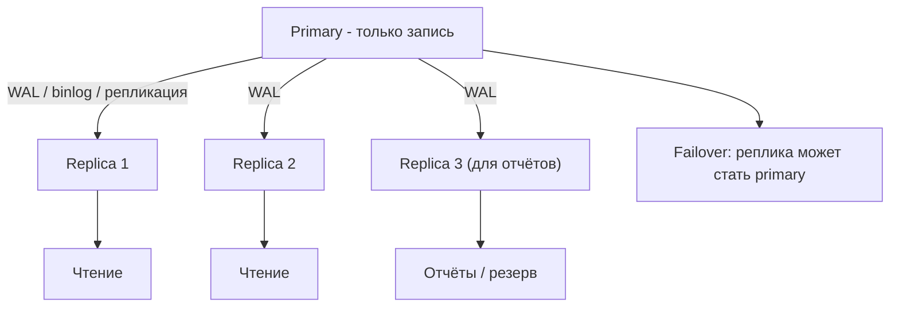
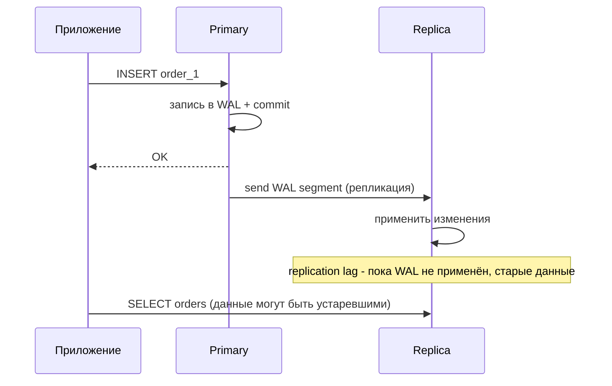

# Репликация (Replication)

## Определение

**Replication (репликация)** — поддержание копий данных БД: изменения с **primary (лидера/мастера)** передаются на **реплики (followers/slaves)** через журнал (WAL в Postgres, binlog в MySQL). Репликация обеспечивает устойчивость к отказам (если primary падает, есть актуальная копия), разгрузку чтения (см. Read Replicas) и наличие исторического слоя. Различают **асинхронную** (быстро, но риск потери) и **синхронную** (надёжно, но дольше).

## Зачем нужно

- **Отказоустойчивость** — при сбое primary реплика продолжает обслуживать (см. Failover).
- **Балансировка чтения** — несколько копий делят SELECT-нагрузку (см. Read Replicas).
- **Резервное копирование** — реплика часто играет роль базы для бэкапов/архивов (см. Backups).
- **Доступность при обслуживании** — upgrade/миграция на одной реплике без простоя системы.
- **Географическое расширение** — копии в разных дата-центрах для latency и DR.

## Как работает

- **Primary (leader/master)** — единственный writer; принимает записи, пишет их в журнал репликации.
- **Replica (follower/slave)** — применяет журнал изменений; только читает (обычно).
- **Синхронная репликация** — коммит подтверждается после применения на реплике: no-loss, но latency растёт.
- **Асинхронная репликация** — primary коммитит, не дожидаясь реплики: быстрее, но при внезапном сбое primary последние изменения могут потеряться.
- **Replication lag** — отставание реплики от primary (асинхронная схема): вплоть до N секунд.
- **Failover** — при падении primary одна из реплик повышается до лидера; клиенты переключаются.
- **Multi-node topologies** — chain (primary → A → B), star (primary → N реплик), вариант с синхронным ack-подтверждением записи.
- **Формат журнала** — Postgres: WAL (write-ahead log), MySQL: binlog; логический (row-based) журнал — для streaming-подписчиков (CDC).

Соглашение: репликация даёт **eventual consistency** для асинхронного случая; строгая синхронность связана с latency и доступностью (см. CAP Theorem).





## Примеры кода

### SQL (настройка репликации Postgres — конфиг)

```sql
-- primary (postgresql.conf):
wal_level = replica        -- или logical
max_wal_senders = 10
synchronous_commit = on    -- для синхронного (по желанию)

-- создание базовой копии для реплики:
pg_basebackup -h primary -D /var/lib/postgresql/data -U replicator -P

-- реплика (postgresql.conf):
primary_conninfo = 'host=primary port=5432 user=replicator'
primary_slot_name = 'slot_1'
```

### TypeScript (мониторинг lag)

```typescript
// lag: разница между активной WAL-позицией primary и применяемой репликой
export async function replicationLag(pool: Pool): Promise<number> {
  // на реплике:
  const { rows } = await pool.query(
    `SELECT pg_wal_lsn_diff(
        pg_last_wal_receive_lsn(),
        pg_last_wal_replay_lsn()) AS lag_bytes`,
  )
  return Number(rows[0]?.lag_bytes ?? 0)
  // alert если лаг большой (см. read-replicas)
}
```

### Go (проверка синхронности для критичного чтения)

```go
// Правило: при критичном «сильном» чтении (деньги, пароль)
// идти на primary, а не на реплику.
func (q *Querier) CriticalRead(ctx context.Context, userID int64) (*User, error) {
	var u User
	err := q.writer.QueryRowContext(ctx,
		"SELECT * FROM users WHERE id = $1", userID).Scan(&u)
	if err != nil {
		return nil, err
	}
	return &u, nil
}
```

### Java (Spring: failover config через реплики)

```java
// Failover: Spring Boot + Postgres
// spring.datasource.hikari.initialization-fail-timeout=-1
// типовые паттерны failover:
//
// 1) health-check: реплика жива?
// 2) если primary недоступен - переключаемся на реплику (script/LB)
// 3) после стабилизации primary - переключить обратно
//
// Главное: правильно выбрать timeout/liveness (см. Health Checks)
```

## Пример использования: интеграция

> Практика: **мониторинг lag**, **каскадная реплика**, **переключение (failover)**.

### SQL (история реплики: каскад)

```sql
-- Replica A и Replica B получают WAL от одной primary.
-- Replica C может наследовать от B (chain):
ALTER SYSTEM SET primary_conninfo = 'host=replica_b ...';
-- Такие топологии снижают нагрузку на primary при многих репликах.
```

### TypeScript (переключение при недоступности primary)

```typescript
export async function withFailover<T>(
  write: () => Promise<T>,
  readPrimary: boolean,
): Promise<T> {
  try {
    return await write()
  } catch (e) {
    // реплика может быть повышена до primary (failover).
    // после failover URL writer меняется (из конфиг/consul).
    const fallback = await promoteUpgradeIfNeeded()
    if (fallback) {
      writePool.options.connectionString = fallback
      return await write()
    }
    throw e
  }
}
```

### Go (проверка health реплики до отправки отчёта)

```go
// Отчёт на реплику: перед тяжёлым запросом убедиться, что она «применена»
func (q *Querier) ShouldUseReplica(ctx context.Context) bool {
	var ok bool
	if err := q.reader.QueryRowContext(ctx, `SELECT pg_is_in_recovery()`).Scan(&ok); err != nil {
		return false
	}
	return ok // true → это реплика (in recovery = follower)
}
```

### Java (Spring: balance read-heavy)

```java
// Разделение write/read на уровне DataSource (см. Read Replicas).
// Реплика, реплика, реплика - в балансировщике, primary для записи.
@Configuration
public class DataSourceConfig {
    @Bean
    DataSource routing(DataSource primary, ReplicaFactory replicas) {
        return new readAwareRoutingDataSource(primary, replicas); // см read-replicas
    }
}
```

## Паттерны использования

- **Асинхронная репликация по умолчанию** — критично почитать latency штатных сценариев.
- **Синхронная для важных данных** — когда потеря недопустима (финансы) — цена latency.
- **Мониторинг lag** — метрики + алерты «replica is N MB/сек отставания».
- **Failover оттренирован** — заранее знать, кто становится primary и как переключается приложение.
- **Реплика для бэкапов** — не дергать primary архивами/бакзем, а читать с реплики.
- **Каскад для многих реплик** — снижает давление на primary.

## Антипаттерны и ловушки

- **Считать асинхронную репликацию синхронной** — критичные читатели «читают свежее» с реплики.
- **Игнорировать lag** — пока реплика отстала, «списки» и «детали» показывают устаревшее.
- **Failover без подготовки** — кто станет primary, как обновится конфиг, скорость.
- **Писать на несколько реплик одновременно** — multi-writer сложен; пишет лидер.
- **Бэкапы с primary** — ненужная нагрузка на лидера; используйте реплику.
- **Нет мониторинга репликации** — «мы не знаем, что реплики отстают».

## Когда использовать / когда НЕ использовать

**Использовать:**
- Сервисы с необходимостью отказоустойчивости и DR (production, база данных).
- Read-heavy приложения, где реплики разгружают primary.

**НЕ использовать (или пересмотреть):**
- Когда допустима потеря данных и реплика не обязательна — жизненный цикл сервиса мал (редко).
- Чтобы «масштабировать запись» — реплики не дают больше записей (см. Sharding).
- В случае сложности жизненного цикла (маленький сервис без СУБД) — реплики не обязательны.

## Связанные темы

- **Read Replicas** — применение репликации для разгрузки чтения.
- **Failover / Disaster Recovery** — как используются реплики при отказе.
- **Sharding** — данные делятся по машинам; каждая копия реплицируется.
- **Eventual Consistency / CAP** — следствие задержки репликации.
- **Backups** — архив/бэкап на реплике, не на primary.
- **Monitoring** — lag и метрики реплик.

## Вопросы

### Q1
**Что такое primary и replica в репликации?**

- [ ] Две равные DB
- [x] Primary - единственный writer; replica - копия, следующая за журналом
- [ ] Кэш и таблица
- [ ] Сервер и индексы

Пояснение: primary принимает записи, реплики применяют журнал и обслуживают чтение; записи на лидера.

### Q2
**В чём особенность асинхронной репликации?**

- [ ] Нет потери данных никогда
- [x] Primary коммитит без подтверждения реплики: быстро, но при сбое возможны потери
- [ ] Медленнее из-за синхронизации
- [ ] Требует нескольких primary

Пояснение: async-репликация даёт скорость и задержку реплик (lag), но не гарантирует durable-запись на реплике в момент сбоя primary.

### Q3
**Что такое replication lag?**

- [ ] Время запроса
- [ ] Число строк
- [x] Отставание реплики от primary (неприменённый журнал)
- [ ] Размер журнала

Пояснение: lag - задержка применения сведений на реплике; данные могут быть неактуальны.

### Q4
**Для чего нужен failover с репликой?**

- [ ] Ускорение запросов
- [x] При падении primary реплика повышается до лидера, сервис остаётся живым
- [ ] Масштабирование записи
- [ ] Кэширование ответов

Пояснение: failover - переключение роли: реплика становится primary, клиенты переключаются; это обеспечивает отказоустойчивость.

### Q5
**Почему реплики не решают масштабирование записи?**

- [ ] Они ускоряют запись
- [x] В primary-writer модель только лидер пишет; реплики не увеличивают «пропуск» транзакций
- [ ] Они пишут всё параллельно
- [ ] Реплики – это таблицы

Пояснение: репликация копирует, но не делит нагрузку записи; рост записей решается шардингом, а не числом реплик.

## Источники

- PostgreSQL — High Availability, Load Balancing and Replication: https://www.postgresql.org/docs/current/high-availability.html
- MySQL — Replication Configuration: https://dev.mysql.com/doc/refman/8.0/en/replication-configuration.html
- AWS Aurora — replication (промышленное решение): https://docs.aws.amazon.com/AmazonRDS/latest/AuroraUserGuide/Aurora.Replication.html
- Patroni — HA for Postgres (автопереключение): https://patroni.readthedocs.io/