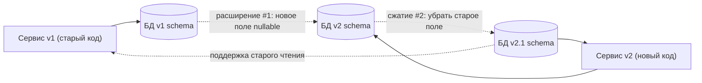
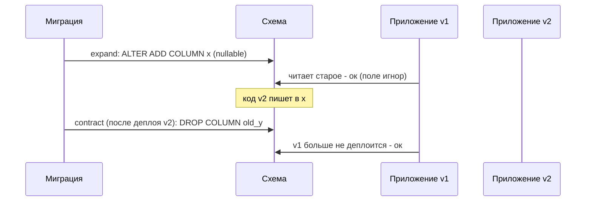

# Версионирование схем

## Определение

**Schema versioning (версионирование схемы)** — дисциплина, при которой структура БД меняется управляемым образом: каждое изменение версионируется, совместимо со старым кодом и применяется поэтапно (см. «Управление изменениями»). Цель — поддержать **backward compatibility**: старые сервисы/клиенты продолжают работать, пока выкатывается новое. В широком смысле — сочетание миграций, флагов и практик **expand-contract** / **parallel change**.

## Зачем нужно

- **Бесперебойные релизы** — мигрируем схему, пока приложение ещё старое (см. Zero Downtime).
- **Совместимость между сервисами** — разные версии микросервисов обращаются к одной БД.
- **Безопасность rollback** — старый код работает и после отката приложения.
- **Данные не теряются** — расширяем схему, а не ломаем её.
- **Длившаяся схемная эволюция** — десятки версий за месяцы без разрушения.

## Как работает

- **Expand** — добавить новое (nullable колонка, новая таблица), старый код не затронут.
- **Contract** — после развёртывания нового кода — сузить: удалить старое поле/таблицу.
- **Параллельное изменение (parallel change)** — «почта для двух форматов» читать/писать оба.
- **Version field в схеме** — через metadata (schema_migrations) — «где мы».
- **Миграция данных отдельно** — от схемы: backfill происходит по шагам (см. Migrations).
- **Полиморфизм данных** — JSON-колонки / type version для свободной эволюции.

Принцип: «код приложения и схема могут жить в разных версиях» — каждая может двигаться вперёд/назад независимо, главное — совместимость в обе стороны.





## Примеры кода

### SQL (expand → backfill → contract)

```sql
-- ШАГ 1 expand (миграция V10)
ALTER TABLE users ADD COLUMN email_normalized text;  -- nullable

-- ШАГ 2 backfill (migration V11, может идти дольше)
UPDATE users SET email_normalized = lower(email) WHERE email_normalized IS NULL;

-- ШАГ 3 contract (V12) - после того, как весь код новый
ALTER TABLE users DROP COLUMN email;
```

### TypeScript (parallel reading/writing двух форматов)

```typescript
type UserRow = { email?: string; email_normalized?: string }

// пишем в оба поля, читаем normalized - старый код (v1) ещё жив
export function persist(db: Db, email: string) {
  return db.update('users', {
    email,
    email_normalized: email.toLowerCase(),
  })
}
export function readEmail(row: UserRow): string {
  return (row.email_normalized ?? row.email ?? '').toLowerCase()
}
```

### Go (обработка старого/нового формата данных)

```go
// до контракта: читаем старое поле, если новое пустое.
type Row struct {
	EmailNormalized  *string `db:"email_normalized"`
	Email            *string `db:"email"`
}

func normalizedEmail(r Row) string {
	if r.EmailNormalized != nil && *r.EmailNormalized != "" {
		return *r.EmailNormalized
	}
	if r.Email != nil {
		return strings.ToLower(*r.Email)
	}
	return ""
}
```

### Java (feature flag на смену кода после миграции)

```java
// Фича-флаг: код v2 активен только когда миграция сделана.
boolean useNewField = featureFlag.isEnabled("users.email_normalized");

// Пока флаг off - старый код и старое поле; после - пишем новое,
// потом удаляем старое поле (contract).
public void save(User u) {
    if (useNewField) {
        db.update("users")
          .set("email_normalized", u.email().toLowerCase())
          .execute();
    } else {
        db.update("users").set("email", u.email()).execute();
    }
}
```

## Пример использования: интеграция

> Практика: **expand-contract**, **double-write**, **поэтапное сжатие**, **независимые версии кода и БД**.

### SQL (решающая последовательность при большом schema-изменении)

```sql
-- 1) expand (nullable)
ALTER TABLE users ADD COLUMN profile_version text; -- nullable
-- 2) (в фоне) backfill нулевых
-- 3) переключение кода на profile_version (double-write)
-- 4) contract:
ALTER TABLE users ALTER COLUMN profile_version SET NOT NULL;
ALTER TABLE users DROP COLUMN old_profile;
```

### TypeScript (dual-read в сервисе)

```typescript
// независимо от версии ответа - читаем любой из вариантов
export function resolveProfile(row: DbRow): Profile {
  if (row.profile_version) return JSON.parse(row.profile_version)
  return JSON.parse(row.old_profile) // fallback до contract
}
```

### Go (миграция статусов данных, две версии одно время)

```go
// события - "v1 статус" переводится в "v2 статус" только когда код готов
func toCurrentState(v1 string) string {
	switch v1 {
	case "O": return "OPEN"
	case "C": return "CLOSED"
	default: return strings.ToUpper(v1)
	}
}
```

### Java (метаданные версии в сущности)

```java
// если у строки есть поле "schema_ver" - можно агрегировать/валидировать
public class UserRow {
    int schemaVer;   // 1..
    String email;    // v1
    String emailNormalized; // v2
}
```

## Паттерны использования

- **Expand → Deploy → Contract** — стандартная триада без опасных остановок.
- **Double-write период** — новое пишется, старое ещё читается (parallel change).
- **Backfill постепенно** — большие таблицы заполняются партиционированно.
- **Backward compatibility в оба конца** — старый клиент и новый код работают.
- **Feature flags** — код переключается на новую схему флагом, не релизом.
- **Метаданные версии в данных** — для событий/долгих очередей - версия записи.

## Антипаттерны и ловушки

- **Contract раньше времени** — старая версия кода упадет (DROP без давления со стороны живого клиента).
- **Изменение значения существующего поля** — опасный break; меняет контракт.
- **Непокрытые бэкфиллы** — поле пустое, старый код получает нулы.
- **Оркестровка деплоя и схемы отдельно** — при откате кода нужна старая (совместимая) схема.
- **Long-running migration** — блокирует prod; выполнять в фоне.
- **Форматные разрывы в очереди/событии** — старые события, новые обработчики: версионировать payload.

## Когда использовать / когда НЕ использовать

**Использовать:**
- Любой сервис с СУБД и релизами, где код может пережить версию схемы.
- Системы нескольких сервисов/клиентов на одной БД.

**НЕ использовать (или пересмотреть):**
- Прототип без персистентности (не нужно).
- Данные полностью временные (кэш, аналитика) - расширение схемы там необязательно.
- Когда БД одна для «без кода» — управление существующей схемой всё равно стоит делать через миграции.

## Связанные темы

- **Миграции баз данных** — инструмент версионирования схемы.
- **Zero Downtime Deploys** — как версии кода и схемы катятся без простоя.
- **Feature Flags** — переключение кода на новую схему.
- **Expanding-contracting DB change** — глубоко разобрано в Migrations.
- **API Versioning** — аналогичная дисциплина для интерфейсов.

## Вопросы

### Q1
**Что такое expand-contract?**

- [ ] Удаление схемы
- [x] Поэтапное изменение: сначала добавить (совместимо), потом сузить (после деплоя)
- [ ] Создание индексов
- [ ] Кэширование данных

Пояснение: expand добавляет обратимо, contract убирает после обновления кода; обе операции совместимы с работающими версиями.

### Q2
**Зачем double-write при переходе на новое поле?**

- [ ] Ускоряет запись
- [x] Позволяет новому и старому коду работать одновременно (оба формата наполняются)
- [ ] Убирает индексы
- [ ] Для бэкапов

Пояснение: пишем в оба формата, пока жив старый код; сжатие — потом contract.

### Q3
**Почему нельзя сразу DROP старое поле?**

- [ ] Index конфликт
- [ ] Это быстрее
- [x] Старый деплой может ещё читать его - упадёт
- [ ] Данные дублируются

Пояснение: пока жив код v1, он читает/пишет старое поле; удалять его только после полного перевода кода (contract).

### Q4
**Что такое schema_migrations?**

- [ ] Кэш-таблица
- [ ] Индекс
- [x] Метadata-таблица, где зафиксирована применяемая версия схемы
- [ ] Репозиторий

Пояснение: инструмент миграций сверяет номера/хеши и знает, какие скрипты ещё не применены.

### Q5
**Что делать, когда миграция повисает/блокирует прод?**

- [ ] Отключить приложение
- [x] Дожидаться/выполнять в фоне; прод живой, критичные операции отдельно
- [ ] Удалить миграции
- [ ] Перезалить БД

Пояснение: тяжёлые DDL/backfill выполняют в фоне или поэтапно, не останавливая систему (следить за блокировками).

## Источники

- Database change management — PostgreSQL Wiki: https://wiki.postgresql.org/wiki/Change_management
- Expanding/Contracting schemas — Migrating schemas patterns (DDIA, Martin Kleppmann)
- Feature flags и миграции — martinfowler.com/bliki/FeatureToggle.html
- Flyway — best practice (expand-contract): https://flywaydb.org/documentation/tutorials/bestPractice