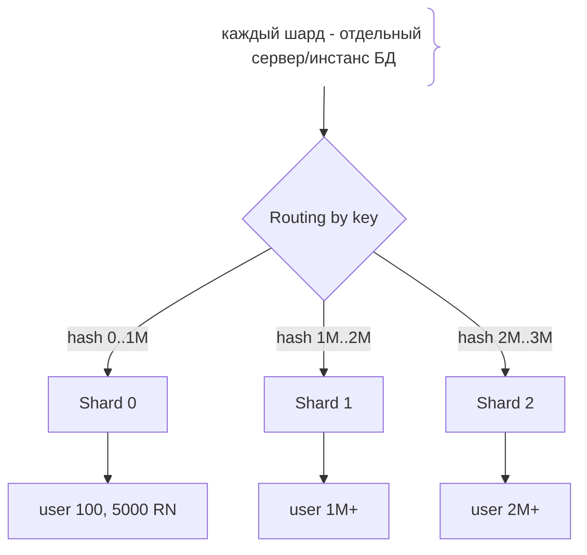
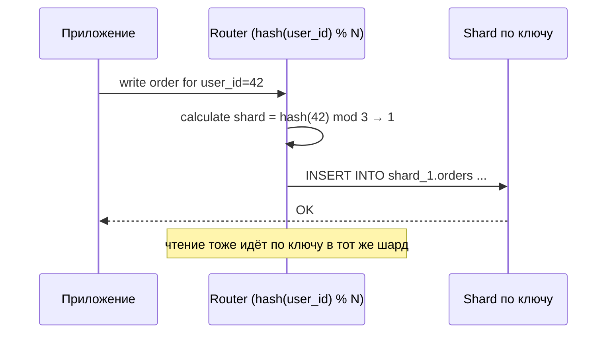

# Шардинг (Sharding)

## Определение

**Sharding (шардинг)** — горизонтальное масштабирование БД: данные делятся на независимые части — **шарды (shards)** — по ключу (например, `user_id`), каждый шард хранится на отдельной реплике/сервере и обслуживает только свою часть данных. В отличие от **partitioning** (партиции внутри одной БД) шардинг разносит данные по нескольким инстансам/машинам. Шардинг масштабирует **и записи, и чтения**, но добавляет сложность: routing, консистентность, решардинг.

## Зачем нужно

- **Масштаб записи** — read replicas не увеличивают объём записей; шарды позволяют писать многим инстансам.
- **Объём данных больше одной машины** — БД не помещается в память/диск одного сервера.
- **Изоляция нагрузки** — «горячие» пользователи не блокируют остальных (по шарду).
- **Задержки** — данные рядом с клиентом в локации шарда (регион/«сегмент»).
- **Отказоустойчивость на уровне данных** — падение одного шарда не роняет всю БД.

## Как работает

- **Шард-ключ (shard key)** — колонка/значение, по которому решается, куда попадёт запись (например, `user_id`, `tenant_id`, `account_id`).
- **Рутинг** — по ключу выбирается шард: `hash(key) % N`, диапазоны, каталог (список «ключ → шард»).
- **Диапазонный** — разделение диапазонов: `id 1..1M → шард A`, `1M..2M → шард B`; простой, но возможен дисбаланс «горячих» диапазонов.
- **Хеш по ключу** — хеш равномерно разбивает данные; нет локальных диапазонов, сложнее запрос по диапазону.
- **Каталог (directory)** — отдельный сервис/таблица «ключ → шард»; гибко, но нужен lookup.
- **Join и транзакции** — данные разных шардов не соединяются за один запрос; обычно это **1-N ребёнок на том же шарде (co-location)**.
- **Решардинг** — добавление шарда требует перераспределения данных (реформация) — сложно и дорого.

Выбор шард-ключа — ключевое решение: он должен давать равномерное распределение и позволять большинству запросов «одной строчкой» попадать в один шард.





## Примеры кода

### TypeScript (простейший роутер по хешу)

```typescript
// функции шардинга: hash(user_id) % shardCount
type Client = { query(q: string, p: unknown[]): Promise<unknown> }

export class ShardRouter {
  constructor(
    private readonly clients: Client[], // [соединение...шард 0..N]
  ) {}

  private shardOf(key: string | number): number {
    // простой стабильный хеш (crc32/sha1) mod количество шардов
    const hash = stringHash(String(key))
    return hash % this.clients.length
  }

  async saveOrder(userId: number, order: unknown) {
    const shard = this.shardOf(userId)
    return this.clients[shard].query(
      'INSERT INTO orders (user_id, payload) VALUES ($1, $2)',
      [userId, JSON.stringify(order)],
    )
  }

  async getOrders(userId: number) {
    const shard = this.shardOf(userId)
    return this.clients[shard].query(
      'SELECT * FROM orders WHERE user_id = $1',
      [userId],
    )
  }
}

function stringHash(s: string): number {
  let h = 0
  for (let i = 0; i < s.length; i++) {
    h = (h * 31 + s.charCodeAt(i)) >>> 0
  }
  return h
}
```

### Go (роутер с co-location: заказы пользователя в том же шарде)

```go
package shard

import (
	"fmt"

	"database/sql"
)

// ключ = user_id (по нему мы располагаем данные пользователя целиком)
func shardIndex(key string, n int) int {
	// fnv хеш → mod n
	h := fnv32(key)
	return int(h % uint32(n))
}

// Вся data пользователя (user, orders, payments) лежит в одном шарде:
//   - join в пределах шарда
//   - транзакция не пересекает границы
//   - маршрутизация по user_id из токена/запроса
func SaveOrderWithUser(db *sql.DB, userID int64, order any) error {
	tx, err := db.Begin()
	if err != nil {
		return err
	}
	// user и order нас находят в одном шарде: никаких кросс-шард записей
	defer tx.Rollback()
	if _, err := tx.Exec("INSERT INTO orders (user_id, payload) VALUES ($1, $2)",
		userID, order); err != nil {
		return err
	}
	return tx.Commit()
}
```

### Java (Spring: роутинг datasource по шард-ключу)

```java
// AbstractRoutingDataSource выбирает источник по ключу.
public class ShardRoutingDataSource extends AbstractRoutingDataSource {
    private final int shardCount;

    // безопасный хеш ключа
    int shardOf(String key) { return (key.hashCode() & 0x7fffffff) % shardCount; }

    private static final ThreadLocal<String> KEY = new ThreadLocal<>();

    public static void shardBy(String key) { KEY.set(key); }

    @Override
    protected Object determineCurrentLookupKey() {
        String key = KEY.get();
        if (key == null) return "default";
        return "shard" + shardOf(key); // возвращает "shard0".."shardN"
    }
}
```

## Пример использования: интеграция

> Практика: **выбор шард-ключа**, **co-location**, **минимизация кросс-шард запросов**.

### TypeScript (хранить шард в транзакции/запросе)

```typescript
// Вся работа одного пользователя идёт по user_id:
// токен/header → user_id → шард → одинDataSource
export async function handle(userId: number, body: unknown) {
  const shard = router.shardOf(userId)
  // данные пользователя co-located: user + orders + payments в одном шарде
  return dbWrites[shard].query(
    'INSERT INTO orders (user_id, payload) VALUES ($1, $2)',
    [userId, JSON.stringify(body)],
  )
}
```

### Go (поиск шарда для ключа из auth)

```go
// в HTTP-обработчик передаётся userID (из JWT) - по нему шард.
func handler(key string, shards []*sql.DB) {
	idx := shardIndex(key, len(shards))
	sh := shards[idx]
	// транзакции и join только в пределах shards[idx]
}
```

### Java (микросервис с одним шардом на сервер)

```java
// В конфигурации: каждый инстанс приложения знает свой шард.
// ShardRoutingDataSource подключает правильный DataSource по ThreadLocal-ключу.
// Записи для пользователя идут только в его шард (co-location).
public class OrderService {
    public void create(String userId, Order o) {
        ShardRoutingDataSource.shardBy(userId);
        try {
            orderRepository.save(o); // Spring Data - шард определяется ключом
        } finally {
            ShardRoutingDataSource.shardBy(null);
        }
    }
}
```

## Паттерны использования

- **Шард-ключ — основной идентификатор** — user_id/tenant_id, равномерное распределение.
- **Co-location** — связанные данные (заказ и его строки) в одном шарде — либо 1 запрос/join, либо транзакция.
- **Все запросы через ключ** — стараться уходить в шард «одной строкой» (id ключа).
- **Агрегация по шардам** — для cross-shard аналитики отправлять подзапросы во все шарды и объединять.
- **Решардинг редко** — проектировать под возможный рост: allow добавление шардов без полного перезалива.
- **Каталог** — если ключи редкие и неравномерные, использовать сервис «ключ → шард».

## Антипаттерны и ловушки

- **Плохой шард-ключ** — месяц/регион с «горячими» значением → горячий шард.
- **Кросс-шард join** — соединять данные разных шардов нельзя одним SQL; решается co-location или приложением.
- **Глобальные транзакции** — распределённые транзакции медленные и сложные (см. Distributed Transactions).
- **Решардинг на ходу** — добавить шард = перераспределить данные; проектируйте заранее (диапазоны/хеш + виртуальные шарды).
- **UNIQUE на глобальном уровне** — уникальность (email) в шарде локальна; глобальные ключи требуют внешнего сервиса.
- **Привязка порядка по ключу** — сортировка/пагинация по не-шард-полю требует объединения.

## Когда использовать / когда НЕ использовать

**Использовать:**
- Объём данных или нагрузка записи превышают одну машину.
- Явный шард-ключ в большинстве запросов (пользователь/арендатор/счёт).

**НЕ использовать (или пересмотреть):**
- Когда достаточно partitioning внутри одной БД (обычные размеры).
- Когда нагрузка решается read replicas (чтение не требует шардинга).
- Когда требуется много кросс-шард запросов и транзакций (схема конфликтует).

## Связанные темы

- **Partitioning** — партиции внутри одного сервера, не шарды.
- **Read Replicas** — масштабирование чтения без деления данных.
- **Replication** — как шард реплицируется/резервируется (каждый шард может иметь реплики).
- **Consistent Hashing** — стабильное распределение ключей по шардам и решардингу.
- **Distributed Transactions** — про разделённое состояние через сервисы.
- **Connection Pooling** — пулы соединений к каждому шарду.

## Вопросы

### Q1
**В чём главное отличие шардинга от партиционирования?**

- [ ] Ни в чём
- [x] Партиционирование делит данные в рамках одного инстанса; шардинг — по нескольким серверам/БД
- [ ] Шардинг - только кэш
- [ ] Партиционирование быстрее во всех случаях

Пояснение: partitioning - логическое разбиение внутри таблицы; sharding - физическое распределение по машинам.

### Q2
**Какой шард-ключ лучший?**

- [ ] Месяц создания записи
- [x] Основной идентификатор пользователя/аккаунта (равномерный, всегда доступен в запросе)
- [ ] Пол пользователя
- [ ] Случайный id без гарантий

Пояснение: ключ должен равномерно распределять нагрузку и встречаться во всех запросах к данным.

### Q3
**Почему co-location важна при шардинге?**

- [ ] Она ускоряет кэширование
- [x] Связанные данные в одном шарде позволяют делать join и транзакции без пересечения шардов
- [ ] Она уменьшает число серверов
- [ ] Она не нужна

Пояснение: если заказ и его строки в одном шарде - можно выполнить один запрос и транзакцию; в разных шардах - сложно и медленно.

### Q4
**Что делать с уникальностью (например, email) при шардинге?**

- [ ] Она сработает автоматически
- [x] UNIQUE-индекс локального шарда не гарантирует глобальную уникальность - нужен отдельный сервис
- [ ] Разрешить дубликаты
- [ ] Создать UNIQUE на каждом шарде

Пояснение: уникальность проверяется только в пределах шарда; глобальная уникальность требует централизованного реестра (Redis/таблица).

### Q5
**Как добавить пятый шард при хеш-разбиении на 4?**

- [ ] Просто добавить сервер
- [ ] Обновить только конфиг
- [x] Перераспределить (решардинг) данные по всем шардам - сложная операция
- [ ] Ключи перенесутся сами

Пояснение: при hash mod N добавление шарда меняет вычисление: часть ключей уходит на другие серверы, нужна миграция данных.

## Источники

- MongoDB — Sharding (документация): https://www.mongodb.com/docs/manual/sharding/
- Citus (Postgres extension) — sharding model: https://docs.citusdata.com/en/latest/concepts/overview.html
- Introduction to database sharding (DigitalOcean): https://www.digitalocean.com/community/tutorials/understanding-database-sharding
- AWS — Scaling to your workload with sharded clusters: https://docs.aws.amazon.com/AmazonDocDB/latest/developer-guide/docdb-sharding.html