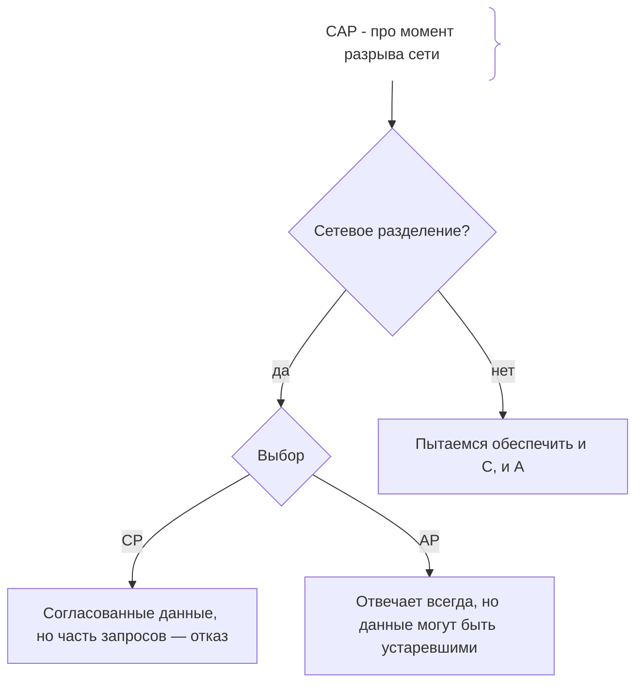
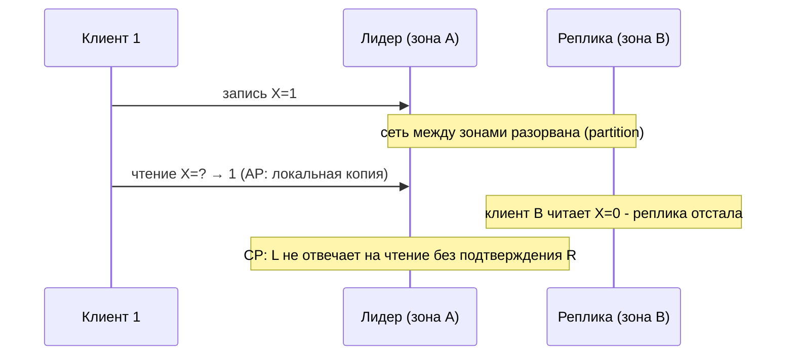

# CAP-теорема

## Определение

**CAP-теорема (CAP theorem, теорема Брюера)** — утверждение о распределённых системах: в случае **сетевого разделения (partition)** нельзя одновременно обеспечить **С**onsistency (согласованность), **А**vailability (доступность) и **P**artition tolerance (устойчивость к разделению). При сбое сети система вынуждена выбирать: либо отвечает, но данные могут быть устаревшими (AP), либо данные согласованы, но часть запросов отсекается (CP).

## Зачем нужно

- **Понимание компромиссов** — ни одна распределённая система не достигает всех трёх свойств сразу.
- **Выбор архитектуры** — что критичнее для продукта: свежесть данных или доступность (онлайн-магазин, банк, чат).
- **Обоснование NoSQL** — MongoDB/Redis/Elasticsearch и т.д. делают осознанный выбор CP или AP.
- **Проектирование отказов** — заранее знать поведение системы при сетевом сбое.

## Как работает

- **Consistency (С)** — после записи все узлы видят одно и то же значение (линейнаризуемость). Реплики не расходятся.
- **Availability (A)** — система отвечает на любой запрос в течение ограниченного времени (не ошибкой из-за «не сейчас»).
- **Partition tolerance (P)** — система продолжает работать при потере связи между узлами (сетевом разделении).
- **Компромисс при P** — при разделении лидер не может синхронизировать копии; либо он откажет части запросов (CP), либо вернёт устаревшие данные (AP).
- **PACELC-уточнение** — дополнение CAP: даже без partition выбирается компромисс между Latency и Consistency (PA/EL vs PC/EC).

Важно: CAP работает **в момент partition**, а не всегда; без разрыва сети можно попытаться обеспечить и С, и A (обычно в пределах дата-центра). PACELC же описывает постоянный выбор даже в норме.

### Примеры CP/AP-систем

- **CP-системы** — при разделении отвечают ошибкой (недоступность), сохраняя согласованность: ZooKeeper, etcd, PostgreSQL (синхронная репликация), MongoDB с majority.
- **AP-системы** — при разделении продолжат отвечать, но с возможным рассинхроном: Cassandra, Dynamo (в конфигурациях), Redis-кластер (в некоторых случаях), DNS.





## Примеры кода

### TypeScript (выбор CP/AP в клиенте)

```typescript
type Opts = { consistency: 'strong' | 'eventual' }

export function readNode(client: RedisClient, key: string, o: Opts) {
  if (o.consistency === 'strong') {
    // CP: требовать подтверждение от кворума узлов
    return client.mgetWithQuorum(key) // большинство узлов вернуло одинаковое
  }
  // AP: чтение из локальной копии - быстрее, но может быть stale
  return client.getLocal(key)
}
```

### Go (таймаут/выбор при partition)

```go
// Клиент решает, что делать при недоступности лидера.
func read(ctx context.Context, key string, mode string) (string, error) {
	if mode == "cp" {
		// CP: вернуть ошибку, если нет кворума
		if _, err := quorumRead(ctx, key); err != nil {
			return "", err
		}
	}
	// AP: прочитать из локального слоя даже если сеть недоступна
	return localCache.Get(key)
}
```

### Java (запись с требованием кворума)

```java
// Запись в распределённую БД: требуется подтверждение большинства реплик (CP).
public class Writer {
    private final List<Node> nodes;

    boolean write(String key, String value) {
        int ok = 0;
        for (Node n : nodes) {
            if (n.confirmWrite(key, value)) ok++;
        }
        return ok > nodes.size() / 2; // кворум - CP, иначе AP
    }
}
```

## Пример использования: интеграция

> Практика: **явно выбирать CP или AP под фичу**, **использовать PACELC**.

### TypeScript (стратегия для разных типов данных)

```typescript
// Свежесть критична (баланс, инвентарь) → consistency: 'strong'
// Допустима задержка (профиль, лайки) → consistency: 'eventual'
export const policies = {
  balance: { consistency: 'strong' as const },
  likes: { consistency: 'eventual' as const },
}
```

### Go (обработка кворума по типам)

```go
var strongOps = map[string]bool{"balance_write": true}
// Сильные операции требуют кворума, остальные - деградированный кворум (AP).
```

### Java (настройка консистентности Cassandra)

```java
// CP-чтение: consistency level QUORUM в Cassandra.
String id = "user-123";
CqlSession s = CqlSession.builder().build();
ResultSet rs = s.execute(SimpleStatement
    .builder("select * from k.users where id=:id")
    .addNamedValue("id", id)
    .build()
    .setConsistencyLevel(ConsistencyLevel.QUORUM));
```

## Паттерны использования

- **Определить тип данных** — для каждого домена решить strong vs eventual (PACELC).
- **Кворумы** — большинство узлов для строгой согласованности, доступности регулируется.
- **Мониторить partition** — если произошёл split сети, знать поведение заранее.
- **Отказ по функциональности** — при разделении деградировать по-фичам (recommendations stale, но баланс - CP).
- **Резерв по месту** — симметричные дата-центры для consistent масштабирования.

## Антипаттерны и ловушки

- **Ожидать «все три» сразу** — CAP гарантирует невозможность при partition.
- **Считать CAP только про БД** — это свойство системы с сетевым разделением, не отдельной БД.
- **Игнорировать partition** — дизайн без выбора CP/AP даёт «сумеречную» зону.
- **Смешивать «все данные strong»** — даст недоступность без необходимости.
- **Не учитывать PACELC** — без partition тоже нужно выбирать latency vs consistency.

## Когда использовать / когда НЕ использовать

**Использовать:**
- Проектирование любой распределённой системы (базы, очереди, кластеры).
- Обсуждение торгов ведущих NoSQL/транзакционных систем.

**НЕ использовать (или пересмотреть):**
- Когда путают с обычным обсуждением latency без сетевых разрывов - это другая ось.
- Как оправдание несовершенного дизайна без реального выбора торгов.

## Связанные темы

- **Eventual Consistency** — AP-конец спектра, итоговая согласованность.
- **Network Partitions** — причина, по которой CAP актуален.
- **Replication** — копии данных - источник рассинхрона (см. read-replicas).
- **Distributed Locks** — синхронизация пиров в распределённых системах.
- **Leader Election** — как выбирается основной узел при partition.

## Вопросы

### Q1
**Что утверждает CAP-теорема?**

- [ ] Система может быть идеальной
- [x] При сетевом разделении нельзя одновременно иметь consistency, availability и partition tolerance
- [ ] Каждая система либо CP, либо AP навсегда
- [ ] CAP работает только в дата-центрах

Пояснение: при partition (P) система вынуждена осознанно выбирать между С и A в этот момент.

### Q2
**Какой выбор делает CP-система при разрыве сети?**

- [x] Отказать части запросов, сохранив согласованность
- [ ] Отвечать всегда с устаревшими данными
- [ ] Игнорировать сеть
- [ ] Включить репликацию

Пояснение: CP жертвует доступностью, но не выдаёт рассинхрон - запросы к не-подтверждённым узлам завершаются ошибкой.

### Q3
**Какой выбор делает AP-система при разрыве сети?**

- [x] Продолжает отвечать, данные могут быть устаревшими
- [ ] Останавливается
- [ ] Теряет данные
- [ ] Гарантирует кворум

Пояснение: AP отдаёт доступности приоритет; реплики могут расходиться, но каждая отвечает.

### Q4
**Что добавляет PACELC к CAP?**

- [ ] Масштабирование
- [x] Выбор между latency и consistency даже без partition
- [ ] Таймер синхронизации
- [ ] Обязательные кворумы

Пояснение: PACELC описывает PA/EL vs PC/EC - постоянный компромисс между задержкой и согласованностью в обычном режиме.

### Q5
**Когда CAP принципиально включается в рассмотрение?**

- [ ] Никогда
- [x] При сетевом разделении между узлами
- [ ] При каждом вызове API
- [ ] Только на серверах без сети

Пояснение: CAP сформулирована про момент partition; без разрыва можно стремиться к С и A одновременно.

## Источники

- Brewer's CAP Theorem ("CAP Twelve Years Later: How the Rules Have Changed"): https://www.infoq.com/articles/cap-twelve-years-later-how-cap-rules-changed/
- CAP Theorem (Martin Kleppmann) - блог: https://martin.kleppmann.com/2015/05/11/please-stop-calling-databases-cp-or-ap.html
- DynamoDB whitepaper - trade-offs: https://docs.aws.amazon.com/amazondynamodb/latest/developerguide/bp-choosing-consistency.html
- PACELC: https://en.wikipedia.org/wiki/PACELC_theorem