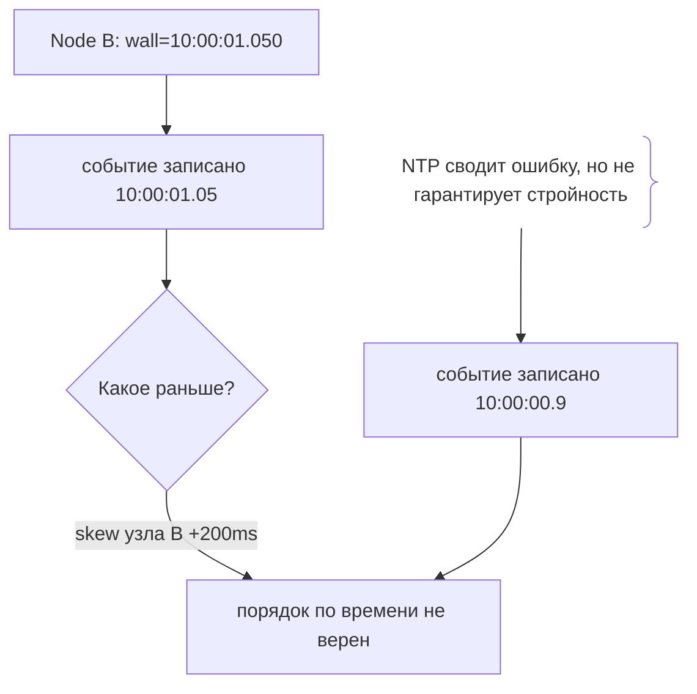
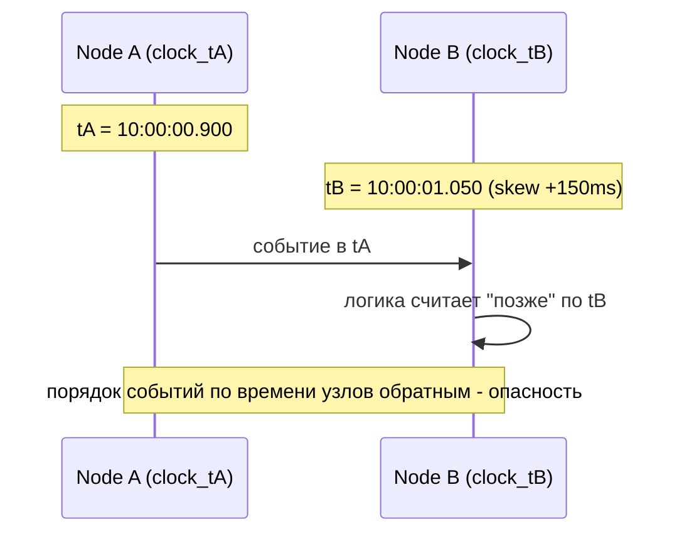

# Расхождение часов (Clock Skew)

## Определение

**Clock skew (расхождение часов)** — разница во времени между часами узлов в распределённой системе. Даже при синхронизации NTP часы разных машин отличаются на доли **миллисекунды–секунды**, а при сбоях NTP или сетевых задержках — заметно больше. Это разрушает доверие к времени как глобальному «порядку» событий: операции на разных узлах нельзя упорядочивать по настенным часам (timestamp).

## Зачем нужно

- **Не полагаться на время при упорядочивании** — приказы по wall-clock ненадёжны.
- **Глобальный порядок** — нужны логические часы (Lamport, вектор) или HLC (hybrid logical clock).
- **TTL/леase в распределённых системах** — смена времени узла ломает договор аренды (см. Distributed Locks).
- **Обработка событий** — коррекция «времени события» для аналитики и логов.

## Как работает

- **Wall clock** — настенные часы машины; могут «прыгать» (NTP шагом на ±секунду).
- **Monotonic clock** — монотонный счётчик времени (без прыжков) для измерения длительности; не подходит для «которого часа».
- **NTP** — корректирует часы в пределах миллисекунд; при сбое возможна ошибка больше.
- **Logical clocks** — Lamport clock (счётчик), vector clocks (частичный порядок) - без зависимости от времени узла.
- **HLC (Hybrid Logical Clock)** — комбинация физического времени + счётчика; даёт близкий к реальному порядок при ограниченном skew.
- **Lease на основе времени** - событие «lease истек» зависит от правильного времени.

Ключевое правило: **никогда не решайте «кто написал позже» по настенному времени узлов**; используйте логический счётчик/вектор/монотонный срок.





## Примеры кода

### TypeScript (не сравнивать timestamps узлов)

```typescript
export function isAfterByNodeClock(fn: () => number, a: number, b: number) {
  // плохо: сравнение времени разных узлов
  return a > b
}

// хорошо: монотонный счётчик от одного источника
export function byMonotonic(clock: { now(): number }, a: number, b: number) {
  return clock.now() >= b // операция после b
}
```

### Go (Lamport clock для порядка)

```go
type Lamport int64

// максимум локального и полученного + 1 - глобальный порядок событий.
func (c *Lamport) OnReceive(in Lamport) {
	if *c < in {
		*c = in
	}
	*c++
}

func (c *Lamport) OnLocal() {
	*c++
}
```

### Java (HLC - гибридные логические часы)

```java
// физическое время + counter; даёт строгий порядок в пределах skew
public class HLC {
    private final long pt = System.currentTimeMillis();
    private final int counter = 0;

    long tick(long msgPt, long msgCounter) {
        long now = System.currentTimeMillis();
        long updated = Math.max(now, Math.max(pt, msgPt));
        int c = (updated == pt) ? counter + 1
              : (updated == msgPt) ? msgCounter + 1 : 0;
        return pack(updated, c);
    }
}
```

## Пример использования: интеграция

> Практика: **избегать wall-clock для порядка**, **TTL считаем в монотонном времени**, **HLC/версия вместо времени**.

### TypeScript (метка версии вместо времени)

```typescript
export type Versioned = { version: number; data: unknown }
// вместо createdAt сравниваем version - одинаковый порядок на всех узлах
export function merge(a: Versioned, b: Versioned): Versioned {
  return a.version >= b.version ? a : b // монотонно, не зависит от часов
}
```

### Go (замер времени операции через monotonic)

```go
// меряем длительность НЕ настенным временем, а monotonic.
start := time.Now() // monotonic безопасен для измерений
elapsed := time.Since(start) // не прыгает с NTP
```

### Java (срок TTL в НЕ-настенных единицах для lease)

```java
// lease использует НЕ System.currentTimeMillis узла "здесь", а
// логическое лидерство (см. Leader Election) или token от координатора.
// Привязка lease к "40ms NTP" чревата ckew-ошибками.
```

## Паттерны использования

- **Логические часы для порядка** — Lamport/vector/HLC для рассылки событий.
- **Монотонное время для длительностей** — time.Since / System.nanoTime, не настенное.
- **NTP + допуски** — синхронизация плюс запас в lease/alert (skew budget).
- **Версии/счётчики вместо времени** — LWW через monotonic version, а не time.
- **Корректировка аналитики** — события снабжаются источником и offset skew.
- **Разделение «время узла» и «время события»** — хранить источник времени отдельно.

## Антипаттерны и ловушки

- **Упорядочивать по wall-clock нескольких узлов** — «кто раньше» может быть неверным.
- **LWW по времени** — clock skew искажает выбор последней записи (см. Eventual Consistency).
- **TTL/lease по времени узла** — NTP-коррекция может убить аренду раньше срока.
- **Сравнивать время логов разных хостов** — без скив-поправки вводит в заблуждение.
- **Ожидать, что NTP магически идеально** — точность конечна, надо закладывать budget.

## Когда использовать / когда НЕ использовать

**Использовать:**
- Везде, где есть порядок событий между узлами (логи, очереди-агрегаты, coordination).
- При lease/TTL распределённых блокировок.

**НЕ использовать (или пересмотреть):**
- Когда время одного узла достаточно (`created_at` в одиночной БД).
- Для измерений длительности в одном процессе.

## Связанные темы

- **Distributed Locks** - lease и его зависимость от времени узла.
- **Leader Election** - таймауты голосования не на wall-clock.
- **Eventual Consistency** - LWW на версии, а не времени.
- **Network Partitions** - увеличивают расхождение часов (нет NTP).
- **Monitoring** - показ skew метрики.

## Вопросы

### Q1
**Что такое clock skew?**

- [ ] Ошибка кэширования
- [x] Разница времени между часами разных узлов
- [ ] Зазор в индексе
- [ ] Длительность операции

Пояснение: skew - разница настенных часов узлов; даже NTP не даёт абсолютного совпадения.

### Q2
**Какие часы корректны для измерения длительности?**

- [ ] Wall clock
- [x] Monotonic clock - не прыгает при NTP
- [ ] Нет таких
- [ ] Логические

Пояснение: monotonic - счётчик времени без коррекций; идеален для замеров внутри узла, не для «которого часа».

### Q3
**Почему нельзя озаглавливать порядок событий по времени узлов?**

- [ ] Слишком просто
- [x] Время разных узлов может расходиться - «кто раньше» неверен
- [ ] Так и нужно
- [ ] Мало данных

Пояснение: skew искажает соотношение; для порядка нужен логический счётчик/версии одного источника.

### Q4
**Что даёт HLC (hybrid logical clock)?**

- [x] Сочетание физического времени и счётчика - порядок близок к реальному при ограниченном skew
- [ ] Ничего
- [ ] Кэш
- [ ] Сериализацию

Пояснение: HLC наследует преимущества wall + counter и практичен для распределённых событий.

### Q5
**Как правильно делать LWW?**

- [ ] По времени узла
- [x] По монотонной версии/счётчику, не по wall-clock
- [ ] По имени сервера
- [ ] Случайно

Пояснение: версия монотонна и не зависит от часов; время же подвержено skew.

## Источники

- NTP - официальные материалы: https://www.ntp.org/
- Leslie Lamport - Time, Clocks and Ordering of Events (ориг. статья)
- Hybrid Logical Clocks (Kulkarni et al): https://cse.buffalo.edu/tech-reports/2014-04.pdf
- Kleppmann - DDIA (глава "Distributed Data: ordering")