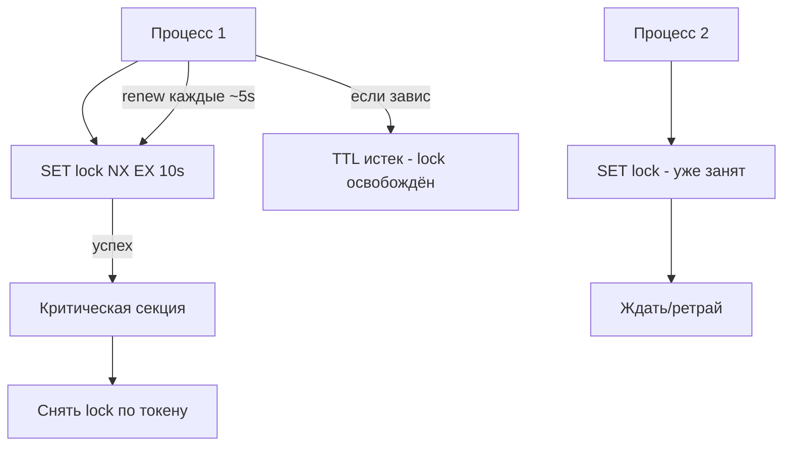
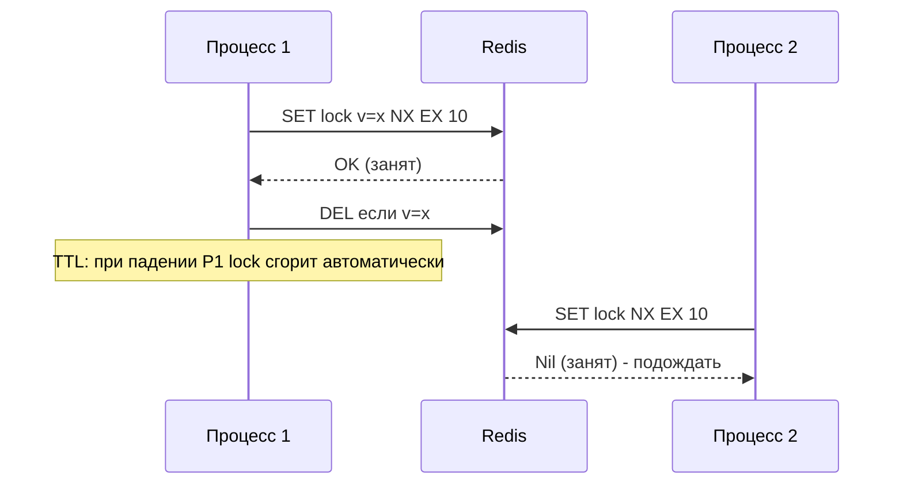

# Распределённые блокировки

## Определение

**Distributed lock (распределённая блокировка)** — механизм взаимоисключения для ресурсов, разделённых между несколькими процессами/узлами в сети. В отличие от локальных блокировок (synchronized/mutex) она координируется через внешний сервис (Redis, ZooKeeper, etcd, PostgreSQL с row lock). Гарантирует, что **в один момент времени только один арендатор** держит lock, и защищает критическую секцию для операций, распределённых по узлам.

## Зачем нужно

- **Обновление одного ресурса из многих инстансов** — инвентарь, баланс, job-обработка.
- **Крон-задачи** — не запускать один и тот же scheduler повторно (см. Leader Election).
- **Миграция/инициализация** — один процесс меняет схему, остальные ждут.
- **Идемпотентность внешних вызовов** — избежать двойной обработки платежа.

## Как работает

- **Аренда (lease) с TTL** — блокировка действует ограниченное время; если арендатель завис, она «сгорает» автоматически.
- **SET NX + EX (Redis)** — атомарная установка ключа «если не существует», с таймаутом.
- **Атомарность** — операции проверки и установки должны быть атомарными (без гонки).
- **Релиз с версией/token** — отпускает lock только тот, кто его держит (сравнение токена).
- **Возобновление (renewal)** — фоновый процесс продлевает аренду, пока работает критическая секция.
- **Одно из решений кворума (Redlock)** — несколько Redis-узлов для устойчивости (спорно; проще ZooKeeper/etcd).

Ключевой риск: **fencing token** — поток-владелец с устаревшей арендой не должен писать в защищаемый ресурс (сравнение токена на стороне ресурса).





## Примеры кода

### TypeScript (Redis-блокировка с TTL и токеном)

```typescript
import { createClient, type RedisClientType } from 'redis'

export class RedisLock {
  constructor(private readonly redis: RedisClientType) {}

  async acquire(key: string, ttlMs = 10000): Promise<string | null> {
    const token = crypto.randomUUID()
    const ok = await this.redis.set(key, token, {
      NX: true,
      PX: ttlMs,
    })
    return ok === 'OK' ? token : null
  }

  async release(key: string, token: string) {
    // Lua: атомарно удалить только если токен совпадает
    await this.redis.eval(
      `if redis.call('get', KEYS[1]) == ARGV[1] then
         return redis.call('del', KEYS[1])
       else return 0 end`,
      { keys: [key], arguments: [token] },
    )
  }
}
```

### Go (занятие блокировки, критическая секция, окончание)

```go
func withLock(rdb *redis.Client, key string, fn func()) error {
	ctx := context.Background()
	token := strconv.Itoa(rand.Int())

	ok, err := rdb.SetNX(ctx, key, token, 10*time.Second).Result()
	if err != nil {
		return err
	}
	if !ok {
		return ErrLocked
	}
	defer func() {
		// освобождение: проверка токена, чтобы не удалить чужой lock
		rdb.Eval(ctx, `
			if redis.call('get', KEYS[1]) == ARGV[1] then
			  return redis.call('del', KEYS[1]) end`, []string{key}, token)
	}()
	fn()
	return nil
}
```

### Java (Spring + Redis lock)

```java
// распределённый lock на уровне приложения.
@Service
public class InventoryService {
    private final StringRedisTemplate redis;

    // SET key token NX PX ttl - атомарно.
    public boolean lock(String key, String token, long ttlMs) {
        return Boolean.TRUE.equals(redis.opsForValue()
            .setIfAbsent(key, token, Duration.ofMillis(ttlMs)));
    }

    public boolean release(String key, String token) {
        // Lua - проверка токена, atom.
        return Boolean.TRUE.equals(redis.execute(
            new DefaultRedisScript<>(
                "if redis.call('get',KEYS[1])==ARGV[1] then return redis.call('del',KEYS[1]) else return 0 end",
                Long.class),
            List.of(key), token));
    }
}
```

## Пример использования: интеграция

> Практика: **TTL-аренда + токен + renewal**, **обработка дедлоков**.

### TypeScript (с renewal - фоновое продление)

```typescript
export class Lease {
  private timer?: NodeJS.Timeout

  constructor(
    private lock: RedisLock,
    private key: string,
    private token: string,
    private ttlMs: number,
  ) {}

  startRenewal() {
    this.timer = setInterval(async () => {
      // продлеваем пока мы всё ещё держатели (token совпадает)
      await this.lock.renew(this.key, this.token, this.ttlMs)
    }, this.ttlMs / 2)
  }

  async stop() {
    clearInterval(this.timer)
    await this.lock.release(this.key, this.token)
  }
}
```

### Go (выполнить один раз в кластере)

```go
// только один процесс делает миграцию/инициализацию.
if err := withLock(ctx, rdb, "migration:global", migrate); err == ErrLocked {
	log.Println("пропускаем: миграция уже идёт в другом инстансе")
}
```

### Java (один активный консьюмер по ключу)

```java
// обрабатывает событие только один из консьюмеров:
boolean got = lock("orders:100", token, 15000);
if (got) {
    try { orderService.process(100); }
    finally { release("orders:100", token); }
}
```

## Паттерны использования

- **TTL + токен** — атомарный NX + время жизни; отпускают по токену.
- **Renewal фоновый** — продление аренды, пока критическая секция жива.
- **Fencing token** — версия в записи ресурса, чтобы старый держатель не перезаписал нового.
- **Короткие критические секции** — не держать lock долго.
- **Идемпотентность** — повтор без lock должен безопасно деградировать (см. Idempotency).
- **Выбор бэкенда** — ZooKeeper/etcd/Postgres для строгого кворума; Redis прост быстр.

## Антипаттерны и ловушки

- **Lock без TTL** — если арендатель умер, блокировка висит вечно.
- **Релиз чужого lock'а** — DEL без проверки токена освободит чужой.
- **Ограничение по времени узла** — при clock skew аренда может разойтись (см. Clock Skew).
- **Игнорировать fencing** — старый держатель после lease написал в ресурс «новому».
- **Доверять Redis без кворума** — Redlock на одном узле при разделении ненадёжен (см. Network Partitions).

## Когда использовать / когда НЕ использовать

**Использовать:**
- Только одно изменение глобального ресурса за раз (миграции, обработчик очереди).
- Крон-задачи, которые должны выполниться единожды в кластере.

**НЕ использовать (или пересмотреть):**
- Когда хватит локальной блокировки (один процесс).
- Когда транзакция БД сама решает конкуренцию (update с версией - см. Optimistic Locking).
- Когда lock на очень долгую операцию - пересмотрите длину критической секции.

## Связанные темы

- **Leader Election** — частный случай «одна роль на кластер».
- **Optimistic / Pessimistic Locking** - локальные стратегии для БД.
- **CAP-теорема** — trade-off при выборе бэкенда для lock.
- **Network Partitions** - риск потери связи с координатором.
- **Distributed Transactions** - lock против компенсаций.

## Вопросы

### Q1
**Зачем distributed lock с TTL?**

- [ ] Быстрее
- [x] Если владелец завис - блокировка освободится сама
- [ ] Для кэша
- [ ] Для балансировки

Пояснение: аренда на время - самовосстановление после сбоев владельца.

### Q2
**Что возвращает `SET key token NX EX 10`?**

- [x] OK если ключа не было (занят нами), иначе nil
- [ ] Данные старое
- [ ] Ошибку всегда
- [ ] Время

Пояснение: NX - «только если нет», EX - TTL; атомарность гарантирует отсутствие гонки установок.

### Q3
**Почему нельзя просто DEL при релизе?**

- [ ] Сложно
- [x] DELETE не атомарно чужой lock: может удалить блокировку нового владельца
- [ ] Быстро
- [ ] Это стандарт

Пояснение: нужна проверка токена (Lua/сравнение), чтобы освободил только тот, кто держит.

### Q4
**Что такое fencing token?**

- [ ] Сетевой адрес
- [ ] Номер порта
- [x] Монотонный номер/версия - защищает от записи старого держателя после lease
- [ ] Ключ шифрования

Пояснение: ресурс сверяет токен: запись с меньшим fencing отвергается, движение «старик-владелец» не ломает.

### Q5
**Какой минус у Redis lock на одном узле при network partition?**

- [ ] Быстрее
- [x] Координатор сам может быть недоступен/разделиться - решение не надёжно
- [ ] Он быстрее в любом случае
- [ ] Нет минусов

Пояснение: безопасность требует кворума/консенсуса (ZooKeeper, etcd, Redlock), один узел - точка отказа.

## Источники

- Redis - SET NX EX и блокировки: https://redis.io/docs/latest/develop/use/distributed-locks/
- Antirez - Redlock analysis: https://martin.kleppmann.com/2016/02/08/how-to-do-distributed-locking.html
- ZooKeeper - recipes distribut locks: https://zookeeper.apache.org/doc/current/recipes.html
- etcd - mutex через lease: https://etcd.io/docs/v3.5/learning/api/