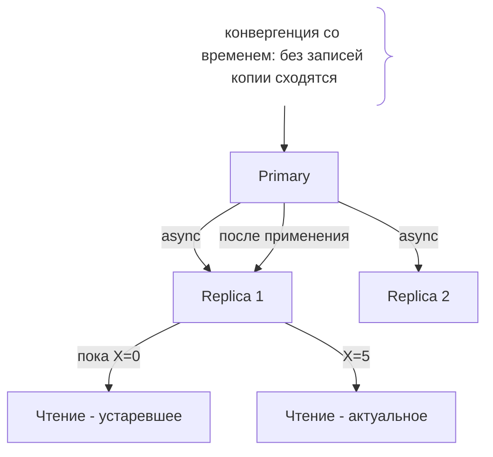
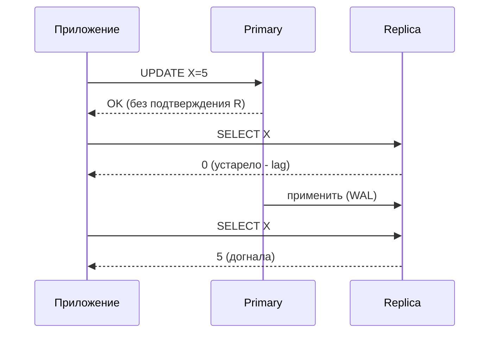

# Eventual Consistency (Итоговая согласованность)

## Определение

**Eventual Consistency (итоговая согласованность)** — модель согласованности в распределённых системах: после завершения записи копии данных **приходят к одному состоянию со временем**, но без гарантии мгновенной согласованности. Чтение сразу после записи может вернуть устаревшее значение на реплике, однако при отсутствии новых записей все узлы со временем конвергируют. Это **AP-конец спектра CAP** (см. CAP-теорема).

## Зачем нужно

- **Доступность и низкая задержка** — реплики отвечают мгновенно, не дожидаясь синхронизации всех.
- **Масштабирование чтения** — read replicas разгружают основную БД (см. Read Replicas).
- **Географическое распределение** — нет глобальной критической секции записи (лидер на нём).
- **Распределённые NoSQL** — Cassandra, DynamoDB и др. строят на ней согласованную модель.

## Как работает

- **Запись идёт в один узел (лидер/первичный)** — может быть тоже репликация в фон (asynchronous).
- **Реплики получают изменения асинхронно** — журнал (WAL) применяется позже (см. Replication).
- **Replication lag** — временное расхождение копий; читатель может увидеть старые данные (см. Read Replicas).
- **Конвергенция** — без новых записей все узлы со временем догоняют (применяют журнал).
- **Типы** — read-your-writes, monotonic reads, causal, last-write-wins - усиленные варианты.
- **Проверка** — нет глобального мгновенного «одно значение»; состояние реплик неизвестно.

Важно: eventual consistency **гарантирует сходимость** (в отсутствие записей), но не **мгновенность**. Разные системы дают разную задержку этого «со временем» (секунды, минуты).





## Примеры кода

### TypeScript (чтение с учётом eventual)

```typescript
type Result = { value: number; fresh: boolean }

export async function readWithHint(client: RedisClient, key: string): Promise<Result> {
  // реплика отвечает, но данные могут быть отсталыми
  const value = Number(await client.getFromReplica(key))
  return { value, fresh: false } // признак «могут быть устаревшие»
}
```

### Go (компромисс для кэша профилей)

```go
// Профиль пользователя можно читать eventual; баланс - strong.
func profile(ctx context.Context) (Profile, error) {
	// AP-чтение: быстро, может быть stale, устраивает продукт
	return repo.ReadProfileFromReplica(ctx, id)
}
```

### Java (чтение с freshness-меткой)

```java
// Данные из кэша с меткой времени - приёмлемо для лайков/просмотров.
public record Snapshot(String value, long updatedAt) {
    boolean isFresh(long maxAgeMs) {
        return System.currentTimeMillis() - updatedAt < maxAgeMs;
    }
}
```

## Пример использования: интеграция

> Практика: **выбрать eventual там где допустимо**, **добавить метку времени/версию**, **спец. strong-чтение для критичного**.

### TypeScript (разделение strong/eventual в сервисе)

```typescript
// Сильные данные: читать только с primary (strong).
// Слабые: можно с реплики (eventual).
export async function balanceAndProfile() {
  const balance = await readPrimary('account:balance') // strong
  const profile = await readReplica('user:profile')    // eventual
  return { balance, profile }
}
```

### Go (read-your-writes для сеанса)

```go
// Гарантия «вижу своё же последнее изменение»: sticky session / no-cache для своей сессии.
func sessionRead(ctx context.Context, key string, uid string) (string, error) {
	// для запросов текущего пользователя - true strong (первичный сервер)
	return cache.GetWithPreviousSession(ctx, key, uid)
}
```

### Java (версия в записи для последнего участника)

```java
// LWW: последняя запись с большей версией/временем побеждает при конфликте реплик.
record Versioned(String value, long version) {}
// конфликт: принять запись с большим version (см. clock-skew - осторожно с временем!)
```

## Паттерны использования

- **Определить категорию данных** — eventual для профилей, лайков, фидов; strong для баланса, заказов.
- **Спец. strong-чтение** — для критичного добавить флаг (чтение с primary/кворума).
- **Метка времени/версия** — данные с меткой свежести легко фильтровать.
- **Sticky session** — «моя сессия» всегда видит своё (read-your-writes).
- **Мониторинг lag** — знать, насколько могут устаревать реплики (см. Read Replicas).

## Антипаттерны и ловушки

- **Читать критичные данные eventual** — баланс/инвентарь могут показаться «неправильными».
- **Считать eventual «мгновенным»** — задержка может быть секунды/минуты.
- **Ожидать глобальный порядок** — без strong-уровня линейнаризации порядок записей не гарантирован.
- **Игнорировать метку свежести** — нет времени/версии, нельзя определить актуальность.
- **Применять LWW с временем** — часы на разных узлах могут расходиться (см. Clock Skew); лучше версия.

## Когда использовать / когда НЕ использовать

**Использовать:**
- Профили, лайки, фиды, кэши, рекомендации - где задержка допустима.
- Масштабирование чтения через read replicas.

**НЕ использовать (или пересмотреть):**
- Деньги, балансы, брони - требуется сильная согласованность.
- Строгий порядок событий (финансовые аудиты).
- Всегда бывает trade-off с доступностью/задержкой (см. CAP).

## Связанные темы

- **CAP-теорема** — AP-конец спектра: доступность ценой согласованности.
- **Read Replicas** — практика масштабирования чтения через eventual-данные.
- **Replication** — механизм, порождающий lag.
- **Network Partitions** — отсюда рассинхрон копий.
- **Clock Skew** — опасность времени при eventual-конфликтах.

## Вопросы

### Q1
**Что гарантирует eventual consistency?**

- [ ] Мгновенную согласованность сразу
- [x] Копии сходятся к общему состоянию со временем
- [ ] Отсутствие репликации
- [ ] Всегда свежие данные

Пояснение: eventual означает «сойдётся позже», когда записей больше нет; мгновенной гарантии нет.

### Q2
**Где eventual consistency подходит?**

- [ ] Баланс денег
- [ ] Финансовые транзакции
- [x] Профили, лайки, фиды, кэши
- [ ] Инвентаризация с точностью до штуки

Пояснение: некритичные данные, где задержка допустима - типичное применение.

### Q3
**Что такое replication lag?**

- [x] Отставание копии от primary при асинхронной репликации
- [ ] Лишний сервер
- [ ] Время старта БД
- [ ] Ширина канала

Пояснение: пока журнал применяется не мгновенно, реплика может отставать - точная мера eventual.

### Q4
**Чем обеспечить «вижу своё последнее изменение»?**

- [ ] Ничем
- [x] Sticky session / strong-чтение для сессии
- [ ] Убить реплики
- [ ] Большим кэшем

Пояснение: read-your-writes - усиленный вариант: сессия видит собственные записи.

### Q5
**Почему опасно использовать время для LWW?**

- [ ] Время не хранится
- [ ] Через день обновится
- [x] Часы на узлах могут расходиться (clock skew) - конфликты некорректны
- [ ] Время дорогое

Пояснение: при расхождении времени у побеждающей записи может быть «позднее» значение по часам, но не по порядку (см. Clock Skew).

## Источники

- Werner Vogels - Eventually Consistent: https://www.allthingsdistributed.com/2008/12/eventually_consistent.html
- PostgreSQL - корректная чтение с реплик (документация): https://www.postgresql.org/docs/current/transaction-iso.html
- DynamoDB - выбор консистентности: https://docs.aws.amazon.com/amazondynamodb/latest/developerguide/HowItWorks.ReadConsistency.html
- Kleppmann - Designing Data-Intensive Applications (глава 5)