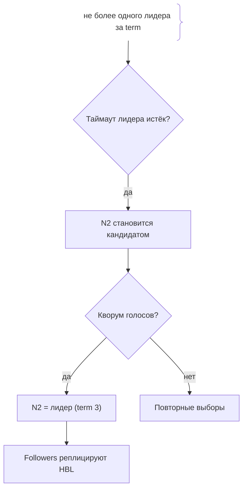
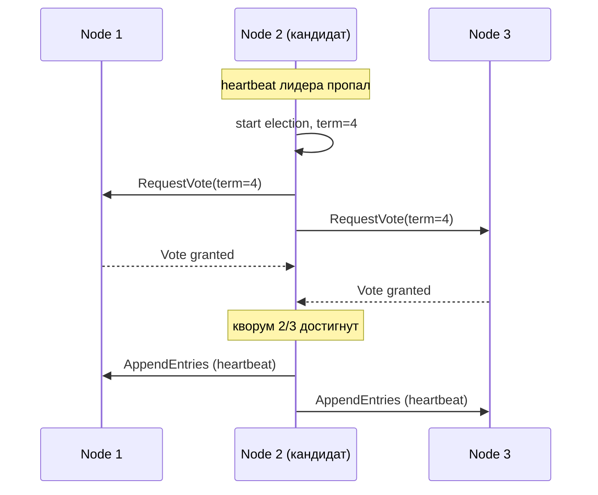

# Выбор лидера (Leader Election)

## Определение

**Leader Election (выбор лидера)** — механизм в распределённой системе для назначения **одного узла-лидера** (leader/master/primary) среди нескольких кандидатов. Лидер единственный обрабатывает запись/координацию, остальные — его реплики/followers. Гарантируется, что даже при сбоях в системе существует не более одного лидера (для «single leader» варианта), что необходимо для консистентности. Алгоритмы: **Raft**, **Paxos**, эмуляция через **ZooKeeper**/etcd (ephemeral znodes / leases).

## Зачем нужно

- **Единственный writer** — исключить гонки при записи в распределённой БД (см. Replication, Read Replicas).
- **Координация** — одна точка принятия решений (секции кворума, консенсус).
- **Failover** — при падении лидера автоматически выбирается новый (см. Failover).
- **Идемпотентность** — в очереди/оркестрации нужен один активный обработчик (см. Distributed Locks).

## Как работает

- **Кандидаты** — узлы, претендующие на роль лидера в начале/при сбое.
- **Голосование** — кворум узлов подтверждает кандидата (большинство : N/2+1).
- **Term (срок)** — монотонная версия периода правления; при сети «разделении» в каждом части-времени может быть голосование.
- **Lease/аренда** — лидер «удерживает» роль ограниченное время; если не продлевает, followers конкурируют.
- **Raft** — таймауты, выборы, логи репликации на лидерстве (стандартный описания).
- **Уникальность** — не более одного принятого лидера на срок; «split brain» предотвращается кворумом.

Ключевое: кворум (жёсткая вероятность для голосования) гарантирует, что два раздела не выберут двух лидеров одновременно, - за счёт того, что пересечение кворумов непусто.





## Примеры кода

### TypeScript (выбор лидера через etcd lease)

```typescript
import { Etcd3 } from 'etcd3'

export async function tryBecomeLeader(etcd: Etcd3, name: string, ttl = 10) {
  // lease + ephemeral ключ: пока жива аренда - мы лидер
  const lease = await etcd.lease().acquire(ttl)
  const acquired = await etcd
    .lock('leader')
    .ttl(ttl)
    .acquire(name) // если ключ занят - не стали лидером
  return { acquired, leaseId: lease.toString() }
}
```

### Go (выбор через ZooKeeper ephemeral node)

```go
// znode c эпимерностью: получили - лидер, потеряли (session expire) - follower.
func acquireLeadership(conn *zk.Conn, path string, data []byte) (bool, error) {
	created, err := conn.Create(path, data, zk.FlagEphemeral, zk.WorldACL(zk.PermAll))
	if err == zk.ErrNodeExists {
		return false, nil // уже есть лидер
	}
	return created != nil, err == nil
}
```

### Java (Raft эмуляция в приложении: статус)

```java
// Текущий статус узла в cluster: leader/follower/candidate.
enum Role { LEADER, FOLLOWER, CANDIDATE }

// Обработка на heartbeat: если лидер пропал - идём в CANDIDATE,
// голосуем, при кворуме становимся LEADER.
public class Node {
    volatile Role role = Role.FOLLOWER;
    void onHeartbeatTimeout() {
        role = Role.CANDIDATE;   // запуск выборов
        // нужен кворум: N/2+1 подтвердивших
    }
}
```

## Пример использования: интеграция

> Практика: **single-active worker-паттерн**, **auto-failover БД**, **лидер для scheduler**.

### TypeScript (один активный воркер для крон-задач)

```typescript
// Несколько инстансов приложения, но крон-задачи исполняет только лидер.
export class CronLeader {
  async start() {
    const { acquired } = await tryBecomeLeader(client, this.host)
    if (acquired) {
      this.scheduler.start() // только лидер
    } else {
      this.scheduler.stop()  // остальные ждут
    }
  }
}
```

### Go (scheduler с эфемерным лидерством)

```go
func main() {
	ok, err := acquireLeadership(conn, "/jobs/leader", []byte(hostname))
	if err != nil {
		log.Fatal(err)
	}
	if ok {
		runScheduler() // единственный активный
	}
}
```

### Java (лидер для потребителя очереди)

```java
// В кластере консьюмеров - только лидер регистрирует консьюмера.
if (node.role == Role.LEADER) {
    consumer.start();
} else {
    consumer.stop(); // followers об этом знают через статус/лидерство
}
```

## Паттерны использования

- **Ephemeral + lease** — лидерство временное; продлевается heartbeat-ом (ZooKeeper/etcd).
- **Кворум выборов** — большинство узлов для согласованного кандидата.
- **Heartbeats** — followers слушают лидера; истечение таймаута - старт выборов.
- **Терм** — монотонный номер срока: конфликты голосов разрешаются им.
- **Watch/eviction** — сторожить потерю лидера и автоматически переизбирать.
- **Формальный алгоритм** — Raft как эквивалент реализуемости для системы.

## Антипаттерны и ловушки

- **Split brain** — два лидера одновременно, если кворум не соблюдён (паттерн-катастрофа).
- **Слишком маленький кворум** — REPLICATION < N/2+1 допустима только для разрешения.
- **Нет lease** — «лидер» держит роль бесконечно, отказ не восстанавливается.
- **Измерять по времени сервера** — таймауты выборов должны быть случайными (иначе голосование срывается).
- **Игнорировать предшествующий терм** — stale кандидат пытается стать лидером.

## Когда использовать / когда НЕ использовать

**Использовать:**
- Single-writer БД (Postgres primary, RabbitMQ quorum queue).
- Сервисы с фоновыми задачами (один активный scheduler/consumer).

**НЕ использовать (или пересмотреть):**
- Если каждый узел может писать независимо (другой класс консенсуса, не single leader).
- Когда лидерность не нужна (stateless сервисы).

## Связанные темы

- **Distributed Locks** — механизм аренды/лидерства для исключительности.
- **CAP-теорема** — лидерство с кворумом - CP-механизм.
- **Network Partitions** — вызов для выбора лидера при разделении.
- **Failover** - практика переключения на нового лидера.
- **Replication / Read Replicas** - follower'ы синхронизируются с лидером.

## Вопросы

### Q1
**Что гарантирует leader election в classic single-leader модели?**

- [x] Не более одного лидера в определённые периоды (term)
- [ ] Два лидера всегда
- [ ] Все узлы пишут
- [ ] Лидер бессмертен

Пояснение: консенсус гарантирует уникальность лидера на срок; split brain не допускается через кворум.

### Q2
**Зачем нужен кворум при голосовании?**

- [x] Пересечение кворумов гарантирует, что два раздела не выберут разных лидеров
- [ ] Просто больше голосов
- [ ] Нужен сервер
- [ ] Все узлы обязаны согласиться

Пояснение: любой кворум большинства имеет общий узел - единого лидера на срок можно определить однозначно.

### Q3
**Что такое lease (аренда) лидера?**

- [ ] Резервная сеть
- [ ] Подписка
- [x] Ограниченный срок роли: лидер должен продлевать heartbeat-ом
- [ ] Право на репликацию

Пояснение: lease - время удержания; если истекло - followers могут выбрать нового лидера.

### Q4
**Что происходит при истечении heartbeat-таймаута у follower?**

- [ ] Узел останавливается
- [x] Узел становится кандидатом и начинает выборы (election)
- [ ] Узел удаляется
- [ ] Ничего не происходит

Пояснение: follower считает лидера недоступным, переходит в candidate и голосует с другими.

### Q5
**Чем опасен split brain в leader election?**

- [x] Два узла считают себя лидерами - конфликт записей и потери консистентности
- [ ] Быстрее работает
- [ ] Резервные копии
- [ ] Просто шум

Пояснение: два лидера пишут в один и тот же набор данных → рассинхрон, порча данных; профилактика - кворум (см. CAP/CP).

## Источники

- Raft Consensus Algorithm (официальный ресурс): https://raft.github.io/
- ZooKeeper - Leader Election: https://zookeeper.apache.org/doc/current/recipes.html
- etcd - лидерство/lease (docs): https://etcd.io/docs/v3.5/dev-guide/api_concurrency_reference/
- Martin Kleppmann - DDIA (глава про консенсус)