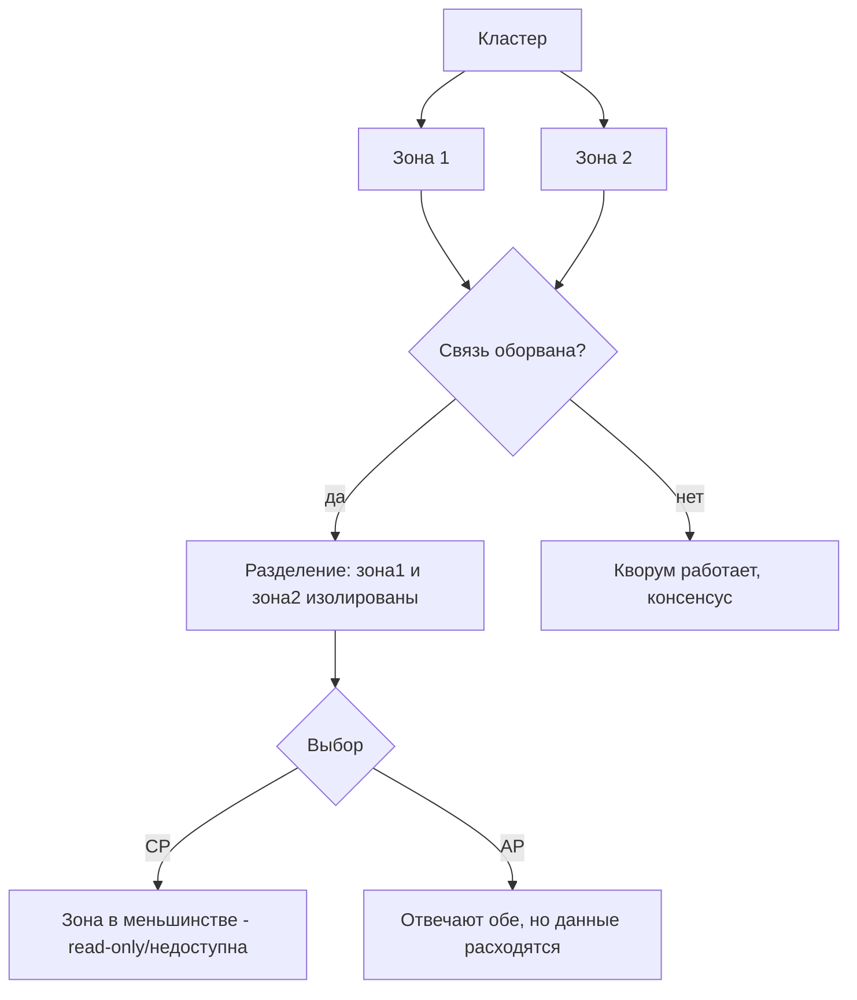
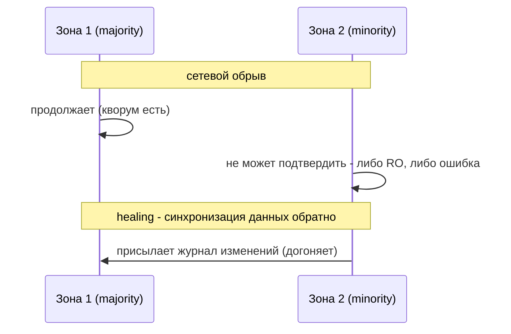

# Сетевые разделения (Network Partitions)

## Определение

**Network partition (сетевое разделение)** — потеря связи между частями кластера: узлы в разных «островках» перестают видеть друг друга (сбой сетевой карты, свича, региона, DNS/firewall). Это центральный сценарий CAP-теоремы (см. CAP-теорема): во время partition системе приходится выбирать между С (согласованность, жертвуя доступностью) и A (доступность, жертвуя согласованностью). Разделение может быть кратковременным (пакет потерян) или длительным (обрыв региона).

## Зачем нужно

- **Понять CAP** — без partition не существует выбора CP/AP.
- **Проектировать отказоустойчивость** — получить поведение систем при обрывах.
- **Предотвратить split brain** — два лидера в разных островках - катастрофа (см. Leader Election).
- **Планировать деградацию** — какие сервисы продолжают работать, какие отсекаются.

## Как работает

- **Причины** — обрыв кабеля, сбой свича, блокировка пакетов (firewall/VPN), остановка части региона.
- **Раздел (partition set)** — непересекающиеся острова; каждый видит только своих.
- **Quorum** — для согласованных решений нужно большинство (N/2+1); в меньшинстве система не может определить «лидера мира при остальных».
- **Minority/majority** — при отсутствии кворума большинство продолжает работать (CP), меньшинство недоступно или становится read-only (см. Replication, Leader Election).
- **Гей-расширение** — healing: связь вернулась; требуется ресинхронизация копий (см. Eventual Consistency).
- **Split brain** — если оба острова считают себя полноправными и принимают записи - рассинхрон данных.

Важно: CAP сформулирована для момента времени; после healing данные конвергируют, если выбрана модель (см. Eventual Consistency / Read Replicas).





## Примеры кода

### TypeScript (обнаружение partition через heartbeat)

```typescript
export class PartitionDetector {
  constructor(
    private peers: string[],          // адреса узлов
    private intervalMs = 1000,
  ) {}

  async isHealthy(): Promise<boolean> {
    let ok = 0
    for (const p of this.peers) {
      try {
        await fetch(`${p}/health`, { signal: AbortSignal.timeout(500) })
        ok++
      } catch {
        /* не ответил */
      }
    }
    return ok > this.peers.length / 2 // кворум есть
  }
}
```

### Go (кворум на валидацию - не принимать решение меньшинством)

```go
// В кластере из 3 узлов решение принимается только при 2+.
func Decide(acks int, total int) bool {
	return acks*2 > total // strict majority
}

// если acks=1 of 3 - «нет кворума»: волевое против BLOCK (CP) или stale (AP).
```

### Java (отсечение меньшинства - read-only при partition)

```java
// В зоне меньшинства БД переходит в read-only (не принимает записи).
public class WaryReplica {
    boolean canWrite(int myVotes, int total) {
        return 2 * myVotes > total;  // в меньшинстве пишем только в AP-модели
    }
}
```

## Пример использования: интеграция

> Практика: **health-checks для детекта**, **переключение резервной зоны**, **деградация фич**.

### TypeScript (переключение клиентов на другой регион)

```typescript
export async function failoverOrReject(...) {
  // 1) детект partition (heartbeat)
  // 2) если primary-регион недоступен - направляем трафик на запасной
  // 3) если запасного нет - отдавать 503/read-only (CP) или stale-кэш (AP)
}
```

### Go (стратегия «каждый сервис знает свою доступность»)

```go
// health handler: сколько узлов видно, кворум ли.
func (d *Detector) Status() map[string]any {
	return map[string]any{
		"peers":  d.peers,
		"quorum": d.isQuorum(),
	}
}
```

### Java (смоук-тест для split-brain политики)

```java
// Проверка: при 3 узлах и отпавшей сети на 1 - политика CP блокирует запись.
void assertSplitBrainPolicy() {
    WaryReplica rep = new WaryReplica();
    Assert.assertTrue(rep.canWrite(2, 3));  // большинство - можно
    Assert.assertFalse(rep.canWrite(1, 3)); // меньшинство - отказ записи
}
```

## Паттерны использования

- **Детект через heartbeat/health** — периодическая проверка соседей (см. Health Checks).
- **Кворум для решений** — те же правила, что в выбор лидера (см. Leader Election).
- **Zones/topologies** — распределение по зонам 3 (majority) чтобы меньшинство было безопасным.
- **Read-only в меньшинстве** — деградация без полного падения (CP).
- **Reconnect/handshake при healing** — после обрыва синхронизовать изменения.
- **Метрики partition** — number of peers, «сетка видимости» в мониторинге.

## Антипаттерны и ловушки

- **Split brain** — две зоны думают, что они полноправные - рассинхрон данных.
- **Писать из меньшинства** — без кворума запись небезопасна (данные теряются при healing).
- **Не иметь метрик partition** — partition произошёл, но никто не заметил.
- **Управление без таймаутов** — зависшие запросы «навсегда» на оборванном канале.
- **AP везде** — для денежных операций рассинхрон катастрофичен (см. CAP).

## Когда использовать / когда НЕ использовать

**Использовать:**
- Проектирование отказоустойчивых кластеров, баз данных, координаторов.
- Разработка поведений при failover и деградации.

**НЕ использовать (или пересмотреть):**
- Отдельные монолитные узлы без репликации - partition не наступает в обычном смысле.
- Простое игнорирование — модерируйте «нет времени»-расписание через таймауты.

## Связанные темы

- **CAP-теорема** — центральный контекст раздела.
- **Leader Election** - кворум и выбор лидера во время partition.
- **Distributed Locks** - координация при разделении ненадежна.
- **Eventual Consistency** - данные копий конвергируют после healing.
- **Failover** - переключение резервной роли при разделении.
- **Monitoring** - метрики видимости узлов.

## Вопросы

### Q1
**Что такое network partition?**

- [ ] Сбой кэша
- [x] Потеря связи между частями кластера - узлы изолированы
- [ ] Медленный запрос
- [ ] Переполнение памяти

Пояснение: разделение - отсутствие связи между группами узлов; ключевой сценарий CAP.

### Q2
**Почему minority-зона не может писать в CP-модели?**

- [ ] Не хватает места
- [x] Нет кворума большинства - решение нельзя принять согласованно
- [ ] Быстрее не пишет
- [ ] Это не правила

Пояснение: запись без большинства может быть отброшена после healing; CP требует подтверждения кворума.

### Q3
**Что опасно в split brain?**

- [x] Две части считают себя полноправными - данные расходятся безвозвратно
- [ ] Быстрее
- [ ] Меньше трафика
- [ ] Резервные копии

Пояснение: два «лидера» пишут по-разному; при объединении конфликты неразрешимы без внешнего слияния.

### Q4
**Зачем heartbeat/health при работе с partition?*\]

- [x] Периодическая проверка видимости узлов - ранний детект разделения
- [ ] Увеличить нагрузку
- [ ] Шифрование
- [ ] Дублирование

Пояснение: heartbeat даёт знать, что связь жива; потеря - предпосылка к переключению/деградации.

### Q5
**Что означает «consistency или availability» в момент partition?**

- [ ] Только один узел
- [ ] Данные не нужны
- [x] Выбор: CP (согласованно, но часть отказов) или AP (отвечать, но возможно устарело)
- [ ] Мгновенная синхронизация

Пояснение: это и есть CAP-компромисс в момент разрыва; до/после - можно стремиться к обоим.

## Источники

- Gilbert, Lynch - Brewer's Conjecture (официальная работа): https://dl.acm.org/doi/10.1145/564585.564601
- CAP theorem explained (Abhishek Gupta, Microsoft): https://learn.microsoft.com/en-us/azure/architecture/guide/design-principles/cap
- Marti Kleppmann - DDIA, глава про разделение сети и кворумы
- System design newsletter - Network Partition (эссе): https://newsletter.systemdesign.one/p/network-partition