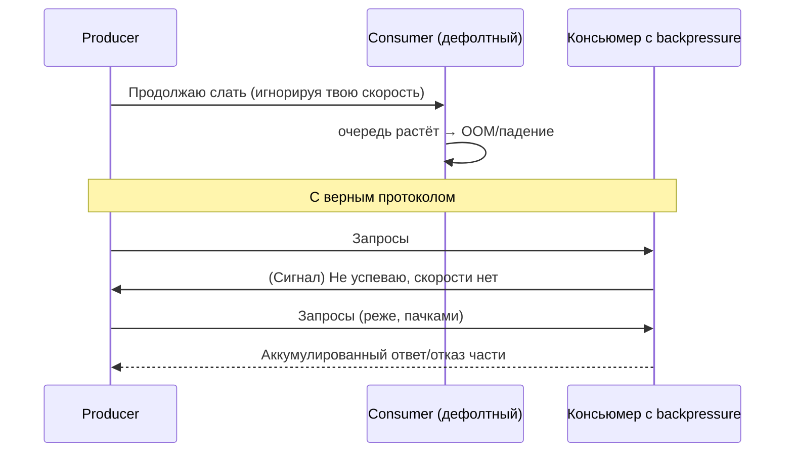
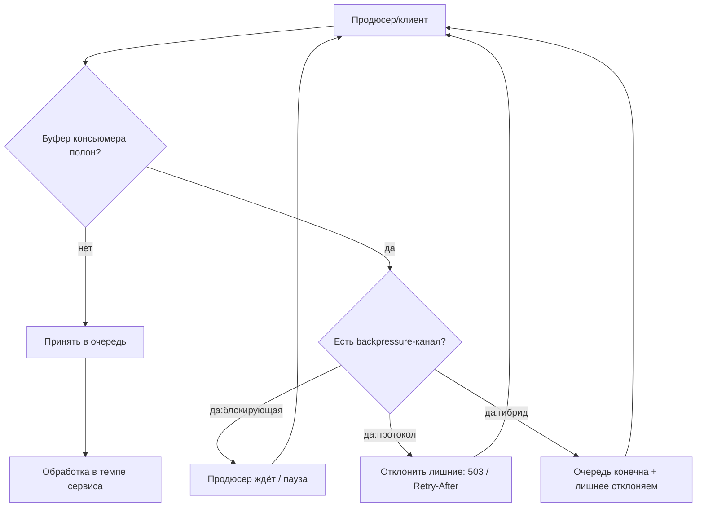

# Backpressure (Обратное давление)

## Определение

**Backpressure (Обратное давление)** — принцип, при котором **потребитель сообщает об источнике, что он не успевает**, и обвязка передачи потока «давит» назад: приём замедляется нелинейно (прямой сигнал «не шли больше», батчи/ретраи по очереди), а источник должен уважать этот сигнал. Цель обратного давления — **плавная деградация вместо резкого падения**: когда система перегружена, мы замедляем вход, а не пытаемся проглотить всё и упасть.

## Зачем нужно

- **Защищать память и потоки** — если продюсер шлёт быстрее, чем консьюмер обрабатывает, необработанные запросы накапливаются: очередь растёт, память истекает → OOM/падение.
- **Не «доить» упавшего сервис** — без давления клиент продолжает слать в Open-цепь или перегруженный сервис, делая хуже (см. Circuit Breakers, Backoff).
- **Смягчать пики** — вместо 5 000 запросов «все сразу» получаем управляемый поток, который сервер пережёвывает.
- **Давать «мягкую» деградацию** — лишние запросы отклоняются быстро (fail fast, 503), здоровые продолжают обслуживаться (load shedding).



## Как работает

Три уровня давления (реализации):

- **Блочных/неограниченных очередей не бывает** — влюбая очередь конечна; когда она переполняется, есть 3 стратегии:
  1. **Блокировать продюсера** (блокирующая очередь) — поток шлёт, пока буфер не полон; продюсер «замирает» и замедляется.
  2. **Отклонять / Load shedding** (переполнен → `503 Service Unavailable` / `REJECTED`) — лишнее отбрасывается быстро, без создания кругового ожидания.
  3. **Пропускать/сокращать работу** (coarse-grain skip) — при перегрузке делать меньше (эскизы вместо подсчёта, батчить).

- **Асинхронные подписки** — stream/потоки (Node streams, Reactive Streams, Go channels) поддерживают **батчи и сигналы «паузы/резюме»**: консьюмер запрашивает заданное число элементов, продюсер ждёт следующего запроса.
- **Протокол уровня запроса** — клиент и сервер договариваются о квоте: `429 Too Many Requests` + `Retry-After`, либо server push с числом разрешённых элементов.
- **Границы уровня системы** — load shedding (отказ части нагрузки), priority queues (важные запросы вперёд), rate limiting (сглаживание входа).

Ключевое отличие от rate limiting: **rate limiting** — единичный счётчик «сколько запросов в секунду с клиента»; **backpressure** — двусторонний сигнал «я не успеваю», который масштабируется под текущую ёмкость обработчиков.



## Примеры кода

> Утилиты, символизирующие сигналы давления: конечная буферная очередь с отклонением, и запросная модель «пауза/резюме».

### TypeScript (асинхронный канал с limit + REJECTED)

```typescript
export class BoundedChannel<Item> {
  private readonly buffer: Array<Item> = []
  private readonly maxSize: number
  private waiting: Array<() => void> = []

  constructor(maxSize: number) {
    this.maxSize = maxSize
  }

  async push(item: Item): Promise<boolean> {
    if (this.buffer.length < this.maxSize) {
      this.buffer.push(item)
      return true
    }
    // сигнал давления: не смогли принять, продюсер должен сбавить темп
    return false
  }

  async take(): Promise<Item | undefined> {
    if (this.buffer.length > 0) return this.buffer.shift()
    return undefined
  }

  get size(): number {
    return this.buffer.length
  }
}
```

### Go (канал + select: пауза/отклонение)

```go
// pushWithBackpressure отправляет элемент в канал; если буфер полон,
// выбираем «протокол давления»: drop или ждать освободившегося места.
func pushWithBackpressure[T any](ch chan T, item T, timeout time.Duration) bool {
	select {
	case ch <- item:
		return true // принято
	case <-time.After(timeout):
		// продюсер не успевает — консьюмер «давит»: либо дропаем,
		// либо (для потери) разворачиваем и шлём с меньшей скоростью
		return false
	}
}
```

### Java (конечная очередь + отбрасывание по нагрузке)

```java
public class BoundedQueue<E> {
    private final ArrayBlockingQueue<E> queue;

    public BoundedQueue(int capacity) {
        this.queue = new ArrayBlockingQueue<>(capacity);
    }

    /** true — принято; false — очередь полна, производитель должен замедлиться */
    public boolean offer(E item) {
        return queue.offer(item);
    }

    public E take() throws InterruptedException {
        return queue.take();
    }

    public int size() {
        return queue.size();
    }
}
```

## Пример использования: интеграция

> В реальном коде backpressure приходит из фреймворков: Node `stream.pipeline` + `backpressure`, Go `net/http` лимит тела/соединений, Reactor `Flux`/`Mono` с `limitRate`, каналы concurrency для workers.

### Node.js: stream pipeline с паузой (TypeScript)

```typescript
import { Readable, Transform, pipeline } from 'stream'
import { promisify } from 'util'

const pipelineAsync = promisify(pipeline)

export async function processWithBackpressure(source: AsyncIterable<string>) {
  const readable = Readable.from(source)
  const transform = new Transform({
    // по умолчанию Readable pause/resume: если консьюмер медленный,
    // stream останавливает чтение из источника, сигнализируя «pressure»
    transform(chunk, _enc, cb) {
      this.push(serialize(chunk))
      cb()
    },
  })
  await pipelineAsync(readable, transform, process.stdout)
}
```

### Go: пул обработчиков с bounded каналом

```go
type Worker struct {
	jobs chan Job
}

func NewWorker(n int) *Worker {
	w := &Worker{jobs: make(chan Job, n)}
	for i := 0; i < runtime.NumCPU(); i++ {
		go func() {
			for j := range w.jobs {
				handle(j)
			}
		}()
	}
	return w
}

// Submit шлёт задачу; буфер полон? Принять нельзя — сигнал давления.
func (w *Worker) Submit(j Job) error {
	select {
	case w.jobs <- j:
		return nil
	default:
		return ErrBackpressure // 503: «мы перегружены, попробуйте позже»
	}
}
```

### Reactor / Spring WebFlux: реактивный backpressure (Java)

```java
Flux.from(ordersSource())                    // источник записей
    .limitRate(128)                          // консьюмер запрашивает по 128 за раз
    .parallel()
    .runOn(Schedulers.parallel())
    .doOnNext(this::saveOrder)               // обработка в темпе, разрешённом им
    .onBackpressureDrop(order -> log.warn("dropped {}", order.id())) // не успеваем → отбрасываем
    .subscribe();
```

## Паттерны использования

- **Очереди всегда конечны** — такой вещи, как «бесконечная очередь», не существует; значит: ограничить буфер и решить судьбу лишнего (drop / 503 / блокировка).
- **Load shedding (сброс нагрузки)** — при перегрузке отклонять лишнее быстро и дёшево (503), а не обрабатывать «в долг».
- **Запросная модель** — консьюмер запрашивает N элементов и получает их; скорость задаёт тот, кто обрабатывает (Reactive Streams, Streams API).
- **Синхронизированные с ресурсами лимиты** — буфер выделяется под реальную ёмкость обработчиков (число воркеров × скорость), а не под абстрактный «максимум».
- **Сочетание с rate limiting** — на входе ограничить, в обработке подстраивать темп (две стороны одного давления).
- **Приоритеты** — важные запросы (платёж) идут в отдельную очередь; отбрасываются в первую очередь «фоновые».
- **Отвечать 503, а не висящий** — клиент получит `Retry-After`/прозрачность, сможет применить backoff или перераспределить.

## Антипаттерны и ловушки

- **Бесконечная «накапливающая» очередь** — память растёт до OOM; «все запросы храним в списке» без лимита — классика.
- **Игнорировать сигнал давления** — продюсер продолжает слать, невзирая на «не успеваю»: очередь недоступна, теряется только поздно.
- **Наивный load shedding** — отбрасываются не «лишние», а всё подряд: здоровых клиентов роняем с 5xx.
- **Backpressure + retries в лоб** — ошибка давления (503) повторяется «немедленно» без backoff; давление становится вечным циклом (нужно раскрутить по Retry-After/Exponential Backoff).
- **Слишком большой буфер на входе** — очереди позволяют хранить только задержку, а не абсорбировать несбалансированный поток.
- **Блокировка без дедлайна** — продюсер «вечно ждёт» места в очереди; дедлайн должен ограничивать ожидание (см. Timeouts).

## Когда использовать / когда НЕ использовать

**Использовать:**
- Потоковая обработка данных (импорты, вебхуки, ETL, разбор логов), где скорость входа выше ёмкости обработчиков.
- Распределённые сценарии: клиенты шлют быстрее, чем сервис физически успевает (push-пулы, фоновые задачи).
- Интерактивные API, когда перегрузка должна быть «видимой» и управляемой (503 + Retry-After).

**НЕ использовать:**
- Интерактивные единичные запросы без потоков (GET страницы): здесь важнее rate limiting и таймауты, а не давлений.
- Когда в роли защитника уже есть очередь брокера с дедупликацией (потерянный воркер может прочитать сообщение заново) — давление лучше реализовать на уровне потребителя брокера.
- Сильно ограниченные по латентности пути, где «drop+повтор» дороже блока/бесконечной обработки (небольшие фиксированные объёмы данных в памяти).

## Связанные темы

- **Rate Limiting** — ограничение «запросов в секунду» на входе; backpressure — двусторонний сигнал ёмкости; комбинируются.
- **Circuit Breakers** — Open защищает от каскада; backpressure защищает от переполнения буферов.
- **Retries / Exponential Backoff** — «503/отклонено» требует уважать Retry-After и растягивать повторы; иначе давление обратится в цикл.
- **Message Queues** — брокер — буфер между продюсером и консьюмером; важно настроить лимиты очереди и потока потребителя.
- **Load Balancing** — равномерное распределение снижает локальные пики; backpressure работает и внутри инстанса.
- **Observability** — следить за размером очереди, долей «503/drop», чтобы видеть давление, а не падение.

## Вопросы

### Q1
**Главная проблема «бесконечной» очереди перед обработчиком?**
- [ ] Она замедляет обработку
- [x] Накопление в памяти: очередь не бесконечна физически, OOM быстрее управляемого отказа
- [ ] Она уменьшает throughput
- [ ] Внутри очереди нет проблем

Пояснение: любая структура в памяти конечна; «хранить всё» заканчивается OOM — управляемая деградация (drop/503) лучше резкого падения.

### Q2
**Что означает «сигнал давления» (backpressure) между продюсером и консьюмером?**
- [ ] Ошибка в протоколе
- [x] «Не успеваю» — соглашение, при котором входящий поток замедляется (пауза, батчи, drop лишнего)
- [ ] Сервер упал
- [ ] Клиент отправил слишком много заголовков

Пояснение: давление — двусторонний сигнал ёмкости: источник уважает его, поток замедляется или лишнее отбрасывается.

### Q3
**Как правильно реагировать на действие «503/отклонено» из-за перегрузки?**
- [ ] Попробовать ещё раз мгновенно
- [ ] Отправить запрос на соседний сервис без повторов
- [x] Уважать Retry-After и/или применить backlog/Retry with backoff
- [ ] Поднять свою очередь

Пояснение: shout сервер указал темп; мгновенный повтор превращает давление в цикл («бьющее стадо») — нужен backoff/Retry-After.

### Q4
**В чём отличие backpressure от rate limiting?**
- [x] Rate limiting — счётчик «N запросов/сек» на входе; backpressure — адаптивный двусторонний сигнал ёмкости
- [ ] Это одно и то же
- [ ] Rate limiting работает только в батчах
- [ ] Backpressure используется только в Go

Пояснение: limit считает фиксированную квоту; давление реагирует на текущую способность консьюмера.

### Q5
**Что такое load shedding (сброс нагрузки)?**
- [ ] Удаление старых логов
- [ ] Плавное замедление сервера
- [x] Быстрое отбрасывание части входящей нагрузки (503) при перегрузке, чтобы защитить здоровые запросы
- [ ] Уменьшение таймаутов

Пояснение: при перегрузке дешевле отбросить «лишнее» мгновенно, чем накапливать и падать; здоровый трафик продолжает обслуживаться.

## Источники

- Google SRE Book — Handling Overload (Backpressure / Load shedding): https://sre.google/sre-book/handling-overload/
- Reactive Streams — спецификация backpressure (JVM): https://www.reactive-streams.org/
- Node.js — Backpressuring in Streams: https://nodejs.org/en/learn/modules/backpressuring-in-streams
- Martin Kleppmann — DDIA: chapter «Replicated / fault-tolerant systems» (обсуждение overload): https://dataintensive.net/
- Spring Reactor — Backpressure operators (limitRate/onBackpressureDrop): https://projectreactor.io/docs/core/release/reference/
- gobyexample / Go channels (buffered + select): https://gobyexample.com/channels