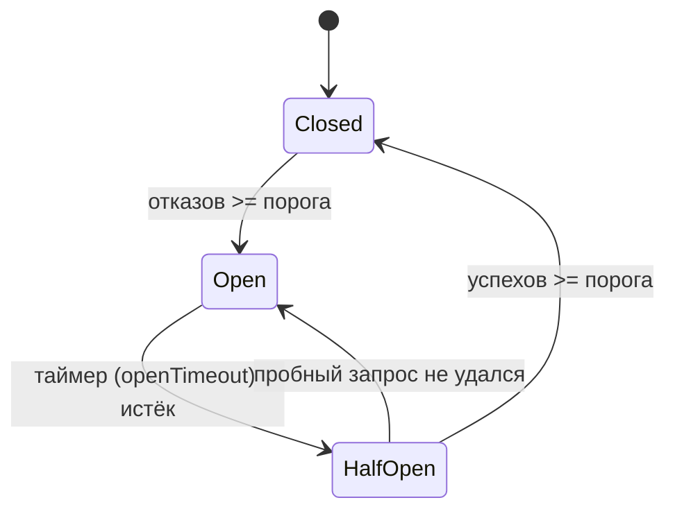
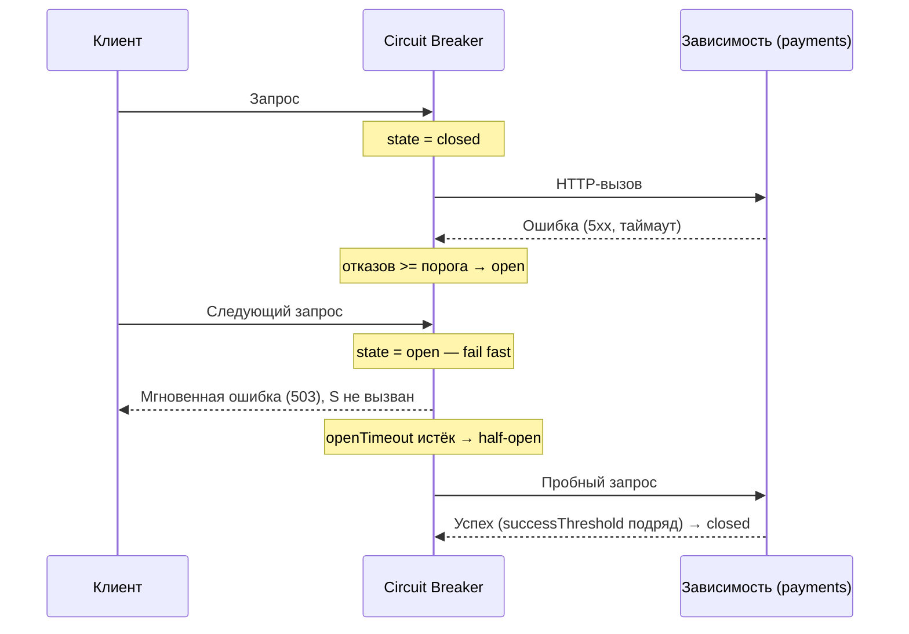

# Circuit Breaker (Предохранитель / Размыкатель цепи)

## Определение

**Circuit Breaker (Предохранитель / размыкатель цепи)** — паттерн устойчивости, который защищает систему от каскадных сбоев: пока вызовы к зависимому сервису постоянно падают, дальнейшие вызовы **мгновенно отклоняются** (fail fast), не доходя до упавшего сервиса. Аналогия — автоматический выключатель в электропроводке: при перегрузке он «размыкает цепь», а через некоторое время даёт попробовать включиться снова.

## Зачем нужно

- **Защита от каскадных отказов (cascading failures)** — не заваливаем и без того падающий сервис новыми запросами, даём ему восстановиться.
- **Fail fast** — клиент получает ошибку сразу, а не спустя долгий таймаут на каждый запрос.
- **Экономия ресурсов** — не тратим CPU/сеть/соединения/порты на обречённые вызовы.
- **Снижение нагрузки на инфраструктуру** — меньше трафика, меньше логов, меньше алертов.
- **Автоматическое восстановление** — после паузы сервис пробует «прощупать» зависимость и вернуть всё в норму без участия человека.

## Как работает

Circuit breaker живёт **на стороне клиента** (client-side): рядом с вызовом зависимого сервиса. Он оборачивает вызов и находится в одном из **трёх состояний**:



- **Closed (Замкнута)** — нормальный режим: запросы идут к зависимости, каждый отказ увеличивает счётчик. Когда отказов набирается `>= failureThreshold` — переключаемся в Open.
- **Open (Разомкнута)** — (Fail fast) все запросы отклоняются сразу, зависимость не вызывается. Запускается таймер `openTimeout` (пауза на восстановление).
- **Half-Open (Полуоткрыта)** — по истечении таймера пропускается небольшое число **пробных запросов** (trial requests). Если `successThreshold` успехов подряд — возвращаемся в Closed. Если хоть один пробный запрос упал — снова в Open и ждём новый таймер.



Ключевые параметры:

- **failureThreshold (порог отказов)** — сколько неудач подряд (или за окно) переводит в Open.
- **successThreshold (порог успехов)** — сколько успехов подряд нужно в Half-Open, чтобы закрыть цепь.
- **openTimeout / cooldown (пауза)** — время пребывания в Open перед пробными запросами. Обычно чуть больше времени восстановления downstream.
- **Какие ошибки считать** — обычно сетевые и 5xx/таймауты; бизнес-ошибки (4xx) не «ломают цепь».

Отсчёт отказов может вестись по **скользящему окну** (напр., 5 отказов за последние 60 секунд), а не просто подряд — это устойчивее к редким сбоям.

## Примеры кода

> Один и тот же breaker на трёх языках. API: `allow()` — можно ли слать запрос (false = fail fast), `recordSuccess()` / `recordFailure()` — фиксируют исход, `call(fn)` — удобная обёртка «выполнить или fail fast».

### TypeScript

```typescript
type BreakerState = 'closed' | 'open' | 'half-open'

export class CircuitBreaker {
  private state: BreakerState = 'closed'
  private failureCount = 0
  private successCount = 0
  private nextAttempt = 0
  private now: () => number

  constructor(
    private failureThreshold = 5,
    private successThreshold = 2,
    private openTimeoutMs = 30_000,
    now: () => number = Date.now,
  ) {
    this.now = now
  }

  /** Можно ли отправлять запрос? В open возвращает false (fail fast). */
  allow(): boolean {
    if (this.state === 'closed') return true
    if (this.state === 'open') {
      if (this.now() >= this.nextAttempt) {
        this.state = 'half-open' // время попробовать снова
        this.successCount = 0
        return true
      }
      return false
    }
    return true // half-open
  }

  recordSuccess(): void {
    if (this.state === 'half-open') {
      this.successCount++
      if (this.successCount >= this.successThreshold) this.reset()
      return
    }
    this.failureCount = 0
  }

  recordFailure(): void {
    if (this.state === 'half-open') {
      this.trip() // пробный запрос упал — снова в open
      return
    }
    this.failureCount++
    if (this.failureCount >= this.failureThreshold) this.trip()
  }

  /** Удобная обёртка: вызов выполнится только если цепь пропускает. */
  async call<T>(fn: () => Promise<T>): Promise<T> {
    if (!this.allow()) throw new Error('circuit open')
    try {
      const result = await fn()
      this.recordSuccess()
      return result
    } catch (e) {
      this.recordFailure()
      throw e
    }
  }

  private trip(): void {
    this.state = 'open'
    this.failureCount = 0
    this.nextAttempt = this.now() + this.openTimeoutMs
  }

  private reset(): void {
    this.state = 'closed'
    this.failureCount = 0
    this.successCount = 0
  }
}
```

### Go

```go
package breaker

import (
	"sync"
	"time"
)

type state int

const (
	stateClosed state = iota
	stateOpen
	stateHalfOpen
)

type CircuitBreaker struct {
	mu sync.Mutex

	state            state
	failureThreshold int
	successThreshold int
	openTimeout      time.Duration

	failures int
	success  int
	nextTry  time.Time
}

func New(failureThreshold, successThreshold int, openTimeout time.Duration) *CircuitBreaker {
	return &CircuitBreaker{
		state:            stateClosed,
		failureThreshold: failureThreshold,
		successThreshold: successThreshold,
		openTimeout:      openTimeout,
		nextTry:          time.Now(),
	}
}

func (cb *CircuitBreaker) Allow() bool {
	cb.mu.Lock()
	defer cb.mu.Unlock()

	switch cb.state {
	case stateClosed:
		return true
	case stateOpen:
		if time.Now().After(cb.nextTry) {
			cb.state = stateHalfOpen
			cb.success = 0
			return true
		}
		return false
	default: // half-open
		return true
	}
}

func (cb *CircuitBreaker) RecordSuccess() {
	cb.mu.Lock()
	defer cb.mu.Unlock()

	if cb.state == stateHalfOpen {
		cb.success++
		if cb.success >= cb.successThreshold {
			cb.reset()
		}
		return
	}
	cb.failures = 0
}

func (cb *CircuitBreaker) RecordFailure() {
	cb.mu.Lock()
	defer cb.mu.Unlock()

	if cb.state == stateHalfOpen {
		cb.trip()
		return
	}
	cb.failures++
	if cb.failures >= cb.failureThreshold {
		cb.trip()
	}
}

func (cb *CircuitBreaker) trip() {
	cb.state = stateOpen
	cb.failures = 0
	cb.nextTry = time.Now().Add(cb.openTimeout)
}

func (cb *CircuitBreaker) reset() {
	cb.state = stateClosed
	cb.failures = 0
	cb.success = 0
}
```

### Java

```java
import java.time.Instant;

public class CircuitBreaker {

    public enum State { CLOSED, OPEN, HALF_OPEN }

    private State state = State.CLOSED;
    private int failures = 0;
    private int success = 0;
    private Instant nextTry = Instant.now();

    private final int failureThreshold;
    private final int successThreshold;
    private final long openTimeoutMs;

    public CircuitBreaker(int failureThreshold, int successThreshold, long openTimeoutMs) {
        this.failureThreshold = failureThreshold;
        this.successThreshold = successThreshold;
        this.openTimeoutMs = openTimeoutMs;
    }

    public synchronized boolean allow() {
        switch (state) {
            case CLOSED:
                return true;
            case OPEN:
                if (Instant.now().isAfter(nextTry)) {
                    state = State.HALF_OPEN;
                    success = 0;
                    return true;
                }
                return false;
            default: // HALF_OPEN
                return true;
        }
    }

    public synchronized void recordSuccess() {
        if (state == State.HALF_OPEN) {
            if (++success >= successThreshold) reset();
        } else if (state == State.CLOSED) {
            failures = 0;
        }
    }

    public synchronized void recordFailure() {
        if (state == State.HALF_OPEN) {
            trip();
        } else if (++failures >= failureThreshold) {
            trip();
        }
    }

    private void trip() {
        state = State.OPEN;
        failures = 0;
        nextTry = Instant.now().plusMillis(openTimeoutMs);
    }

    private void reset() {
        state = State.CLOSED;
        failures = 0;
        success = 0;
    }
}
```

## Пример использования: интеграция

> Breaker живёт на стороне клиента и оборачивает **один конкретный вызов зависимости** (per-dependency). Интеграция: проверяем `allow()` до вызова, после — фиксируем исход и при Open отдаём fail-fast либо fallback (заглушку/кэш/последний успешный ответ).

### Express middleware (TypeScript)

```typescript
import express from 'express'
import { CircuitBreaker } from './circuit-breaker' // класс из «Примеров кода»

const app = express()
const paymentsBreaker = new CircuitBreaker(5, 2, 30_000) // per-dependency

app.post('/api/checkout', async (req, res) => {
  if (!paymentsBreaker.allow()) {
    // fail fast: downstream (payments) не вызываем
    res.status(503).json({ error: 'Payments temporarily unavailable' })
    return
  }
  try {
    const upstream = await fetch('http://payments/api/charge', {
      method: 'POST',
      body: JSON.stringify(req.body),
    })
    if (!upstream.ok) throw new Error(`upstream ${upstream.status}`)
    paymentsBreaker.recordSuccess()
    res.json({ ok: true })
  } catch {
    paymentsBreaker.recordFailure()
    // fallback: обычно здесь — кэшированный/деградированный ответ вместо 502
    res.status(502).json({ error: 'Payment failed, try again later' })
  }
})
```

### net/http обёртка (Go)

```go
package main

import (
	"encoding/json"
	"net/http"
	"time"
)

var payments = New(5, 2, 30*time.Second) // CircuitBreaker из примера выше

func checkoutHandler(w http.ResponseWriter, r *http.Request) {
	if !payments.Allow() {
		// fail fast — загрузку из очереди запросов не делаем
		w.WriteHeader(http.StatusServiceUnavailable)
		json.NewEncoder(w).Encode(map[string]string{"error": "payments temporarily unavailable"})
		return
	}

	resp, err := http.Post("http://payments/api/charge", "application/json", r.Body)
	if err != nil || resp.StatusCode >= 500 {
		payments.RecordFailure()
		w.WriteHeader(http.StatusBadGateway)
		json.NewEncoder(w).Encode(map[string]string{"error": "payment failed"})
		return
	}
	defer resp.Body.Close()
	payments.RecordSuccess()
	w.WriteHeader(resp.StatusCode)
	json.NewEncoder(w).Encode(map[string]string{"ok": "true"})
}

func main() {
	http.HandleFunc("/api/checkout", checkoutHandler)
	http.ListenAndServe(":8080", nil)
}
```

### Spring-сервис (Java)

Breaker обычно живёт в **HTTP-клиенте** зависимого сервиса, поэтому удобнее обернуть не interceptor, а сам клиент:

```java
import java.util.function.Supplier;
import org.springframework.http.ResponseEntity;
import org.springframework.stereotype.Service;
import org.springframework.web.client.RestTemplate;

@Service
public class PaymentClient {

    private final CircuitBreaker breaker = new CircuitBreaker(5, 2, 30_000);
    private final RestTemplate restTemplate = new RestTemplate();

    public String charge(Order order) {
        if (!breaker.allow()) {
            throw new ServiceUnavailableException("payments temporarily unavailable"); // fail fast
        }
        try {
            ResponseEntity<String> resp = restTemplate.postForEntity(
                "http://payments/api/charge", order, String.class
            );
            breaker.recordSuccess();
            return resp.getBody();
        } catch (RuntimeException e) {
            breaker.recordFailure();
            throw e; // или вернуть fallback: закэшированный ответ / заглушку
        }
    }
}
```

Готовые промышленные реализации (использовать в проде лучше их): **Resilience4j** (Java), **Hystrix** (legacy), **go-resilience / sony/gobreaker** (Go), **opossum** (Go), для Node — **cockatiel** или **@opossum/opossum**.

## Паттерны использования

- **Per-dependency breaker** — свой экземпляр на каждый внешний сервис, а не один на всё приложение.
- **Комбинация с таймаутом** — таймаут на downstream должен быть **меньше** openTimeout, иначе breaker не поможет (все запросы будут упираться в долгий таймаут).
- **Считать только «настоящие» отказы** — сетевые ошибки, таймауты, 5xx; 4xx (как бизнес-ошибки) цепь не ломают.
- **Fallback при Open** — результат-заглушка, последний успешный ответ из кэша или деградация функциональности (например, отключить платёж и предложить оформить заказ без оплаты).
- **Логировать и мониторить переходы** — смена состояния `closed → open → half-open` должна попадать в метрики/алерты (см. Observability).
- **Согласовывать параметры со SLA зависимости** — пороги и паузу подбирать под типичное время восстановления downstream.

## Антипаттерны и ловушки

- **Один breaker на все сервисы** — падение одного внешнего сервиса выводит из строя всё приложение.
- **Считать 4xx как отказ** — клиентские ошибки «ломают цепь» без причины, сервисы закрываются из-за обычных ошибок валидации.
- **Слишком маленький openTimeout** — breaker будет «дёргать» упавший сервис, а не давать ему восстановиться.
- **Слишком большой openTimeout** — после восстановления downstream цепь ещё долго открыта, пользователи видят ошибки без причины.
- **Half-open пропускает слишком много пробных запросов** — лавина к ещё неокрепшему сервису. Пропускайте **1 пробный запрос** либо ограниченную долю трафика.
- **Retries поверх Open без ограничений** — retry-клиенты продолжат долбить, а breaker сразу отклоняет; нужно согласовывать (см. Retries/Exponential Backoff).
- **Игнорировать распределённость** — на каждом узле кластера свой экземпляр, поэтому суммарный «порог отказов» = N узлов × порог. Обычно приемлемо, но при строгих SLA закладывайтесь.

## Когда использовать / когда НЕ использовать

**Использовать:**
- Вызовы к внешним API без гарантий SLA (платёжные шлюзы, геокодеры).
- Вызовы к внутренним сервисам с несколькими репликами, когда отказ — часть нормы (частые деплои, высокая нагрузка).
- Цепочки вызовов, где долгий таймаут одного звена «висящий» держит всю цепочку.
- Когда есть безопасный fallback (кэш, заглушка), чтобы пережить окно отказа.

**НЕ использовать:**
- Синхронные вызовы в локальной высоконадёжной сети к сервису без реплик и без смысловой деградации — достаточно таймаутов и retries.
- Когда деградация (fail fast) хуже, чем подождать таймаут: например, пользовательский запрос, который нельзя вернуть без результата.
- Для обеспечения консистентности — breaker не «чинит» данные, а лишь скрывает отказ.

## Связанные темы

- **Rate Limiting** — защищает от перегрузки одним клиентом; breaker — от каскадного отказа всей системы. Хорошая пара для API Gateway.
- **Timeouts** — breaker без таймаута бесполезен: нужно ограничить, сколько ждать ответа downstream, пока считается «отказ».
- **Retries** — ретраить стоит только через open/closed состояния и с остановкой, когда цепь разомкнута.
- **Exponential Backoff** — как правильно увеличивать паузу между повторными запросами и «окном восстановления».
- **Backpressure** — противодавление на уровне потока/очереди; breaker — на уровне отдельного вызова. Их часто комбинируют.
- **Service Discovery (обнаружение сервисов)** — если балансировщик умеет убирать нездоровые инстансы, отказов станет меньше и breaker срабатывать будет реже.

## Вопросы

### Q1
**Что происходит с запросами, когда breaker находится в состоянии Open?**
- [ ] Проходят как обычно, но медленнее
- [x] Мгновенно отклоняются (fail fast), downstream не вызывается
- [ ] Превращаются в фоновые задачи
- [ ] Автоматически повторяются с удвоенной паузой

Пояснение: в Open запросы не доходят до зависимости — копятся отказы только в счётчике самого breaker'а, что защищает упавший сервис.

### Q2
**Что делает breaker, когда Open и истёк openTimeout?**
- [ ] Остаётся Open навсегда
- [x] Переходит в Half-Open и пропускает пробные запросы
- [ ] Мгновенно закрывается и пускает всё
- [ ] Перезапускает downstream-сервис

Пояснение: по истечении паузы breaker «прощупывает» зависимость ограниченным числом пробных запросов, чтобы не нагрузить её лавиной.

### Q3
**В Half-Open пробный запрос упал. Что происходит?**
- [ ] Состояние не меняется
- [x] Breaker возвращается в Open и снова ждёт таймер
- [ ] Breaker закрывается и пропускает всё
- [ ] Счётчик успехов обнуляется только наполовину

Пояснение: один неудачный пробный запрос означает, что зависимость ещё не восстановилась, — цепь снова размыкается на новый открытый период.

### Q4
**Что важно учитывать про breaker в кластере из N узлов?**
- [ ] Ничего — breaker один на всех
- [x] На каждом узле свой экземпляр, поэтому суммарных «порог отказов» фактически умножается на N
- [ ] В кластере breaker запрещён стандартом
- [ ] Таймауты автоматически удваиваются

Пояснение: каждый узел считает отказы локально, поэтому в кластере отключение «почувствуется» только после N×порога неудач. Это обычно приемлемо, но важно учитывать в SLA.

### Q5
**Какие ошибки обычно стоит учитывать в счётчике отказов breaker'а?**
- [ ] Все ошибки, включая 4xx
- [x] Сетевые ошибки, таймауты и 5xx
- [ ] Только ошибки, унаследованные от Error
- [ ] Только ответы 200 с пустым телом

Пояснение: 4xx — это клиентские/бизнес-ошибки, они «ломают цепь» без причины. Триггерить breaker должны реальные сбои инфраструктуры (сеть, таймаут, 5xx).

## Источники

- Martin Fowler — Circuit Breaker (эталонная статья): https://martinfowler.com/bliki/CircuitBreaker.html
- Azure Architecture Center — Circuit Breaker pattern: https://learn.microsoft.com/en-us/azure/architecture/patterns/circuit-breaker
- Resilience4j docs (Java): https://resilience4j.readme.io/
- Netflix Hystrix wiki (историческая реализация): https://github.com/Netflix/Hystrix/wiki
- Sony gobreaker (Go): https://github.com/sony/gobreaker
- Michael Nygard — «Release It! Design and Deploy Production-Ready Software» (книга, глава Stability Patterns)