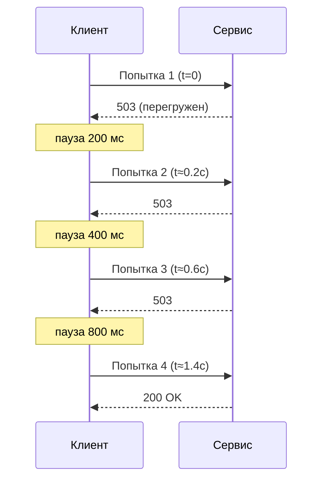
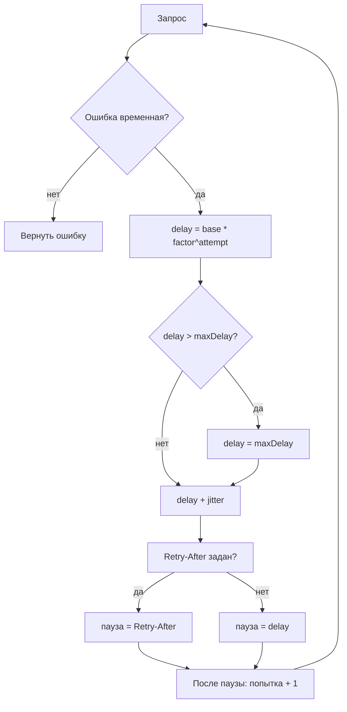

# Exponential Backoff (Экспоненциальная задержка)

## Определение

**Exponential Backoff (Экспоненциальная задержка)** — правило, по которому пауза между повторными попытками (retries) растёт по экспоненте: каждая следующая пауза в `factor` раз длиннее предыдущей (`delay = base × factor^attempt`), с ограничением сверху (`maxDelay`). Так упавшая система получает время на восстановление, а не «долбится» равными интервалами.

## Зачем нужно

- **Давать сервису время восстановиться** — он пережил всплеск; равный интервал «200 мс» не даёт ему очухаться, экспонента быстро разгружает.
- **Снижать эффект «бьющего стада»** (thundering herd) — клиенты, повторяющие с равным периодом, попадают в одну и ту же секунду; размазанные паузы распределяют нагрузку.
- **Укладываться в дедлайн по умолчанию** — комбинация «несколько быстрых попыток + редкие поздние» лучше балансирует скорость восстановления и время ожидания.
- **Смягчать каскад** — согласованная экспонента всех клиентов заметно снижает давление при пиках (см. Retries, Backpressure).



## Как работает

Формула роста паузы (для `attempt` от 0):

```
delay = min(baseDelay × factor^attempt, maxDelay)
```

Пример (`base=200мс`, `factor=2`, `maxDelay=5с`):

| Попытка | Пауза | Попытка | Пауза |
|---|---|---|---|
| 1 → 2 | 200 мс | 4 → 5 | 1 600 мс |
| 2 → 3 | 400 мс | 5 → 6 | 3 200 мс |
| 3 → 4 | 800 мс | 6 → 7 | 5 000 мс (cap) |

Ключевые понятия:

- **baseDelay (базовая задержка)** — стартовая пауза после первой ошибки (обычно 50–500 мс).
- **factor (множитель)** — темп роста, классически **2** (удвоение).
- **maxDelay (потолок)** — жёсткий предел паузы, чтобы клиенты не «засыпали» навсегда и вмещались в дедлайн.
- **Jitter (разброс)** — случайное смещение паузы, обязательное для тысяч клиентов: без него все попадают в «стандартные» окна. Виды: *full jitter* (случайное 0…delay), *equal jitter* (delay ± половина), *decorrelated jitter* (между половиной и 1.5× базовой).
- **Retry-After** — если сервер ответил `429`/`503` с заголовком, пауза берётся из него (приоритетнее своего алгоритма).



> Backoff — это формула **паузы**; а сколько раз повторять — задаёт retry (см. Retries). Вместе: retry решает «сколько», backoff — «с какой задержкой».

## Примеры кода

> Утилита `getDelayMs` изолирует формулу; `withExponentialBackoff` — законченная обёртка «retry + backoff + jitter».

### TypeScript

```typescript
export interface BackoffOptions {
  baseDelayMs: number
  factor?: number
  maxDelayMs?: number
  maxAttempts?: number
}

export function getDelayMs(attempt: number, opts: BackoffOptions): number {
  const factor = opts.factor ?? 2
  const capped = opts.baseDelayMs * Math.pow(factor, attempt)
  return Math.min(capped, opts.maxDelayMs ?? Number.MAX_SAFE_INTEGER)
}

export async function withExponentialBackoff<T>(
  fn: () => Promise<T>,
  opts: BackoffOptions & { shouldRetry?: (e: unknown) => boolean },
): Promise<T> {
  const maxAttempts = opts.maxAttempts ?? 3
  let lastError: unknown
  for (let attempt = 0; attempt < maxAttempts; attempt++) {
    try {
      return await fn()
    } catch (e) {
      lastError = e
      if (opts.shouldRetry && !opts.shouldRetry(e)) throw e
      if (attempt >= maxAttempts - 1) break
      const delay = getDelayMs(attempt, opts) // 200, 400, 800...
      const jitter = Math.floor(Math.random() * (delay / 2))
      await new Promise((r) => setTimeout(r, delay + jitter))
    }
  }
  throw lastError
}
```

### Go

```go
func backoffDelay(attempt int, base, maxCap time.Duration, factor float64) time.Duration {
	d := float64(base) * math.Pow(factor, float64(attempt))
	if d > float64(maxCap) {
		d = float64(maxCap)
	}
	return time.Duration(d)
}

func withBackoff[T any](fn func() (T, error), attempts int) (T, error) {
	var zero T
	const base = 200 * time.Millisecond
	const maxCap = 5 * time.Second

	for attempt := 0; attempt < attempts; attempt++ {
		value, err := fn()
		if err == nil {
			return value, nil
		}
		if attempt >= attempts-1 {
			return zero, err
		}
		delay := backoffDelay(attempt, base, maxCap, 2.0)
		jitter := time.Duration(rand.Int63n(int64(delay / 2)))
		time.Sleep(delay + jitter)
	}
	return zero, nil
}
```

### Java

```java
static long backoffDelay(int attempt, long baseMs, long maxMs, double factor) {
    double d = baseMs * Math.pow(factor, attempt);
    return Math.min((long) d, maxMs);
}

static <T> T withBackoff(
        Supplier<T> fn, int attempts, long baseMs, long maxMs
) {
    Throwable last = null;
    for (int i = 0; i < attempts; i++) {
        try {
            return fn.get();
        } catch (RuntimeException e) {
            last = e;
            if (i >= attempts - 1) break;
            long delay = backoffDelay(i, baseMs, maxMs, 2.0);
            long jitter = ThreadLocalRandom.current().nextLong(delay / 2 + 1);
            try {
                Thread.sleep(delay + jitter);
            } catch (InterruptedException ie) {
                Thread.currentThread().interrupt();
                throw e;
            }
        }
    }
    throw new RuntimeException(last);
}
```

## Пример использования: интеграция

> Backoff применяется как обёртка вокруг вызова зависимости или задачи из очереди. Вручную писать редко придётся — библиотеки (AWS SDK, Resilience4j, opossum) уже реализуют формулу.

### fetch с учётом Retry-After (TypeScript)

```typescript
async function fetchWithBackoff(url: string, opts: BackoffOptions = { baseDelayMs: 200, maxDelayMs: 5000 }): Promise<Response> {
  const maxAttempts = opts.maxAttempts ?? 4
  for (let attempt = 0; attempt < maxAttempts; attempt++) {
    const res = await fetch(url)
    if (res.ok) return res
    if (res.status !== 429 && res.status < 500) return res // не временное
    if (attempt >= maxAttempts - 1) return res

    let pause = getDelayMs(attempt, opts)
    const retryAfter = res.headers.get('retry-after')
    if (retryAfter) pause = Number(retryAfter) * 1000 // сервер сам сказал
    await new Promise((r) => setTimeout(r, pause))
  }
  throw new Error(`fetch failed: ${url}`)
}
```

### net/http с backoff (Go)

```go
func getRetry(client *http.Client, url string, attempts int) (*http.Response, error) {
	const base = 200 * time.Millisecond
	const maxCap = 5 * time.Second

	for i := 0; i < attempts; i++ {
		resp, err := client.Get(url)
		if err == nil && resp.StatusCode < 500 {
			return resp, nil // 4xx и 2xx/3xx — повторять не нужно
		}
		if resp != nil {
			resp.Body.Close()
		}
		if i >= attempts-1 {
			return nil, err
		}
		if ra := resp.Header.Get("Retry-After"); ra != "" {
			// сервер явно попросил подождать
			if secs, err := strconv.Atoi(ra); err == nil {
				time.Sleep(time.Duration(secs) * time.Second)
				continue
			}
		}
		delay := backoffDelay(i, base, maxCap, 2.0)
		jitter := time.Duration(rand.Int63n(int64(delay / 2)))
		time.Sleep(delay + jitter)
	}
	return nil, fmt.Errorf("all %d attempts failed", attempts)
}
```

### Resilience4j (Java)

```java
RetryConfig config = RetryConfig.custom()
        .maxAttempts(4)
        // start=200мс, factor=2, max=5с — формула вида base * 2^attempt
        .exponentialBackoff(Duration.ofMillis(200), 2.0, Duration.ofSeconds(5))
        .retryExceptions(HttpServerErrorException.class, ResourceAccessException.class)
        .build();

Retry retry = Retry.of("orders", config);
Order[] orders = retry.executeSupplier(
        () -> restTemplate.getForObject("http://orders/api/orders", Order[].class)
);
```

## Паттерны использования

- **Использовать вместе с retries** — retry задаёт «сколько раз», exponential backoff — «с какой паузой».
- **Обязательный jitter** — при большом числе клиентов «чистый» exponential без разброса всё равно собирает удары в одни окна.
- **Ставить maxDelay** — ограничивать паузу, чтобы уложиться в дедлайн запроса (см. Timeouts) и не «усыпить» здоровых клиентов.
- **Уважать Retry-After** — сервер в 429/503 сам сообщает, когда можно вернуться; его приоритет выше своей формулы.
- **Начинать с малого baseDelay** — «быстрая пара-тройка попыток» + редкие поздние; дедлайн при этом почти не страдает.
- **Использовать для очередей/воркеров** — экспоненциальная задержка перед повторным взятием сообщения из очереди распределяет обработку.

## Антипаттерны и ловушки

- **Exponential backoff без jitter** — «бьющее стадо»: все клиенты попадают в одинаковые растущие окна.
- **Без maxDelay** — пауза растёт бесконечно: клиенты «засыпают» на часы, SLAs рушатся.
- **Огромный baseDelay** — каждая первая пауза уже превышает разумный дедлайн пользователя.
- **Игнорировать Retry-After** — сервер просит подождать 30 секунд, а мы долбим через секунду.
- **Синхронный random с общим seed** — «случайные» смещения одинаковые у всех процессов, jitter не работает.
- **Backoff без учёта бюджета запроса** — сумма пауз уходит за deadline, пользователь ждёт дольше обещанного (см. Retries).
- **Применять к неидемпотентным операциям** — экспоненциальный retry POST без идемпотентного ключа = дубли (см. Idempotency).

## Когда использовать / когда НЕ использовать

**Использовать:**
- Все автоматические retries к сети, БД, внешним API, микросервисам.
- Задачи из очередей и фоновые воркеры, где паузы не ощущает человек.
- Интеграции с внешними сервисами (AWS SDK, Stripe, OAuth) — там уже встроено.

**НЕ использовать:**
- Интерактивные запросы с жёстким дедлайном — лучше быстро вернуть ошибку (или использовать минимум попыток).
- Когда есть retry-слой выше (broker, gateway, прокси) — избегаем кратных backoff'ов.
- Для WebSocket/SSE — там долгая «тишина» нормальна; timeouts и heartbeat вместо повторов.
- Для ошибок, которые повтор не исправит (4xx, валидация).

## Связанные темы

- **Retries** — определяет, сколько раз повторять; backoff отвечает за паузу. Работают в паре.
- **Timeouts / Deadline** — сумма пауз backoff'а должна укладываться в общий бюджет запроса.
- **Circuit Breakers** — при Open растёт доля мгновенных отказов, retries с backoff'ом не должны «долбить» в разомкнутую цепь (обычно breaker возвращает ошибку сразу — retry тогда бессмыслен).
- **Rate Limiting** — 429 требует уважать Retry-After и не забивать лимиты своими повторами.
- **Backpressure** — если сервис не справляется с потоком, экспоненциальные повторы со стороны клиентов уменьшают давление; правильнее согласовать поток через сигналы перегрузки.
- **Idempotency** — гарантия безопасности повторов.

## Вопросы

### Q1
**Что растёт в exponential backoff с каждой попыткой?**
- [ ] Число попыток
- [x] Пауза между попытками — по правилу `base × factor^attempt` (с ограничением maxDelay)
- [ ] Размер запроса
- [ ] Время ответа сервера

Пояснение: экспоненциально растёт именно задержка между повторами; число попыток фиксирует retry.

### Q2
**Зачем нужен jitter в экспоненциальном backoff?**
- [ ] Сделать код «случайнее»
- [x] Размазать повторы всех клиентов во времени и избежать «бьющего стада»
- [ ] Увеличить производительность
- [ ] Соблюсти Retry-After

Пояснение: без jitter тысячи клиентов попадают в одни и те же растущие окна — нагрузка бьёт синхронными волнами (thundering herd).

### Q3
**Почему важен потолок maxDelay?**
- [x] Без него пауза растёт бесконечно, клиенты «засыпают», и запрос не укладывается в дедлайн
- [ ] Он увеличивает число попыток
- [ ] Он ускоряет ответ сервера
- [ ] Он обязателен для Retry-After

Пояснение: cap ограничивает «вечную» задержку и помогает вписаться в общий бюджет времени запроса (см. Timeouts).

### Q4
**Сервис ответил 429 с заголовком Retry-After: 30. Что делать клиенту?**
- [x] Подождать 30 секунд, игнорируя свою формулу backoff на этот раз
- [ ] Продолжить докидывать запросы каждые 200 мс
- [ ] Сбросить число попыток и начать заново
- [ ] Удвоить лимиты вручную

Пояснение: заголовок Retry-After — прямое указание сервера; уважение его важнее собственного алгоритма.

### Q5
**В чём разница между retry и exponential backoff?**
- [ ] Это одно и то же
- [x] Retry — «сколько раз повторять», backoff — «с какой нарастающей паузой»
- [ ] Backoff работает без retry
- [ ] Retry задаёт паузу, а backoff — число попыток

Пояснение: retry определяет количество попыток, exponential backoff — формулу паузы между ними; они используются вместе.

## Источники

- AWS Architecture Blog — Exponential Backoff And Jitter: https://aws.amazon.com/blogs/architecture/exponential-backoff-and-jitter/
- AWS SDK — Retry behavior (число попыток, backoff): https://docs.aws.amazon.com/sdkref/latest/guide/feature-retry-behavior.html
- Google Cloud Storage — Retry strategy: https://cloud.google.com/storage/docs/retry-strategy
- Resilience4j — Exponential backoff (RetryConfig): https://resilience4j.readme.io/docs/retry
- RFC 9110 — Retry-After header: https://datatracker.ietf.org/doc/html/rfc9110
- SRE Book — Retry budget и cascading failures: https://sre.google/sre-book/addressing-cascading-failures/