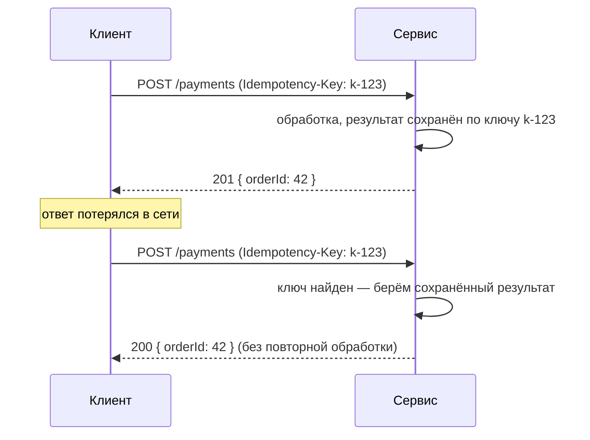
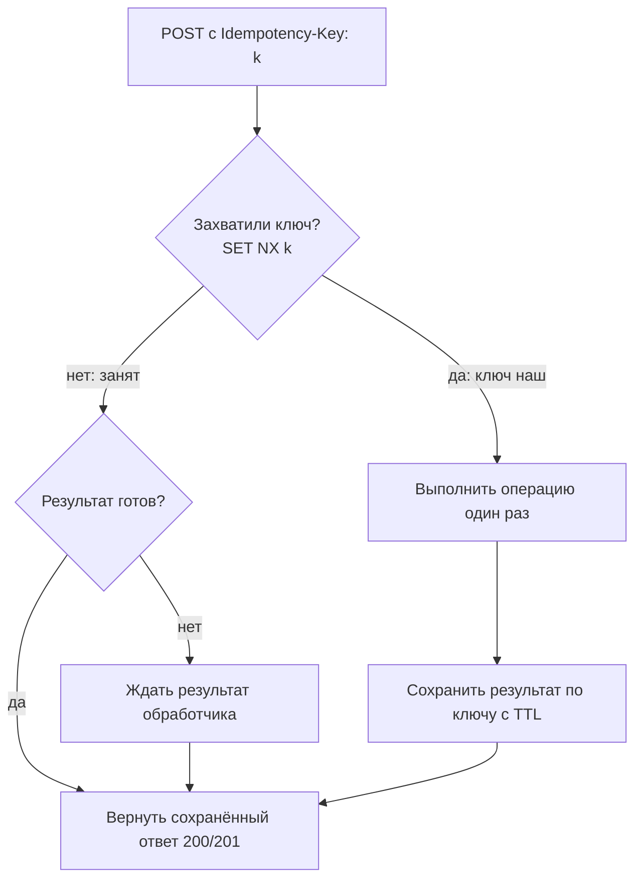

# Idempotency (Идемпотентность)

## Определение

**Idempotency (Идемпотентность)** — свойство операции: повторное применение столько угодно раз даёт **тот же результат и то же состояние системы**, что и первое. Другими словами: отправили запрос, он потерялся в сети, повторили — система не создала дубль, а вернула сохранённый ответ. Идемпотентность — обязательная база для безопасных retries.

## Зачем нужно

- **Делать безопасными повторы** — retries и backoff (см. темы выше) повторяют запросы; без идемпотентности повтор = дубль: двойное списание, двойной заказ, дубли сообщений в очереди.
- **Защищать платёжные и бизнес-операции** — цена ошибки высока: повторный списание денег или создание заказа незаметно пользователю.
- **Упрощать разговор клиент↔сервер** — клиент может спокойно переотправлять при сетевых сбоях, не зная, долетел ли запрос.
- **Поддерживать очереди и брокеры** — потребление сообщений повторяется (at-least-once), идемпотентность не даёт эффекту notify дублироваться.



## Как работает

Различают два уровня идемпотентности:

- **Идемпотентные методы HTTP по определению** — повторение запроса само по себе безопасно: `GET`, `HEAD`, `PUT`, `DELETE`, `OPTIONS`. Сервер обязан давать тот же эффект.
- **Сделанные идемпотентными операции (обычно `POST`)** — создание, списание, перевод: чтобы повтор был безопасным, клиент передаёт **идемпотентный ключ** (`Idempotency-Key`), а сервер кеширует результат по нему.

| Метод | Идемпотентен? | Пояснение |
|---|---|---|
| GET | ✅ | Чтение — повтор не меняет состояние |
| PUT (замена по id) | ✅ | Повторная запись той же модели даёт тот же результат |
| DELETE | ✅ | Удалить уже удалённое — то же «удалено» |
| POST | ❌ | Создаёт ресурс — повтор создаёт дубль |
| PATCH | ⚠️ | Зависит от семантики; идемпотентен, если описание (delta) применяется один раз |

Механизм для `POST`:

1. Клиент генерирует ключ (UUID) и передаёт его в заголовке `Idempotency-Key`.
2. Сервер проверяет: ключ уже обработан? — да: **вернуть сохранённый ответ** без повторной обработки.
3. Нет: выполнить операцию **один раз**, сохранить результат по ключу с **TTL** (например, 24 часа).
4. Повторный запрос с тем же ключом возвращает тот же результат (первый — `201`, потом `200` — сервер может в lастой отвечать кодом успеха).

Важные нюансы:

- **Конкуренция по ключу** — если два запроса с одним ключом пришли одновременно, должен выполниться ровно один; остальные ждут его результат (lock/очередь на ключе).
- **Только один обработчик по ключу** — продумать гонку в кластере: локальной Map недостаточно, в проде — Redis/Lock/KV с атомарным `SET NX` + TTL.
- **TTL — это не «вечность»** — ключ живёт столько, сколько длится окно автоматических повторов (retry-период), обычно часы, а не минуты.



## Примеры кода

> В демо-утилитах хранилище — in-memory Map; в проде заменяется на Redis/KV с атомарным захватом ключа и TTL (см. «Пример использования»).

### TypeScript

```typescript
interface StoredResponse<T> {
  status: number
  body: T
}

export async function runIdempotent<T>(
  key: string,
  handler: () => Promise<T>,
  store: { get(k: string): Promise<StoredResponse<T> | null>; set(k: string, v: StoredResponse<T>): Promise<void> },
  createdStatus = 201,
): Promise<StoredResponse<T>> {
  const cached = await store.get(key) // атомарный GET: ключ уже обработан?
  if (cached) return cached

  const body = await handler()
  const response = { status: createdStatus, body }
  await store.set(key, response) // SET с TTL
  return response
}
```

### Go

```go
type IdempotencyStore[V any] struct {
	mu  sync.Mutex
	m   map[string]V
}

func (s *IdempotencyStore[V]) Run(key string, fn func() (V, error)) (V, bool, error) {
	s.mu.Lock()
	if v, ok := s.m[key]; ok {
		s.mu.Unlock()
		return v, true, nil // уже обработано — возвращаем сохранённое
	}
	s.mu.Unlock()

	v, err := fn() // обработка ровно один раз
	if err != nil {
		return v, false, err
	}
	s.mu.Lock()
	s.m[key] = v
	s.mu.Unlock()
	return v, false, nil
}
```

### Java

```java
public class IdempotencyGate<K, V> {
    private final ConcurrentHashMap<K, V> store = new ConcurrentHashMap<>();

    public V runOnce(K key, Supplier<V> handler) {
        // computeIfAbsent: на один ключ handler выполнится ровно один раз,
        // конкурентные запросы получат уже сохранённый результат
        return store.computeIfAbsent(
            key,
            k -> { return handler.get(); }
        );
    }
}
```

## Пример использования: интеграция

> Рабочий вариант: атомарный захват ключа (`SET key ... NX EX ttl`) в Redis/KV, чтобы в кластере из N реплик выполнился ровно один обработчик.

### Express + Redis (TypeScript)

```typescript
import express from 'express'
import { createClient } from 'redis'
import { randomUUID } from 'crypto'

const app = express()
app.use(express.json())
const redis = createClient()

app.post('/api/payments', async (req, res) => {
  const key = (req.headers['idempotency-key'] as string) || randomUUID()

  const cached = await redis.get(`idem:${key}`)
  if (cached) return res.status(200).json(JSON.parse(cached))

  const captured = await redis.set(`idem:${key}`, 'processing', { NX: true, EX: 86_400 })
  if (!captured) {
    // ключ занят другим запросом — ждём результат (poll) или возвращаем 409
    return res.status(409).json({ error: 'request in progress' })
  }

  const result = { orderId: 42, total: req.body.total } // ops
  await redis.set(`idem:${key}`, JSON.stringify(result), { EX: 86_400 })
  return res.status(201).json(result)
})
```

### net/http + кеш (Go)

```go
type cache interface {
	Get(key string) ([]byte, bool)
	Put(key string, b []byte, ttl time.Duration)
}

type PaymentHandler struct {
	cache cache
}

func (h *PaymentHandler) handle(w http.ResponseWriter, r *http.Request) {
	key := r.Header.Get("Idempotency-Key")
	if key == "" {
		key = uuid.NewString()
	}
	if raw, ok := h.cache.Get(key); ok {
		writeJSON(w, http.StatusOK, raw) // повтор — тот же результат
		return
	}
	if !h.cache.Acquire(key, time.Hour*24) { // SET NX + TTL
		writeJSON(w, http.StatusConflict, map[string]string{"error": "in progress"})
		return
	}
	result := h.service.Charge(r.Context(), key, r.Body)
	h.cache.Put(key, result, time.Hour*24)
	writeJSON(w, http.StatusCreated, result)
}
```

### Spring (Java)

```java
@Service
public class PaymentService {
    private final ConcurrentHashMap<String, PaymentResult> cache = new ConcurrentHashMap<>();

    public PaymentResult charge(ChargeRequest req) {
        String key = req.getIdempotencyKey();
        if (key == null || key.isBlank()) {
            key = UUID.randomUUID().toString();
        }
        // гарантия: на ключ — одно выполнение; повторы возвращают тот же результат
        return cache.computeIfAbsent(key, k -> doCharge(req));
    }

    private PaymentResult doCharge(ChargeRequest req) {
        // реальная бизнес-логика (списание, проверка лимитов)
        return gateway.charge(req.getAmount());
    }
}
```

## Паттерны использования

- **Идемпотентный ключ как UUID** — клиент генерирует и шлёт в заголовке `Idempotency-Key`; один ключ — одна операция.
- **Сервер кеширует результат по ключу** — повтор вернёт то же тело/статус, а не «обработку заново».
- **Атомарный захват ключа** — `SET NX` с TTL в Redis/KV: в кластере выполняется ровно один запрос по ключу.
- **TTL, покрывающий окно повторов** — ключ живёт дольше автоматических retries (retry-бюджет + запас), но не вечно.
- **Безопасные повторы + ключ** — retries и Exponential Backoff могут повторять запрос **только** если операция идемпотентна (или есть ключ).
- **В очередях** — потребитель берёт сообщение, обрабатывает идемпотентно (dedup по ключу/ID сообщения).
- **Возвращать разный статус первого и повторного** — первый `201`, повтор `200` (клиент видит «уже было» по коду, если важно).

## Антипаттерны и ловушки

- **Повтор POST без Idempotency-Key** — дубль: двойное списание/заказ. Классика.
- **Кеш по ключу только в памяти одной реплики** — в кластере второй реплика повторно выполнит операцию (нужен общий Redis/KV + атомарный NX).
- **Гонка без атомарного захвата** — «сначала проверили, потом обработали»: два потока одновременно прошли проверку и оба выполнили операцию.
- **Результат кешируется не полностью** — сохранили только «успех», а тело ответа — нет: повтор отдаст не тот статус.
- **TTL слишком маленький** — повторы заняли дольше, чем живёт ключ → операция выполнилась второй раз. Отсюда правило «TTL ≥ retry-окно + запас».
- **Разные ключи для одной логической операции** — клиент генерирует ключ на каждый повтор: идемпотентность теряется.
- **Генерация ключа сервером** — если сервер сам создаёт ключ при каждом запросе, повторы никогда не «сматчатся» по ключу.

## Когда использовать / когда НЕ использовать

**Использовать:**
- Все модифицирующие операции, которые повторяются автоматически: **платежи, переводы, создание заказов, подписки, вебхуки**.
- POST/PATCH, допускающие повторы по сети (retries, reconciliation, повторная отправка сообщений очереди).
- Любые интеграции с деньгами или важными записями.

**НЕ использовать (строго):**
- `GET`/`DELETE`/`PUT` по id — уже идемпотентны по HTTP-семантике, ключ не обязателен (но безвреден).
- Операции, где повторение логически допустимо и без кеша (генерация аналитики, «сон» — тут важнее дедупликация сообщений, чем HTTP-ключ).
- В системах без сетевых повторов (внутри одного процесса, где надёжность гарантирована) — оверинжиниринг.

## Связанные темы

- **Retries** — безопасны только при идемпотентности: retry повторяет запрос, идемпотентность не даёт повторить эффект.
- **Exponential Backoff** — интервалы повторов должны укладываться в TTL ключа (TTL ≥ retry-окно).
- **Timeouts / Deadline** — результат по ключу должен успеть сохраниться до повторной попытки; дедлайн звена важен для согласованности.
- **Circuit Breakers** — breaker отклоняет запросы в Open; по ключу повтор сможет вернуть сохранённый результат, не дойдя до сломанной зависимости.
- **HTTP Protocols** — статус-коды (409 Conflict для «в процессе», 201/200) и заголовок Idempotency-Key.
- **Message Queues** — at-least-once гарантии + идемпотентные потребители (dedup).

## Вопросы

### Q1
**Что такое идемпотентная операция?**
- [ ] Операция, которая всегда завершается без ошибок
- [x] Операция, повторное применение которой даёт тот же результат и состояние, что и первое
- [ ] Операция с низкой задержкой
- [ ] Операция, которую можно выполнять параллельно

Пояснение: идемпотентность — «повтор не меняет состояния»: тот же результат и та же сторона эффектов при любом числе повторов.

### Q2
**Какие методы HTTP идемпотентны по определению?**
- [ ] GET и POST
- [x] GET, PUT, DELETE (и HEAD/OPTIONS) — идемпотентны; POST — нет
- [ ] Только POST
- [ ] Все методы, кроме DELETE

Пояснение: GET, HEAD, PUT, DELETE, OPTIONS — повторение безопасно; POST создаёт ресурс и по умолчанию не идемпотентен.

### Q3
**Как сделать POST-операцию идемпотентной?**
- [x] Передать Idempotency-Key; сервер выполняет операцию один раз и кеширует результат по ключу
- [ ] Добавить заголовок Content-Type
- [ ] Использовать GET вместо POST
- [ ] Отправить запрос только один раз

Пояснение: ключ + кеш результата по ключу: повтор с тем же ключом возвращает сохранённый ответ без повторной обработки.

### Q4
**Два запроса с одним Idempotency-Key пришли одновременно. Что должно произойти?**
- [x] Ровно один запрос выполнит операцию, второй дождётся и вернёт тот же результат
- [ ] Оба выполнят операцию, потом склеим результаты
- [ ] Второй запрос упадёт с 500
- [ ] Ключ сменится у второго запроса

Пояснение: нужен атомарный захват ключа (SET NX) — гарантия «один обработчик на ключ»; конкурент получает сохранённый результат или ждёт.

### Q5
**Почему TTL идемпотентного ключа должен быть больше окна retry?**
- [x] Если TTL истечёт раньше повторов, повтор выполнит операцию второй раз (дубль)
- [ ] TTL экономит память, это просто оптимизация
- [ ] TTL обязан быть ровно 24 часа
- [ ] TTL не нужен вовсе

Пояснение: ключ должен пережить все автоматические повторы (retry-бюджет), иначе операция выполнится повторно.

## Источники

- Stripe — Idempotent Requests: https://stripe.com/docs/guides/idempotency
- RFC 9110 — Idempotent Methods (GET/PUT/DELETE): https://www.rfc-editor.org/rfc/rfc9110
- AWS — Making retries safe with idempotent APIs: https://aws.amazon.com/blogs/compute/making-retries-safe-with-idempotent-apis/
- Microsoft Learn — Idempotent request handling: https://learn.microsoft.com/en-us/azure/architecture/patterns/idempotency
- Around the clock — HTTP method semantics (RFC 9.2): https://www.ietf.org/archive/id/draft-ietf-httpbis-method-registrations-14.html