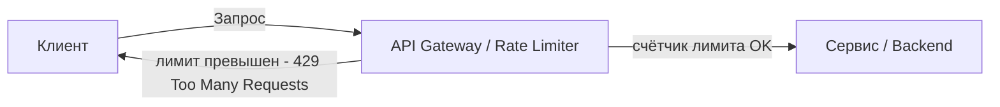
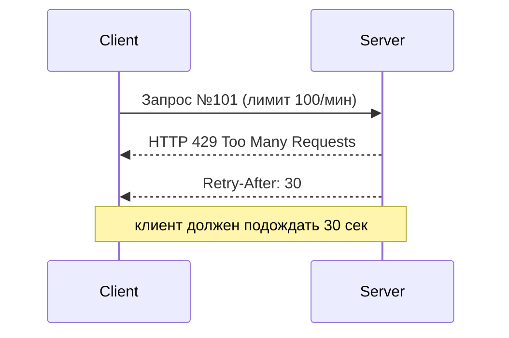
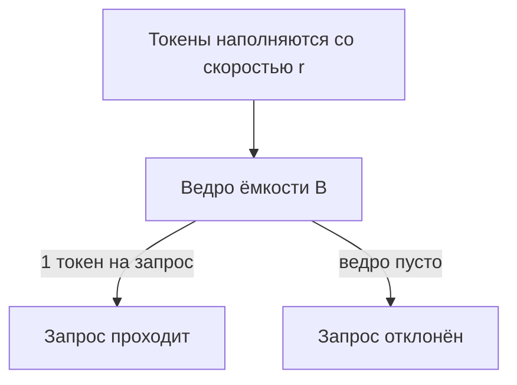

# Rate Limiting (Ограничение количества запросов)

## Определение

**Rate Limiting (Ограничение количества запросов)** — механизм контроля того, сколько запросов клиент (пользователь, IP-адрес, сервис) может отправить на сервер **за определённый период времени**. Это способ защитить сервис от перегрузки, атак и гарантировать справедливое распределение ресурсов между клиентами.

## Зачем нужно

Rate Limiting решает несколько задач:

- **Защита от перегрузки** — не даёт отдельному клиенту исчерпать вычислительные ресурсы сервера (CPU, память, БД, сеть).
- **Защита от DDoS и перебора (brute-force)** — ограничивает скорость атак: перебор паролей, skimming, сканирование.
- **Справедливость (fairness)** — гарантирует, что все клиенты получают долю ресурсов, а не один "прожорливый" забирает всё.
- **Стабильность системы** — предотвращает каскадные сбои и деградацию из-за внезапных всплесков трафика.
- **Управление стоимостью** — в платных API лимит — это часть тарифа (например, 1000 запросов/мес).

## Как работает

Базовая идея: **счётчик запросов** в **окне времени**.



Ключевые понятия:

- **Допустимый лимит** — напр. `100 запросов / минуту` на пользователя.
- **Окно ограничения** — период, в котором считается счётчик (секунда, минута, час).
- **Ключ ограничения** — по чему считаем: `user_id`, `IP`, `API-key`, комбинация.

### Ответ при превышении



При превышении возвращается **HTTP 429 Too Many Requests** и заголовок **Retry-After** (в секундах, когда можно повторить). Хороший API также отдаёт заголовки `X-RateLimit-Limit`, `X-RateLimit-Remaining`, `X-RateLimit-Reset`.

## Алгоритмы Rate Limiting

### 1. Fixed Window (Фиксированное окно)

Счётчик сбрасывается каждый фиксированный период (напр., каждую минуту).


- **Плюс**: просто, дешёво в памяти (1 счётчик на ключ).
- **Минус**: «проблема границы» — burst на стыке двух окон (в конце минуты 59 запросов + в начале следующей 59 = 118 почти за секунду).

### 2. Sliding Window Log (Журнал скользящего окна)

Хранится временная метка каждого запроса. Лимит — число запросов за **скользящий** период.

- **Плюс**: точный.
- **Минус**: дорого — хранить все метки, O(N) памяти.

### 3. Sliding Window Counter (Скользящее окно-счётчик)

Гибрид: берётся вес текущего и предыдущего окон.

- **Плюс**: компромисс точности и памяти.

### 4. Token Bucket (Ведро токенов)

В «ведро» с ёмкостью `B` добавляются токены со скоростью `r` (в единицу времени). Запрос забирает 1 токен; если ведро пусто — запрос отклоняется.



- **Плюс**: допускает burst-всплески до ёмкости `B`. Очень популярен (nginX, Redis, AWS).
- **Это рекомендуемый алгоритм по умолчанию** для большинства случаев.

### 5. Leaky Bucket (Протекающее ведро)

Запросы попадают в очередь с фиксированной скоростью обработки. Ведро «протекает» с постоянной скоростью.

- **Плюс**: сглаживает outburst, подходит для стабильной обработки.
- **Минус**: задержка при больших очередях.

Таблица сравнения:

| Алгоритм | Точность | Память | Поддержка burst | Сложность |
|----------|----------|--------|-----------------|-----------|
| Fixed Window | низкая | низкая | слабая | низкая |
| Sliding Window Log | высокая | высокая | да | средняя |
| Sliding Window Counter | средняя | низкая | да | средняя |
| Token Bucket | средняя | низкая | сильная | низкая |
| Leaky Bucket | средняя | низкая | нет | низкая |

## Примеры кода

> Каждый из 5 алгоритмов показан на трёх языках: TypeScript, Go, Java.
> Это абстракции (receiver-функция `allow(key)` возвращает `true`, если запрос можно пропустить), чтобы сфокусироваться на логике алгоритмов.

### 1. Fixed Window (Фиксированное окно)

Хранится один счётчик на ключ; при переходе в новое окно счётчик обнуляется.

**TypeScript** (класс и функциональная фабрика — оба подхода валидны, см. примечание ниже):

```typescript
type WindowEntry = { start: number; count: number }
type FixedWindowLimiter = (key: string, now?: number) => boolean

// функциональная фабрика (замыкание) — функциональный стиль, привычный для React
export function createFixedWindow(
  limit: number,
  windowMs: number,
  windows = new Map<string, WindowEntry>(),
): FixedWindowLimiter {
  return (key, now = Date.now()) => {
    const entry = windows.get(key) ?? { start: now, count: 0 }
    if (now - entry.start >= windowMs) {
      entry.start = now
      entry.count = 0
    }
    if (entry.count >= limit) {
      windows.set(key, entry)
      return false
    }
    entry.count++
    windows.set(key, entry)
    return true
  }
}

// эквивалент на классах (инкапсуляция состояния в объект)
export class FixedWindowClass {
  private windows = new Map<string, WindowEntry>()
  constructor(
    private limit: number,
    private windowMs: number,
  ) {}
  allow(key: string, now = Date.now()): boolean {
    const entry = this.windows.get(key) ?? { start: now, count: 0 }
    if (now - entry.start >= this.windowMs) {
      entry.start = now
      entry.count = 0
    }
    if (entry.count >= this.limit) {
      this.windows.set(key, entry)
      return false
    }
    entry.count++
    this.windows.set(key, entry)
    return true
  }
}
```

**Go** (struct + методы):

```go
type fixedWindow struct {
	mu       sync.Mutex
	limit    int
	window   time.Duration
	start    time.Time
	count    int
}

func newFixedWindow(limit int, window time.Duration) *fixedWindow {
	return &fixedWindow{limit: limit, window: window, start: time.Now()}
}

func (fw *fixedWindow) Allow(now time.Time) bool {
	fw.mu.Lock()
	defer fw.mu.Unlock()

	if now.Sub(fw.start) >= fw.window {
		fw.start = now
		fw.count = 0
	}
	if fw.count >= fw.limit {
		return false
	}
	fw.count++
	return true
}
```

**Java**:

```java
public class FixedWindowLimiter {
    private final int limit;
    private final long windowMs;
    private long start;
    private int count;

    public FixedWindowLimiter(int limit, long windowMs) {
        this.limit = limit;
        this.windowMs = windowMs;
        this.start = System.currentTimeMillis();
    }

    public synchronized boolean allow(long now) {
        if (now - start >= windowMs) {
            start = now;
            count = 0;
        }
        if (count >= limit) return false;
        count++;
        return true;
    }
}
```

### 2. Sliding Window Log (Журнал скользящего окна)

Хранятся временные метки всех запросов; считаются те, что попали в скользящий интервал.

**TypeScript:**

```typescript
type SlidingLogLimiter = (key: string, now?: number) => boolean

export function createSlidingLog(
  limit: number,
  windowMs: number,
  logs = new Map<string, number[]>(),
): SlidingLogLimiter {
  return (key, now = Date.now()) => {
    const timestamps = (logs.get(key) ?? []).filter(
      (t) => now - t < windowMs,
    )
    if (timestamps.length >= limit) {
      logs.set(key, timestamps)
      return false
    }
    timestamps.push(now)
    logs.set(key, timestamps)
    return true
  }
}
```

**Go:**

```go
type slidingLog struct {
	mu       sync.Mutex
	limit    int
	window   time.Duration
	log      []time.Time
}

func (sl *slidingLog) Allow(now time.Time) bool {
	sl.mu.Lock()
	defer sl.mu.Unlock()

	cutoff := now.Add(-sl.window)
	kept := sl.log[:0]
	for _, t := range sl.log {
		if t.After(cutoff) {
			kept = append(kept, t)
		}
	}
	sl.log = kept

	if len(sl.log) >= sl.limit {
		return false
	}
	sl.log = append(sl.log, now)
	return true
}
```

**Java:**

```java
public class SlidingLogLimiter {
    private final int limit;
    private final long windowMs;
    private final List<Long> log = new ArrayList<>();

    public SlidingLogLimiter(int limit, long windowMs) {
        this.limit = limit;
        this.windowMs = windowMs;
    }

    public synchronized boolean allow(long now) {
        long cutoff = now - windowMs;
        log.removeIf(t -> t <= cutoff);
        if (log.size() >= limit) return false;
        log.add(now);
        return true;
    }
}
```

### 3. Sliding Window Counter (Скользящее окно-счётчик)

Считает с учётом части предыдущего окна: точнее Fixed Window, но хранит только 2 счётчика.

**TypeScript:**

```typescript
type CounterEntry = { count: number; windowStart: number }
type SlidingCounter = (key: string, now?: number) => boolean

export function createSlidingCounter(
  limit: number,
  windowMs: number,
  buckets = new Map<string, CounterEntry>(),
): SlidingCounter {
  return (key, now = Date.now()) => {
    const current = Math.floor(now / windowMs)
    const bucket = buckets.get(key) ?? { count: 0, windowStart: current }
    if (bucket.windowStart !== current) {
      // предыдущее окно устарело — можно учитывать лишь долю
      bucket.count = 0
      bucket.windowStart = current
    }
    if (bucket.count >= limit) {
      buckets.set(key, bucket)
      return false
    }
    bucket.count++
    buckets.set(key, bucket)
    return true
  }
}
```

**Go:**

```go
type slidingCounter struct {
	mu       sync.Mutex
	limit    int
	windowNs int64
	start    int64
	count    int
}

func (sc *slidingCounter) Allow(nowNs int64) bool {
	sc.mu.Lock()
	defer sc.mu.Unlock()

	curr := nowNs / sc.windowNs
	if curr != sc.start {
		sc.start = curr
		sc.count = 0
	}
	if sc.count >= sc.limit {
		return false
	}
	sc.count++
	return true
}
```

**Java:**

```java
public class SlidingCounterLimiter {
    private final int limit;
    private final long windowMs;
    private long windowIndex;
    private int count;

    public SlidingCounterLimiter(int limit, long windowMs) {
        this.limit = limit;
        this.windowMs = windowMs;
        this.windowIndex = System.currentTimeMillis() / windowMs;
    }

    public synchronized boolean allow(long now) {
        long idx = now / windowMs;
        if (idx != windowIndex) {
            windowIndex = idx;
            count = 0;
        }
        if (count >= limit) return false;
        count++;
        return true;
    }
}
```

### 4. Token Bucket (Ведро токенов)

Токены наполняются со скоростью `r`; запрос забирает 1 токен. Позволяет всплески до ёмкости ведра.

**TypeScript** (класс + функциональная версия):

```typescript
export function createTokenBucket(
  capacity: number,
  refillPerSec: number,
  buckets = new Map<string, { tokens: number; lastRefill: number }>(),
): (key: string, now?: number) => boolean {
  return (key, now = Date.now()) => {
    const b = buckets.get(key) ?? { tokens: capacity, lastRefill: now }
    const elapsedSec = (now - b.lastRefill) / 1000
    b.tokens = Math.min(capacity, b.tokens + elapsedSec * refillPerSec)
    b.lastRefill = now
    if (b.tokens < 1) {
      buckets.set(key, b)
      return false
    }
    b.tokens -= 1
    buckets.set(key, b)
    return true
  }
}
```

**Go:**

```go
import "math" // в реальном файле: import("math"; "sync"; "time")

type tokenBucket struct {
	mu           sync.Mutex
	capacity     float64
	tokens       float64
	refillPerSec float64
	lastRefill   time.Time
}

func (tb *tokenBucket) Allow(now time.Time) bool {
	tb.mu.Lock()
	defer tb.mu.Unlock()

	tb.tokens = math.Min(
		tb.capacity,
		tb.tokens+now.Sub(tb.lastRefill).Seconds()*tb.refillPerSec,
	)
	tb.lastRefill = now

	if tb.tokens < 1 {
		return false
	}
	tb.tokens--
	return true
}
```

**Java:**

```java
public class TokenBucketLimiter {
    private final double capacity;
    private final double refillPerSec;
    private double tokens;
    private long lastRefill;

    public TokenBucketLimiter(double capacity, double refillPerSec) {
        this.capacity = capacity;
        this.refillPerSec = refillPerSec;
        this.tokens = capacity;
        this.lastRefill = System.nanoTime();
    }

    public synchronized boolean allow() {
        long now = System.nanoTime();
        tokens = Math.min(
            capacity,
            tokens + (now - lastRefill) / 1e9 * refillPerSec,
        );
        lastRefill = now;
        if (tokens < 1) return false;
        tokens -= 1;
        return true;
    }
}
```

### 5. Leaky Bucket (Протекающее ведро)

Запросы сглаживаются: обрабатываются с фиксированной скоростью, остальное попадает в очередь.

**TypeScript:**

```typescript
export function createLeakyBucket(
  ratePerSec: number,
  capacity: number,
  buckets = new Map<string, { last: number; used: number }>(),
): (key: string, now?: number) => boolean {
  return (key, now = Date.now()) => {
    const b = buckets.get(key) ?? { last: now, used: 0 }
    // «протекает» со скоростью ratePerSec
    b.used = Math.max(0, b.used - (now - b.last) * (ratePerSec / 1000))
    if (b.used >= capacity) {
      buckets.set(key, b)
      return false
    }
    b.used += 1
    b.last = now
    buckets.set(key, b)
    return true
  }
}
```

**Go:**

```go
import "math" // в реальном файле: import("math"; "sync"; "time")

type leakyBucket struct {
	mu         sync.Mutex
	ratePerSec float64
	capacity   float64
	used       float64
	last       time.Time
}

func (lb *leakyBucket) Allow(now time.Time) bool {
	lb.mu.Lock()
	defer lb.mu.Unlock()

	lb.used = math.Max(
		0,
		lb.used-now.Sub(lb.last).Seconds()*lb.ratePerSec,
	)
	if lb.used >= lb.capacity {
		lb.last = now
		return false
	}
	lb.used++
	lb.last = now
	return true
}
```

**Java:**

```java
public class LeakyBucketLimiter {
    private final double ratePerSec;
    private final double capacity;
    private double used;
    private long last;

    public LeakyBucketLimiter(double ratePerSec, double capacity) {
        this.ratePerSec = ratePerSec;
        this.capacity = capacity;
        this.last = System.nanoTime();
    }

    public synchronized boolean allow() {
        long now = System.nanoTime();
        used = Math.max(0, used - (now - last) / 1e9 * ratePerSec);
        if (used >= capacity) {
            last = now;
            return false;
        }
        used++;
        last = now;
        return true;
    }
}
```

### Примечание про классы vs функции в TypeScript

Оба подхода **общеприняты** и легитимны для инкапсуляции состояния лимитера:

- **Классы** (`class TokenBucket`) — классический ООП-подход, встречается в больших кодовых базах, Node.js-библиотеках, легко расширяется наследованием. Подходит, когда у лимитера много методов и внутренних зависимостей.
- **Функциональные фабрики** (замыкание, возвращающее функцию) — стиль, привычный для **React-экосистемы** (хуки, композиция). Компактнее, без `this`, проще тестировать, 상태 изолировано в замыкании. Для простого лимитера это часто предпочтительнее.

Для личного тренажёра я использую функциональную форму (ближе к тому, как ты пишешь на React), но оба варианта в примерах выше корректны.

## Пример использования: интеграция

> Как встроить лимитеры из «Примеров кода» в реальное приложение. Rate limiting живёт в HTTP-слое, поэтому естественнее всего реализовать его как **middleware** (промежуточный обработчик) — он отрабатывает **до** логики контроллера.

Ключ лимита выбирается из запроса: `IP`, `X-API-Key`, `user_id`. При превышении возвращаем **429 Too Many Requests** + заголовок **Retry-After** (в секундах) — клиент знает, когда повторять запрос.

### Express middleware (TypeScript)

```typescript
import express, { type NextFunction, type Request, type Response } from 'express'
import { createTokenBucket } from './token-bucket' // из «Примеров кода» выше

const app = express()

// общий лимит: 100 запросов в минуту на IP
const RATE = 100
const REFILL_PER_SEC = RATE / 60
const limiters = new Map<string, ReturnType<typeof createTokenBucket>>()

function rateLimit(req: Request, res: Response, next: NextFunction) {
  // берём исходный IP: x-forwarded-for ставит прокси, req.ip — ближайший хоп
  const key =
    (req.headers['x-forwarded-for'] as string)?.split(',')[0]?.trim() ??
    req.ip ??
    'unknown'

  if (!limiters.has(key)) limiters.set(key, createTokenBucket(RATE, REFILL_PER_SEC))
  if (!limiters.get(key)!(key)) {
    res.set('Retry-After', '60')
    res.status(429).json({ error: 'Too Many Requests' })
    return
  }
  next() // лимит не превышен — передаём запрос дальше
}

app.use(rateLimit) // применяем ко ВСЕМ маршрутам
app.get('/api/orders', (req, res) => res.json({ ok: true }))
```

### net/http middleware (Go)

```go
package main

import (
	"net/http"
	"sync"
	"time"
)

// rateLimiter держит свой лимитер на каждый IP (map + mutex для конкурентности).
type rateLimiter struct {
	mu       sync.Mutex
	limiters map[string]*tokenBucket // key: client-IP -> лимитер (struct из примера выше)
	capacity float64
	perSec   float64
}

func newRateLimiter(capacity, perSec float64) *rateLimiter {
	return &rateLimiter{
		limiters: make(map[string]*tokenBucket),
		capacity: capacity,
		perSec:   perSec,
	}
}

func newTokenBucket(capacity, refillPerSec float64) *tokenBucket {
	tb := &tokenBucket{capacity: capacity, refillPerSec: refillPerSec}
	tb.tokens = capacity
	tb.lastRefill = time.Now()
	return tb
}

func (rl *rateLimiter) bucketFor(ip string) *tokenBucket {
	rl.mu.Lock()
	defer rl.mu.Unlock()
	b, ok := rl.limiters[ip]
	if !ok {
		b = newTokenBucket(rl.capacity, rl.perSec)
		rl.limiters[ip] = b
	}
	return b
}

// Middleware оборачивает http.Handler; 429 — если лимит исчерпан.
func (rl *rateLimiter) Middleware(next http.Handler) http.Handler {
	return http.HandlerFunc(func(w http.ResponseWriter, r *http.Request) {
		if !rl.bucketFor(clientIP(r)).Allow(time.Now()) {
			w.Header().Set("Retry-After", "60")
			http.Error(w, `{"error":"Too Many Requests"}`, http.StatusTooManyRequests)
			return
		}
		next.ServeHTTP(w, r)
	})
}

func clientIP(r *http.Request) string {
	if v := r.Header.Get("X-Forwarded-For"); v != "" {
		return v // первое значение — исходный клиент
	}
	return r.RemoteAddr
}
```

### Spring HandlerInterceptor (Java)

```java
import jakarta.servlet.http.HttpServletRequest;
import jakarta.servlet.http.HttpServletResponse;
import org.springframework.web.servlet.HandlerInterceptor;

import java.io.IOException;
import java.util.Map;
import java.util.concurrent.ConcurrentHashMap;

public class RateLimitInterceptor implements HandlerInterceptor {

    private static final double CAPACITY = 100;
    private static final double REFILL_PER_SEC = CAPACITY / 60;

    // ConcurrentHashMap — потому что handle записывается конкурентно из потоков Tomcat
    private final Map<String, TokenBucketLimiter> limiters = new ConcurrentHashMap<>();

    @Override
    public boolean preHandle(
            HttpServletRequest request,
            HttpServletResponse response,
            Object handler
    ) throws IOException {
        String key = request.getRemoteAddr();
        TokenBucketLimiter limiter = limiters.computeIfAbsent(
            key,
            k -> new TokenBucketLimiter(CAPACITY, REFILL_PER_SEC) // класс из примера выше
        );

        if (!limiter.allow()) {
            response.setHeader("Retry-After", "60");
            response.sendError(HttpServletResponse.SC_TOO_MANY_REQUESTS, "Too Many Requests");
            return false; // false — цепочка прерывается, контроллер не вызывается
        }
        return true; // true — обрабатываем дальше
    }
}
```

Регистрация интерцептора (чтобы Spring его применил):

```java
import org.springframework.context.annotation.Configuration;
import org.springframework.web.servlet.config.annotation.InterceptorRegistry;
import org.springframework.web.servlet.config.annotation.WebMvcConfigurer;

@Configuration
public class WebConfig implements WebMvcConfigurer {
    @Override
    public void addInterceptors(InterceptorRegistry registry) {
        registry.addInterceptor(new RateLimitInterceptor())
                .addPathPatterns("/api/**"); // только /api/**, а не статика
    }
}
```

Во всех трёх случаях лимитер живёт **в памяти одного процесса** (in-memory). Для кластера из нескольких серверов суммарный лимит станет больше заявленного — тогда нужен распределённый счётчик (Redis), см. «Антипаттерны и ловушки» ниже.

## Паттерны использования

- **Реализация на уровне API Gateway / обратного прокси** — централизованно для всех сервисов (nginx `limit_req`, Kong, Envoy).
- **Распределённый лимитер на Redis** — когда серверов несколько (`INCR` + `EXPIRE` для fixed window, Lua для token bucket).
- **Лимит по нескольким ключам** — напр., `IP + user_id`, чтобы не обойти лимит сменой IP.
- **Отдавать лимиты в заголовках** — прозрачно для клиента.
- **429 + Retry-After** — стандарт для сообщения о превышении.

## Антипаттерны и ловушки

- **Лимитировать только по IP** — легко обходится (NAT, фрод), несправедливо для shared IP.
- **Не отправлять Retry-After** — клиент не знает, когда повторять, начинается эффект «бьющего стада» (thundering herd): все клиенты одновременно повторяют запросы, сервер получает лавину.
- **Не учитывать распределённость** — in-memory лимитер на каждом сервере даёт суммарный лимит БОЛЬШЕ заявленного (N серверов × лимит).
- **Слишком строгий лимит** — деградация легитимного трафика, плохой UX.
- **Не учитывать разные веса запросов** — тяжёлый запрос (генерация отчёта) и лёгкий (ping) считаются одинаково.

## Когда использовать / когда НЕ использовать

**Использовать:**
- Публичные API / B2B интеграции
- Внешние эндпоинты, уязвимые к перебору (auth, OTP)
- Сервисы под непредсказуемой нагрузкой
- Защита платного API в рамках тарифа

**НЕ использовать:**
- Внутренние вызовы между доверенными сервисами в надёжной сети (здесь важнее — retries/backoff)
- Когда нужен точный учёт каждого запроса без отбрасывания (тогда — брокеры сообщений / очередь)

## Связанные темы

- **Retries (повторные запросы)** — клиент должен корректно реагировать на 429 с учётом Retry-After.
- **Exponential Backoff** — как правильно увеличивать паузу между повторными запросами после лимита.
- **Circuit Breakers** — защищают сервис, когда превышение лимита становится систематическим.
- **API Gateway / Reverse Proxy** — где чаще всего реализуется rate limiting.
- **Backpressure** — родственный механизм противодавления в очереди/потоке.
- **Idempotency** — помогает повторять запросы (которые может спровоцировать 429) безопасно.

## Вопросы

### Q1
**Что возвращает сервер, когда клиент превысил лимит запросов?** (draft)
- [ ] HTTP 400 Bad Request
- [x] HTTP 429 Too Many Requests
- [ ] HTTP 500 Internal Server Error
- [ ] HTTP 403 Forbidden

Пояснение: 429 — стандартный код «слишком много запросов», при этом рекомендуется указывать заголовок Retry-After.

### Q2
**В чём главная проблема алгоритма Fixed Window?** (draft)
- [ ] Требует много памяти
- [x] «Проблема границы» — всплеск на стыке двух окон
- [ ] Не работает в распределённых системах
- [ ] Медленный на больших объёмах

Пояснение: на границе окна клиент может сделать двойной burst: 59 запросов в конце минуты + 59 в начале следующей почти мгновенно.

### Q3
**Какой алгоритм лучше всего подходит, чтобы разрешать кратковременные всплески трафика (burst), но в целом ограничивать среднюю скорость?** (draft)
- [ ] Fixed Window
- [x] Token Bucket
- [ ] Leaky Bucket
- [ ] Sliding Window Log

Пояснение: Token Bucket позволяет мгновенно использовать накопленные токены (до ёмкости ведра), что даёт поддержку burst.

### Q4
**Почему in-memory rate limiter некорректен при нескольких серверах за балансировщиком?** (draft)
- [ ] Он слишком быстрый
- [x] Суммарный лимит становится больше заявленного (N серверов × лимит)
- [ ] Требует ключ пользователя
- [ ] Не сохраняет счётчик при перезапуске

Пояснение: каждый сервер считает независимо, поэтому суммарный допустимый трафик кратно вырастает. Нужен распределённый лимитер (Redis).

## Источники

- RFC 6585 (429 Too Many Requests + Retry-After): https://www.rfc-editor.org/rfc/rfc6585
- Распределённое ограничение на Redis (Algorithmia / Redis docs): https://redis.io/glossary/rate-limiting/
- Документация nginx `ngx_http_limit_req_module`: https://nginx.org/en/docs/http/ngx_http_limit_req_module.html
- Guava RateLimiter (Java): https://github.com/google/guava
- Онлайн-статья о алгоритмах rate limiting (System Design discussion)
